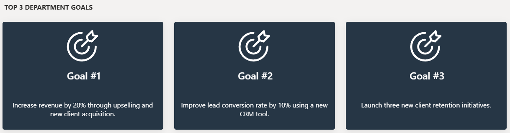
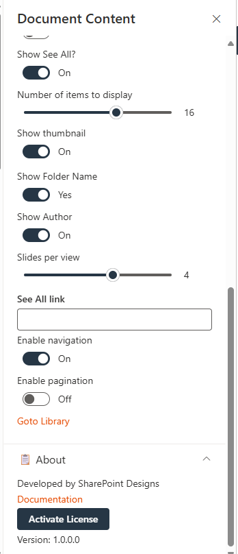

# Configuration

## 📰 1. Welcome Banner

### 📋 Details

- **Department Showcase Web Part**: Visually highlights a specific department with a professional background image and clear labeling of the department name.

- **Key Personnel Display**: Features profile cards for key team members (e.g., Manager and Quality Manager) with names, roles, and placeholders for profile pictures.

---

### Welcome Banner – Appearance Settings

This section allows customization of the **Welcome Banner** for a department or contact information display. The following configurable options are available:

#### 🗂️ Select Layout

- **Dropdown Menu**
- **Selected Option:** `Contact Information`
- **Purpose:** Defines the type of layout to be used for the banner content.

#### 🎨 Change Background

- **Button:** `Select image`
- **Purpose:** Allows the user to upload or select an image to be used as the background of the banner.

#### 📍 Background Position

- **Text Field Value:** `-20px bottom / cover no-repeat`
- **Purpose:** Custom CSS-style shorthand to control background positioning and behavior.
  - `-20px bottom`: Adjusts vertical positioning of the background image, shifting it 20 pixels above the bottom.
  - `cover`: Scales the image to cover the entire banner area.
  - `no-repeat`: Ensures the background image does not repeat.

#### 🏢 Enter Department Name

- **Text Field Value:** `DEPARTMENTS`
- **Purpose:** Displays the department name prominently on the banner.

#### 📐 Department Name Alignment

- **Dropdown Menu**
- **Selected Option:** `Bottom`
- **Purpose:** Aligns the department name within the banner.

#### 📏 Banner Height

- **Slider Control**
- **Value Set To:** `350`
- **Purpose:** Adjusts the height of the welcome banner in pixels.

#### 👥 Show Contact Persons

- **Toggle Switch**
- **Current Status:** `Off`
- **Purpose:** When enabled, displays contact persons associated with the department or section. and Clicking the Manage Contact Users button opens a side panel where you can enter contact user information.

### ℹ️ About Section

#### 👨‍💻 Developer Info

- Indicates the web part is developed by **SharePoint Designs**.

#### 📚 Documentation Link

- Provides access to user and admin documentation for further guidance.

#### 🔑 Activate License Button

- A button to activate the premium or licensed version of the web part if applicable.

### 📸 Screenshots

- **Screenshot**: Welcome Banner web part
  
- **Screenshot**: Property pane
  

## 📰 2. How can we assist you

### 📋 Details

This web part offers support contact information, including a phone number and email address. It invites users to reach out for help with any inquiries or issues.

- The webpart features a prominent message encouraging users to seek assistance.
- Contact details are clearly displayed with phone and email icons for quick access.

---

### ⚙️ Configuration Options

Customize your Assist web part effortlessly to suit your requirements:

---

#### <u>Header Settings Section</u>

##### 🧩 Webpart title

- Allows users to set a custom title for the web part (e.g., HOW CAN WE ASSIST YOU?).

#### <u>General Settings Section</u>

##### 📞 Support Phone Number

- Input field to provide a contact number for support.

##### 📧 Support Email Address

- Field to specify the primary support email ID.

##### 💬 Support Message

- Allows customization of the support message displayed on the web part.

##### ✉️ Email Address

- A secondary or general inquiry email address.

### ℹ️ About Section

- 👨‍💻 **Developed by**: SharePoint Designs
- 📚 **Documentation**: Link to official documentation (not shown in screenshot)
- 🔑 **Activate License**: Button to activate the web part license
- 🔢 **Version**: `1.0.0.0`

### 📸 Screenshots

- **Screenshot**: Assist web part
  
- **Screenshot**: Property pane
  

## 📰 3. Contact Cards

### 📋 Details

### ⚙️ Configuration Options

The Web Part configuration is divided into two main sections:

- Contact
- Contact Information

---

### 📇 1. Contact Section

This section allows configuration of high-level display properties for the Web Part:

#### 👥 Group Name (Expandable Group)

This group contains the following fields:

##### 🧾 Webpart Title for Contact 1

- Text field for customizing the title (e.g., _Contact HR Team_).

#### 🗂️ Webpart Title for Contact 2

- Text field for customizing the title (e.g., _Contact Legal Team_).

#### 📏 Height (Slider Control)

- Adjustable slider to control the height of the Web Part (e.g., _113_).

---

### 🗃️ 2. Contact Information Section

- This section allows configuration of individual contact details and display options:

#### 👤 Select Contact 1

- Person picker for selecting the first contact (e.g., _John McLaughlin_).

#### 👤 Select Contact 2

- Person picker for selecting the second contact (e.g., _Carolina Lucero_).

#### 📝 Description 1

- Text field for adding a description for Contact 1.

#### 📝 Description 2

- Text field for adding a description for Contact 2.

#### 🔲 Show Border line (Toggle Switch)

- Toggles display of a border around the contact section.

#### 📏 Border Bottom line (Toggle Switch)

- Toggles display of a bottom border for the contact section.

#### 🌫️ Show shadow (Toggle Switch)

- Toggles display of a shadow around the contact section for visual emphasis.

### ℹ️ About Section

- 👨‍💻 **Developed by**: SharePoint Designs
- 📚 **Documentation**: Link to official documentation (not shown in screenshot)
- 🔑 **Activate License**: Button to activate the web part license
- 🔢 **Version**: `1.0.0.0`

### 📸 Screenshots

- **Screenshot**: Contact Cards web part
  
- **Screenshot**: Property pane
  

## 📰 4. Goals

### 📋 Details

- **Visual Display of Department Goals**: The web part highlights the top 3 department goals using a clean, card-based layout, with consistent iconography and goal-specific descriptions for clear communication.

- **Structured and Focused Messaging**: Each goal card features a prominent heading and a brief, measurable objective—ideal for aligning team focus and tracking progress.

---

### ⚙️ General Settings

#### 🧮 Filter Layout

- Dropdown to choose the desired visual layout for goal display.  
  _Example: `Goals Layout1`_ – A card-style layout for showcasing goals prominently.

#### 📝 Enter Webpart Title

- A text input field to define the title displayed at the top of the web part.  
  _Example: `Top 3 department goals`_

#### 📋 Select a list

- A dropdown for selecting the SharePoint list containing goal data.  
  _Example: `Goals`_ – The list should include fields like Title, Description, and Icon (optional).

---

### ℹ️ About Section

#### 👨‍💻 Developer Info

- Indicates the web part is developed by **SharePoint Designs**.

#### 📚 Documentation Link

- Provides access to user and admin documentation for further guidance.

#### 🔑 Activate License Button

- A button to activate the premium or licensed version of the web part if applicable.

### 📸 Screenshots

- **Screenshot**: Goals web part
  
- **Screenshot**: Property pane
  

## 📰 5. Document Content

### 📋 Details

- Document Content Web Part displays department policy documents in a card layout, each labeled clearly by department (e.g., HR, IT, Finance).

- Horizontal Carousel Navigation allows users to browse through available documents using left and right arrows.

---

### Document Content Web Part – Configuration Guide

The **Document Content** web part is used to display files from a selected SharePoint document library in a visually organized format such as a film strip. This configuration panel is divided into three main sections: **Header Settings**, **General Settings**, and **Appearance Settings**.

---

### 🔖 Header Settings

#### 🏷️ Show Webpart Title:

- Toggle switch to show or hide the web part title.  
   **Status**: Enabled (`Yes`)

#### 🔤 Title:

- Text field to define the web part name.  
   **Value**: `Document Content`

---

### ⚙️ General Settings

#### 🔌 Source:

- Defines the origin of the documents. it have two options that is This site and A document library on this site. which u want you can use the source.  
  **Value**: `This Site` The 'Select Library' field is not required, as all items will be retrieved directly from the site.
  **Value**: `A document library on this site`

#### 📚 Select a Library:

- Dropdown to choose a library from the site.  
  **Value**: `Policies and Procedures`

#### 📁 Folder Name:

- Optional text input for specifying a sub-folder.

#### 📂 Include sub-folder files

- Enabling this toggle will retrieve items from sub-folders in the selected library.

---

### 🎨 Appearance Settings

#### 🧱 Layout Type:

- Controls how content is visually displayed.  
   **Selected Option**: `Film Strip`

#### ➖ Enable Borders:

- Toggle to show/hide borders around items.  
   **Status**: Off

#### 🎨 Add Background Color:

- Toggle to apply background color.  
   **Status**: Off

#### 👁️ Show See All?:

- Toggle to display a "See All" link.  
   **Status**: On

#### 🔢 Number of Items to Display:

- Slider to define how many documents are shown.  
   **Value**: 16

#### 🖼️ Show Thumbnail:

- Toggle to display file previews.  
   **Status**: On

#### 📁 Show Folder Name:

- Toggle to display folder names.  
   **Status**: Yes

#### ✍️ Show Author:

- Toggle to show the file creator.  
   **Status**: On

#### 🎞️ Slides per View:

- Slider to define the number of items shown per slide.  
   **Value**: 4

#### 🔗 See All Link:

- Optional field to define a custom "See All" URL.

#### ➡️ Enable Navigation:

- Toggle to enable left/right carousel arrows.  
   **Status**: On

#### 📄 Enable Pagination:

- Toggle to enable pagination controls.  
   **Status**: Off

### ℹ️ About Section

- 👨‍💻 **Developed by**: SharePoint Designs
- 📚 **Documentation**: Link to official documentation (not shown in screenshot)
- 🔑 **Activate License**: Button to activate the web part license
- 🔢 **Version**: `1.0.0.0`

### 📸 Screenshots

- **Screenshot**: Document Content web part
  
- **Screenshot**: Property pane
  
  

## 📰 6. Share Ideas

### 📋 Details

- Share Your Ideas Web Part encourages user engagement by allowing employees to submit innovative thoughts or suggestions.

- Interactive Button ("Click here") leads users to a form or dedicated space for idea submission, enhanced with a visual graphic for clarity and appeal

---

### Share Ideas Web Part – Configuration Guide

The **Share Ideas** web part provides a platform for users to submit feedback, ideas, or suggestions, typically by redirecting to a form or email via a clickable button. The web part is visually supported by an image and customizable interface.

---

### 🔖 Header Settings

#### 🧩 Webpart Title:

- Specifies the title displayed at the top of the web part.  
   **Value**: `SHARE YOUR IDEAS`

---

### ⚙️ General Settings

#### 📏 Webpart Height:

- Adjustable slider to define the height of the web part container.  
   **Value**: `231`

#### 🖼️ Select:

- Allows the user to upload or select an image to display.

#### 🔘Button Text:

- Defines the text shown on the interactive button.  
   **Value**: `Click here`

#### 🔗 Action Link:

- Sets the destination link or action triggered when the button is clicked.  
   **Value**: `sales@sharepointdesigns.com` (email link)

---

### ℹ️ About Section

- 👨‍💻 **Developed by**: SharePoint Designs
- 📚 **Documentation**: Link to official documentation (not shown in screenshot)
- 🔑 **Activate License**: Button to activate the web part license
- 🔢 **Version**: `1.0.0.0`

### 📸 Screenshots

- **Screenshot**: Share Ideas web part
  
- **Screenshot**: Property pane
  

## 📰 7. News Letter

- Newsletter Web Part displays the latest company newsletters with a visual preview, title, and publication date for improved visibility and engagement.

- A "Read More" button links users to the full content, providing easy access to detailed updates like the "Company Quarterly Newsletter – April".

---

### 📬 Newsletter Web Part – Configuration Guide

The **Newsletter** web part is designed to showcase company newsletters or announcements in a visually engaging slider format. It provides customization for height, slide content, and data source.

---

### ⚙️ General Settings

#### 🧩 Webpart Title

- Label displayed at the top of the web part.
- **Value**: `NEWSLETTER`

#### 🌐 Select Sites

- Allows selection of one or more sites from which the newsletter content will be pulled.
- Currently, no site is selected (`No search results`).

#### 📏 Height

- Controls the height of the newsletter display area.
- **Value**: `295`

#### 🎞️ Number of Items per Slide

- Determines how many newsletter items are shown in one view.
- **Value**: `1`

---

### 📁 Manage Files

- Provides additional control over content files and enables navigation to the selected Document library.

---

### ℹ️ About Section

- 👨‍💻 **Developer**: SharePoint Designs
- 📚 **Documentation**: Link provided for user help (not shown in detail)
- 🔑 **License Activation**: Includes a button to activate the license for full functionality.
- 🔢 **Version**: `1.0.0.0`

### 📸 Screenshots

- **Screenshot**: Newsletter web part
  
- **Screenshot**: Property pane
  

## 📰 8. Pixel Gallery

---

### 🖼️ Pixel Gallery Web Part – Configuration Guide

The **Pixel Gallery** web part allows users to display images from a SharePoint document library in a slideshow format. It provides control over visual appearance and image source.

---

### ⚙️ General Settings

#### 🏷️ Web Part Title

- Defines the display title of the gallery section.  
  **Value**: `Gallery`

#### 🎨 Web Part Title Color Code

- Hex code to customize the title’s font color.  
  **Value**: `#000000` (Black)

#### 📚 Library Name

- Specifies the SharePoint document library that stores the gallery images.  
  **Value**: `Gallery`

#### 📁 Folder Name

- Optional field to limit the gallery to a specific folder within the library.  
  **Value**: _(Empty in screenshot)_

#### 📐 Webpart Height

- Controls the vertical size of the gallery display.  
  **Value**: `228`

#### 🎞️ Items to Show per Slide

- Number of images displayed simultaneously in one gallery slide.

### ℹ️ About Section

#### 👨‍💻 Developer Info

- Indicates the web part is developed by **SharePoint Designs**.

#### 📚 Documentation Link

- Provides access to user and admin documentation for further guidance.

#### 🔑 Activate License Button

- A button to activate the premium or licensed version of the web part if applicable.

### 📸 Screenshots

- **Screenshot**: Pixel Gallery web part
  
- **Screenshot**: Property pane
  
