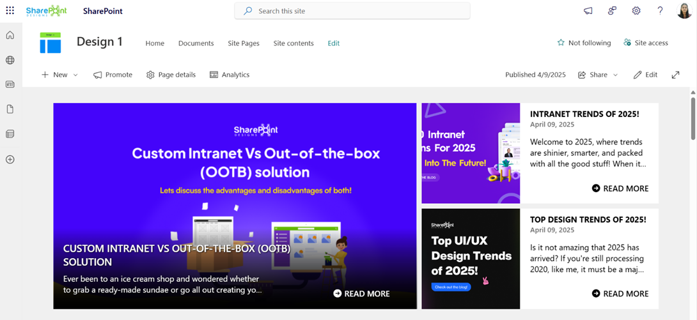

# Configuration

### Note:

The Home page should be configured using the "Design 1 Setup" web part to ensure that the required lists and libraries are created automatically. Without this configuration, users will need to manually create dedicated lists or libraries for the respective web parts.

## 📰 1. Featured News

### 🚀️PREREQUISITE

- [ ] Ensure a **"Category"** Choice column exists on the site.

> ⚠️ **Important:** If the web part is manually added to the page, the **"Category"** column is **required** and must be created beforehand.

- [ ] Create a "Category" Choice column if the site page doesn't exist this column

### 📋 Details

- **Central Updates**: Keep everyone informed with company news.
- **Professional Display**: Present announcements/department news clearly and formally.
- **Structured Layout**: Organized sections for each department.

### 🏷️ Features News Web Part – Property Pane Configuration

#### 🎨 Appearance Settings

| 🏷️ Name              | 🎯 Purpose                                  | 💡 Select Option                  |
| -------------------- | ------------------------------------------- | --------------------------------- |
| Choose Layout        | Select layout style for news display        | Top Story, Grid, Filmstrip, Tiles |
| Show Category Filter | Enable or disable category filters for news | On / Off                          |
| Show Search Box      | Allow users to search news articles         | On / Off                          |
| Show Sort By         | Add sorting option to reorder news content  | On / Off                          |

---

#### ⚙️ General Settings

| 🏷️ Name             | 🎯 Purpose                                                   | 💡 Select Option                  |
| ------------------- | ------------------------------------------------------------ | --------------------------------- |
| Webpart Title       | Title displayed at the top of the news web part              | Features News                     |
| Search Sites        | Select SharePoint sites to pull news from                    | (Leave blank for current)         |
| Filter by Tag       | Filter news items by tags (e.g., Departments, Announcements) | Enter tags                        |
| Enable RSS Feed     | Toggle RSS feed functionality on/off                         | On / Off                          |
| Show See All Button | Toggle visibility of “See All” button                        | On / Off                          |
| View All URL        | Custom URL for the “See All” button                          | `{siteUrl}/_layouts/15/news.aspx` |

---

#### 🎯 Target Audience

| 🏷️ Name         | 🎯 Purpose                                             | 💡 Select Option      |
| --------------- | ------------------------------------------------------ | --------------------- |
| Target Audience | Show news posts only to selected users using targeting | Select audience group |

---

#### 🛠️ Manage News Posts

| 🏷️ Name           | 🎯 Purpose                                         | 💡 Select Option          |
| ----------------- | -------------------------------------------------- | ------------------------- |
| Manage News Posts | View and manage all published and draft news posts | Open news management page |

---

## 🚨 2. Breaking News

### 📋 Details

Deliver urgent and time-sensitive information with high visibility:

- **Urgent Alerts**: Ideal for critical updates such as service outages, emergency messages, or security notifications.
- **Adjustable Notification**: Customize alert appearance and visibility duration.

### List Config

Note: For the **Breaking News** webpart, create a list with the following columns.

#### 📋 Required Columns

| 🏷️ Column Name (Case Sensitive) | 🔣 Column Type | 💡 Option                           |
| ------------------------------- | -------------- | ----------------------------------- |
| **Link**                        | URL            |                                     |
| **Expiry Date**                 | Datetime       |                                     |
| **Order By**                    | Number         |                                     |
| **Target Window**               | Choice         | (Open in new tab, Open in same tab) |

### 🏷️ Breaking News Web Part – Property Pane Configuration

#### 🎨 Appearance Settings

| 🏷️ Name       | 🎯 Purpose                                    | 💡 Select Option   |
| ------------- | --------------------------------------------- | ------------------ |
| Webpart Title | Set a custom title for the web part display   | Breaking News      |
| Sub Title     | Add a custom inline subtitle                  | (Text input)       |
| Select a List | Choose the SharePoint list with alert content | Breaking News List |
| Change Icon   | Pick an icon representing urgency/type        | (Icon picker)      |
| Show Arrows   | Enable or disable navigation arrows           | On / Off           |

---

#### ⚙️ General Settings

| 🏷️ Name               | 🎯 Purpose                             | 💡 Select Option     |
| --------------------- | -------------------------------------- | -------------------- |
| Notification Duration | Set how long the alert remains visible | (Seconds or minutes) |

---

## 🔗 3. Quick Links

### 📋 Details

Provide fast and intuitive access to essential resources:

- **Essential Resources**: Direct users to frequently used tools, forms, documents, and company policies.
- **Icons & Labels**: Enhance navigation with clearly labeled links and intuitive icons.

### List Config

Note: For the **Quick Links/Tool Links** webpart, create a list with the following columns.

#### 📋 Required Columns

| 🏷️ Column Name (Case Sensitive) | 🔣 Column Type | 💡 Option |
| ------------------------------- | -------------- | --------- |
| **URL**                         | URL            |           |
| **Icon**                        | Image          |           |
| **Target Window**               | Choice         | (Yes, No) |
| **Order0**                      | Number         |           |

### 🏷️ Quick Links Web Part – Property Pane Configuration

#### 🎨 Appearance Settings

| 🏷️ Name       | 🎯 Purpose                               | 💡 Select Option         |
| ------------- | ---------------------------------------- | ------------------------ |
| Webpart Title | Set a custom title to label the web part | Quick Links              |
| Select a List | Choose the SharePoint list for links     | Tool Links / Quick Links |
| Layouts       | Choose layout style                      | Vertical / Horizontal    |

---

#### ⚙️ General Settings

| 🏷️ Name   | 🎯 Purpose                                  | 💡 Select Option |
| --------- | ------------------------------------------- | ---------------- |
| View List | Quickly access the connected list for edits | Open List        |

---

## 👥 4. Employee Search

### 📋 Details

Easily browse and discover employee information across the organization:

- **Employee Directory**: View detailed staff profiles including name, role, contact info, and more.
- **Easy Search**: Use advanced filters to quickly locate team members by department, job title, or other attributes.

### 🏷️ Employee Search Web Part – Property Pane Configuration

#### 🎨 Appearance & Query Settings

| 🏷️ Name                | 🎯 Purpose                                                                   | 💡 Select Option |
| ---------------------- | ---------------------------------------------------------------------------- | ---------------- |
| Webpart Title          | Enter a custom title for the web part                                        | Employee Search  |
| `$filter`              | Filter users by Microsoft Graph properties (e.g.,`jobTitle eq 'HR Manager'`) | Text input       |
| `$orderby`             | Sort user results (e.g.,`displayName asc`)                                   | Dropdown         |
| Number of Items/Page   | Set how many user profiles show per page                                     | Number input     |
| `$search`              | Configure search behavior                                                    | Text input       |
| Show Pagination        | Enable navigation controls to browse additional users                        | On / Off         |
| Show Blank if None     | Display nothing if no results found                                          | On / Off         |
| Show Results Count     | Show total matching user count                                               | On / Off         |
| Show Live Persona Card | Display detailed user info on hover                                          | On / Off         |
| Results Layout         | Choose the layout style for results (e.g.,**People**)                        | Dropdown         |

---

#### 🧩 Template Options

| 🏷️ Name               | 🎯 Purpose                         | 💡 Select Option       |
| --------------------- | ---------------------------------- | ---------------------- |
| Manage Persona Fields | Customize which user fields appear | Field selector         |
| Picture Size          | Set profile picture size           | Small / Medium / Large |

---

## 📰 5. RSS Feed

### 📋 Details

Integrate external news sources directly into your intranet for broader visibility:

- **External News Integration**: Pulls in news from trusted sources like Microsoft, TechCrunch, and more.
- **Unified Design**: Seamlessly styled to match internal news web parts.
- **Content Preview**: Displays headline, summary, and publication date for quick insights.

### 🏷️ RSS Feed Web Part – Property Pane Configuration

#### 🎨 Basic Configurations

| 🏷️ Name       | 🎯 Purpose                            | 💡 Select Option |
| ------------- | ------------------------------------- | ---------------- |
| Webpart Title | Enter a custom title for the web part | Text input       |
| RSS URL       | Add the URL for the RSS feed          | URL input        |
| RSS API Key   | Paste API key if required             | Text input       |

---

#### 🔧 Feed Controls

| 🏷️ Name            | 🎯 Purpose                               | 💡 Select Option      |
| ------------------ | ---------------------------------------- | --------------------- |
| Max Count Per Page | Number of feed items to display per page | Slider / Number input |

---

#### 🎛️ Additional Settings

| 🏷️ Name        | 🎯 Purpose                             | 💡 Select Option      |
| -------------- | -------------------------------------- | --------------------- |
| See All Button | Enable or disable the “See All” button | On / Off              |
| View All URL   | Link the “See All” button redirects to | URL input             |
| Webpart Height | Adjust the height of the web part      | Slider / Number input |

---

## ❓ 6. FAQs

### 📋 Details

Provide a centralized knowledge base for commonly asked questions:

- **Knowledge Base**: Easily accessible answers to frequent employee or customer inquiries.
- **Organized Categories**: FAQs are grouped into categories for smoother navigation and quicker discovery.

### List Config

Note: For the **FAQs** webpart, create a list with the following columns.

#### 📋 Required Columns

| 🏷️ Column Name (Case Sensitive) | 🔣 Column Type |
| ------------------------------- | -------------- |
| **Description**                 | Multiline      |
| **Order0**                      | Number         |

### 🏷️ FAQs Web Part – Property Pane Configuration

#### 🎨 Basic Settings

| 🏷️ Name           | 🎯 Purpose                                               | 💡 Select Option                                        |
| ----------------- | -------------------------------------------------------- | ------------------------------------------------------- |
| Webpart Title     | Customize the title above the FAQs section               | Text input                                              |
| Select a List     | Choose the SharePoint FAQs list with questions & answers | Dropdown                                                |
| Height            | Adjust the height of the web part                        | Number input                                            |
| Display All Items | Toggle to show all FAQs or limit the number displayed    | On / Off                                                |
| Items to Show     | Number of FAQ items to display when not showing all      | Number input                                            |
| View All URL      | Link to a full FAQ page if available                     | URL input (default`{siteUrl}/Lists/FAQs/AllItems.aspx`) |

---

#### 🔤 Filter Items

| 🏷️ Name | 🎯 Purpose                         | 💡 Select Option |
| ------- | ---------------------------------- | ---------------- |
| Sort By | Order FAQs**A to Z** or **Z to A** | Dropdown         |

---

## 📅 7. Events Calendar

### 📋 Details

Keep everyone updated with key organizational dates and activities:

- **Event Calendar**: Displays company meetings, events, holidays, and other important dates.
- **Detailed Info**: Includes date, time, location, and other essential details for each event.

### 🏷️ Events Calendar Web Part – Property Pane Configuration

#### ⚙️ Configuration Options

#### Calendar List

| 🏷️ Name       | 🎯 Purpose                                              | 💡 Notes |
| ------------- | ------------------------------------------------------- | -------- |
| Calendar List | Quick access to the connected SharePoint**Events list** |          |

#### View Configurations

| 🏷️ Name          | 🎯 Purpose                                                                                                         | 💡 Notes                               |
| ---------------- | ------------------------------------------------------------------------------------------------------------------ | -------------------------------------- |
| Webpart Title    | Customize the title appearing above the calendar                                                                   | Text input                             |
| Select a List    | Choose the**events list** from the dropdown to display event data                                                  | Dropdown                               |
| Filter Events    | Filter events by:  - **Upcoming Events**   - **Previous (nth) Months** (past events shown and highlighted) | Dropdown with numeric input for months |
| Show Calendar    | Toggle to show or hide the visual calendar interface                                                               | On / Off                               |
| View All URL     | Link to full events listing page  Default: `{siteUrl}/_layouts/15/Events.aspx?ListGuid={listID}`               | URL input                              |
| Show Event Icons | Enable or disable category icons for each event                                                                    | On / Off                               |

#### Event Configurations

| 🏷️ Name       | 🎯 Purpose                           | 💡 Notes      |
| ------------- | ------------------------------------ | ------------- |
| Add New Event | Opens form to add new event          | Button / Link |
| Edit Events   | Redirects to events list for editing | Button / Link |
