# Configuration

## 📰 1. Features News

### 📋 Details

- **Central Updates**: Keep everyone informed with company news.
- **Professional Display**: Present announcements/department news clearly and formally.
- **Structured Layout**: Organized sections for each department.

---

### ⚙️ Configuration Options

Easily tailor the Features News web part to fit your organization's needs with these flexible configuration options:

---

#### <u>Basic Configurations</u>

##### 🏷️ Webpart Title

- Customize the title that appears at the top of the web part.

##### 🔍 Search Sites

- Choose which SharePoint sites to fetch news from.
- Leave blank to pull content from the current site.

##### 🏷️ Filter by Tag

- Filter news based on specific tags (e.g., **Departments**, **Announcements**) to display only relevant posts.

##### 🌐 Enable RSS Feed

- Toggle ON/OFF to enable or disable RSS feeds.
- Use **Manage Links** to add your preferred RSS sources.

##### 👀 Show See All Button

- Toggle to **show** or **hide** the “See All” button for users to explore more content.

#### <u>Layouts</u>

##### 🔗 View All URL

- Add a custom link for the “View All” button.
- Leave empty to use the default destination.
- Default value: `{siteUrl}/_layouts/15/news.aspx`

##### 🗂️ Show Category Filter

- Enable or disable category filters for quick browsing.

##### 🔎 Show Search Box

- Let users search through news articles with a handy search input box.

##### ↕️ Show Sort By

- Add a **Sort** option to let users reorder content by relevance, date, etc.

##### 🧩 Choose Layout

- Pick from multiple layout styles:
  - **Top Story**
  - **Grid**
  - **Filmstrip**
  - **Tiles**

#### <u>Target Audience </u>

##### 👥 Target Audience

- Show posts only to selected users using audience targeting.

#### <u>Manage News Posts</u>

##### 🛠️ Manage News Posts

- Click to view and manage all published and draft news items in one place.

---

### 📸 Screenshots

- **Screenshot**: News and Announcements web part
  
- **Screenshot**: Property pane
  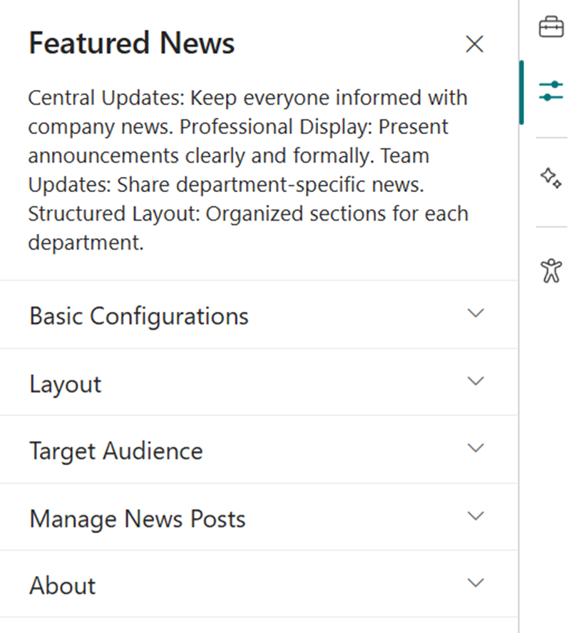

## 🚨 2. Breaking News

### 📋 Details

Deliver urgent and time-sensitive information with high visibility:

- **Urgent Alerts**: Ideal for critical updates such as service outages, emergency messages, or security notifications.
- **Adjustable Notification**: Customize how the alert appears and how long it remains visible.

---

### ⚙️ Configuration Options

Quickly configure your **Breaking News** web part to match your needs:

#### <u>Basic</u>

##### 🏷️ Webpart Title

- Set a custom title for the web part display.

##### 🖊️ Sub Title

- Add a custom **inline title** to provide more context.

##### 📃 Select a List

- Choose a SharePoint **Breaking News list** from the available options.
- Add or update alert content directly within this list.

#### <u>View settings</u>

##### 🛑 Change Icon

- Pick a custom icon that visually represents the urgency or type of alert.

##### ↔️ Show Arrows

- Enable or disable **navigation arrows** for smoother alert scrolling.

---

### 📸 Screenshots

- **Screenshot**: Breaking News web part
  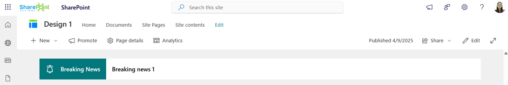
- **Screenshot**: Property pane
  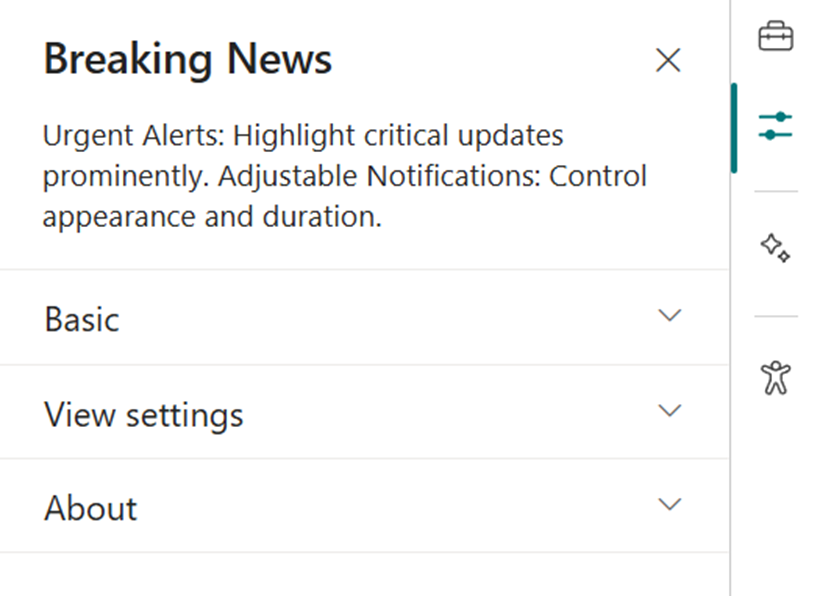

## 🔗 3. Quick Links

### 📋 Details

Provide fast and intuitive access to essential resources:

- **Essential Resources**: Direct users to frequently used tools, forms, documents, and company policies.
- **Icons & Labels**: Enhance navigation with clearly labeled links and intuitive icons.

---

### ⚙️ Configuration Options

Customize your **Quick Links** web part with the following settings:

#### <u>Basic</u>

##### 🏷️ Webpart Title

- Set a custom title to label the web part clearly.

##### 📃 Select a List

- Choose the relevant SharePoint list (e.g., **Tool Links** or **Quick Links**) to populate the links.

#### <u>View settings</u>

##### 🧱 Layouts

- Select your preferred layout style:
  - **Vertical**
  - **Horizontal**

#### <u>List settings</u>

##### 🔍 View List

- Quickly access the connected list for edits or updates.

---

### 📸 Screenshots

- **Screenshot**: Quick Links web part
  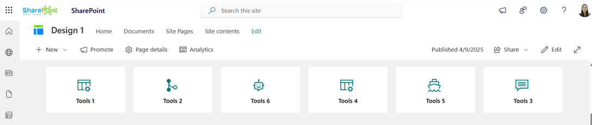
  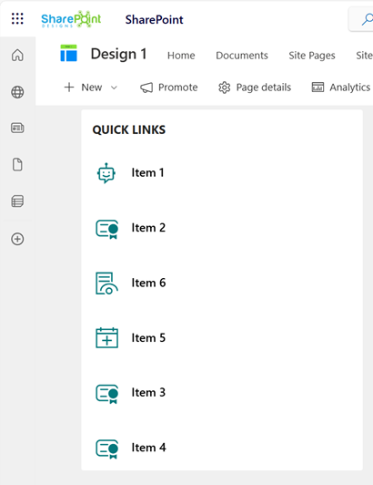
- **Screenshot**: Property pane
  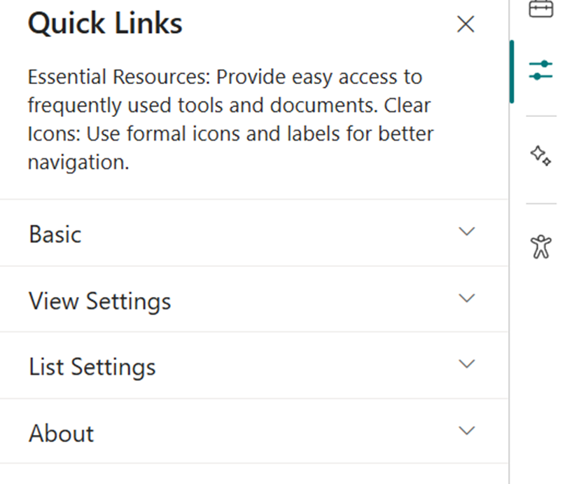

## 👥 4. Employee Search

### 📋 Details

Easily browse and discover employee information across the organization:

- **Employee Directory**: View detailed staff profiles including name, role, contact info, and more.
- **Easy Search**: Use advanced filters to quickly locate team members by department, job title, or other attributes.

---

### ⚙️ Configuration Options

Configure the **Employee Search** web part to fit your organization’s needs:

#### <u>Basic</u>

#### 🏷️ Webpart Title

- Enter a **custom title** for the web part.

---

#### <u>🔍 Query Settings</u>

Fine-tune what user data is displayed using query parameters:

- **`$select`**: Choose user properties to display (e.g., `id`, `userPrincipalName`, `displayName`, `mail`, `jobTitle`, `mobilePhone`, `companyName`).
- **`$filter`**: Filter users by specific property (e.g., `jobTitle eq 'HR'`).
- **`$orderby`**: Sort users based on selected field (e.g., `displayName` or `jobTitle`).
- **Number of Items per Page**: Define how many user profiles appear per page.

---

#### <u>🔎 Search Parameter</u>

- **`$search`**: Choose the appropriate search behavior based on your requirements.

---

#### <u>🎨 Styling Options</u>

Customize the appearance and interactivity of the web part:

- **Show Pagination**: Enable navigation to browse additional users.
- **Show Blank if No Result**: Display nothing if no user is found.
- **Show Results Count**: Show total number of matching users.
- **Show Live Persona Card**: Display user card with details on hover.
- **Results Layout**: Choose the **People** layout for displaying profiles.

---

#### <u>🧩 Template Options</u>

Adjust how user data is visually displayed:

- **Manage Persona Fields**: Rearrange or modify which fields show in the web part.
- **Picture Size**: Set profile picture size to match your layout preferences.

---

### 📸 Screenshots

- **Screenshot**: Employee Search web part
  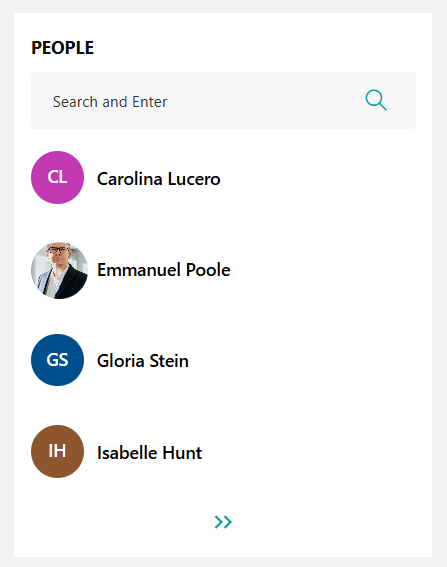
- **Screenshot**: Property pane
  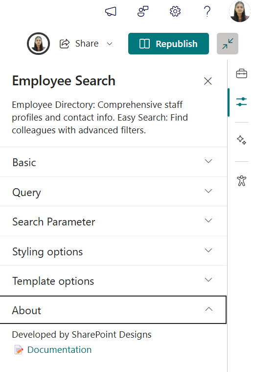

## 📰 5. RSS Feed

### 📋 Details

Integrate external news sources directly into your intranet for broader visibility:

- **External News Integration**: Pulls in news from trusted sources like Microsoft, TechCrunch, and more.
- **Unified Design**: Seamlessly styled to match internal news web parts.
- **Content Preview**: Displays headline, summary, and publication date for quick insights.

---

### ⚙️ Configuration Options

#### <u>⚙️ Basic Configurations</u>

Configure your **RSS Feed** web part with the following settings:

##### 🏷️ Webpart Title

- Enter a **custom title** in the first textbox to label the web part.

##### 🔗 RSS URL

- Add the **RSS feed URL** in the second textbox.
- _Note:_ If left blank, the feed will not load.

##### 🔐 RSS API Key

- Paste your **API key** (if required) into the third textbox.

---

#### <u>🔧 Feed Controls</u>

##### 📄 Max Count Per Page

- Use the **first slider** to set the number of feed items displayed per page.

##### 📊 Data Limits

- Use the **second slider** to determine how many articles or items are retrieved from the feed at once.

---

#### <u>🎛️ Additional Settings</u>

##### 👁️ See All Button Toggle

- Enable or disable the **"See All"** button.

##### 🔗 View All URL

- Provide a link that the **"See All"** button redirects to.
- This link should show the full list of RSS feeds.

##### 📏 Webpart Height

- Adjust the **web part height** using the slider to match your layout needs.

---

### 📸 Screenshots

- **Screenshot**: RSS Feed web part
  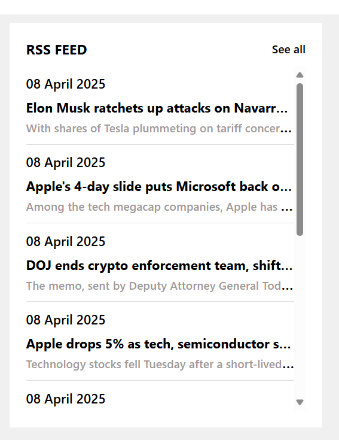
- **Screenshot**: Property pane
  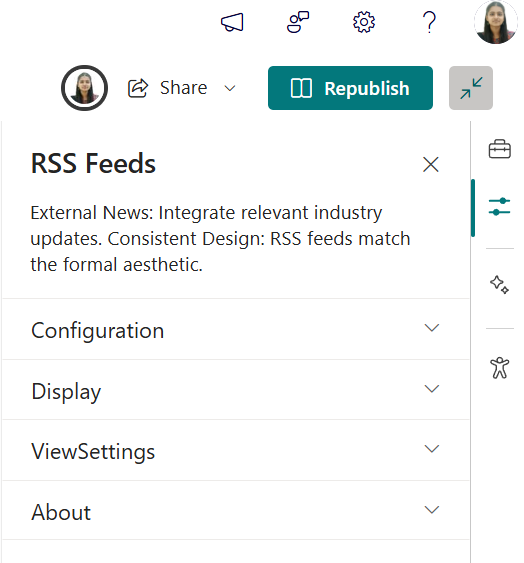

## ❓ 6. FAQs

### 📋 Details

Provide a centralized knowledge base for commonly asked questions:

- **Knowledge Base**: Easily accessible answers to frequent employee or customer inquiries.
- **Organized Categories**: FAQs are grouped into categories for smoother navigation and quicker discovery.

---

### ⚙️ Configuration Options

Fine-tune your **FAQs** web part with these settings:

#### <u>Basic</u>

##### 🏷️ Webpart Title

- Customize the title that appears above the FAQs section.

##### 📃 Select a List

- Choose the SharePoint **FAQs list** where all Q&A entries are stored and managed.

##### 📏 Height

- Adjust the **height** of the web part to fit your design needs.

##### 🔄 Display All Items

- Toggle ON to display **all FAQ entries** from the list.
- Toggle OFF to show a limited number.

##### 🔢 Items to Show

- Specify how many FAQ items to display when **Display All Items** is turned off.

##### 🔗 View All URL

- Add a link to the full FAQ page if available.
- Leave blank if no dedicated page exists.
- Deafult value: `{siteUrl}/Lists/FAQs/AllItems.aspx`

#### <u>Filter items</u>

##### 🔤 Sort By

- Choose how FAQs are ordered:
  - **A to Z**
  - **Z to A**

---

### 📸 Screenshots

- **Screenshot**: FAQs
  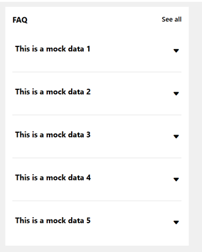
- **Screenshot**: Property pane
  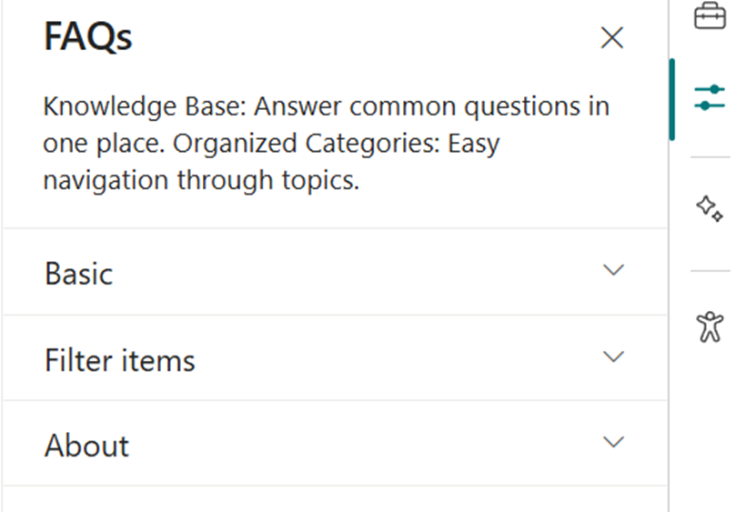

## 📅 7. Events Calendar

### 📋 Details

Keep everyone updated with key organizational dates and activities:

- **Event Calendar**: Displays company meetings, events, holidays, and other important dates.
- **Detailed Info**: Includes date, time, location, and other essential details for each event.

---

### ⚙️ Configuration Options

Set up your **Events Calendar** web part with the following configurable settings:

#### <u>Calendar list</u>

##### 📂 Calendar List

- Quick access to the connected SharePoint **Events list**.

#### <u>View configurations</u>

##### 🏷️ Webpart Title

- Customize the title that appears above the calendar.

##### 📃 Select a List

- Choose the **events list** from the dropdown to fetch and display event data.

##### 🧮 Filter Events

- Select from dropdown filters to control what events are shown:
  - **Upcoming Events** – Only shows future events.
  - **Previous (nth) Months** – Also includes past events from the specified number of months.
    - Past events are highlighted in the calendar, and clicking a date reveals event details.

##### 📆 Show Calendar

- Toggle ON/OFF to display or hide the visual calendar interface.

##### 🔗 View All URL

- Link to a page where all events are listed.
- Leave default or update as needed.

  **Default Value**:  
  `{siteUrl}/_layouts/15/Events.aspx?ListGuid={listID}`

##### 🖼️ Show Event Icons

- Enable or disable **category icons** for each event to visually distinguish event types.

#### <u>Event Configurations</u>

##### Add new event

- Click to add a new event

##### Edit events

- This will redirect to events list where you can make changes to the event

---

### 📸 Screenshots

- **Screenshot**: Upcoming Events
  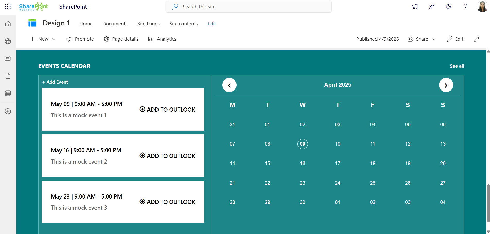

- **Screenshot**: Property pane
  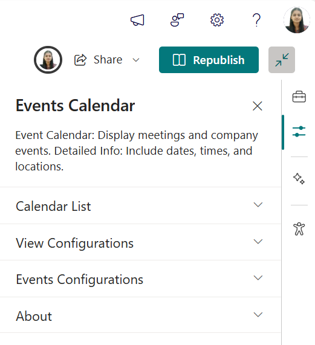
