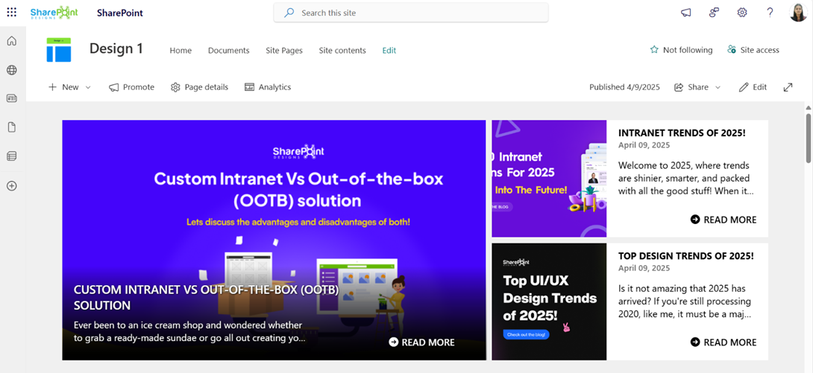
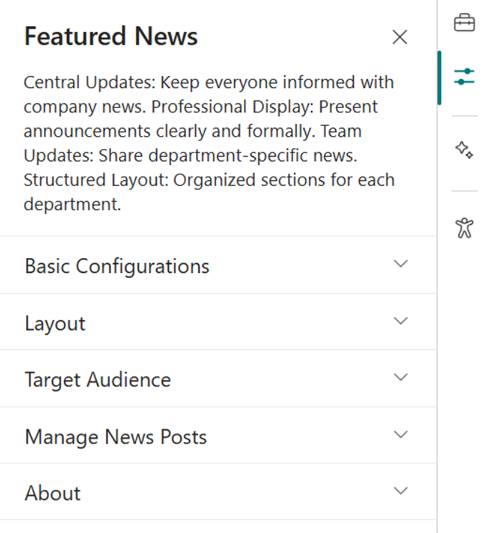
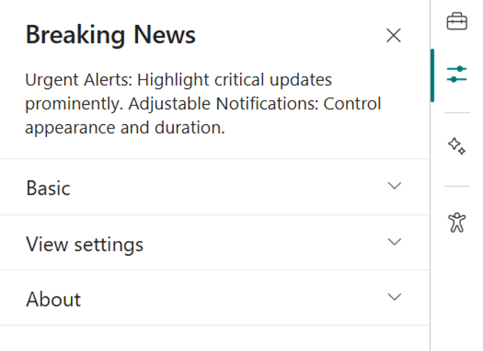
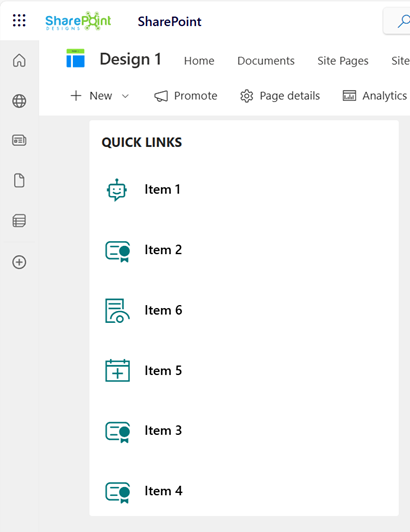

### Note:

The Home page should be configured using the "Design 1 Setup" web part to ensure that the required lists and libraries are created automatically. Without this configuration, users will need to manually create dedicated lists or libraries for the respective web parts.

Configuration settings for each web part.

## 📰 1. Welcome Banner

### 📋 Details

- **Department Showcase Web Part**: Visually highlights a specific department with a professional background image and clear labeling of the department name.
- **Key Personnel Display**: Features profile cards for key team members (e.g., Manager and Quality Manager) with names, roles, and placeholders for profile pictures.

---

#### ☰ Appearance Settings

This section allows customization of the **Welcome Banner** for a department or contact information display. The following configurable options are available:

📸 View Property Pane Screenshots

| 🏷️ Name                         | 🎯 Purpose                                                                                                                                                                                           | 💡 Select Option                 |
| ------------------------------- | ---------------------------------------------------------------------------------------------------------------------------------------------------------------------------------------------------- | -------------------------------- |
| 🗂️**Select Layout**             | Specifies the layout type for the banner content. It supports two layouts: Contact Information and Announcements.                                                                                    | `Contact Information`            |
| 🎨**Change Background**         | Allows the user to upload or select an image to be used as the background of the banner.                                                                                                             | `Select image`                   |
| ğŸ“**Background Position**       | Controls background positioning with CSS-style shorthand. • `-20px bottom`: shifts 20px from bottom  • `cover`: fills area  • `no-repeat`: Ensures the background image does not repeat. | `-20px bottom / cover no-repeat` |
| 🏢**Enter Department Name**     | Displays the department name prominently on the banner.                                                                                                                                              | `DEPARTMENTS`                    |
| 📐**Department Name Alignment** | Aligns the department name within the banner.                                                                                                                                                        | `Bottom`                         |
| 📏**Banner Height**             | Adjusts the height of the welcome banner in pixels.                                                                                                                                                  | `350`                            |
| 👥**Show Contact Persons**      | When enabled, displays contact persons associated with the department or section. and Clicking the**Manage Contact Users** button opens a side panel where you can enter contact user information.   | `Off`                            |

#### ℹ️ About Section

| 🏷️ Name                       | 🎯 Purpose                                                                           |
| ----------------------------- | ------------------------------------------------------------------------------------ |
| 👨‍💻**Developer Info**          | Indicates the web part is developed by**SharePoint Designs**.                        |
| 📚**Documentation Link**      | Provides access to user and admin documentation for further guidance.                |
| 🔑**Activate License Button** | A button to activate the premium or licensed version of the web part, if applicable. |

## 📰 2. Assist

### 📋 Details

This web part offers support contact information, including a phone number and email address. It invites users to reach out for help with any inquiries or issues.

- The webpart features a prominent message encouraging users to seek assistance.
- Contact details are clearly displayed with phone and email icons for quick access.

---

### ⚙️ Configuration Options

Customize your Assist web part effortlessly to suit your requirements:

📸 View Property Pane Screenshots

#### 📌 Header Settings Section

| 🏷️ Name             | 🎯 Purpose                                                                            |
| ------------------- | ------------------------------------------------------------------------------------- |
| 🧩**Webpart Title** | Allows users to set a custom title for the web part (e.g., "HOW CAN WE ASSIST YOU?"). |

#### ⚙️ General Settings Section

| 🔧 Name                     | 🎯 Purpose                                                             |
| --------------------------- | ---------------------------------------------------------------------- |
| 📞**Support Phone Number**  | Input field to provide a contact number for support.                   |
| 📧**Support Email Address** | Field to specify the primary support email ID.                         |
| 💬**Support Message**       | Allows customization of the support message displayed on the web part. |
| ✉️**Email Address**         | A secondary or general inquiry email address.                          |

## 📰 3. Contact Cards

### 📋 Details

- Displays team-specific contact cards grouped under headings like "Contact HR Team" and "Contact Legal Team" for easy reference.
- Each card includes a placeholder image, name, job title, and a short description field (up to 255 characters), offering a simple and clean layout.

---

### ⚙️ Configuration Options

The Web Part configuration is divided into two main sections:

- Contact
- Contact Information

📸 View Property Pane Screenshots

#### 📇 General Settings

This section allows configuration of high-level display properties for the Web Part:

| 🏷️ Name                           | 🎯 Purpose                                               | 💡 Select Option     |
| --------------------------------- | -------------------------------------------------------- | -------------------- |
| 🧾**Webpart Title for Contact 1** | Text field for customizing the title.                    | `Contact HR Team`    |
| 🗂️**Webpart Title for Contact 2** | Text field for customizing the title.                    | `Contact Legal Team` |
| 📏**Height (Slider Control)**     | Adjustable slider to control the height of the Web Part. | `113`                |

---

#### 🗃️ Contact Information Settings

- This section allows configuration of individual contact details and display options:

| 🏷️ Name                  | 🎯 Purpose                                                                  | 💡 Select Option    |
| ------------------------ | --------------------------------------------------------------------------- | ------------------- |
| 👤**Select Contact 1**   | Person picker for selecting the first contact.                              | `John McLaughlin`   |
| 👤**Select Contact 2**   | Person picker for selecting the second contact.                             | `Carolina Lucero`   |
| 📝**Description 1**      | Text field for adding a description for Contact 1.                          | _Enter description_ |
| 📝**Description 2**      | Text field for adding a description for Contact 2.                          | _Enter description_ |
| 🔲**Show Border line**   | Toggles display of a border around the contact section.                     | `On / Off`          |
| 📏**Border Bottom line** | Toggles display of a bottom border for the contact section.                 | `On / Off`          |
| 🌫️**Show shadow**        | Toggles display of a shadow around the contact section for visual emphasis. | `On / Off`          |

## 📰 4. Goals

### 📋 Details

- **Visual Display of Department Goals**: The web part highlights the top 3 department goals using a clean, card-based layout, with consistent iconography and goal-specific descriptions for clear communication.
- **Structured and Focused Messaging**: Each goal card features a prominent heading and a brief, measurable objective—ideal for aligning team focus and tracking progress.

### List Config

Note: For the **Goals** webpart, create a list with the following columns.

#### 📋 Required Columns

| 🏷️ Column Name (Case Sensitive) | 🔣 Column Type |
| ------------------------------- | -------------- |
| **Description**                 | Multiline      |
| **Image**                       | Image          |

---

#### ⚙️ General Settings

📸 View Property Pane Screenshots

| 🏷️ Name                   | 🎯 Purpose                                                                   | 💡 Select Option         |
| ------------------------- | ---------------------------------------------------------------------------- | ------------------------ |
| 🧮**Filter Layout**       | Dropdown to choose the desired visual layout for goal display.               | `Goals Layout1`          |
| 📝**Enter Webpart Title** | A text input field to define the title displayed at the top of the web part. | `Top 3 department goals` |
| 📋**Select a list**       | A dropdown for selecting the SharePoint list containing goal data.           | `Goals`                  |

## 📰 5. Document Content

### 📋 Details

- Document Content Web Part displays department policy documents in a card layout, each labeled clearly by department (e.g., HR, IT, Finance).
- Horizontal Carousel Navigation allows users to browse through available documents using left and right arrows.

### Library Config

Note: For the **Document Contents** webpart, create a seperate library if required or use any existing library.

### Document Content Web Part – Configuration Guide

This configuration panel is divided into three main sections: **Header Settings**, **General Settings**, and **Appearance Settings**.

📸 View Property Pane Screenshots

#### 🔖 Header Settings

| 🏷️ Name                  | 🎯 Purpose                                        | 💡 Select Option   |
| ------------------------ | ------------------------------------------------- | ------------------ |
| 🏷️**Show Webpart Title** | Toggle switch to show or hide the web part title. | `Yes` (Enabled)    |
| 🔤**Title**              | Text field to define the web part name.           | `Document Content` |

#### ⚙️ General Settings

| 🏷️ Name                        | 🎯 Purpose                                                                                         | 💡 Select Option                               |
| ------------------------------ | -------------------------------------------------------------------------------------------------- | ---------------------------------------------- |
| 🔌**Source**                   | Defines the origin of the documents. Two options:`This Site` or `A document library on this site`. | `This Site`, `A document library on this site` |
| 📚**Select a Library**         | Dropdown to choose a library from the site.                                                        | `Policies and Procedures`                      |
| 📁**Folder Name**              | Optional text input for specifying a sub-folder.                                                   | _Optional field_                               |
| 📂**Include sub-folder files** | Toggle to retrieve items from sub-folders in the selected library.                                 | `On / Off`                                     |

#### 🎨 Appearance Settings

| 🏷️ Setting                       | 🎯 Description                                                                    | 💡 Value/Example |
| -------------------------------- | --------------------------------------------------------------------------------- | ---------------- |
| 🧱**Layout Type**                | Controls how the content is visually displayed (Film Strip, Grid, List, Compact). | `Film Strip`     |
| ➖**Enable Borders**             | Toggle to show/hide borders around items.                                         | `Off`            |
| 🎨**Add Background Color**       | Toggle to apply background color.                                                 | `Off`            |
| 👁️**Show See All?**              | Toggle to display a "See All" link.                                               | `On`             |
| 🔢**Number of Items to Display** | Slider to define how many documents are shown.                                    | `16`             |
| 🖼️**Show Thumbnail**             | Toggle to display file previews.                                                  | `On`             |
| 📁**Show Folder Name**           | Toggle to display folder names.                                                   | `Yes`            |
| ✍️**Show Author**                | Toggle to show the file creator.                                                  | `On`             |
| 🎞️**Slides per View**            | Slider to define the number of items shown per slide.                             | `4`              |
| 🔗**See All Link**               | Optional field to define a custom "See All" URL.                                  | _Optional_       |
| ➡️**Enable Navigation**          | Toggle to enable left/right carousel arrows.                                      | `On`             |
| 📄**Enable Pagination**          | Toggle to enable pagination controls.                                             | `Off`            |

## 📰 6. Share Ideas

### 📋 Details

- Share Your Ideas Web Part encourages user engagement by allowing employees to submit innovative thoughts or suggestions.
- Interactive Button ("Click here") leads users to a form or dedicated space for idea submission, enhanced with a visual graphic for clarity and appeal

---

### Share Ideas Web Part – Configuration Guide

The **Share Ideas** web part provides a platform for users to submit feedback, ideas, or suggestions, typically by redirecting to a form or email via a clickable button. The web part is visually supported by an image and customizable interface.

📸 View Property Pane Screenshots

---

#### 📌 Header Settings

| 🔧 Name             | 🎯 Purpose                                                | 💡 Select Option   |
| ------------------- | --------------------------------------------------------- | ------------------ |
| 🧩**Webpart Title** | Specifies the title displayed at the top of the web part. | `SHARE YOUR IDEAS` |

---

#### ⚙️ General Settings

| 🏷️ Name              | 🎯 Purpose                                                                | 💡 Select Option              |
| -------------------- | ------------------------------------------------------------------------- | ----------------------------- |
| 📏**Webpart Height** | Adjustable slider to define the height of the web part container.         | `231`                         |
| 🖼️**Select**         | Allows the user to upload or select an image to display.                  | _Image not specified_         |
| 🔘**Button Text**    | Defines the text shown on the interactive button.                         | `Click here`                  |
| 🔗**Action Link**    | Sets the destination link or action triggered when the button is clicked. | `sales@sharepointdesigns.com` |

## 📰 7. News Letter

- Newsletter Web Part displays the latest company newsletters with a visual preview, title, and publication date for improved visibility and engagement.
- A "Read More" button links users to the full content, providing easy access to detailed updates like the "Company Quarterly Newsletter – April".

### Library Config

Note: For the **Newsletter** webpart, create a library with the following columns.

#### 📋 Required Columns

| 🏷️ Column Name (Case Sensitive) | 🔣 Column Type |
| ------------------------------- | -------------- |
| **Edition**                     | Datetime       |
| **Cover Photo**                 | Image          |

---

### 📬 Newsletter Web Part – Configuration Guide

The **Newsletter** web part is designed to showcase company newsletters or announcements in a visually engaging slider format. It provides customization for height, slide content, and data source.

📸 View Property Pane Screenshots

---

#### ⚙️ General Settings

| 🏷️ Name                         | 🎯 Purpose                                                                         | 💡 Select Option    |
| ------------------------------- | ---------------------------------------------------------------------------------- | ------------------- |
| 🧩**Webpart Title**             | Label displayed at the top of the web part.                                        | `NEWSLETTER`        |
| 🌐**Select Sites**              | Allows selection of one or more sites from which the newsletter content is pulled. | `No search results` |
| 📏**Height**                    | Controls the height of the newsletter display area.                                | `295`               |
| 🎞️**Number of Items per Slide** | Determines how many newsletter items are shown in one view.                        | `1`                 |

#### 📁 Manage Files

| 🏷️ Name            | 🎯 Purpose                                                                                              |
| ------------------ | ------------------------------------------------------------------------------------------------------- |
| 🗂️**Manage Files** | Provides additional control over content files and enables navigation to the selected Document library. |

## 📰 8. Pixel Gallery

### 🖼️ Pixel Gallery Web Part – Configuration Guide

The **Pixel Gallery** web part allows users to display images from a SharePoint document library in a slideshow format. It provides control over visual appearance and image source.

### Library Config

Note: For the **Pixel gallery** webpart, create a library to store the images or use existing if already exist.

---

📸 View Property Pane Screenshots

#### ⚙️ General Settings

| 🏷️ Name                         | 🎯 Purpose                                                                   | 💡 Select Option        |
| ------------------------------- | ---------------------------------------------------------------------------- | ----------------------- |
| 🏷️**Web Part Title**            | Defines the display title of the gallery section.                            | Gallery                 |
| 🎨**Web Part Title Color Code** | Hex code to customize the title’s font color                                 | \#000000 (Black)        |
| 📚**Library Name**              | Specifies the SharePoint document library that stores the gallery images.    | Gallery                 |
| 📁**Folder Name**               | Optional field to limit the gallery to a specific folder within the library. | _(Empty in screenshot)_ |
| 📐**Webpart Height**            | Controls the vertical size of the gallery display.                           | 228                     |
| 🎞️**Items to Show per Slide**   | Number of images displayed simultaneously in one gallery slide.              | _(Not provided)_        |

## 📰 9. Featured News

### 📋 Details

- **Central Updates**: Keep everyone informed with company news.
- **Professional Display**: Present announcements/department news clearly and formally.
- **Structured Layout**: Organized sections for each department.

### 🏷️ Features News Web Part – Property Pane Configuration

📸 View Property Pane Screenshots

#### 🎨 Appearance Settings

| 🏷️ Name              | 🎯 Purpose                                                                                                               | 💡 Select Option                  |
| -------------------- | ------------------------------------------------------------------------------------------------------------------------ | --------------------------------- |
| Choose Layout        | Select layout style for news display                                                                                     | Top Story, Grid, Filmstrip, Tiles |
| Show Category Filter | Note: This should be enabled only if the news is tagged to any category. Toggle to enable filtering content by category. | Off                               |
| News Category        | Select the available choice column to apply filters.                                                                     | choose available choice column    |
| Apply Filters        | Select the available options from the News Category selected.                                                            | (Not Selected)                    |
| Show Search Box      | Allow users to search news articles                                                                                      | On / Off                          |
| Show Sort By         | Add sorting option to reorder news content                                                                               | On / Off                          |

---

#### ⚙️ General Settings

| 🏷️ Name             | 🎯 Purpose                                                   | 💡 Select Option                  |
| ------------------- | ------------------------------------------------------------ | --------------------------------- |
| Webpart Title       | Title displayed at the top of the news web part              | Features News                     |
| Search Sites        | Select SharePoint sites to pull news from                    | (Leave blank for current)         |
| Filter by Tag       | Filter news items by tags (e.g., Departments, Announcements) | Enter tags                        |
| Enable RSS Feed     | Toggle RSS feed functionality on/off                         | On / Off                          |
| Show See All Button | Toggle visibility of “See All” button                        | On / Off                          |
| View All URL        | Custom URL for the “See All” button                          | `{siteUrl}/_layouts/15/news.aspx` |

---

#### 🎯 Target Audience

| 🏷️ Name         | 🎯 Purpose                                             | 💡 Select Option      |
| --------------- | ------------------------------------------------------ | --------------------- |
| Target Audience | Show news posts only to selected users using targeting | Select audience group |

---

#### 🛠️ Manage News Posts

| 🏷️ Name           | 🎯 Purpose                                         | 💡 Select Option          |
| ----------------- | -------------------------------------------------- | ------------------------- |
| Manage News Posts | View and manage all published and draft news posts | Open news management page |

---

## 🚨 10. Breaking News

### 📋 Details

Deliver urgent and time-sensitive information with high visibility:

- **Urgent Alerts**: Ideal for critical updates such as service outages, emergency messages, or security notifications.
- **Adjustable Notification**: Customize alert appearance and visibility duration.

### List Config

Note: For the **Breaking News** webpart, create a list with the following columns.

#### 📋 Required Columns

| 🏷️ Column Name (Case Sensitive) | 🔣 Column Type | 💡 Option                           |
| ------------------------------- | -------------- | ----------------------------------- |
| **Link**                        | URL            |                                     |
| **Expiry Date**                 | Datetime       |                                     |
| **Order By**                    | Number         |                                     |
| **Target Window**               | Choice         | (Open in new tab, Open in same tab) |

### 🏷️ Breaking News Web Part – Property Pane Configuration

📸 View Property Pane Screenshots

#### 🎨 Appearance Settings

| 🏷️ Name       | 🎯 Purpose                                    | 💡 Select Option   |
| ------------- | --------------------------------------------- | ------------------ |
| Webpart Title | Set a custom title for the web part display   | Breaking News      |
| Sub Title     | Add a custom inline subtitle                  | (Text input)       |
| Select a List | Choose the SharePoint list with alert content | Breaking News List |
| Change Icon   | Pick an icon representing urgency/type        | (Icon picker)      |
| Show Arrows   | Enable or disable navigation arrows           | On / Off           |

---

#### ⚙️ General Settings

| 🏷️ Name               | 🎯 Purpose                             | 💡 Select Option     |
| --------------------- | -------------------------------------- | -------------------- |
| Notification Duration | Set how long the alert remains visible | (Seconds or minutes) |

---

## 🔗 11. Quick Links

### 📋 Details

Provide fast and intuitive access to essential resources:

- **Essential Resources**: Direct users to frequently used tools, forms, documents, and company policies.
- **Icons & Labels**: Enhance navigation with clearly labeled links and intuitive icons.

### List Config

Note: For the **Quick Links/Tool Links** webpart, create a list with the following columns.

#### 📋 Required Columns

| 🏷️ Column Name (Case Sensitive) | 🔣 Column Type | 💡 Option |
| ------------------------------- | -------------- | --------- |
| **URL**                         | URL            |           |
| **Icon**                        | Image          |           |
| **Target Window**               | Choice         | (Yes, No) |
| **Order0**                      | Number         |           |

### 🏷️ Quick Links Web Part – Property Pane Configuration

📸 View Property Pane Screenshots

#### 🎨 Appearance Settings

| 🏷️ Name       | 🎯 Purpose                               | 💡 Select Option         |
| ------------- | ---------------------------------------- | ------------------------ |
| Webpart Title | Set a custom title to label the web part | Quick Links              |
| Select a List | Choose the SharePoint list for links     | Tool Links / Quick Links |
| Layouts       | Choose layout style                      | Vertical / Horizontal    |

---

#### ⚙️ General Settings

| 🏷️ Name   | 🎯 Purpose                                  | 💡 Select Option |
| --------- | ------------------------------------------- | ---------------- |
| View List | Quickly access the connected list for edits | Open List        |

---

## ❓ 12. FAQs

### 📋 Details

Provide a centralized knowledge base for commonly asked questions:

- **Knowledge Base**: Easily accessible answers to frequent employee or customer inquiries.
- **Organized Categories**: FAQs are grouped into categories for smoother navigation and quicker discovery.

### List Config

Note: For the **FAQs** webpart, create a list with the following columns.

#### 📋 Required Columns

| 🏷️ Column Name (Case Sensitive) | 🔣 Column Type |
| ------------------------------- | -------------- |
| **Description**                 | Multiline      |
| **Order0**                      | Number         |

### 🏷️ FAQs Web Part – Property Pane Configuration

📸 View Property Pane Screenshots

#### 🎨 Basic Settings

| 🏷️ Name           | 🎯 Purpose                                               | 💡 Select Option                                        |
| ----------------- | -------------------------------------------------------- | ------------------------------------------------------- |
| Webpart Title     | Customize the title above the FAQs section               | Text input                                              |
| Select a List     | Choose the SharePoint FAQs list with questions & answers | Dropdown                                                |
| Height            | Adjust the height of the web part                        | Number input                                            |
| Display All Items | Toggle to show all FAQs or limit the number displayed    | On / Off                                                |
| Items to Show     | Number of FAQ items to display when not showing all      | Number input                                            |
| View All URL      | Link to a full FAQ page if available                     | URL input (default`{siteUrl}/Lists/FAQs/AllItems.aspx`) |

---

#### 🔤 Filter Items

| 🏷️ Name | 🎯 Purpose                         | 💡 Select Option |
| ------- | ---------------------------------- | ---------------- |
| Sort By | Order FAQs**A to Z** or **Z to A** | Dropdown         |

---
