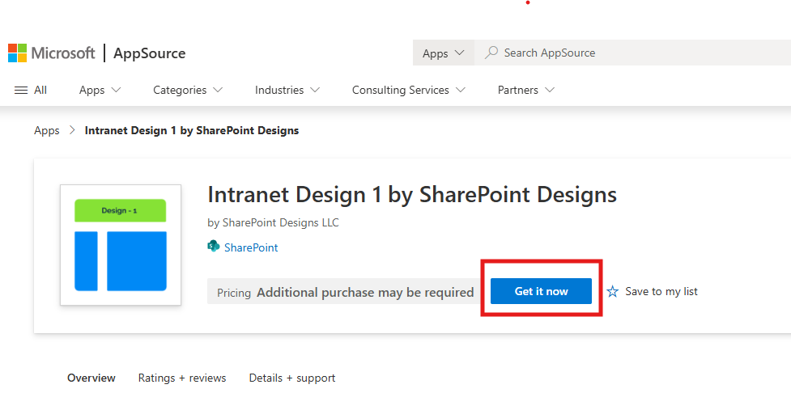
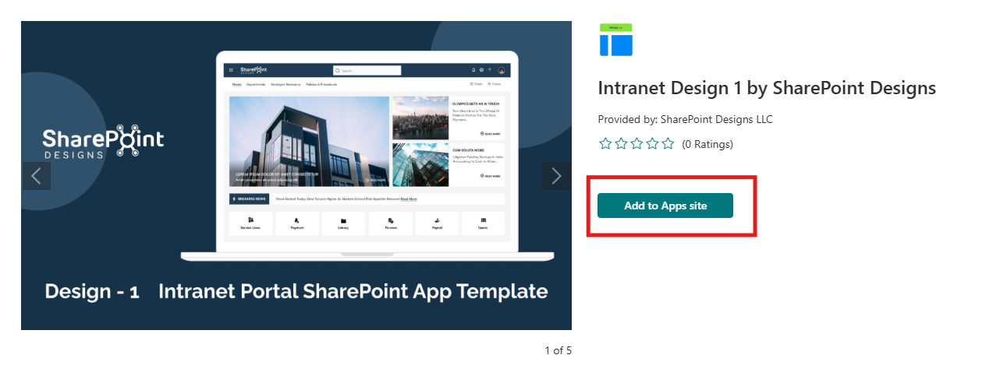

# Installation

## ⚙️ Installation Instructions

| Step | Description                                                                                                                                                                                                                                                                                                                                                                    |
| ---- | ------------------------------------------------------------------------------------------------------------------------------------------------------------------------------------------------------------------------------------------------------------------------------------------------------------------------------------------------------------------------------ |
| 1    | Visit the [Intranet Design 1 – SharePoint Designs](https://appsource.microsoft.com/en-us/product/office/WA200008452?tab=Overview) listing on Microsoft AppSource and then click **Get it now**.                                                                                                                                 |
| 2    | You will be redirected to the SharePoint Store. Click **Add to Apps Site** to add it to your tenant.  ⚠️ _If you don't have permission, a popup will appear saying "App requires permission approval." A request will be raised, and your tenant administrator needs to approve it before the app can be added._ |
| 3    | After adding the app, go to **SharePoint Admin Center > Advanced > API Access** and approve the pending request for the **Employee Search** web part.                                                                                                                                                                                                                          |
| 4    | Required Permissions: `User.Read.All`                                                                                                                                                                                                                                                                                                                                          |
| 5    | Go to any modern SharePoint site, click the **Settings** icon.                                                                                                                                                                                                                                                                                                                 |
| 6    | Select **“Add an app”**, and choose **Intranet Design 1 by SharePoint Designs**.                                                                                                                                                                                                                                                                                               |
| 7    | Click **Add**.                                                                                                                                                                                                                                                                                                                                                                 |
| 8    | Navigate to **Site Contents** to confirm the app is installed.                                                                                                                                                                                                                                                                                                                 |

---

## 🧪 Testing Instructions

### ➕ Add the Design 1 Site Setup Web Part

1. Go to a modern SharePoint page (or create a new one).
2. Edit the page and add the **"Design 1 Site Setup"** web part.
3. Republish the page.
4. Click the **“Apply template”** button.

---

### ✅ Expected Behaviour

A new homepage will be created as per this design:  
🔗 [Home Page Design](https://www.sharepointdesigns.com/diy-intranet-designs)

**Automatically Created Lists (pre-filled with mock data):**

| List Name     | Purpose                      |
| ------------- | ---------------------------- |
| FAQs          | Frequently Asked Questions   |
| Quick Links   | Shortcut to key resources    |
| Tool Links    | Links to internal tools      |
| Breaking News | Time-sensitive announcements |

> ✅ No manual configuration needed after applying the template.

---

## 🔍 Validate Each Web Part on the Provisioned Page

| Web Part               | Description                                 |
| ---------------------- | ------------------------------------------- |
| **📰 Featured News**   | Central updates, professional announcements |
| **🚨 Breaking News**   | Urgent alerts with adjustable duration      |
| **🔗 Quick Links**     | Easy access to essential tools with icons   |
| **👥 Employee Search** | Searchable employee directory with filters  |
| **📰 RSS Feed**        | External industry news matching design      |
| **❓ FAQs**            | Organized, searchable knowledge base        |
| **📅 Events Calendar** | Company meetings/events with full details   |

---

## 🧹 Uninstall Guide

| Step | Instruction                                                              |
| ---- | ------------------------------------------------------------------------ |
| 1    | Go to **Site Contents** in your SharePoint site.                         |
| 2    | Find **Intranet Design 1 by SharePoint Designs**.                        |
| 3    | Click `···` next to the app and select **"Remove"**.                     |
| 4    | If prompted, switch to **Classic Experience**.                           |
| 5    | Hover over the app, click `···`, then click **Remove** again to confirm. |

---

## 🛠️ Troubleshooting Common Issues

| Issue                       | Description                 | Solution                                                                                                                                         |
| --------------------------- | --------------------------- | ------------------------------------------------------------------------------------------------------------------------------------------------ |
| ⚠️ Web Part Not Displaying  | Web part missing on page    | Ensure it is added to a modern page and republished                                                                                              |
| 🔐 API Request Not Approved | Employee Search not working | Approve in **API Management**, ensure all required permissions (`User.Read.All`, `Directory.AccessAsUser.All`, `Directory.Read.All`) are granted |
| 🗃️ Lists Not Created        | Lists missing               | Ensure the **"Apply template"** button was clicked. If not, reapply the design                                                                   |
| 📝 Missing Demo Items       | Lists are empty             | Check if lists exist. If so, reapply the design or add demo items manually                                                                       |

---

## 🌟 Best Practices

### 🔁 Regular Updates

- Update site content regularly.
- Monitor and optimize site performance.

### 🎓 User Training

- Conduct training sessions.
- Provide easy-to-follow documentation.

### 🔐 Security Measures

- Apply strong security protocols.
- Perform regular audits.

### 🗣️ User Feedback

- Collect feedback frequently.
- Implement improvements accordingly.

### 🤝 Collaboration

- Enable team collaboration with SharePoint features.
- Use document libraries, lists, and workflows.

---

## 🧑‍💼 User Permissions

### 🗂️ Assigning Roles

| Role              | Access Level                     |
| ----------------- | -------------------------------- |
| **Site Owners**   | Full control, manage permissions |
| **Site Members**  | Contribute content               |
| **Site Visitors** | Read-only access                 |

### 🛡️ Managing Permissions

- Use permission levels based on responsibilities.
- Create **custom permission levels** if needed.
- Manage **inheritance** across sites/subsites.

### 🧾 Permission Best Practices

- Apply **Least Privilege Principle**.
- Review permissions regularly.
- Keep a **permissions change log**.

---

## 🆘 Support

For help or inquiries, contact **SharePoint Designs**:  
🌐 [www.sharepointdesigns.com](http://www.sharepointdesigns.com)  
📧 support@sharepointdesigns.com
