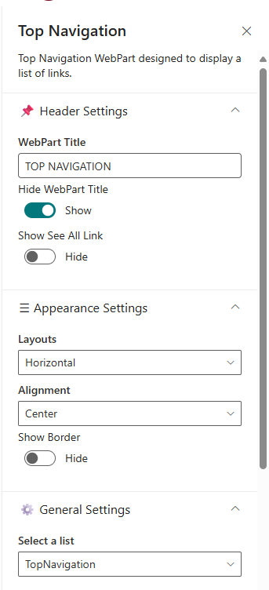
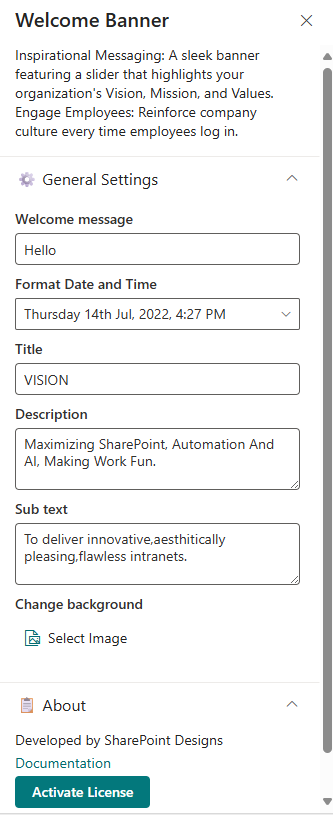
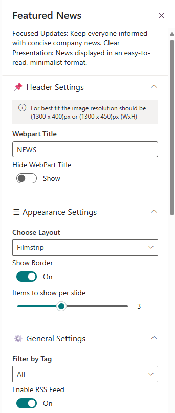
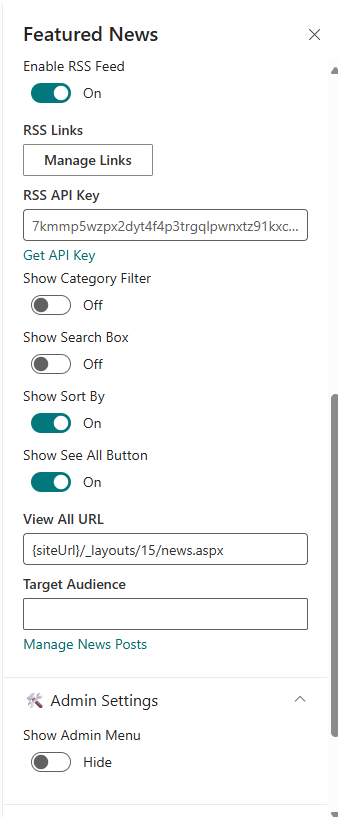

# Configuration

Configuration settings for each web part.

## 🧭 1. Top Navigation

### 📋 Details

- **Intuitive Access**: Minimalist top navigation for easy access to essential
  intranet areas.
- **Customizable Menus**: Simplify menus to suit your organization's needs
  without unnecessary clutter.

---

### 📄 Top Navigation Web Part - Property Pane Configuration

#### 📌 Header Settings

| **Property**       | **Description**                           | **Example / Options** |
| ------------------ | ----------------------------------------- | --------------------- |
| WebPart Title      | Title displayed for the web part          | TOP NAVIGATION        |
| Hide WebPart Title | Toggle to show or hide the WebPart title  | Show / Hide           |
| Show See All Link  | Toggle to show or hide the "See All" link | Show / Hide           |

#### 🎨 Appearance Settings

| **Property** | **Description**                                   | **Example / Options** |
| ------------ | ------------------------------------------------- | --------------------- |
| Layouts      | Defines the layout of the navigation items        | Horizontal            |
| Alignment    | Aligns the navigation content                     | Left / Center / Right |
| Show Border  | Toggle to show or hide border around the web part | Show / Hide           |

#### ⚙️ General Settings

| **Property**  | **Description**                                    | **Example / Options** |
| ------------- | -------------------------------------------------- | --------------------- |
| Select a list | Selects the SharePoint list for navigation content | TopNavigation         |

#### 🔐 Admin Settings

| **Property**    | **Description**                           | **Example / Options** |
| --------------- | ----------------------------------------- | --------------------- |
| Show Admin Menu | Toggle to show admin-only features        | Show / Hide           |
| Admin Users     | Specifies users who can access admin menu | xyz                   |

#### ℹ️ About Section

| 🏷️ Name                     | 🎯 Purpose                                                                           |
| --------------------------- | ------------------------------------------------------------------------------------ |
| **Developer Info**          | Indicates the web part is developed by**SharePoint Designs**.                        |
| **Documentation Link**      | Provides access to user and admin documentation for further guidance.                |
| **Activate License Button** | A button to activate the premium or licensed version of the web part, if applicable. |

## 📰 2. Welcome Banner

### 📋 Details

- **Personalized Welcome Banner** – Greets the user by name with the current date and time, creating a friendly and engaging intranet experience.
- **Inspirational Messaging** - A sleek banner featuring a slider 4ha4 highlights
  your organization's Vision, Mission, and Values.

---

### 🏷️ Welcome Banner Web Part – Property Pane Configuration

The **Welcome Banner** web part delivers inspirational messaging through a configurable banner slider that emphasizes the organization's **Vision**, **Mission**, and **Values**.

#### ⚙️ General Settings

This section allows customization of the **Welcome Banner** for a department or contact information display. The following configurable options are available:

| 🏷️ Name                  | 🎯 Purpose                                                                     | 💡 Select Option                                                     |
| ------------------------ | ------------------------------------------------------------------------------ | -------------------------------------------------------------------- |
| **Welcome message**      | Text displayed as a greeting to the user.                                      | "Hello"                                                              |
| **Format Date and Time** | A date-time picker to display the current date and time in a formatted manner. | "Thursday 14th Jul, 2022, 4:27 PM"                                   |
| **Title**                | Heading or main focus of the banner.                                           | "VISION"                                                             |
| **Description**          | A short, impactful message summarizing the theme of the banner.                | "Maximizing SharePoint, Automation And AI, Making Work Fun."         |
| **Sub text**             | A supporting statement that expands on the main description.                   | "To deliver innovative, aesthetically pleasing, flawless intranets." |
| **Change background**    | Option to upload a custom background image for the banner.                     | Select an image using the "Select Image" control.                    |

## 🔗 3. Quick links

### 📋 Details

- **Essential Resources**: Provide immedia4e access to frequently used tools
  and documents.
- **Minimalist Icons**: Use clean icons and labels for straightforward
  navigation.

### 🏷️ Quick Links Web Part – Property Pane Configuration

- The Quick Links web part offers centralized access to frequently used external applications and team tools. It improves efficiency by simplifying access to all essential resources from one place.

#### 📌 Header Settings

| 🏷️ Name                | 🎯 Purpose                                 | 💡 Select Option |
| ---------------------- | ------------------------------------------ | ---------------- |
| **WebPart Title**      | Title displayed at the top of the web part | COMMON TOOLS     |
| **Hide WebPart Title** | Toggle to show or hide the web part title  | Show / Hide      |

#### ⚙️ General Settings

| 🏷️ Name             | 🎯 Purpose                                                                     | 💡 Select Option        |
| ------------------- | ------------------------------------------------------------------------------ | ----------------------- |
| **Select a list**   | Text displayed as a greeting to the user.                                      | CommonTools             |
| **Add/Update list** | A date-time picker to display the current date and time in a formatted manner. | Action: Add/Update      |
| **Limit**           | Sets the number of quick links to display                                      | 1–50 (Slider set to 16) |

#### 🎨 Appearance Settings

| 🏷️ Name          | 🎯 Purpose                                        | 💡 Select Option |
| ---------------- | ------------------------------------------------- | ---------------- |
| **Show borders** | Toggle to show or hide border around the web part | On / Off         |

## 📰 4. News

### 📋 Details

- **Focused Updates**: Keep everyone informed with concise company news.
- **Clear Presentation**: News displayed in an easy to read, minimalist
  format.

### 🏷️ Featured News Web Part

The **Featured News** web part by SharePoint Designs is designed to keep everyone informed with concise, visually engaging company news. This component supports clean, minimalist layouts and integrates well with RSS feeds and filtering options for dynamic content display.

#### 📌 Header Settings

| 🏷️ Name                | 🎯 Purpose                                        | 💡 Select Option         |
| ---------------------- | ------------------------------------------------- | ------------------------ |
| **Webpart Title**      | Set a custom title for the web part.              | NEWS                     |
| **Hide WebPart Title** | Toggle to show or hide the web part title.        | Show                     |
| **Image Resolution**   | Recommended image resolution for optimal display. | 1300x400px or 1300x450px |

#### 🎨 Appearance Settings

| 🏷️ Name                     | 🎯 Purpose                                    | 💡 Select Option |
| --------------------------- | --------------------------------------------- | ---------------- |
| **Choose Layout**           | Select the visual layout for displaying news. | Filmstrip        |
| **Show Border**             | Toggle the border around each news item.      | On               |
| **Items to Show per Slide** | Set how many news items appear in each slide. | 3                |

#### ⚙️ General Settings

| 🏷️ Name                  | 🎯 Purpose                                                         | 💡 Select Option                        |
| ------------------------ | ------------------------------------------------------------------ | --------------------------------------- |
| **Filter by Tag**        | Choose to filter content by specific tags or categories.           | All                                     |
| **Enable RSS Feed**      | Toggle to display external RSS news feeds.                         | On                                      |
| **RSS Links**            | Manage external RSS feed links.                                    | [Manage Links]                          |
| **RSS API Key**          | Provide or generate an API key for secure RSS integration.         | 7kmmp5wzpx2dyt4f4p3trgqlpwnxtz91kxcc... |
| **Show Category Filter** | Toggle to enable filtering content by category.                    | Off                                     |
| **Show Search Box**      | Toggle to include a search box for news items.                     | Off                                     |
| **Show Sort By**         | Enable sorting functionality (e.g., by date or title).             | On                                      |
| **Show See All Button**  | Toggle to display a “See All” button linking to full news listing. | On                                      |
| **View All URL**         | Set the page URL for viewing the full list of news items.          | `{siteUrl}/\_layouts/15/news.aspx`      |
| **Target Audience**      | Define audience targeting for news content visibility.             | (Empty)                                 |
| **Manage News Posts**    | Link to the interface for managing and editing news posts.         | [Manage News Posts]                     |

## 🏢 5. Facilities

### 📋 Details

- **Organizational Facilities**: Highlight various facilities of your organization
  with brief descriptions and images.
- **Visual Engagement**: Use a clean layout to showcase offices,
  departments, or amenities.

### 🏷️ Facilities Web Part – Configuration Tables

#### 📌 Header Settings

| 🏷️ Name                | 🎯 Purpose                                 | 💡 Select Option |
| ---------------------- | ------------------------------------------ | ---------------- |
| **WebPart Title**      | Title displayed at the top of the web part | FACILITIES       |
| **Hide WebPart Title** | Toggle to show or hide the title           | Show             |

#### ⚙️ General Settings

| 🏷️ Name             | 🎯 Purpose                                     | 💡 Select Option |
| ------------------- | ---------------------------------------------- | ---------------- |
| **Select a list**   | Choose the SharePoint list for displaying data | Facilities       |
| **Add/Update list** | Link or refresh the selected list              | -                |

#### 🎨 Appearance Settings

| 🏷️ Name                  | 🎯 Purpose                            | 💡 Select Option                           |
| ------------------------ | ------------------------------------- | ------------------------------------------ |
| **See All**              | URL for the “View All” button         | `{siteUrl}/Lists/Facilities/AllItems.aspx` |
| **Show view all button** | Display button to view all list items | On                                         |
| **Show border**          | Toggle to enable a visual border      | On                                         |
| **Height**               | WebPart vertical height in pixels     | 388                                        |

## 📅 6. Events Calendar

### 📋 Details

- Unified Scheduling: Display company events, meetings, and important
  dates.
- Simple View: A clear calendar layout without unnecessary embellishmen

### 🏷️ Events Calendar Web Part

The **Events Calendar** web part allows site administrators to display and manage a calendar of upcoming events from a SharePoint list. This configurable component ensures that team members stay informed about scheduled activities, meetings, and deadlines.

#### 🧷 Header Settings

| 🏷️ Name                | 🎯 Purpose                                           | 💡 Select Option                                 |
| ---------------------- | ---------------------------------------------------- | ------------------------------------------------ |
| **WebPart Title**      | The title displayed at the top of the web part       | EVENTS CALENDAR                                  |
| **Hide WebPart Title** | Option to show or hide the title                     | Show                                             |
| **Show See All Link**  | Display a link that leads to the full events view    | Show                                             |
| **View All URL**       | URL of the page where all calendar events are listed | `{siteUrl}/_layouts/15/Events.aspx?ListGuid=...` |

#### ⚙️ General Settings

| 🏷️ Name             | 🎯 Purpose                                              | 💡 Select Option |
| ------------------- | ------------------------------------------------------- | ---------------- |
| **Select a list**   | Dropdown to choose the list used for events             | Events           |
| **Show Calendar**   | Toggle to show calendar-style display                   | Yes              |
| **Filter Events**   | Dropdown to filter event types shown in the web part    | Upcoming Events  |
| **Add/Edit Events** | Links to create or update events in the configured list | Add/Edit Events  |

## 🎉 7. Holidays

### 📋 Details

- Upcoming Breaks: Highlight upcoming public holidays and company
  days off.
- Planning Aid: Assist in scheduling around non-working days.

### 🏷️ Holidays Property Pane Configuration

The **Holidays Property Pane** allows users to configure the display settings of the Holidays web part.

#### 📌 Header Settings

| 🏷️ Name                | 🎯 Purpose                                    | 💡 Select Option   |
| ---------------------- | --------------------------------------------- | ------------------ |
| **Title**              | Specifies the display name of the web part.   | -                  |
| **Hide WebPart Title** | Toggles the visibility of the web part title. | **Show**, **Hide** |

#### ⚙️ General Settings

| 🏷️ Name           | 🎯 Purpose                                                                  | 💡 Select Option               |
| ----------------- | --------------------------------------------------------------------------- | ------------------------------ |
| **Select a list** | Allows you to select the SharePoint list from which holidays are retrieved. | List dropdown (e.g., Holidays) |

#### 🎨 Appearance Settings

| 🏷️ Name                        | 🎯 Purpose                                                           | 💡 Select Option                                           |
| ------------------------------ | -------------------------------------------------------------------- | ---------------------------------------------------------- |
| **Filter Holidays**            | Filters the type of holidays to display.                             | **All Holidays**, **Upcoming Holidays**, **Past Holidays** |
| **Change Bullet/Icon Style**   | Displays holidays with customized bullet icons.                      | **On**, **Off**                                            |
| **Show Border**                | Adds a border around the holiday list.                               | **On**, **Off**                                            |
| **No. of Holidays to Display** | Sets the maximum number of holidays visible in the web part.         | **6**                                                      |
| **Height**                     | Adjustable slider to control the height of the web part (in pixels). | **424**                                                    |
