# Configuration

This document explains how to configure each web part in your intranet solution, including setup details, list configurations, and property pane options.

- - -

## 📑 Table of Contents

1. [🧭 Top Navigation](#-2-top-navigation)
2. [🎉 Welcome Banner](#-3-welcome-banner)
3. [🔗 Common Tools](#-4-common-tools)
4. [📰 News](#-5-news)
5. [🏢 Facilities](#-6-facilities)
6. [📅 Events Calendar](#-7-events-calendar)
7. [🎈 Holidays](#-8-holidays)

- - -

## 1. Set Up Wizard

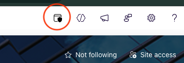

1. Since this is a first-time setup (or setup was not previously completed), a **full-page Setup Wizard** will automatically appear — no need to manually add any web part.

📸 View Set up Screenshots

   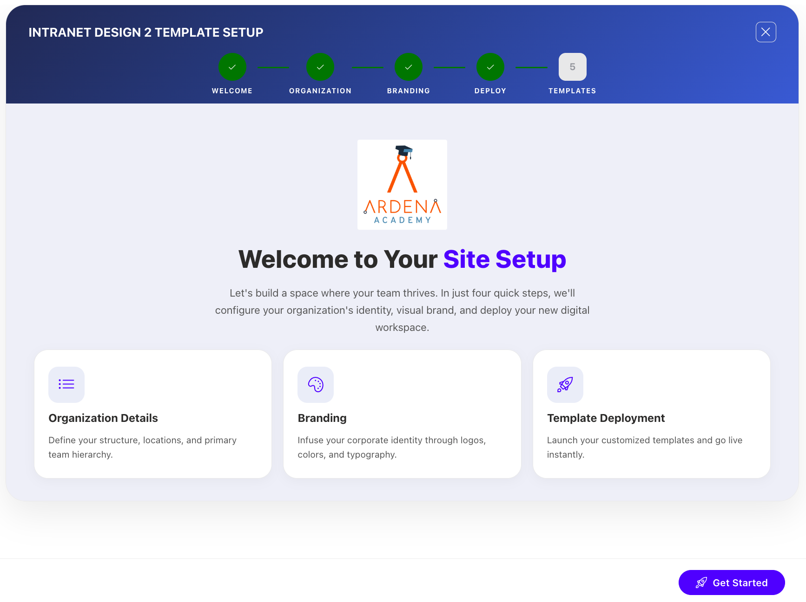

2. Walk through the wizard steps:

   * **Organizational Details** — Enter your organization information.
   * **Branding** — Upload your site logo. The wizard uses AI to automatically generate a brand color palette from the logo. You can review, adjust, or change the suggested colors before clicking **Save and Apply Theme**. You can also upload a custom favicon and configure regional settings.
   * **Deploy & Template** — Deploy the intranet layout. Once deployed, the page is saved as a template so it can be reused later to recreate the site layout.
3. Do not close the browser during deployment. The wizard will create the required lists, libraries, and layout with sample data.
4. Once deployment is complete, you will be given the option to **set the newly created page as your homepage**. Click **View Page** to open the new page with the full Design 2 layout applied.

📸 View Completed setup Screenshots

   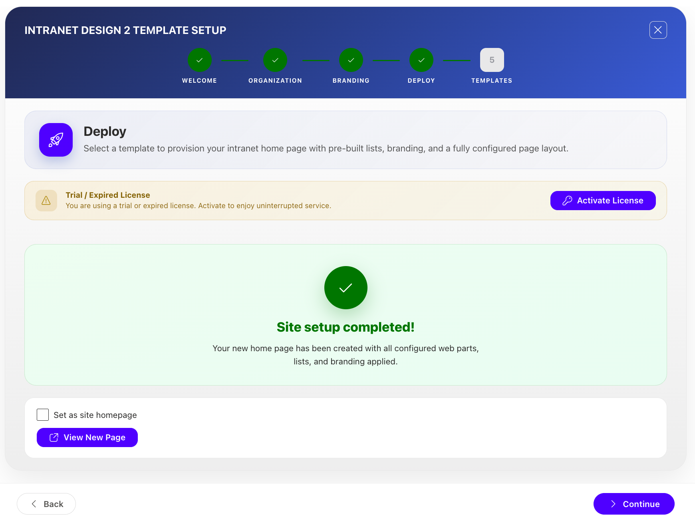

> **After Setup**
>
> * The full-page wizard will no longer appear on page load.
> * You can relaunch the Setup Wizard at any time from the **suite bar** at the top of the site to update settings.
> * Admins can return to the Deploy & Template step at any time to apply a saved template and recreate the site layout.

- - -

- - -

## 🧭 2. Top Navigation

A minimalist top navigation bar providing easy access to essential intranet sections. Menus are fully customizable to match your organization’s needs.

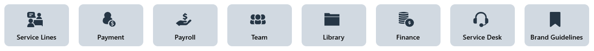

- - -

### 🧱 List Configuration

Create a SharePoint list with the following columns:

| 🏷️ Column Name | 🔣 Type         | Description                        |
| --------------- | --------------- | ---------------------------------- |
| Icon            | Image           | Displays the navigation icon       |
| URL             | Hyperlink       | Target link for each item          |
| Order           | Number          | Defines item order                 |
| TargetWindow    | Choice (Yes/No) | Opens in a new tab if set to “Yes” |

- - -

### ⚙️ Property Pane Settings

📸 View Property Pane Screenshots

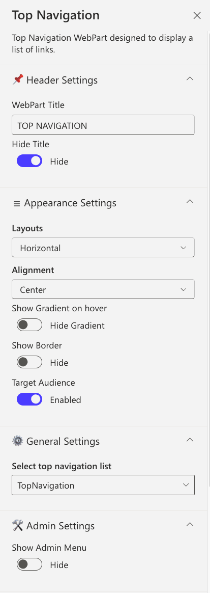

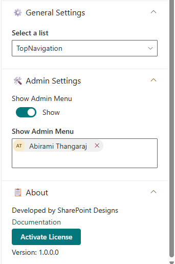

#### Header Settings

| Name          | Purpose                                                           | Option         |
| ------------- | ----------------------------------------------------------------- | -------------- |
| WebPart Title | Customize the title displayed above the navigation bar            | TOP NAVIGATION |
| Hide Title    | Conceal the title to create a cleaner, more minimalist appearance | Show / Hide    |

#### Appearance Settings

| Name                   | Purpose                                                             | Option                |
| ---------------------- | ------------------------------------------------------------------- | --------------------- |
| Layout                 | Select the arrangement of navigation items (currently horizontal)   | Horizontal            |
| Alignment              | Control the horizontal positioning of navigation items              | Left / Center / Right |
| Show Gradient on Hover | Add a subtle gradient effect when users hover over navigation items | Show / Hide           |
| Show Border            | Display a border frame around the entire navigation component       | Show / Hide           |
| Border Color           | Choose the color of the navigation border for brand consistency     | Color Picker          |
| Target Audience        | Restrict navigation visibility to specific user groups or audiences | Optional              |

#### General Settings

📸 View Property Pane Screenshots

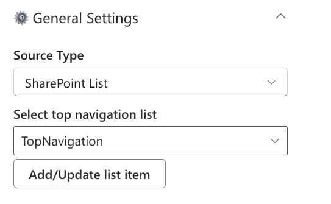

| Name                       | Purpose                                                          | Option        |
| -------------------------- | ---------------------------------------------------------------- | ------------- |
| Select source | Select either to pick the items from a sharepoint list or property panel | List, Property Pane |
| Select top navigation list | Choose the SharePoint list containing your navigation menu items | List |
| Add/Update list item | Clicking on it should open a panel to manage the list items | SharePoint List |
| Manage Top Navigation | Collection of data store in the property panel | Property Pane |

#### Admin Settings

| Name            | Purpose                                                         | Option       |
| --------------- | --------------------------------------------------------------- | ------------ |
| Show Admin Menu | Display an additional menu section exclusive to administrators  | Show / Hide  |
| Admin Users     | Specify which users have access to the admin-only menu features | (User names) |

- - -

## 🎉 3. Welcome Banner

A personalized banner greeting the user by name and time, while promoting your organization’s **Vision**, **Mission**, and **Values**.

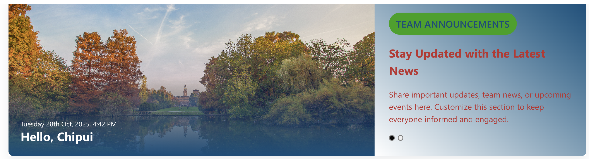

- - -

### ⚙️ Configuration

📸 View Property Pane Screenshots

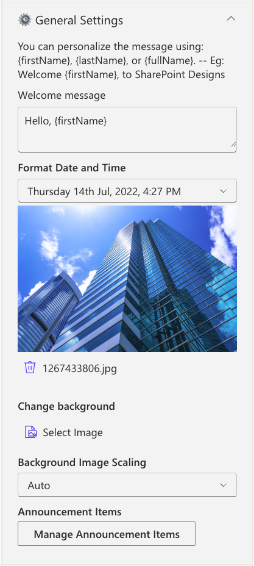

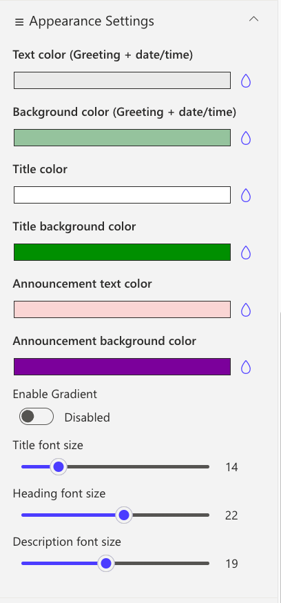

### General Settings

| Name                      | Purpose                                                                                                                                  | Example                                 |
| ------------------------- | ---------------------------------------------------------------------------------------------------------------------------------------- | --------------------------------------- |
| Welcome Message           | Defines the greeting text displayed to users. Supports tokens such as `{firstName}`, `{lastName}`, and `{fullName}` for personalization. | `Welcome, {firstName}`                  |
| Format Date and Time      | Configures how the current date and time are presented within the component.                                                             | `Monday, 14 Aug 2023, 3:45 PM`          |
| Change Background         | Allows uploading a custom banner image to be used as the background.                                                                     | Upload via Image Picker                 |
| Background image scaling  | Controls how the background image is resized or fitted within the banner area.                                                           | Options: Cover, Auto, Contain           |
| Manage Announcement Items | Provides a collection field to add and manage the announcements displayed in the carousel.                                               | Add items through a property collection |
| Text Color                | Sets the default color for paragraph-level text within the component.                                                                    | Select a color using the Color Picker   |
| Font Sizes                | Configures the font sizes for badges, headings, and paragraph elements.                                                                  | Adjust using slider controls            |

### Appearance Settings

| Name                                    | Purpose                                                                              | Example                       |
| --------------------------------------- | ------------------------------------------------------------------------------------ | ----------------------------- |
| Text color (Greeting + date/time)       | Sets the color of the greeting message and the displayed date/time text.             | Choose a preferred text color |
| Background color (Greeting + date/time) | Defines the background color applied behind the greeting and date/time section.      | Select a background color     |
| Title color                             | Specifies the text color for announcement titles.                                    | Pick a title color            |
| Title background color                  | Sets the background color for the announcement title area.                           | Choose a background color     |
| Announcement text color                 | Configures the color used for general announcement text.                             | Select from the color palette |
| Announcement background color           | Determines the background color for the announcement card container.                 | Use the Color Picker          |
| Enable Gradient                         | Toggles a gradient overlay on the banner image and announcement card when activated. | Enable via toggle switch      |
| Title font size                         | Adjusts the font size for announcement titles.                                       | Modify using slider control   |
| Heading font size                       | Adjusts the font size for announcement headings.                                     | Modify using slider control   |
| Description font size                   | Sets the font size for the announcement description text.                            | Adjust using slider control   |

- - -

## 🔗 4. Common Tools

Provides quick access to essential tools, apps, and documents for daily use with clean icons and labels.

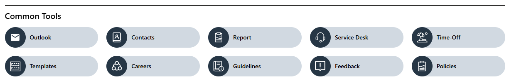

- - -

### 🧱 List Configuration

| Column Name | Type            | Description           |
| ----------- | --------------- | --------------------- |
| Icon        | Image           | Tool icon             |
| Link        | Hyperlink       | Target URL            |
| OrderBy     | Number          | Sort order            |
| OpenIn      | Choice (Yes/No) | Opens in a new window |

- - -

### ⚙️ Property Pane Settings

📸 View Property Pane Screenshots

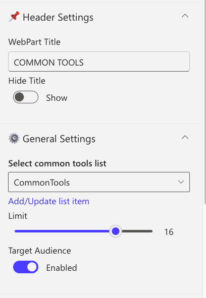

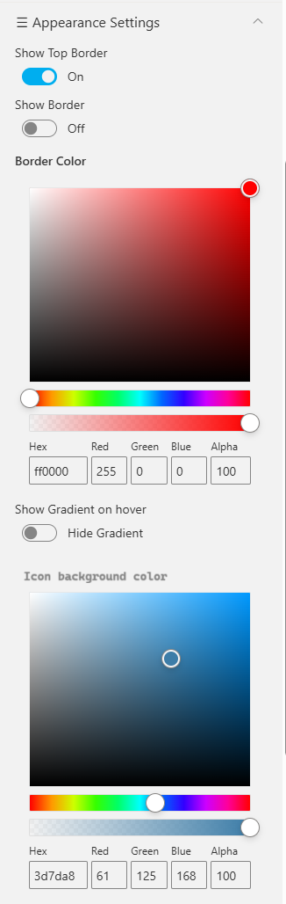

| Category   | Name                   | Purpose                                                             | Option       |
| ---------- | ---------------------- | ------------------------------------------------------------------- | ------------ |
| Header     | WebPart Title          | Title displayed at top                                              | COMMON TOOLS |
| Header     | Hide Title             | Toggle visibility                                                   | Show / Hide  |
| Select source | Select either to pick the items from a sharepoint list or property panel | List, Property Pane |
| Select a list | Choose the SharePoint list containing your tools menu items | List |
| Add/Update list item | Clicking on it should open a panel to manage the list items | SharePoint List |
| Manage Common Tools | Collection of data store in the property panel | Property Pane |
| General    | Limit                  | Number of links to show                                             | 1–50         |
| General    | Target audience        | Restrict navigation visibility to specific user groups or audiences | Group name   |
| Appearance | Show Top Border        | Toggle sharp top border                                             | On / Off     |
| Appearance | Border Color           | Select border color                                                 | Color Picker |
| Appearance | Show Gradient on Hover | Highlight link on hover                                             | Color Picker |
| Appearance | Icon Background Color  | Change icon background                                              | Color Picker |

- - -

## 📰 5. News

Showcase concise company updates in a clean, minimal layout. Integrates with SharePoint news or RSS feeds.

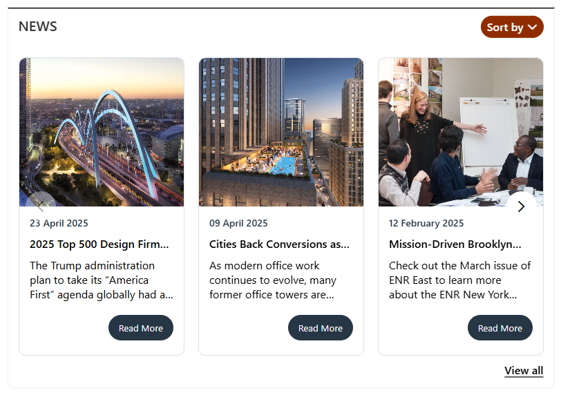

- - -

### ⚙️ Configuration

📸 View Property Pane Screenshots

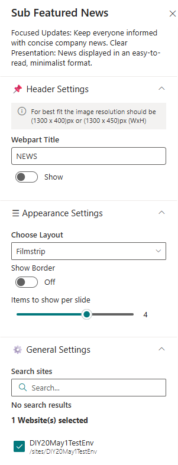

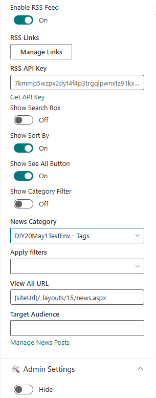

#### Header Settings

| Name             | Purpose                   | Option     |
| ---------------- | ------------------------- | ---------- |
| WebPart Title    | Custom title for web part | NEWS       |
| Hide Title       | Toggle visibility         | Show       |
| Image Resolution | Recommended image size    | 1300x400px |

#### General Settings

| Name                 | Purpose                          | Example                           |
| -------------------- | -------------------------------- | --------------------------------- |
| Search Sites         | Select source sites              | Current site                      |
| Enable RSS Feed      | Enable RSS integration           | On                                |
| RSS Links            | Manage external feeds            | \[Manage Links]                   |
| Show See All Button  | Adds “See All” button            | On                                |
| Show Category Filter | Enables category-based filtering | Off                               |
| View All URL         | URL for full list                | `{siteUrl}/_layouts/15/news.aspx` |

- - -

## 🏢 6. Facilities

Highlight your organization’s facilities, offices, or departments using a clean, visual layout.

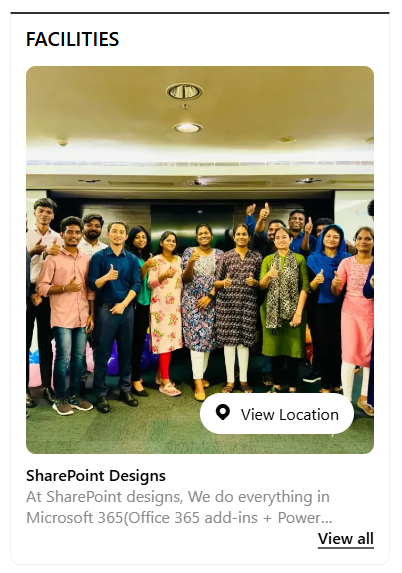

- - -

### 🧱 List Configuration

| Column           | Type                   | Description          |
| ---------------- | ---------------------- | -------------------- |
| Content          | Multiple lines of text | Facility description |
| Thumbnail        | Image                  | Facility image       |
| OrderBy          | Number                 | Sort order           |
| Address Location | Multiple lines of text | Address info         |

- - -

### ⚙️ Property Pane Settings

📸 View Property Pane Screenshot

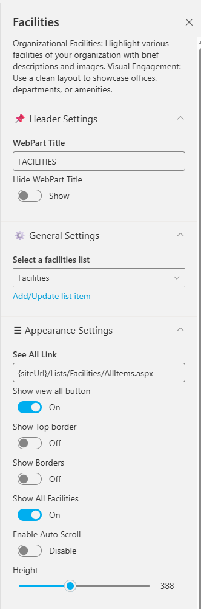

| \| Name            | Purpose                    | Option                                     |
| ------------------ | -------------------------- | ------------------------------------------ |
| WebPart Title      | Display title              | FACILITIES                                 |
| Hide Title         | Toggle visibility          | Show                                       |
| Select a list      | Choose SharePoint list     | Facilities                                 |
| Add/Update list item | Clicking on it should open a panel to manage the list items | SharePoint List |
| See All            | URL for full list          | `{siteUrl}/Lists/Facilities/AllItems.aspx` |
| Show Top Border    | Toggle top border          | On / Off                                   |
| Show Borders       | Add border around web part | On / Off                                   |
| Enable Auto Scroll | Auto-scroll carousel       | On / Off                                   |
| Height             | Set height (px)            | 388                                        |

- - -

## 📅 7. Events Calendar

Display and manage upcoming company events, meetings, and important dates.

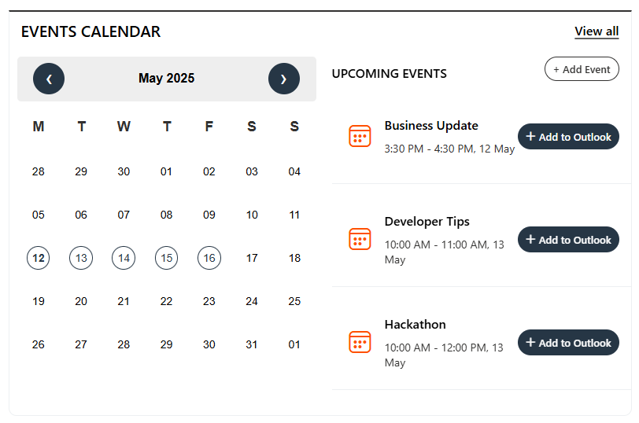

- - -

### ⚙️ Configuration

📸 View Property Pane Screenshots

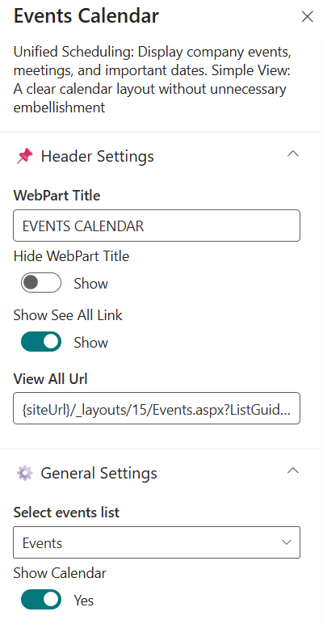

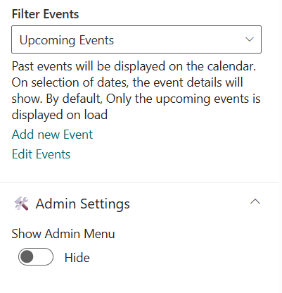

| Name                     | Purpose                      | Example                             |
| ------------------------ | ---------------------------- | ----------------------------------- |
| WebPart Title            | Title of the section         | EVENTS CALENDAR                     |
| Show See All Link        | Link to full event list      | Show                                |
| View All URL             | URL to all events            | `{siteUrl}/_layouts/15/Events.aspx` |
| Select the option events | Choose event source          | SharePoint / Mailbox / Current User |
| Filter Events            | Show upcoming or past events | Upcoming Events                     |
| Add/Edit Events          | Manage list items            | Add/Edit Events                     |

- - -

## 🎈 8. Holidays

Highlight upcoming public holidays or company days off to help employees plan ahead.

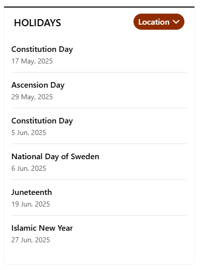

- - -

### 🧱 List Configuration

| Column      | Type                   | Description            |
| ----------- | ---------------------- | ---------------------- |
| Description | Multiple lines of text | Holiday details        |
| HolidayLink | Hyperlink              | External link (if any) |
| StartDate   | Date and Time          | Holiday date           |
| Location    | Choice                 | Location-based         |

- - -

### ⚙️ Property Pane Settings

📸 View Property Pane Screenshot

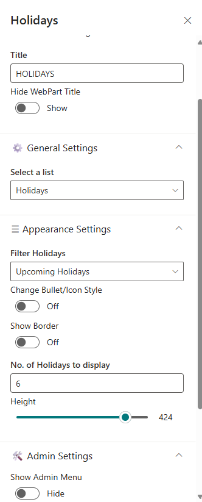

| Name                       | Purpose                       | Option                |
| -------------------------- | ----------------------------- | --------------------- |
| Title                      | Title for web part            |                       |
| Hide Title                 | Toggle visibility             | Show / Hide           |
| Select source | Select either to pick the items from a sharepoint list or property panel | List, Property Pane |
| Select a list | Choose the SharePoint list containing your Holidays menu items | List |
| Add/Update list item | Clicking on it should open a panel to manage the list items | SharePoint List |
| Manage Top Navigation | Collection of data store in the property panel | Property Pane |
| Filter Holidays            | Filter type                   | All / Upcoming / Past |
| Show Bullets               | Display icons beside holidays | On / Off              |
| Show Borders               | Show/hide border              | On / Off              |
| Border Color               | Pick border color             | Color Picker          |
| No. of Holidays to Display | Limit results                 | 6                     |
| Height                     | Adjust component height       | 424                   |

- - -

> 📘 **Developed by:** [SharePoint Designs](https://sharepointdesigns.com)
