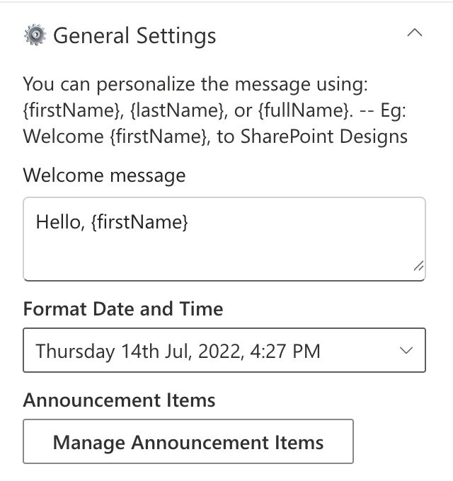
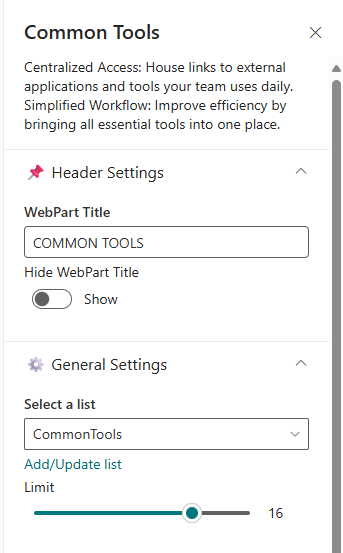
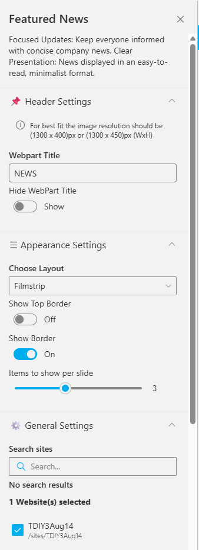

# Configuration

This document explains how to configure each web part in your intranet solution, including setup details, list configurations, and property pane options.

- - -

## 📑 Table of Contents

1. [🧭 Top Navigation](#-1-top-navigation)
2. [🎉 Welcome Banner](#-2-welcome-banner)
3. [🔗 Common Tools](#-3-common-tools)
4. [📰 News](#-4-news)
5. [🏢 Facilities](#-5-facilities)
6. [📅 Events Calendar](#-6-events-calendar)
7. [🎈 Holidays](#-7-holidays)

- - -

## 🧭 1. Top Navigation

### Overview

A minimalist top navigation bar providing easy access to essential intranet sections. Menus are fully customizable to match your organization’s needs.

- - -

### 🧱 List Configuration

Create a SharePoint list with the following columns:

| 🏷️ Column Name | 🔣 Type         | Description                        |
| --------------- | --------------- | ---------------------------------- |
| Icon            | Image           | Displays the navigation icon       |
| URL             | Hyperlink       | Target link for each item          |
| Order           | Number          | Defines item order                 |
| TargetWindow    | Choice (Yes/No) | Opens in a new tab if set to “Yes” |

- - -

### ⚙️ Property Pane Settings

📸 View Property Pane Screenshots

#### Header Settings

| Name          | Purpose                          | Option         |
| ------------- | -------------------------------- | -------------- |
| WebPart Title | Title displayed for the web part | TOP NAVIGATION |
| Hide Title    | Toggle web part title visibility | Show / Hide    |

#### Appearance Settings

| Name                   | Purpose                        | Option                |
| ---------------------- | ------------------------------ | --------------------- |
| Layout                 | Defines navigation layout      | Horizontal            |
| Alignment              | Align content                  | Left / Center / Right |
| Show Gradient on Hover | Adds hover gradient effect     | Show / Hide           |
| Show Border            | Toggles border around web part | Show / Hide           |
| Border Color           | Border color picker            | Color Picker          |

#### General Settings

| Name                       | Purpose                               | Option        |
| -------------------------- | ------------------------------------- | ------------- |
| Select top navigation list | Choose SharePoint list for navigation | TopNavigation |

#### Admin Settings

| Name            | Purpose                     | Option       |
| --------------- | --------------------------- | ------------ |
| Show Admin Menu | Toggles admin-only features | Show / Hide  |
| Admin Users     | Users with admin access     | (User names) |

- - -

## 🎉 2. Welcome Banner

### Overview

A personalized banner greeting the user by name and time, while promoting your organization’s **Vision**, **Mission**, and **Values**.

- - -

### ⚙️ Configuration

📸 View Property Pane Screenshots

| Name                      | Purpose                                                                           | Example                            |
| ------------------------- | --------------------------------------------------------------------------------- | ---------------------------------- |
| Welcome Message           | Display a personalized greeting. Use '{firstName}', '{lastName}', or '{fullName}' | “Hello '{firstName}'”              |
| Format Date and Time      | Display the current date and time                                                 | “Thursday 14th Jul, 2022, 4:27 PM” |
| Manage Announcement Items | Add the collection of announcements that will appear in carousel view             | Property collection data field     |
| Text Color                | Adjust paragraph text color                                                       | Color Picker                       |
| Font Sizes                | Set badge, heading, and paragraph font sizes                                      | Slider Controls                    |
| Change Background         | Upload a custom banner background                                                 | Image Picker                       |

- - -

## 🔗 3. Common Tools

### Overview

Provides quick access to essential tools, apps, and documents for daily use with clean icons and labels.

- - -

### 🧱 List Configuration

| Column Name | Type            | Description           |
| ----------- | --------------- | --------------------- |
| Icon        | Image           | Tool icon             |
| Link        | Hyperlink       | Target URL            |
| OrderBy     | Number          | Sort order            |
| OpenIn      | Choice (Yes/No) | Opens in a new window |

- - -

### ⚙️ Property Pane Settings

📸 View Property Pane Screenshots

| Category   | Name                   | Purpose                 | Option       |
| ---------- | ---------------------- | ----------------------- | ------------ |
| Header     | WebPart Title          | Title displayed at top  | COMMON TOOLS |
| Header     | Hide Title             | Toggle visibility       | Show / Hide  |
| General    | Select a list          | Choose SharePoint list  | CommonTools  |
| General    | Limit                  | Number of links to show | 1–50         |
| Appearance | Show Top Border        | Toggle sharp top border | On / Off     |
| Appearance | Border Color           | Select border color     | Color Picker |
| Appearance | Show Gradient on Hover | Highlight link on hover | Color Picker |
| Appearance | Icon Background Color  | Change icon background  | Color Picker |

- - -

## 📰 4. News

### Overview

Showcase concise company updates in a clean, minimal layout. Integrates with SharePoint news or RSS feeds.

- - -

### ⚙️ Configuration

📸 View Property Pane Screenshots

#### Header Settings

| Name             | Purpose                   | Option     |
| ---------------- | ------------------------- | ---------- |
| WebPart Title    | Custom title for web part | NEWS       |
| Hide Title       | Toggle visibility         | Show       |
| Image Resolution | Recommended image size    | 1300x400px |

#### General Settings

| Name                 | Purpose                          | Example                           |
| -------------------- | -------------------------------- | --------------------------------- |
| Search Sites         | Select source sites              | Current site                      |
| Enable RSS Feed      | Enable RSS integration           | On                                |
| RSS Links            | Manage external feeds            | \[Manage Links]                   |
| Show See All Button  | Adds “See All” button            | On                                |
| Show Category Filter | Enables category-based filtering | Off                               |
| View All URL         | URL for full list                | `{siteUrl}/_layouts/15/news.aspx` |

- - -

## 🏢 5. Facilities

### Overview

Highlight your organization’s facilities, offices, or departments using a clean, visual layout.

- - -

### 🧱 List Configuration

| Column           | Type                   | Description          |
| ---------------- | ---------------------- | -------------------- |
| Content          | Multiple lines of text | Facility description |
| Thumbnail        | Image                  | Facility image       |
| OrderBy          | Number                 | Sort order           |
| Address Location | Multiple lines of text | Address info         |

- - -

### ⚙️ Property Pane Settings

📸 View Property Pane Screenshot

| Name               | Purpose                    | Option                                     |
| ------------------ | -------------------------- | ------------------------------------------ |
| WebPart Title      | Display title              | FACILITIES                                 |
| Hide Title         | Toggle visibility          | Show                                       |
| Select a list      | Choose SharePoint list     | Facilities                                 |
| See All            | URL for full list          | \\\\`{siteUrl}/Lists/Facilities/AllItems.aspx\\\\` |
| Show Top Border    | Toggle top border          | On / Off                                   |
| Show Borders       | Add border around web part | On / Off                                   |
| Enable Auto Scroll | Auto-scroll carousel       | On / Off                                   |
| Height             | Set height (px)            | 388                                        |

- - -

## 📅 6. Events Calendar

### Overview

Display and manage upcoming company events, meetings, and important dates.

- - -

### ⚙️ Configuration

📸 View Property Pane Screenshots

| Name                     | Purpose                      | Example                             |
| ------------------------ | ---------------------------- | ----------------------------------- |
| WebPart Title            | Title of the section         | EVENTS CALENDAR                     |
| Show See All Link        | Link to full event list      | Show                                |
| View All URL             | URL to all events            | \\\\`{siteUrl}/_layouts/15/Events.aspx\\\\` |
| Select the option events | Choose event source          | SharePoint / Mailbox                |
| Filter Events            | Show upcoming or past events | Upcoming Events                     |
| Add/Edit Events          | Manage list items            | Add/Edit Events                     |

- - -

## 🎈 7. Holidays

### Overview

Highlight upcoming public holidays or company days off to help employees plan ahead.

- - -

### 🧱 List Configuration

| Column      | Type                   | Description            |
| ----------- | ---------------------- | ---------------------- |
| Description | Multiple lines of text | Holiday details        |
| HolidayLink | Hyperlink              | External link (if any) |
| StartDate   | Date and Time          | Holiday date           |
| Location    | Choice                 | Location-based         |

- - -

### ⚙️ Property Pane Settings

📸 View Property Pane Screenshot

| Name                       | Purpose                       | Option                |
| -------------------------- | ----------------------------- | --------------------- |
| Title                      | Title for web part            | -                     |
| Hide Title                 | Toggle visibility             | Show / Hide           |
| Select a list              | Choose source list            | Holidays              |
| Filter Holidays            | Filter type                   | All / Upcoming / Past |
| Show Bullets               | Display icons beside holidays | On / Off              |
| Show Borders               | Show/hide border              | On / Off              |
| Border Color               | Pick border color             | Color Picker          |
| No. of Holidays to Display | Limit results                 | 6                     |
| Height                     | Adjust component height       | 424                   |

- - -

> 📘 **Developed by:** [SharePoint Designs](https://sharepointdesigns.com)
