# Configuration

Configuration settings for each web part.

### Note:

All subpages should be configured using the "Design 2 SubPage Setup" web part to ensure that the required lists and libraries are created automatically with mock data. Without this configuration, users will need to manually create dedicated lists or libraries for the respective web parts.

## 📇 1. Welcome Banner

### 📋 Details

- **Department Showcase Web Part**: Visually highlights a specific department with a professional background image and clear labeling of the department name.
- **Key Personnel Display**: Features profile cards for key team members (e.g., Manager and Quality Manager) with names, roles, and placeholders for profile pictures.

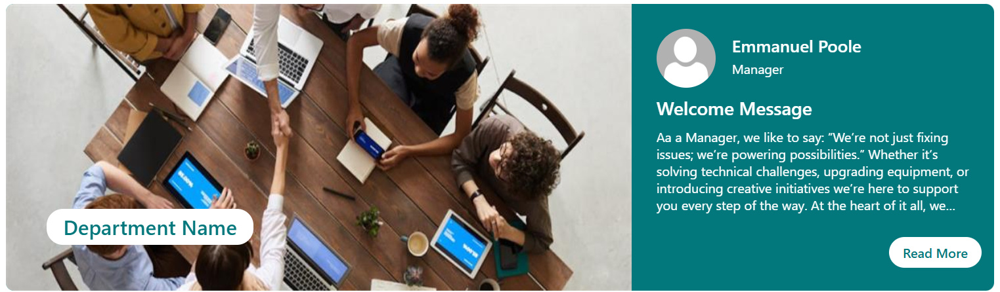

### List Config

Note: If the layout selected for the Welcome Banner is **Employee Resource Banner**, it must be connected to a SharePoint list.

| 🏷️ Column Name (Case Sensitive) | 🔣 Column Type            |
| ------------------------------- | ------------------------- |
| **Name**                        | 👤 Person                 |
| **Role**                        | 🔤 Single line of text    |
| **Message Description**         | 📄 Multiple lines of text |
| **Read MoreLink**               | 🔗 Hyperlink              |

### 🏷️ Welcome Banner Web Part – Property Pane Configuration

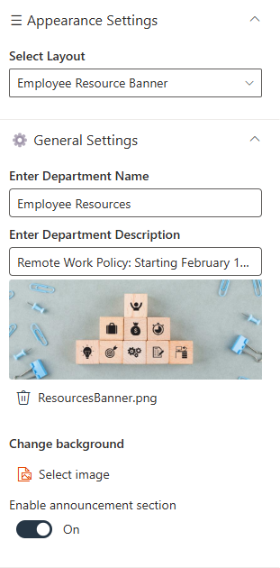

### 🎨 Appearance Settings

| 🏷️ Name       | 🎯 Purpose                                  | 💡 Select Option |
| ------------- | ------------------------------------------- | ---------------- |
| Select Layout | Defines the layout of the department banner | Choose layout    |

---

### ⚙️ General Settings

| 🏷️ Name                        | 🎯 Purpose                                            | 💡 Select Option |
| ------------------------------ | ----------------------------------------------------- | ---------------- |
| Enter Department Name          | Text field to input the department name               | Department Name  |
| Enter Department Name Height   | Adjusts the font size of the department name          | 16               |
| Banner Height                  | Adjusts the height of the banner                      | 350              |
| Select a window quicklink list | Chooses a quick link list to be displayed in a window | ManagerMessage   |
| Enable announcement section    | Toggles display of the announcement section           | On               |
| Enter Manager Message Header   | Text for the header of the manager’s message          | Welcome Message  |
| Enter Read More Text           | Text for the "Read More" link in the message section  | (Blank)          |
| Change background              | Allows changing the background image of the banner    | Select image     |

## 📰 2. Document Content

### 📋 Details

- Document Content Web Part displays department policy documents in a card layout, each labeled clearly by department (e.g., HR, IT, Finance).
- Horizontal Carousel Navigation allows users to browse through available documents using left and right arrows.

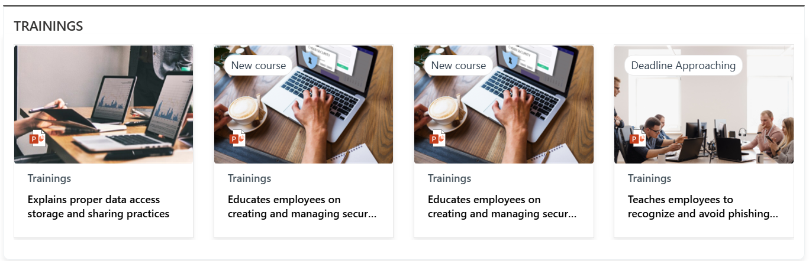

### 🏷️ Document Content Web Part – Property Pane Configuration

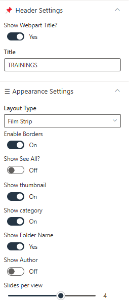
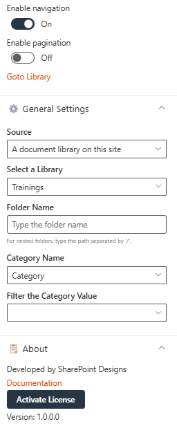

### 📌 Header Settings

| 🏷️ Name            | 🎯 Purpose                                       | 💡 Select Option |
| ------------------ | ------------------------------------------------ | ---------------- |
| Show Webpart Title | Toggle switch to show or hide the web part title | Yes              |
| Title              | Text field to define the web part name           | Document Content |

### ⚙️ General Settings

| 🏷️ Name                  | 🎯 Purpose                                                                                        | 💡 Select Option                            |
| ------------------------ | ------------------------------------------------------------------------------------------------- | ------------------------------------------- |
| Source                   | Defines the origin of the documents. Choose from "This Site" or "A document library on this site" | This Site / A document library on this site |
| Select a Library         | Dropdown to choose a library from the site                                                        | Policies and Procedures                     |
| Folder Name              | Optional text input for specifying a sub-folder                                                   | (Blank)                                     |
| Include sub-folder files | Retrieves items from sub-folders when enabled                                                     | Enabled                                     |

### 🎨 Appearance Settings

| 🏷️ Name                    | 🎯 Purpose                                  | 💡 Select Option |
| -------------------------- | ------------------------------------------- | ---------------- |
| Layout Type                | Controls how content is visually displayed  | Film Strip       |
| Enable Borders             | Toggle to show/hide borders around items    | Off              |
| Add Background Color       | Toggle to apply background color            | Off              |
| Show See All?              | Toggle to display a "See All" link          | On               |
| Number of Items to Display | Sets how many documents are shown           | 16               |
| Show Thumbnail             | Toggle to display file previews             | On               |
| Show Folder Name           | Toggle to display folder names              | Yes              |
| Show Author                | Toggle to show the file creator             | On               |
| Slides per View            | Number of items shown per slide             | 4                |
| See All Link               | Custom URL for "See All" button             | (Blank)          |
| Enable Navigation          | Toggle to enable left/right carousel arrows | On               |
| Enable Pagination          | Toggle to enable pagination controls        | Off              |

## ❓ 3. FAQs

### 📋 Details

Provide a centralized knowledge base for commonly asked questions:

- **Knowledge Base**: Easily accessible answers to frequent employee or customer inquiries.
- **Organized Categories**: FAQs are grouped into categories for smoother navigation and quicker discovery.

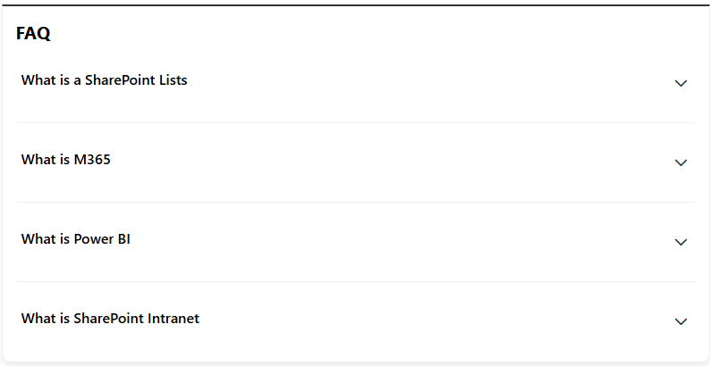

### List Config

Note: For the **FAQ** section, if a list named **FAQs** already exists, you may use it. Otherwise, please create a new list with the columns specified below.

| 🏷️ Column Name (Case Sensitive) | 🔣 Column Type            |
| ------------------------------- | ------------------------- |
| **Description**                 | 📄 Multiple lines of text |
| **Order**                       | 🔢 Number                 |

### 🏷️ FAQs Web Part – Property Pane Configuration

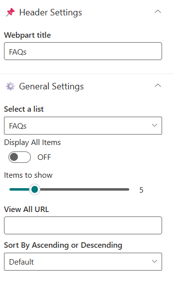

### 📌 Header Settings

| 🏷️ Name       | 🎯 Purpose                                              | 💡 Select Option |
| ------------- | ------------------------------------------------------- | ---------------- |
| Webpart Title | Customize the title that appears above the FAQs section | Text Field       |

### ⚙️ General Settings

| 🏷️ Name           | 🎯 Purpose                                                            | 💡 Select Option                 |
| ----------------- | --------------------------------------------------------------------- | -------------------------------- |
| Select a List     | Choose the SharePoint**FAQs list** where all Q&A entries are stored   | SharePoint List (FAQs)           |
| Display All Items | Toggle ON to display all FAQ entries, OFF to limit the number shown   | On / Off                         |
| Items to Show     | Number of FAQ items to display when "Display All Items" is turned off | Numeric Input                    |
| View All URL      | Link to the full FAQ page; default:`{}/Lists/FAQs/AllItems.aspx`      | URL (Optional)                   |
| Sort By           | Defines the order of FAQ items                                        | Default / Ascending / Descending |

## 📢 4. Featured News

### 📋 Details

- **Central Updates**: Keep everyone informed with company news.
- **Professional Display**: Present announcements/department news clearly and formally.
- **Structured Layout**: Organized sections for each department.
  

### 🏷️ Featured News Web Part – Property Pane Configuration

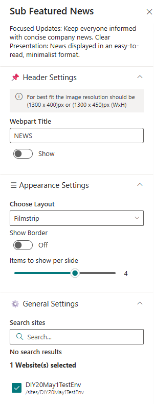

### 📌 Header Settings

| 🏷️ Name             | 🎯 Purpose                                                               | 💡 Select Option                 |
| ------------------- | ------------------------------------------------------------------------ | -------------------------------- |
| Webpart Title       | Customize the title that appears at the top of the web part              | Text Input                       |
| Show See All Button | Toggle to show or hide the “See All” button                              | Show / Hide                      |
| View All URL        | Add a custom link for the “View All” button. Leave blank for default URL | URL or`{}/_layouts/15/news.aspx` |

### 🎨 Appearance Settings

| 🏷️ Name                 | 🎯 Purpose                                   | 💡 Select Option                     |
| ----------------------- | -------------------------------------------- | ------------------------------------ |
| Choose Layout           | Pick from multiple layout styles             | Top Story / Grid / Filmstrip / Tiles |
| Items to show per slide | Set number of news items to display          | Numeric Input                        |
| Show Category Filter    | Enable or disable category filters           | Enable / Disable                     |
| Show Search Box         | Let users search through news articles       | Enable / Disable                     |
| Show Sort By            | Add a Sort option to reorder content         | Enable / Disable                     |
| Hide Border             | Toggle to display border around News section | Show / Hide                          |

#### ⚙️ General Settings

| 🏷️ Name                  | 🎯 Purpose                                                                                                               | 💡 Select Option                        |
| ------------------------ | ------------------------------------------------------------------------------------------------------------------------ | --------------------------------------- |
| **Search Sites**         | Search and select the site(s) for the news source.                                                                       | current site                            |
| **Enable RSS Feed**      | Toggle to display external RSS news feeds.                                                                               | On                                      |
| **RSS Links**            | Manage external RSS feed links.                                                                                          | [Manage Links]                          |
| **RSS API Key**          | Provide or generate an API key for secure RSS integration.                                                               | 7kmmp5wzpx2dyt4f4p3trgqlpwnxtz91kxcc... |
| **Show Search Box**      | Toggle to include a search box for news items.                                                                           | Off                                     |
| **Show Sort By**         | Enable sorting functionality (e.g., by date or title).                                                                   | On                                      |
| **Show See All Button**  | Toggle to display a “See All” button linking to full news listing.                                                       | On                                      |
| **Show Category Filter** | Note: This should be enabled only if the news is tagged to any category. Toggle to enable filtering content by category. | Off                                     |
| **News Category**        | Select the available choice column to apply filters.                                                                     | choose available choice column          |
| **Apply Filters**        | Select the available options from the News Category selected.                                                            | (Not Selected)                          |
| **View All URL**         | Set the page URL for viewing the full list of news items.                                                                | `{siteUrl}/_layouts/15/news.aspx`       |
| **Target Audience**      | Define audience targeting for news content visibility.                                                                   | (Empty)                                 |
| **Manage News Posts**    | Link to the interface for managing and editing news posts.                                                               | [Manage News Posts]                     |

## 📝 5. Feedback / Share Your Ideas

💡 **Engagement Tool** Enable users to easily share feedback, suggestions, or innovative ideas to enhance collaboration and continuous improvement.

- **Interactive Interface**: A visually engaging section featuring an image and call-to-action button.
- **Streamlined Communication**: Feedback is routed through the specified email or link.
- **Customizable Design**: Adjust image, button, and layout to match site branding.

  

### 🏷️ Feedback / Share Your Ideas Web Part – Property Pane Configuration

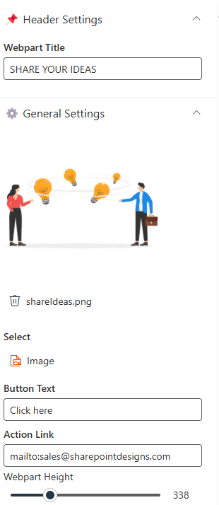

### 📌 Header Settings

| 🏷️ Name       | 🎯 Purpose                                    | 💡 Select Option |
| ------------- | --------------------------------------------- | ---------------- |
| WebPart Title | Sets the heading displayed above the web part | Share Your Ideas |

### ⚙️ General Settings

| 🏷️ Name        | 🎯 Purpose                                                                 | 💡 Select Option         |
| -------------- | -------------------------------------------------------------------------- | ------------------------ |
| Select Image   | Adds a visual element representing idea sharing (e.g., lightbulb exchange) | Upload Image             |
| Button Text    | Text displayed on the call-to-action button                                | Click here               |
| Action Link    | Opens default email client to send feedback to a given email               | mailto:email@example.com |
| WebPart Height | Defines vertical space occupied by the web part on the page                | 338                      |

## 🏆 6. Top 3 Department Goals

🎯 **Goal Alignment Display**Showcase the most important department objectives clearly and effectively to keep team members aligned and focused.

- **Targeted Display**: Highlights up to three strategic goals at a glance.
- **Custom Layouts**: Choose from multiple visual arrangements to best fit your site design.
- **List-Based Management**: Pulls goal data dynamically from a SharePoint list.

  

### List Config

Note: For the **Goals** section, if a list named **Goals** already exists, you may use it. Otherwise, please create a new list with the columns specified below.

| 🏷️ Column Name (Case Sensitive) | 🔣 Column Type            |
| ------------------------------- | ------------------------- |
| **Description**                 | 📄 Multiple lines of text |
| **Image**                       | 🖼️ Image                  |
| **Link**                        | 🔗 Hyperlink              |
| **Id**                          | 🔢 Number                 |

### 🏷️ Top 3 Department Goals Web Part – Property Pane Configuration

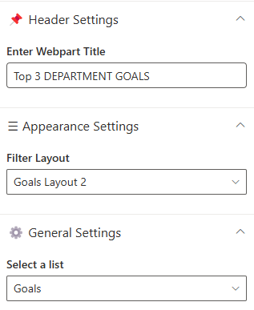

### 📌 Header Settings

| 🏷️ Name       | 🎯 Purpose                                               | 💡 Select Option |
| ------------- | -------------------------------------------------------- | ---------------- |
| Webpart Title | Defines the heading that appears above the goals section | Top 3 Goals      |

### 🎨 Appearance Settings

| 🏷️ Name       | 🎯 Purpose                                                         | 💡 Select Option             |
| ------------- | ------------------------------------------------------------------ | ---------------------------- |
| Filter Layout | Select from available layout templates for how goals are presented | (Available Layout Templates) |

### ⚙️ General Settings

| 🏷️ Name       | 🎯 Purpose                                             | 💡 Select Option |
| ------------- | ------------------------------------------------------ | ---------------- |
| Select a List | Choose the SharePoint list containing department goals | Goals            |

## 📩 7. News Letter

- Newsletter Web Part displays the latest company newsletters with a visual preview, title, and publication date for improved visibility and engagement.
- A "Read More" button links users to the full content, providing easy access to detailed updates like the "Company Quarterly Newsletter – April".

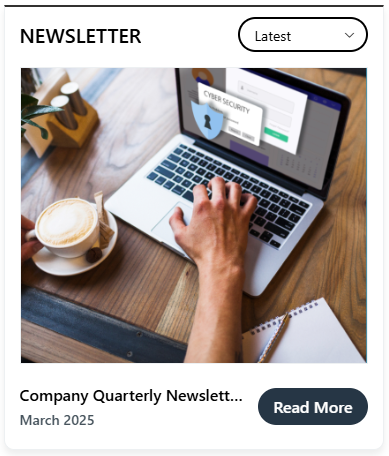

### Library Config

Note: For the Newsletter section, if a library named **Newsletter** exists, simply select it. Otherwise, create the required columns in the existing Newsletter library.

| 🏷️ Column Name (Case Sensitive) | 🔣 Column Type   |
| ------------------------------- | ---------------- |
| **Edition**                     | 📅 Date and Time |
| **CoverPhoto**                  | 🖼️ Image         |

### 🏷️ Newsletter Web Part – Property Pane Configuration

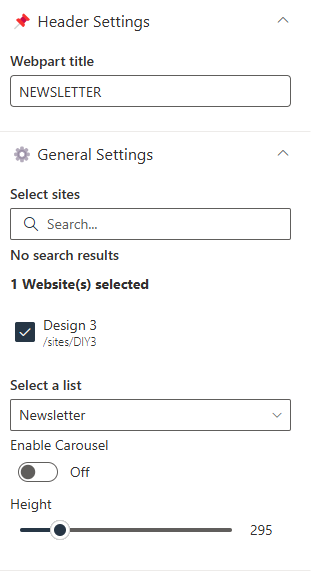

### 📌 Header Settings

| 🏷️ Name       | 🎯 Purpose                                 | 💡 Select Option |
| ------------- | ------------------------------------------ | ---------------- |
| Webpart Title | Label displayed at the top of the web part | NEWSLETTER       |

### ⚙️ General Settings

| 🏷️ Name                   | 🎯 Purpose                                              | 💡 Select Option  |
| ------------------------- | ------------------------------------------------------- | ----------------- |
| Select Sites              | Allows selection of sites for newsletter content        | No search results |
| Select a list             | Select the required list for the newsletter             |                   |
| Height                    | Controls the height of the newsletter display area      | 295               |
| Enable Carousel           | Toggles the carousel functionality                      | On                |
| Number of Items per Slide | Determines how many newsletter items are shown per view | 1                 |

## 🔗 8. Quick Links

🔗 **Resource Navigation Tool**Provide fast access to important links, tools, and resources through a streamlined and customizable interface.

- **Centralized Access**: Display key department or project links for quick access.
- **Custom Limits**: Control the number of visible items with a configurable slider.
- **Flexible Layout**: Hide or show borders and titles to match page styling.

  

### List Config

Note: For the **Quick Links** section, create a list with the following columns.

| 🏷️ Column Name (Case Sensitive) | 🔣 Column Type                |
| ------------------------------- | ----------------------------- |
| **Icon**                        | 🖼️ Image                      |
| **Link**                        | 📅 Date and Time              |
| **OrderBy**                     | 🔢 Number                     |
| **OpenIn**                      | 📁 Choice (Choices- Same,New) |

### 🏷️ Quick Links Web Part – Property Pane Configuration

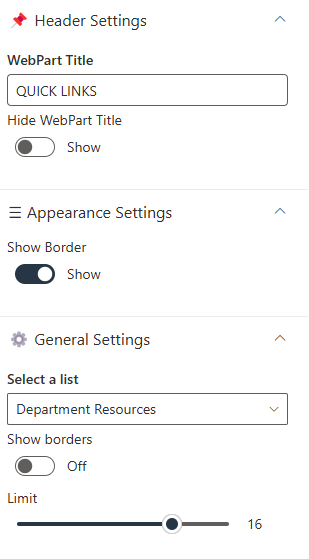

### 📌 Header Settings

| 🏷️ Name            | 🎯 Purpose                              | 💡 Select Option |
| ------------------ | --------------------------------------- | ---------------- |
| WebPart Title      | Sets the title shown above the web part | —                |
| Hide WebPart Title | Controls whether the title is visible   | Show             |

### 🎨 Appearance Settings

| 🏷️ Name     | 🎯 Purpose                                               | 💡 Select Option |
| ----------- | -------------------------------------------------------- | ---------------- |
| Show Border | Determines whether a border is shown around the web part | Hide             |

### ⚙️ General Settings

| 🏷️ Name       | 🎯 Purpose                                         | 💡 Select Option |
| ------------- | -------------------------------------------------- | ---------------- |
| Select a List | The list from which link items are retrieved       | —                |
| Limit         | Sets the number of links displayed in the web part | —                |

## 👥 9. Meet the SMEs

👩‍💼 **Subject Matter Experts Showcase** Highlight key team members and their expertise to help employees connect with the right people.

- **Enhanced Visibility**: Showcase SMEs to increase awareness and foster collaboration.
- **Customizable Display**: Control layout, number of items, and image size.
- **Interactive Design**: Optional carousel for dynamic presentation.
  

### List Config

Note: For the **Meet the SMEs** section, create a list with the following columns.

| 🏷️ Column Name (Case Sensitive) | 🔣 Column Type         |
| ------------------------------- | ---------------------- |
| **CustomName**                  | 🔤 Single line of text |
| **Name**                        | 👤 Person              |
| **Profile Photo**               | 🖼️ Image               |
| **OrderBy**                     | 🔢 Number              |

### 🏷️ Meet the SMEs Web Part – Property Pane Configuration

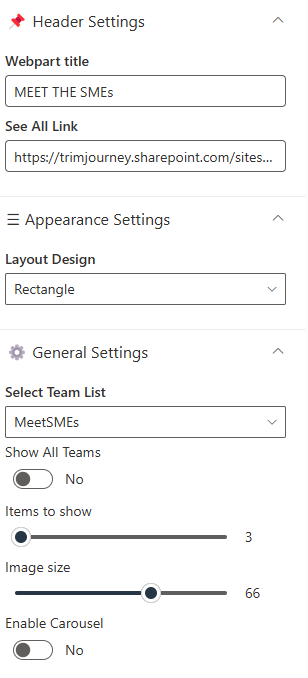

### 📌 Header Settings

| 🏷️ Name       | 🎯 Purpose                                                        | 💡 Select Option |
| ------------- | ----------------------------------------------------------------- | ---------------- |
| Webpart Title | Sets the title shown above the SME showcase section               | Yes              |
| See All Link  | Adds a hyperlink to view the full list of SMEs on a separate page | Document Content |

### ⚙️ General Settings

| 🏷️ Name          | 🎯 Purpose                                                                      | 💡 Select Option                            |
| ---------------- | ------------------------------------------------------------------------------- | ------------------------------------------- |
| Select Team List | The SharePoint list where SME information is stored.                            | This Site / A document library on this site |
| Show All Teams   | Filters the view to display a limited selection of SMEs when toggled to No.     | No                                          |
| Items to Show    | Specifies how many SME profiles are displayed at once.                          | (Blank)                                     |
| Image Size       | Sets the size of the SME profile images.                                        | (Blank)                                     |
| Enable Carousel  | Controls whether the web part cycles through SME profiles in a carousel format. | No                                          |

### 🎨 Appearance Settings

| 🏷️ Name       | 🎯 Purpose                                         | 💡 Select Option |
| ------------- | -------------------------------------------------- | ---------------- |
| Layout Design | Defines the visual layout for displaying SME cards | (Blank)          |

## 🏁 10. Contacts

### 📋 Details

- **Department Showcase Web Part**: Visually highlights a specific department with a professional background image and clear labeling of the department name.
- **Key Personnel Display**: Features profile cards for key team members (e.g., Manager and Quality Manager) with names, roles, and placeholders for profile pictures.

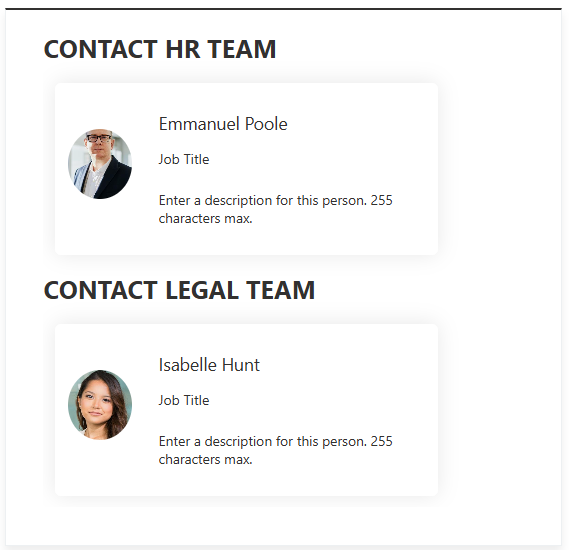

### 🏷️ Contacts Web Part – Property Pane Configuration

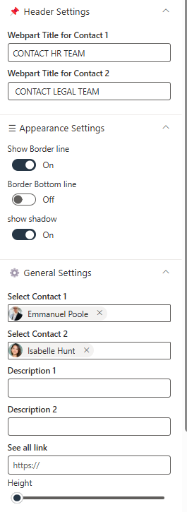

### 📌 **Header Settings**

| 🏷️ Name                     | 🎯 Purpose                         | 💡 Select Option |
| --------------------------- | ---------------------------------- | ---------------- |
| Webpart Title for Contact 1 | Customizes the title for Contact 1 | Text Field       |
| Webpart Title for Contact 2 | Customizes the title for Contact 2 | Text Field       |

### 🎨 **Appearance Settings**

| 🏷️ Name            | 🎯 Purpose                                              | 💡 Select Option |
| ------------------ | ------------------------------------------------------- | ---------------- |
| Show Border Line   | Toggles the display of a border around the section      | Toggle Switch    |
| Border Bottom Line | Toggles the display of a bottom border                  | Toggle Switch    |
| Show Shadow        | Toggles the display of a shadow for emphasis            | Toggle Switch    |
| Height             | Adjustable slider to control the height of the Web Part | Slider Control   |

### ⚙️ **General Settings**

| 🏷️ Name          | 🎯 Purpose                                      | 💡 Select Option |
| ---------------- | ----------------------------------------------- | ---------------- |
| Select Contact 1 | Selects the first contact from a person picker  | Person Picker    |
| Select Contact 2 | Selects the second contact from a person picker | Person Picker    |
| Description 1    | Adds a description for Contact 1                | Text Field       |
| Description 2    | Adds a description for Contact 2                | Text Field       |

### General Webpart Configuration

#### 🔐 Admin Settings

Whenever a user is assigned as the web part admin, they will see a ⚙️ settings icon. Clicking this icon will navigate them to the list where the corresponding data is stored.

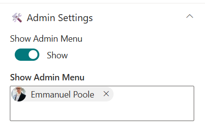

| 🏷️ Name         | 🎯 Purpose                                | 💡 Select Option |
| --------------- | ----------------------------------------- | ---------------- |
| Show Admin Menu | Toggle to show admin-only features        | Show / Hide      |
| Admin Users     | Specifies users who can access admin menu | xyz              |

### ℹ️ About Section

This section primarily contains a documentation link that redirects users to the complete Installation, Configuration, and Overview pages. Users can also activate the license from this section.

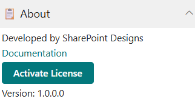

| 🏷️ Name                     | 🎯 Purpose                                                                           |
| --------------------------- | ------------------------------------------------------------------------------------ |
| **Developer Info**          | Indicates the web part is developed by **SharePoint Designs**.                       |
| **Documentation Link**      | Provides access to user and admin documentation for further guidance.                |
| **Activate License Button** | A button to activate the premium or licensed version of the web part, if applicable. |
