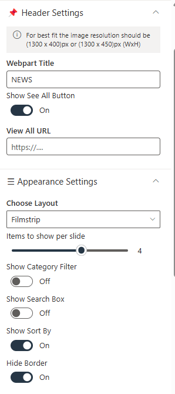
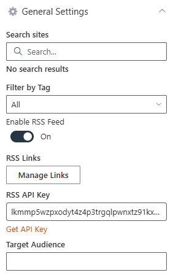

# Configuration

## 📇 1. Contact Cards

### 📋 Details

### ⚙️ Configuration Options

The Web Part configuration is divided into two main sections:

- Contact
- Contact Information

---

### 📇 1. Contact Section

This section allows configuration of high-level display properties for the Web Part:

### 📌 1. Header Settings

This group contains the following fields:

##### 🧾 Webpart Title for Contact 1

- Text field for customizing the title (e.g., _Contact HR Team_).

#### 🗂️ Webpart Title for Contact 2

- Text field for customizing the title (e.g., _Contact Legal Team_).

---

### ⚙️ Appearance Settings

#### 🔲 Show Border line (Toggle Switch)

- Toggles display of a border around the contact section.

#### 📏 Border Bottom line (Toggle Switch)

- Toggles display of a bottom border for the contact section.

#### 🌫️ Show shadow (Toggle Switch)

- Toggles display of a shadow around the contact section for visual emphasis.

#### 📏 Height (Slider Control)

- Adjustable slider to control the height of the Web Part (e.g., _113_).

---

### ⚙️ General Settings

- This section allows configuration of individual contact details and display options:

#### 👤 Select Contact 1

- Person picker for selecting the first contact (e.g., _John McLaughlin_).

#### 👤 Select Contact 2

- Person picker for selecting the second contact (e.g., _Carolina Lucero_).

#### 📝 Description 1

- Text field for adding a description for Contact 1.

#### 📝 Description 2

- Text field for adding a description for Contact 2.

### ℹ️ About Section

- 👨‍💻 **Developed by**: SharePoint Designs
- 📚 **Documentation**: Link to official documentation (not shown in screenshot)
- 🔑 **Activate License**: Button to activate the web part license
- 🔢 **Version**: `1.0.0.0`

### 📸 Screenshots

- **Screenshot**: Contact Cards web part
  
- **Screenshot**: Property pane
  

## 📰 2. Document Content

### 📋 Details

- Document Content Web Part displays department policy documents in a card layout, each labeled clearly by department (e.g., HR, IT, Finance).
- Horizontal Carousel Navigation allows users to browse through available documents using left and right arrows.

---

### ⚙️ Configuration Guide

The **Document Content** web part is used to display files from a selected SharePoint document library in a visually organized format such as a film strip. This configuration panel is divided into three main sections: **Header Settings**, **General Settings**, and **Appearance Settings**.

---

### 📌 Header Settings

#### 🏷️ Show Webpart Title:

- Toggle switch to show or hide the web part title.
  **Status**: Enabled (`Yes`)

#### 🔤 Title:

- Text field to define the web part name.
  **Value**: `Document Content`

---

### ⚙️ General Settings

#### 🔌 Source:

- Defines the origin of the documents. it have two options that is This site and A document library on this site. which u want you can use the source.
  **Value**: `This Site` The 'Select Library' field is not required, as all items will be retrieved directly from the site.
  **Value**: `A document library on this site`

#### 📚 Select a Library:

- Dropdown to choose a library from the site.
  **Value**: `Policies and Procedures`

#### 📁 Folder Name:

- Optional text input for specifying a sub-folder.

#### 📂 Include sub-folder files

- Enabling this toggle will retrieve items from sub-folders in the selected library.

---

### 🎨 Appearance Settings

#### 🧱 Layout Type:

- Controls how content is visually displayed.
  **Selected Option**: `Film Strip`

#### ➖ Enable Borders:

- Toggle to show/hide borders around items.
  **Status**: Off

#### 🎨 Add Background Color:

- Toggle to apply background color.
  **Status**: Off

#### 👁️ Show See All?:

- Toggle to display a "See All" link.
  **Status**: On

#### 🔢 Number of Items to Display:

- Slider to define how many documents are shown.
  **Value**: 16

#### 🖼️ Show Thumbnail:

- Toggle to display file previews.
  **Status**: On

#### 📁 Show Folder Name:

- Toggle to display folder names.
  **Status**: Yes

#### ✍️ Show Author:

- Toggle to show the file creator.
  **Status**: On

#### 🎞️ Slides per View:

- Slider to define the number of items shown per slide.
  **Value**: 4

#### 🔗 See All Link:

- Optional field to define a custom "See All" URL.

#### ➡️ Enable Navigation:

- Toggle to enable left/right carousel arrows.
  **Status**: On

#### 📄 Enable Pagination:

- Toggle to enable pagination controls.
  **Status**: Off

### 📸 Screenshots

- **Screenshot**: Document Content web part
  
- **Screenshot**: Property pane
  
  

## ❓ 3. FAQs

### 📋 Details

Provide a centralized knowledge base for commonly asked questions:

- **Knowledge Base**: Easily accessible answers to frequent employee or customer inquiries.
- **Organized Categories**: FAQs are grouped into categories for smoother navigation and quicker discovery.

---

### ⚙️ Configuration Options

Fine-tune your **FAQs** web part with these settings:

#### <u>Header Settings</u>

##### 🏷️ Webpart Title

- Customize the title that appears above the FAQs section.

##### 📃 Select a List

- Choose the SharePoint **FAQs list** where all Q&A entries are stored and managed.

##### 🔄 Display All Items

- Toggle ON to display **all FAQ entries** from the list.
- Toggle OFF to show a limited number.

##### 🔢 Items to Show

- Specify how many FAQ items to display when **Display All Items** is turned off.

##### 🔗 View All URL

- Add a link to the full FAQ page if available.
- Leave blank if no dedicated page exists.
- Deafult value: `{}/Lists/FAQs/AllItems.aspx`

#### <u>Filter items</u>

##### 🔤 Sort By

- Choose how FAQs are ordered:
  - **Default**
  - **Ascending**
  - **Descending**

### 📸 Screenshots

- **Screenshot**: FAQs web part
  
- **Screenshot**: Property pane
  
  

## 📢 4. Featured News

### 📋 Details

- **Central Updates**: Keep everyone informed with company news.
- **Professional Display**: Present announcements/department news clearly and formally.
- **Structured Layout**: Organized sections for each department.

---

### ⚙️ Configuration Options

Easily tailor the Features News web part to fit your organization's needs with these flexible configuration options:

---

#### <u>Header Settings</u>

##### 🏷️ Webpart Title

- Customize the title that appears at the top of the web part.

##### 👀 Show See All Button

- Toggle to **show** or **hide** the “See All” button for users to explore more content.

##### 🔗 View All URL

- Add a custom link for the “View All” button.
- Leave empty to use the default destination.
- Default value: `{}/_layouts/15/news.aspx`

#### <u>Appearance Settings</u>

##### 🧩 Choose Layout

- Pick from multiple layout styles:
  - **Top Story**
  - **Grid**
  - **Filmstrip**
  - **Tiles**

##### 🎞️ Items to show per slide

- Set the number of news to show in the webpart.

##### 🗂️ Show Category Filter

- Enable or disable category filters for quick browsing.

##### 🔎 Show Search Box

- Let users search through news articles with a handy search input box.

##### ↕️ Show Sort By

- Add a **Sort** option to let users reorder content by relevance, date, etc.

##### 🔲 Hide Border

- Toggles display of a border around the News section.

#### <u>General Settings </u>

##### 🔍 Search Sites

- Choose which SharePoint sites to fetch news from.
- Leave blank to pull content from the current site.

##### 🏷️ Filter by Tag

- Filter news based on specific tags (e.g., **Departments**, **Announcements**) to display only relevant posts.

##### 🌐 Enable RSS Feed

- Toggle ON/OFF to enable or disable RSS feeds.
- Use **Manage Links** to add your preferred RSS sources.

##### 👥 Target Audience

- Show posts only to selected users using audience targeting.

---

### 📸 Screenshots

- **Screenshot**: WHAT'S HAPPENING AT OUR DEPARTMENT web part
  
- **Screenshot**: Property pane
  
  

## 📝 5. Feedback / Share Your Ideas

💡 **Engagement Tool**Enable users to easily share feedback, suggestions, or innovative ideas to enhance collaboration and continuous improvement.

- **Interactive Interface**: A visually engaging section featuring an image and call-to-action button.
- **Streamlined Communication**: Feedback is routed through the specified email or link.
- **Customizable Design**: Adjust image, button, and layout to match site branding.

---

### ⚙️ Configuration Options

#### 🔹 Header Settings

- **🏷️ Webpart Title**:
  Sets the heading displayed above the web part.

---

#### 🔹 General Settings

- **🖼️ Select Image**

  - Adds a visual element representing idea sharing (shown between a man and woman exchanging lightbulbs).

- **🔘 Button Text**

  - Text displayed on the call-to-action button that users click to submit feedback.

- **🔗 Action Link**

  - Clicking the button opens the default email client to send feedback to the specified email address.

- **📏 Webpart Height**

  - Defines the vertical space occupied by the web part on the page.

---

### 📸 Screenshots

- **Screenshot**: WHAT'S HAPPENING AT OUR DEPARTMENT web part
  
- **Screenshot**: Property pane
  

## 🏆 6. Top 3 Department Goals

🎯 **Goal Alignment Display**Showcase the most important department objectives clearly and effectively to keep team members aligned and focused.

- **Targeted Display**: Highlights up to three strategic goals at a glance.
- **Custom Layouts**: Choose from multiple visual arrangements to best fit your site design.
- **List-Based Management**: Pulls goal data dynamically from a SharePoint list.

---

### ⚙️ Configuration Options

#### 🔹 Header Settings

- **🏷️ Webpart Title**:
  - Defines the heading that appears above the goals section.

---

#### 🔹 Appearance Settings

- **📐 Filter Layout**:
- Select from available layout templates for how the goals are visually presented.

---

#### 🔹 General Settings

- **📋 Select a List**:
  - Choose the SharePoint list that contains the department goals. The web part retrieves items from this list to display.

---

### 📸 Screenshots

- **Screenshot**: WHAT'S HAPPENING AT OUR DEPARTMENT web part
  
- **Screenshot**: Property pane
  

## 📩 7. News Letter

- Newsletter Web Part displays the latest company newsletters with a visual preview, title, and publication date for improved visibility and engagement.
- A "Read More" button links users to the full content, providing easy access to detailed updates like the "Company Quarterly Newsletter – April".

---

### 📬 Configuration Guide

The **Newsletter** web part is designed to showcase company newsletters or announcements in a visually engaging slider format. It provides customization for height, slide content, and data source.

---

### 📌 Header Settings

#### 🧩 Webpart Title

- Label displayed at the top of the web part.
- **Value**: `NEWSLETTER`

### ⚙️ General Settings

#### 🌐 Select Sites

- Allows selection of one or more sites from which the newsletter content will be pulled.
- Currently, no site is selected (`No search results`).

#### 📏 Height

- Controls the height of the newsletter display area.
- **Value**: `295`

#### Enable Carousel

- Use this toggle to activate the carousel functionality.
  **Status**: On

#### 🎞️ Number of Items per Slide

- Determines how many newsletter items are shown in one view.
- **Value**: `1`

---

### 📸 Screenshots

- **Screenshot**: Newsletter web part
  
- **Screenshot**: Property pane
  

## 🔗 8. QuickLinks

🔗 **Resource Navigation Tool**Provide fast access to important links, tools, and resources through a streamlined and customizable interface.

- **Centralized Access**: Display key department or project links for quick access.
- **Custom Limits**: Control the number of visible items with a configurable slider.
- **Flexible Layout**: Hide or show borders and titles to match page styling.

---

### ⚙️ Configuration Options

#### 🔹 Header Settings

- **🏷️ WebPart Title**:
- Sets the title shown above the web part.
- **🛑 Hide WebPart Title**:

  - Toggle: `Show`
  - Controls whether the title is visible. In this setup, the title is displayed.

---

#### 🔹 Appearance Settings

- **🧱 Show Border**:
  - Toggle: `Hide`
  - Determines whether a border is shown around the web part. Currently set to hidden.

---

#### 🔹 General Settings

- **📋 Select a List**:
- The list from which link items are retrieved.
- **🔢 Limit**:
- Sets the number of links displayed in the web part.

---

### 📸 Screenshots

- **Screenshot**: WHAT'S HAPPENING AT OUR DEPARTMENT web part
  
- **Screenshot**: Property pane
  

## 👥 9. Meet the SMEs

👩‍💼 **Subject Matter Experts Showcase**Highlight key team members and their expertise to help employees connect with the right people.

- **Enhanced Visibility**: Showcase SMEs to increase awareness and foster collaboration.
- **Customizable Display**: Control layout, number of items, and image size.
- **Interactive Design**: Optional carousel for dynamic presentation.

---

### ⚙️ Configuration Options

#### 🔹 Header Settings

- **🏷️ Webpart Title**:
- Sets the title shown above the SME showcase section.
- **🔗 See All Link**:
- Adds a hyperlink to view the full list of SMEs on a separate page.

---

#### 🔹 Appearance Settings

- **🖼️ Layout Design**:
  -- Defines the visual layout for displaying SME cards.

---

#### 🔹 General Settings

- **📋 Select Team List**:
- The SharePoint list where SME information is stored.
- **👥 Show All Teams**:

  - Toggle: `No`
  - Filters the view to display a limited selection of SMEs.

- **🔢 Items to Show**:
- Specifies how many SME profiles are displayed at once.
- **🖼️ Image Size**:
- Sets the size of the SME profile images.
- **🎠 Enable Carousel**:

  - Toggle: `No`
  - Controls whether the web part cycles through SME profiles in a carousel format.

---

### 📸 Screenshots

- **Screenshot**: WHAT'S HAPPENING AT OUR DEPARTMENT web part
  
- **Screenshot**: Property pane
  

## 🏁 10. Welcome Banner

### 📋 Details

- **Department Showcase Web Part**: Visually highlights a specific department with a professional background image and clear labeling of the department name.
- **Key Personnel Display**: Features profile cards for key team members (e.g., Manager and Quality Manager) with names, roles, and placeholders for profile pictures.

---

### 📘 WelcomeBanner Configuration Guide

The **WelcomeBanner** web part allows you to display a personalized message from a manager or department, using a variety of layout and styling options. This guide explains the configurable properties shown in the web part settings panel.

---

### ⚙️ Appearance Settings

#### **Select Layout**

- **Description:** Choose a banner layout to define how the message will be displayed.
- **Current Selection:** _Employee Resource Banner_
- **Purpose:** Controls the visual format of the welcome message (e.g., with or without images, side-by-side layout, etc.).

---

#### 🔧 General Settings

### **Enter Department Name**

- **Description:** Specifies the department or section name to be displayed on the banner.
- **Example Input:** _Policies & Procedures_

### **Enter Department Description**

- **Description:** A short description or welcome message for the selected department.
- **Example Input:** _Welcome Message_

### **Change Background**

- **Description:** Allows customization of the banner background by uploading an image.
- **Option:** _Select Image_ – Opens the file picker to choose a background image.

### **Enable Announcement Section**

- **Description:** Toggle to show or hide an additional announcement area below the banner.
- **Status:** **On** (enabled)

---

### 📸 Screenshots

- **Screenshot**: WHAT'S HAPPENING AT OUR DEPARTMENT web part
  
- **Screenshot**: Property pane
  
