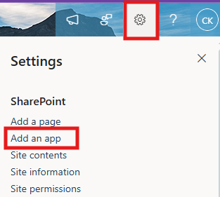
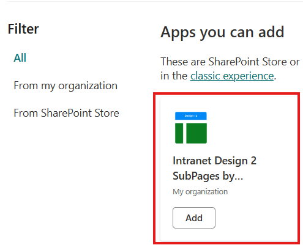
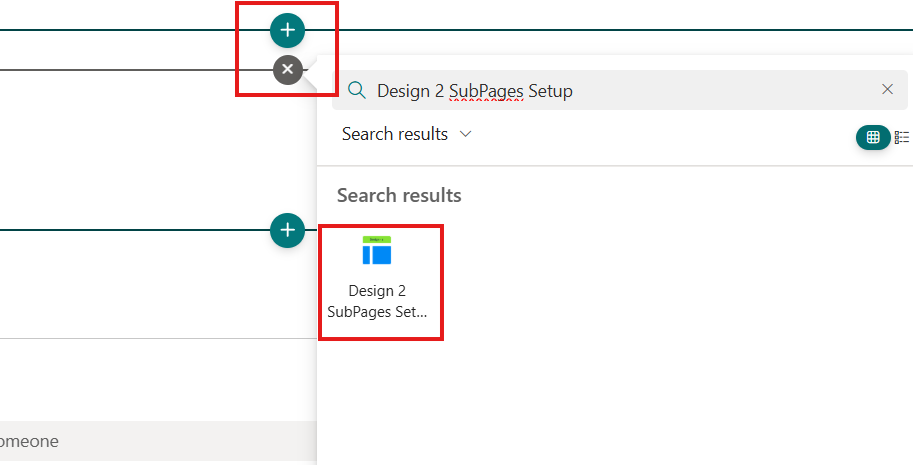
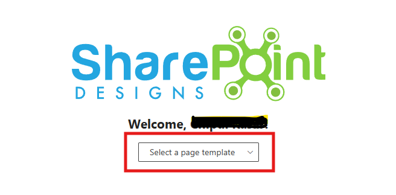
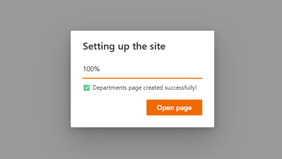
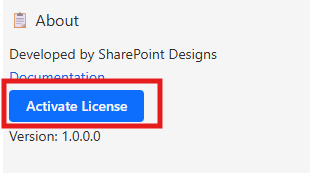

# Installation

## ⚙️ Installation Instructions

- Upload the `spd-intranetdesign2-subpages.sppkg` file to your App Catalog
- Navigate to any modern SharePoint site, Click the **Settings** icon

  

- Select **“Add an app”**, and choose **Intranet Design 2 Sub Pages by SharePoint Designs**

  

- Click **Add**
- After installation, go to **Site Contents** to confirm it's added to the site.

  

---

## 🧪 Testing Instructions

> **Note:** _Upon adding the web part to the page, a **free 15-day trial** will start automatically._

1. Navigate to a modern SharePoint page or create a new one.
2. Edit the page and add the **"Design 2 Sub Pages Setup"** web part.
   
3. **Republish** the page.
4. **Select a page template** from the dropdown:
   (_Departments / Employee Resources / Policies & Procedures_)
   
5. Click the **“Apply Design”** button.

   > _Visible only after selecting a template._ > 

6. Do not close the browser. A pop-up will appear to create required lists and libraries with mock data (_Applicable only for lists_).
7. After creation, the page will refresh automatically and proceed with adding the necessary web parts and layout.
8. Once setup is complete, a button will appear to open the newly created page — click it to view your configured site.

   

---

## 🔑 Activating a License Key

> _Once your free trial ends, you'll need a license key to continue using the app._

### License Activation Steps

| **Step** | **Action**                 | **Details / Notes**                                                                                                                                                                                                                                                                                                   |
| -------- | -------------------------- | --------------------------------------------------------------------------------------------------------------------------------------------------------------------------------------------------------------------------------------------------------------------------------------------------------------------- |
| 1        | Go to the app page         | Navigate to the SharePoint page where the app is installed.                                                                                                                                                                                                                                                           |
| 2        | Open activation panel      | - If the trial **has expired**, you'll see an **"Activate"** button on the app — click it.  - If the trial **is still active** and you want to activate it, edit the page → open the **Web Part property panel** → click **"Activate License"**.   |
| 3        | Launch activation dialog   | A dialog box will appear prompting for a key.                                                                                                                                                                                                                                           |
| 4        | Click **Get Key**          | In the license dialog, click **Get Key** — this will take you to the payment page in a new tab.                                                                                                                                                                                                                       |
| 5        | Purchase the license       | Complete the payment process. Once done, you’ll receive a license key via email. Be sure to check your spam/junk folder if you don't see it.                                                                                                                                                                          |
| 6        | Enter and activate the key | Go back to the SharePoint page, paste the license key into the dialog box, and click **Activate** to complete activation.                                                                                                                                                                                             |

✅ **Done! Your app is now fully activated.**

---

### ✅ Expected Behaviour

A page will be create based on the selection(**_Home/Departments/Employee Resources/Policies & Procedures_**)

The following SharePoint Lists are automatically created based on the selection:

- _ManagerMessage (Departments)_
- _DepartmentLinks (Departments)_
- _Goals (Departments)_
- _MeetSMEs (Departments)_
- _ResourceLinks (Employee Resources)_
- _PolicyLinks (Policies & Procedures)_
- _PoliciesFAQs (Policies & Procedures)_

The following SharePoint Library are automatically created based on the selection:

- _DepartmentPolicies (Departments)_
- _Gallery (Departments)_
- _ImportantDocuments (Departments)_
- _Newsletter (Employee Resources)_
- _Trainings (Employee Resources)_
- _BenefitsandPerks (Employee Resources)_
- _SOPs (Policies & Procedures)_

> These lists are pre-filled with demo/mock items for easy testing.
> **No manual configuration required after clicking the Apply template button.**

---

## 🔍 Validate Each Web Part on the Provisioned Page

## DEPARTMENT PAGE

| **Webpart**             | **Description**                                                                                                                                                                |
| ----------------------- | ------------------------------------------------------------------------------------------------------------------------------------------------------------------------------ |
| **Welcome Banner**      | - Large hero image with department title and key managers’ profiles to establish context  - Highlights leadership, setting the tone for department-specific content below. |
| **Department Links**    | - Quick-access icons/tiles directing users to frequently used resources  - Simplifies navigation by grouping critical department tools in one place                        |
| **Goals**               | - Prominent cards illustrating clear, measurable objectives (e.g., revenue growth)  - Keeps everyone aligned by showcasing priorities at a glance                          |
| **Department Policies** | - Horizontal carousel or tiles for policy documents (Word, PDF) with quick previews  - Ensures staff can easily find and reference key procedural docs                     |
| **Important Documents** | - Card layout featuring essential policies and handbooks in downloadable format  - Centralizes employee manuals for quick reference and compliance                         |
| **Meet the SMEs**       | - Showcases expert profiles with names, roles, and potential contact links.  - Makes it easy to identify and reach out to departmental specialists                         |
| **Department News**     | - Date-stamped announcements or articles with brief summaries  - Provides timely updates on departmental or industry developments                                          |

---

## EMPLOYEE RESOURCES

| **Webpart**                   | **Description**                                                                                                                                                 |
| ----------------------------- | --------------------------------------------------------------------------------------------------------------------------------------------------------------- |
| **Employee Resources Banner** | - Illustrated hero section showing various employee service categories (IT, HR, etc,)  - Helps staff quickly spot essential support areas and request help, |
| **Resources Links**           | - Icon-based shortcuts to critical internal portals or tools (travel, marketing, contacts)  - Speeds up navigation to commonly accessed services.           |
| **Benefits and Perks**        | - Displays health insurance, retirement plans, and wellness program info.  - Links to detailed PDF documents explaning each benefit offering.               |
| **Share Your Ideas**          | - Calls employees to submit suggestions, foatering and innovative culture.  - May link to a feedback form or discussing explaning each benefit offering.    |
| **Newsletter**                | - Showcases the latest monthly publication with organizational highlights.  - Keeps employees informed about current evets, milestones, and stories.        |
| **Trainings**                 | - Displays available or upcoming sessions with tags like "New Course".  - Direct links to registration or deeper course info encourage ongoing development. |

---

## POLICIES & PROCEDURES

| **Webpart**                              | **Description**                                                                                                                                          |
| ---------------------------------------- | -------------------------------------------------------------------------------------------------------------------------------------------------------- |
| **Banner & Title**                       | - Visual theme emphasizing security and compliance, plus rotating updates.   - Immediately draws attention to new or crucial policy changes.         |
| **Policy Links**                         | - Icon-based categories for HR, Genral, DEI, Travel, and other key policies.  - Streamlines navigation to relevant policy documents or sub-pages.    |
| **SOPs (Standard Operating Procedures)** | - Carousel of PDF documents outlining critical processes like Data Security.  - Offers quick scrolling to find and open the needed procedural guide. |
| **FAQs**                                 | - Expandable common questions on data privacy, refunds and more.  - Promotes self-service by offering immediate answers to frequent queries.         |
| **Contact HR & Legal Teams**             | - Profile-like cards with names, roles, and direct links for support)  - Streamlines access to departmental experts for policy-related questions.    |

## 🧹 Uninstall Guide

Follow the steps below to uninstall the **Intranet Design 2 Sub Pages by SharePoint Designs** app from your SharePoint site:

1. Go to your SharePoint site and click on **Site Contents** from the left side navigation or the settings menu.
2. Find **Intranet Design 2 Sub Pages by SharePoint Designs** in the list of installed apps.
3. Click the three dots (···) next to the app name and select **"Remove"**.
4. If prompted to switch to the **Classic Experience**, follow the prompt to proceed.
5. In the Classic Experience, hover over the app again, click the three dots (···), and then click **Remove** to finalize the uninstallation.

---

## 🛠️ Troubleshooting Common Issues

### ⚠️ Issue: Web Part Not Displaying Correctly

**Solution**: Ensure that the web part has been added to a modern SharePoint page and that the page has been republished. Check for any missing permissions that might be required for the web part to function correctly.

### 🗃️ Issue: Lists/Library Not Created

**Solution**: Verify that the **"Apply template"** button was clicked after adding the **"Design 2 Sub Pages Setup"** web part. If the lists/Library are still not created, delete the page and reapply the design.

### 📝 Issue: Missing Demo Items

**Solution**: Check if the lists items are present in the Site Contents. If the lists are empty, manually add demo items or reapply the design.

---

## 🌟 Best Practices

### 🔁 Regular Updates

- **Keep Content Fresh**: Regularly update the content on your SharePoint site to keep it relevant and engaging.
- **Monitor Performance**: Regularly check the performance of your SharePoint site and make necessary adjustments to improve speed and user experience.

### 🎓 User Training

- **Provide Training**: Offer training sessions for users to help them understand how to use the SharePoint site effectively.
- **Create Documentation**: Develop comprehensive documentation to guide users on how to navigate and use the site.

### 🔐 Security Measures

- **Implement Security Protocols**: Ensure that proper security measures are in place to protect sensitive information.
- **Regular Audits**: Conduct regular security audits to identify and address potential vulnerabilities.

### 🗣️ User Feedback

- **Collect Feedback**: Regularly collect feedback from users to understand their needs and improve the site accordingly.
- **Act on Feedback**: Implement changes based on user feedback to enhance the overall user experience.

### 🤝 Collaboration

- **Encourage Collaboration**: Promote collaboration among team members by providing tools and features that facilitate communication and teamwork.
- **Use SharePoint Features**: Utilize SharePoint features such as document libraries, lists, and workflows to streamline collaboration and improve productivity.

---

## 🧑‍💼 User Permissions

### 🗂️ Assigning Permissions

- **Site Owners**: Have full control over the site and can manage permissions for other users.
- **Site Members**: Can contribute content and interact with the site but have limited administrative capabilities.
- **Site Visitors**: Have read-only access to the site and cannot make any changes.

### 🛡️ Managing Permissions

- **Permission Levels**: Define different levels of access for users based on their roles and responsibilities.
- **Custom Permissions**: Create custom permission levels to meet specific needs and requirements.
- **Inheritance**: Manage permissions inheritance to ensure consistency across different site collections and subsites.

### 🧾 Best Practices for Permissions

- **Least Privilege Principle**: Assign the minimum level of permissions necessary for users to perform their tasks.
- **Regular Reviews**: Conduct regular reviews of user permissions to ensure they are up-to-date and aligned with current roles.
- **Documentation**: Maintain documentation of user permissions and any changes made to ensure transparency and accountability.

---

## 🆘 Support

Please contact **SharePoint Designs**
🌐 [www.sharepointdesigns.com](http://www.sharepointdesigns.com)
📧 support@sharepointdesigns.com
