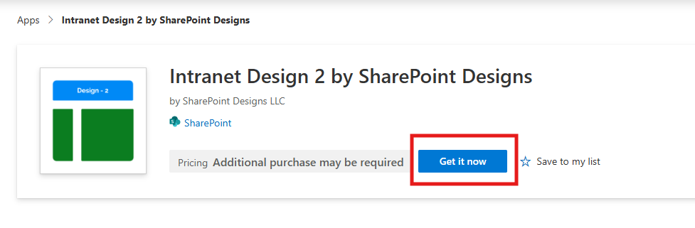
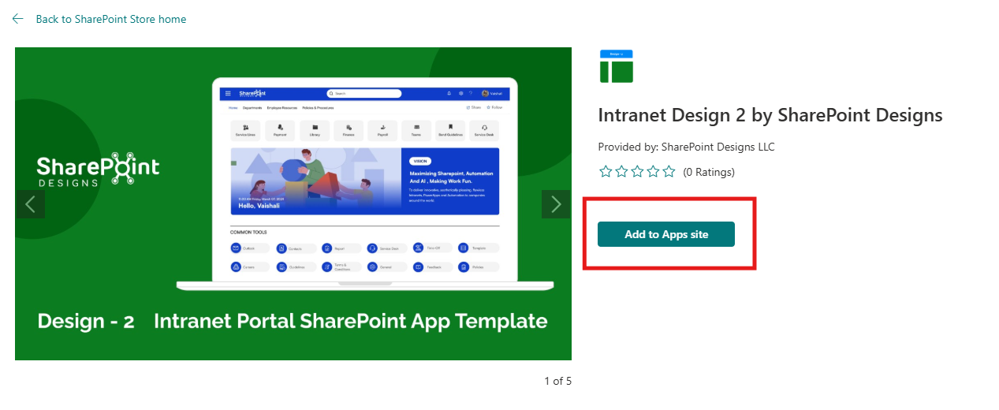
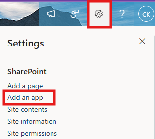
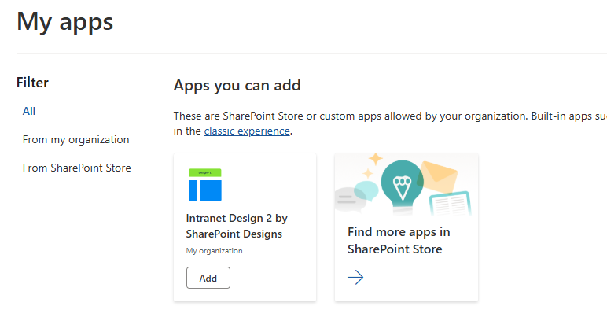

## ⚙️ Installation Instructions

| Step | Description                                                                                                                                                                                                                                                                                                                                                                   |
| ---- | ----------------------------------------------------------------------------------------------------------------------------------------------------------------------------------------------------------------------------------------------------------------------------------------------------------------------------------------------------------------------------- |
| 1    | Visit the[Intranet Design 2 – SharePoint Designs](https://appsource.microsoft.com/en-us/product/office/WA200008649?tab=Overview) listing on Microsoft AppSource and click **Get it now**.                                                                                                                                      |
| 2    | You will be redirected to the SharePoint Store. Click**Add to Apps Site** to add it to your tenant.  ⚠️ _If you don't have permission, a popup will appear saying "App requires permission approval." A request will be raised, and your tenant administrator needs to approve it before the app can be added._ |
| 3    | Navigate to any modern SharePoint site, and click the**Settings** icon.                                                                                                                                                                                                                                                             |
| 4    | Select**“Add an app”**, and choose**Intranet Design 2 Site by SharePoint Designs**.                                                                                                                                                                                                                                                  |
| 5    | Click**Add**.                                                                                                                                                                                                                                                                                                                                                                 |
| 6    | After installation, go to**Site Contents** to confirm it's added to the site.                                                                                                                                                                                                                                                 |

---

## 🧪 Testing Instructions

> **Note:** _Upon adding the application to the site, a **free 15-day trial** will start automatically._

1. Add the **"Intranet Design 2 by SharePoint Designs"** app to your SharePoint site.
2. Refresh the page at least once so that the new changes are properly loaded.
3. Since this is a first-time setup (or setup was not previously completed), a **full-page Setup Wizard** will automatically appear — no need to manually add any web part.

   

4. Walk through the wizard steps:
   - **Organizational Details** — Enter your organization information.
   - **Branding** — Upload your site logo. The wizard uses AI to automatically generate a brand color palette from the logo. You can review, adjust, or change the suggested colors before clicking **Save and Apply Theme**. You can also upload a custom favicon and configure regional settings.
   - **Deploy & Template** — Deploy the intranet layout. Once deployed, the page is saved as a template so it can be reused later to recreate the site layout.

5. Do not close the browser during deployment. The wizard will create the required lists, libraries, and layout with sample data.
6. Once deployment is complete, you will be given the option to **set the newly created page as your homepage**. Click **View Page** to open the new page with the full Design 2 layout applied.

   

> **After Setup**
>
> - The full-page wizard will no longer appear on page load.
> - You can relaunch the Setup Wizard at any time from the **suite bar** at the top of the site to update settings.
> - Admins can return to the Deploy & Template step at any time to apply a saved template and recreate the site layout.

---

## 🔑 Activating a License Key

> _Once your free trial ends, you'll need a license key to continue using the app._

### License Activation Steps

| **Step** | **Action**                 | **Details / Notes**                                                                                                                                                                                                                                                                                               |
| -------- | -------------------------- | ----------------------------------------------------------------------------------------------------------------------------------------------------------------------------------------------------------------------------------------------------------------------------------------------------------------- |
| 1        | Go to the app page         | Navigate to the SharePoint page where the app is installed.                                                                                                                                                                                                                                                       |
| 2        | Open activation panel      | \- If the trial**has expired**, you'll see an **"Activate"** button on the app — click it.  - If the trial **is still active** and you want to activate it, edit the page → open the **Web Part property panel** → click **"Activate License"**.  |
| 3        | Launch activation dialog   | A dialog box will appear prompting for a key.                                                                                                                                                                                                                                       |
| 4        | Click**Get Key**           | In the license dialog, click**Get Key** — this will take you to the payment page in a new tab.                                                                                                                                                                                                                    |
| 5        | Purchase the license       | Complete the payment process. Once done, you’ll receive a license key via email. Be sure to check your spam/junk folder if you don't see it.                                                                                                                                                                      |
| 6        | Enter and activate the key | Go back to the SharePoint page, paste the license key into the dialog box, and click**Activate** to complete activation.                                                                                                                                                                                          |

✅ **Done! Your app is now fully activated.**

---

### ✅ Expected Behaviour

The following SharePoint Lists are automatically created based on the Home Page:

- _Top Navigation_
- _CommonTools_
- _Facilities_
- _Holidays_

> These lists are pre-filled with demo/mock items for easy testing.
> **No manual configuration required after clicking the Apply template button.**

---

## 🔍 Validate Each Web Part on the Provisioned Page

## HOME PAGE

| **Webpart**            | **Description**                                                                                                                                                    |
| ---------------------- | ------------------------------------------------------------------------------------------------------------------------------------------------------------------ |
| **🧭 Top Navigation**  | \-**Intuitive Access**: Minimalist top navigation for easy access to essential intranet areas.                                                                     |
| **👋 Welcome Banner**  | \-**Personalized Welcome Banner**: Greets the user by name with the current date and time, creating a friendly and engaging intranet experience.                   |
| **🔗 Quick Links**     | \-**Essential Resources**: Provide easy access to frequently used tools and documents.   - **Clear Icons**: Use formal icons and labels for better navigation. |
| **📰 News**            | \-Date-stamped announcements or articles with brief summaries. Provides timely updates on departmental or industry developments                                    |
| **🏢 Facilities**      | \-**Organizational Facilities**: Highlight various facilities of your organization with brief descriptions and images.                                             |
| **🎉 Holidays**        | \-**Upcoming Holidays Overview**: Displays a list of upcoming holidays with corresponding dates for user awareness and planning.                                   |
| **📅 Events Calendar** | \-**Event Calendar**: Display meetings and company events.   - **Detailed Info**: Include dates, times, and locations.                                         |

## 🧹 Uninstall Guide

Follow the steps below to uninstall the **Intranet Design 2 by SharePoint Designs** app from your SharePoint site:

1. Go to your SharePoint site and click on **Site Contents** from the left side navigation or the settings menu.
2. Find **Intranet Design 2 by SharePoint Designs** in the list of installed apps.
3. Click the three dots (···) next to the app name and select **"Remove"**.
4. If prompted to switch to the **Classic Experience**, follow the prompt to proceed.
5. In the Classic Experience, hover over the app again, click the three dots (···), and then click **Remove** to finalize the uninstallation.

---

## 🛠️ Troubleshooting Common Issues

### ⚠️ Issue: Web Part Not Displaying Correctly

**Solution**: Ensure that the web part has been added to a modern SharePoint page and that the page has been republished. Check for any missing permissions that might be required for the web part to function correctly.

### 🗃️ Issue: Lists/Library Not Created

**Solution**: Verify that the **"Apply template"** button was clicked after adding the **"Design 2 Setup"** web part. If the lists/Library are still not created, delete the page and reapply the design.

### 📝 Issue: Missing Demo Items

**Solution**: Check if the lists items are present in the Site Contents. If the lists are empty, manually add demo items or reapply the design.

---

## 🌟 Best Practices

### 🔁 Regular Updates

- **Keep Content Fresh**: Regularly update the content on your SharePoint site to keep it relevant and engaging.
- **Monitor Performance**: Regularly check the performance of your SharePoint site and make necessary adjustments to improve speed and user experience.

### 🎓 User Training

- **Provide Training**: Offer training sessions for users to help them understand how to use the SharePoint site effectively.
- **Create Documentation**: Develop comprehensive documentation to guide users on how to navigate and use the site.

### 🔐 Security Measures

- **Implement Security Protocols**: Ensure that proper security measures are in place to protect sensitive information.
- **Regular Audits**: Conduct regular security audits to identify and address potential vulnerabilities.

### 🗣️ User Feedback

- **Collect Feedback**: Regularly collect feedback from users to understand their needs and improve the site accordingly.
- **Act on Feedback**: Implement changes based on user feedback to enhance the overall user experience.

### 🤝 Collaboration

- **Encourage Collaboration**: Promote collaboration among team members by providing tools and features that facilitate communication and teamwork.
- **Use SharePoint Features**: Utilize SharePoint features such as document libraries, lists, and workflows to streamline collaboration and improve productivity.

---

## 🧑‍💼 User Permissions

### 🗂️ Assigning Permissions

- **Site Owners**: Have full control over the site and can manage permissions for other users.
- **Site Members**: Can contribute content and interact with the site but have limited administrative capabilities.
- **Site Visitors**: Have read-only access to the site and cannot make any changes.

### 🛡️ Managing Permissions

- **Permission Levels**: Define different levels of access for users based on their roles and responsibilities.
- **Custom Permissions**: Create custom permission levels to meet specific needs and requirements.
- **Inheritance**: Manage permissions inheritance to ensure consistency across different site collections and subsites.

### 🧾 Best Practices for Permissions

- **Least Privilege Principle**: Assign the minimum level of permissions necessary for users to perform their tasks.
- **Regular Reviews**: Conduct regular reviews of user permissions to ensure they are up-to-date and aligned with current roles.
- **Documentation**: Maintain documentation of user permissions and any changes made to ensure transparency and accountability.

---

## 🆘 Support

Please contact **SharePoint Designs**
🌐 [www.sharepointdesigns.com](https://www.sharepointdesigns.com)
📧 support@sharepointdesigns.com
