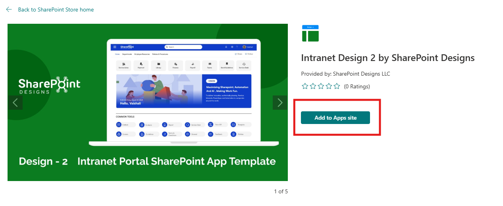
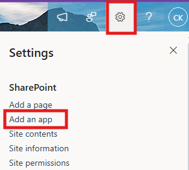
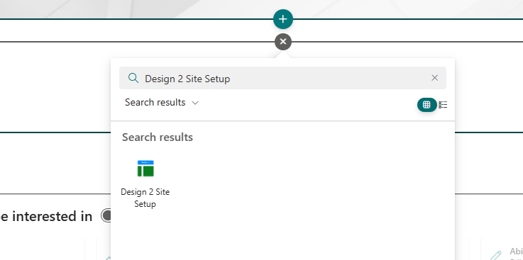
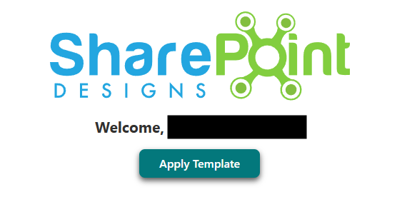
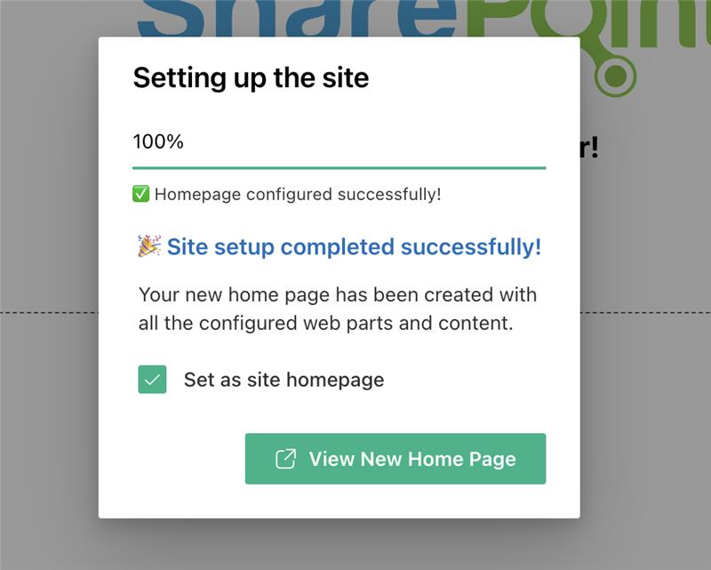
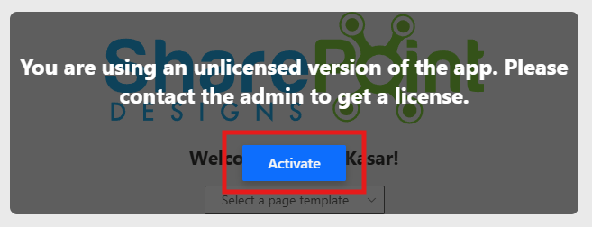
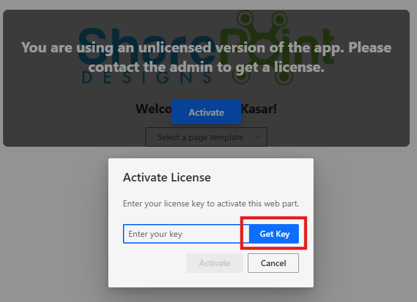

## ⚙️ Installation Instructions

| Step | Description                                                                                                                                                                                                                                                                                                                                                                   |
| ---- | ----------------------------------------------------------------------------------------------------------------------------------------------------------------------------------------------------------------------------------------------------------------------------------------------------------------------------------------------------------------------------- |
| 1    | Visit the[Intranet Design 2 – SharePoint Designs](https://appsource.microsoft.com/en-us/product/office/WA200008649?tab=Overview) listing on Microsoft AppSource and click **Get it now**.                                                                                                                                      |
| 2    | You will be redirected to the SharePoint Store. Click**Add to Apps Site** to add it to your tenant.  ⚠️ *If you don't have permission, a popup will appear saying "App requires permission approval." A request will be raised, and your tenant administrator needs to approve it before the app can be added.* |
| 3    | Navigate to any modern SharePoint site, and click the**Settings** icon.                                                                                                                                                                                                                                                             |
| 4    | Select**“Add an app”**, and choose**Intranet Design 2 Site by SharePoint Designs**.                                                                                                                                                                                                                                                  |
| 5    | Click**Add**.                                                                                                                                                                                                                                                                                                                                                                 |
| 6    | After installation, go to**Site Contents** to confirm it's added to the site.                                                                                                                                                                                                                                                 |

- - -

## 🧪 Testing Instructions

> **Note:** *Upon adding the web part to the page, a **free 15-day trial** will start automatically.*

1. Navigate to a modern SharePoint page or create a new one.
2. Edit the page and add the **"Design 2 Site Setup"** web part.
   
3. **Republish** the page.
4. Click the **“Apply Design”** button.

   > 
5. Do not close the browser. A pop-up will appear to create required lists and libraries with mock data (*Applicable only for lists*).
6. After creation, the page will refresh automatically and proceed with adding the necessary web parts and layout.
7. Once setup is complete - "Set as Homepage" checkbox will appear

   * If checked, clicking "Open New Page" will open the newly created page and set it as the homepage.
   * If unchecked, the new page opens normally without changing the homepage.

   

- - -

## 🔑 Activating a License Key

> *Once your free trial ends, you'll need a license key to continue using the app.*

### License Activation Steps

| **Step** | **Action**                 | **Details / Notes**                                                                                                                                                                                                                                                                                               |
| -------- | -------------------------- | ----------------------------------------------------------------------------------------------------------------------------------------------------------------------------------------------------------------------------------------------------------------------------------------------------------------- |
| 1        | Go to the app page         | Navigate to the SharePoint page where the app is installed.                                                                                                                                                                                                                                                       |
| 2        | Open activation panel      | \- If the trial**has expired**, you'll see an **"Activate"** button on the app — click it.  - If the trial **is still active** and you want to activate it, edit the page → open the **Web Part property panel** → click **"Activate License"**.  |
| 3        | Launch activation dialog   | A dialog box will appear prompting for a key.                                                                                                                                                                                                                                       |
| 4        | Click**Get Key**           | In the license dialog, click**Get Key** — this will take you to the payment page in a new tab.                                                                                                                                                                                                                    |
| 5        | Purchase the license       | Complete the payment process. Once done, you’ll receive a license key via email. Be sure to check your spam/junk folder if you don't see it.                                                                                                                                                                      |
| 6        | Enter and activate the key | Go back to the SharePoint page, paste the license key into the dialog box, and click**Activate** to complete activation.                                                                                                                                                                                          |

✅ **Done! Your app is now fully activated.**

- - -

### ✅ Expected Behaviour

The following SharePoint Lists are automatically created based on the Home Page:

* *Top Navigation*
* *CommonTools*
* *Facilities*
* *Holidays*

> These lists are pre-filled with demo/mock items for easy testing.
> **No manual configuration required after clicking the Apply template button.**

- - -

## 🔍 Validate Each Web Part on the Provisioned Page

## HOME PAGE

| **Webpart**            | **Description**                                                                                                                                                    |
| ---------------------- | ------------------------------------------------------------------------------------------------------------------------------------------------------------------ |
| **🧭 Top Navigation**  | \-**Intuitive Access**: Minimalist top navigation for easy access to essential intranet areas.                                                                     |
| **👋 Welcome Banner**  | \-**Personalized Welcome Banner**: Greets the user by name with the current date and time, creating a friendly and engaging intranet experience.                   |
| **🔗 Quick Links**     | \-**Essential Resources**: Provide easy access to frequently used tools and documents.   - **Clear Icons**: Use formal icons and labels for better navigation. |
| **📰 News**            | \-Date-stamped announcements or articles with brief summaries. Provides timely updates on departmental or industry developments                                    |
| **🏢 Facilities**      | \-**Organizational Facilities**: Highlight various facilities of your organization with brief descriptions and images.                                             |
| **🎉 Holidays**        | \-**Upcoming Holidays Overview**: Displays a list of upcoming holidays with corresponding dates for user awareness and planning.                                   |
| **📅 Events Calendar** | \-**Event Calendar**: Display meetings and company events.   - **Detailed Info**: Include dates, times, and locations.                                         |

## 🧹 Uninstall Guide

Follow the steps below to uninstall the **Intranet Design 2 by SharePoint Designs** app from your SharePoint site:

1. Go to your SharePoint site and click on **Site Contents** from the left side navigation or the settings menu.
2. Find **Intranet Design 2 by SharePoint Designs** in the list of installed apps.
3. Click the three dots (···) next to the app name and select **"Remove"**.
4. If prompted to switch to the **Classic Experience**, follow the prompt to proceed.
5. In the Classic Experience, hover over the app again, click the three dots (···), and then click **Remove** to finalize the uninstallation.

- - -

## 🛠️ Troubleshooting Common Issues

### ⚠️ Issue: Web Part Not Displaying Correctly

**Solution**: Ensure that the web part has been added to a modern SharePoint page and that the page has been republished. Check for any missing permissions that might be required for the web part to function correctly.

### 🗃️ Issue: Lists/Library Not Created

**Solution**: Verify that the **"Apply template"** button was clicked after adding the **"Design 2 Setup"** web part. If the lists/Library are still not created, delete the page and reapply the design.

### 📝 Issue: Missing Demo Items

**Solution**: Check if the lists items are present in the Site Contents. If the lists are empty, manually add demo items or reapply the design.

- - -

## 🌟 Best Practices

### 🔁 Regular Updates

* **Keep Content Fresh**: Regularly update the content on your SharePoint site to keep it relevant and engaging.
* **Monitor Performance**: Regularly check the performance of your SharePoint site and make necessary adjustments to improve speed and user experience.

### 🎓 User Training

* **Provide Training**: Offer training sessions for users to help them understand how to use the SharePoint site effectively.
* **Create Documentation**: Develop comprehensive documentation to guide users on how to navigate and use the site.

### 🔐 Security Measures

* **Implement Security Protocols**: Ensure that proper security measures are in place to protect sensitive information.
* **Regular Audits**: Conduct regular security audits to identify and address potential vulnerabilities.

### 🗣️ User Feedback

* **Collect Feedback**: Regularly collect feedback from users to understand their needs and improve the site accordingly.
* **Act on Feedback**: Implement changes based on user feedback to enhance the overall user experience.

### 🤝 Collaboration

* **Encourage Collaboration**: Promote collaboration among team members by providing tools and features that facilitate communication and teamwork.
* **Use SharePoint Features**: Utilize SharePoint features such as document libraries, lists, and workflows to streamline collaboration and improve productivity.

- - -

## 🧑‍💼 User Permissions

### 🗂️ Assigning Permissions

* **Site Owners**: Have full control over the site and can manage permissions for other users.
* **Site Members**: Can contribute content and interact with the site but have limited administrative capabilities.
* **Site Visitors**: Have read-only access to the site and cannot make any changes.

### 🛡️ Managing Permissions

* **Permission Levels**: Define different levels of access for users based on their roles and responsibilities.
* **Custom Permissions**: Create custom permission levels to meet specific needs and requirements.
* **Inheritance**: Manage permissions inheritance to ensure consistency across different site collections and subsites.

### 🧾 Best Practices for Permissions

* **Least Privilege Principle**: Assign the minimum level of permissions necessary for users to perform their tasks.
* **Regular Reviews**: Conduct regular reviews of user permissions to ensure they are up-to-date and aligned with current roles.
* **Documentation**: Maintain documentation of user permissions and any changes made to ensure transparency and accountability.

- - -

## 🆘 Support

Please contact **SharePoint Designs**
🌐 [www.sharepointdesigns.com](http://www.sharepointdesigns.com)
📧 support@sharepointdesigns.com
