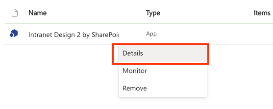
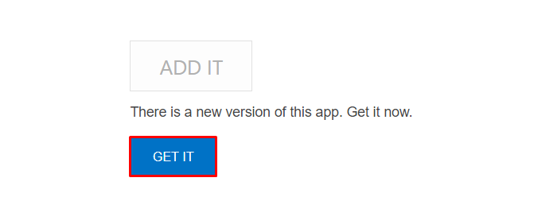

# How to Update *Intranet Design 2 by SharePoint Designs* package

## Overview

When a new version of *Intranet Design 2 by SharePoint Designs* is released in **Microsoft AppSource**, you can update it directly from your SharePoint App Catalog or from the site where it’s installed.  

Updating ensures you get the latest improvements, bug fixes, and features without affecting your existing data or configuration.

- - -

## Steps to Update

1. Go to your **App Catalog**:\
   👉 [`https://{tenant-name}.sharepoint.com/sites/appcatalog/_layouts/15/appStore.aspx/appDetail/WA200008649?entry=AppSource`](https://`{tenant-name}`.sharepoint.com/sites/appcatalog/_layouts/15/appStore.aspx/appDetail/WA200008649?entry=AppSource)\
   *(Replace `{tenant-name}` with your SharePoint tenant name.)*
2. On the app page, click **Update**.  
3. If prompted, review and approve any new permissions.  
4. The app will automatically update to the latest version — no redeployment is needed.  

- - -

## Update from SharePoint Site

1. Open the **Site Contents** page on the site where the app is installed and select the **...** button on the app tile.

See screenshot

2. On the callout that opens, select the **Details/About** tab. On the **Details/About** page that opens, there is a notice that a new version is available.  
3. If you're unable to see the **Details** tab, click **+ New** on the top left.  
4. Here you'll find the app under **Added Apps**, click on it.  
5. Click the **Get It** button. The app begins updating in the background

See screenshot

