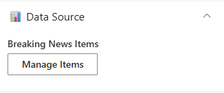
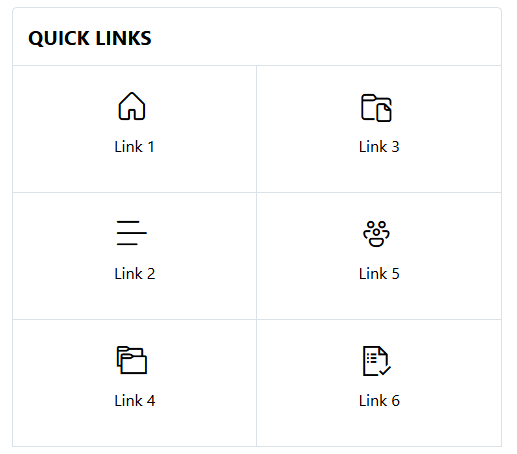
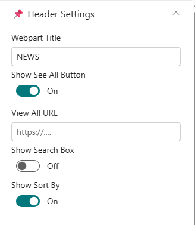

The Home page should be configured using the "Design 3 Setup" web part to ensure that the required lists and libraries are created automatically. Without this configuration, users will need to manually create dedicated lists or libraries for the respective web parts.

## 1. Welcome Banner

- - -

### ⚙️ Configuration

#### General settings

📸 View General settings Screenshots

| Name                 | Purpose                                      | Example                            |
| -------------------- | -------------------------------------------- | ---------------------------------- |
| Layout               | Define the layout structure of the web part. | Home/Sub Page                      |
| Welcome Message      | Display a personalized greeting.             | “Hello”                            |
| Format Date and Time | Display the current date and time            | “Thursday 14th Jul, 2022, 4:27 PM” |
| Change Background    | Upload a custom banner background            | Image Picker                       |

#### Message Configuration

📸 View Message Configuration Screenshots

| Name                  | Purpose                                                             | Example                                      |
| --------------------- | ------------------------------------------------------------------- | -------------------------------------------- |
| Show User's Full Name | Toggle to show or hide the user's full name in the welcome message. | On/Off                                       |
| People                | Select specific users to feature in the welcome message.            | User Picker                                  |
| Description           | Provide a brief description for the welcome message.                | “Maximizing SharePoint, Automation, and AI.” |
| Redirection URL       | Specify a URL to redirect users when they click on the Read More.   | URL Input                                    |

#### Appearance Settings

📸 View Appearance Settings Screenshots

| Name                        | Purpose                                              | Example        |
| --------------------------- | ---------------------------------------------------- | -------------- |
| Banner Height               | Adjust the height of the welcome banner.             | Slider Control |
| Message Container Width     | Set the width of the message container.              | Slider Control |
| People Welcome Height       | Adjust the height of the message container.          | Slider Control |
| Background color            | Choose a background color for the Message container. | Color Picker   |
| Text color                  | Choose a text color for the Message container.       | Color Picker   |
| Welcome Message theme color | Choose a theme color for the Welcome Message text.   | Dropdown       |
| Gradient Background theme   | Choose a theme color for the Gradient Background.    | Dropdown       |
| Read More Button Theme      | Choose a theme color for the Read More button.       | Dropdown       |

#### Draggable Configuration

📸 View Draggable Configuration Screenshots

| Name                     | Purpose                                                                 | Example |
| ------------------------ | ----------------------------------------------------------------------- | ------- |
| Enable Dragging          | Toggle to enable or disable dragging functionality for the web part.    | On/Off  |
| Reset Component Position | Reset the position of the web part to its default location on the page. | Button  |

## 2. Breaking News

### ⚙️Configuration

##### General Settings

📸 View General Settings Screenshots

| Name               | Purpose                                      | Example         |
| ------------------ | -------------------------------------------- | --------------- |
| Title              | Set the title for the Breaking News webpart. | "Breaking News" |
| Breaking news icon | Choose an icon to represent breaking news.   | Icon Picker     |

##### Data source

📸 View Data source Screenshots

| Name                | Purpose                                      | Example         |
| ------------------- | -------------------------------------------- | --------------- |
| Breaking news items | Add, remove, or reorder breaking news items. | Collection data |

##### Carousel Settings

📸 View carousel settings Screenshots

| Name                   | Purpose                                                       | Example        |
| ---------------------- | ------------------------------------------------------------- | -------------- |
| Autoplay               | Toggle to enable or disable autoplay for the carousel.        | On/Off         |
| Auto play speed        | Set the speed of the carousel transition.                     | Slider Control |
| Enable infinite loop   | Toggle to enable or disable infinite looping of the carousel. | On/Off         |
| Show navigation arrows | Toggle to show or hide navigation arrows on the carousel.     | On/Off         |

##### Appearance Settings

📸 View appearance settings Screenshots

| Name         | Purpose                                                | Example      |
| ------------ | ------------------------------------------------------ | ------------ |
| Accent Color | Choose an accent color for the Breaking News web part. | Color Picker |

#### Layout

📸 View layout Settings Screenshots

| Name                                         | Purpose                                                            | Example |
| -------------------------------------------- | ------------------------------------------------------------------ | ------- |
| Hide this webpart is there's nothing to show | Toggle to hide the web part when there are no breaking news items. | On/Off  |

## 3. Quick Links

Provide fast and intuitive access to essential resources:

* **Essential Resources**

  : Direct users to frequently used tools, forms, documents, and company policies.
* **Icons & Labels**
  : Enhance navigation with clearly labeled links and intuitive icons.

### ⚙️Configuration

#### Header settings

📸 View Header Settings Screenshots

| Name       | Purpose                                           | Example       |
| ---------- | ------------------------------------------------- | ------------- |
| Title      | Set the title for the Quick Links webpart.        | "Quick Links" |
| Hide Title | Toggle to show or hide the title of the web part. | On/Off        |

#### General settings

📸 View General Settings Screenshots

| Name                 | Purpose                                                              | Example         |
| -------------------- | -------------------------------------------------------------------- | --------------- |
| Manage Quick Links   | Add, remove, or reorder quick links items.                           | Collection data |
| Enable Drag & Drop   | Toggle to enable or disable drag and drop functionality for sorting. | On/Off          |
| Enable item deletion | Toggle to enable or disable the ability to delete quick link items.  | On/Off          |

#### Layouts settings

📸 View layout Settings Screenshots

| Name        | Purpose                                             | Example           |
| ----------- | --------------------------------------------------- | ----------------- |
| Layouts     | Choose the layout style for displaying quick links. | Auto/Matrix       |
| Alignment   | Choose the alignment for displaying quick links.    | Left/Center/Right |
| Show border | Toggle to show or hide borders around quick links.  | On/Off            |

#### Appearance settings

📸 View appearance Settings Screenshots

| Name                                         | Purpose                                                          | Example  |
| -------------------------------------------- | ---------------------------------------------------------------- | -------- |
| Hide this webpart is there's nothing to show | Toggle to hide the web part when there are no quick links items. | On/Off   |
| Title theme color                            | Choose a theme color for the Quick Links title.                  | Dropdown |
| Button hover theme color                     | Choose a theme color for the Quick Links button hover effect.    | Dropdown |

## 📰 4. News

Deliver the latest updates and announcements through a dynamic, filterable news section featuring categories, sorting, and RSS integration.

### ⚙️ Configuration

#### Header Settings

📸 View Header settings Screenshots

| Name                | Purpose                           | Select Option/Type                          |
| ------------------- | --------------------------------- | ------------------------------------------- |
| Webpart Title       | Display title of the news section | Textbox (e.g., NEWS)                        |
| Show see all button | Toggle visibility of "See All"    | Switch (Show/Hide)                          |
| View All URL        | Set URL for "See All" button      | Textbox (`{siteUrl}/_layouts/15/news.aspx`) |
| Show search box     | Toggle visibility of search box   | Switch (Show/Hide)                          |
| Show sort by        | Toggle visibility of sort options | Switch (Show/Hide)                          |

#### General Settings

📸 View General settings Screenshots

| Name                 | Purpose                          | Select Option/Type |
| -------------------- | -------------------------------- | ------------------ |
| Search Sites         | Define source site collections   | Search Box         |
| Fetching Items Limit | Set maximum number of news items | Slider             |
| Enable RSS Feed      | Fetch external RSS feeds         | Toggle (On)        |
| RSS Links            | Manage RSS links                 | Manage RSS Links   |
| RSS API Key          | Enter API Key for secure access  | Textbox            |
| Get API Key          | Generate or retrieve API Key     | Button             |

#### Layout Settings

📸 View Layout Settings Screenshots

| Name                                         | Purpose                                                   | Select Option/Type |
| -------------------------------------------- | --------------------------------------------------------- | ------------------ |
| Show category filter                         | Toggle visibility of category filter                      | Switch (On/Off)    |
| News Category                                | Select news category to display                           | Dropdown           |
| Choose Layout                                | Select display style (e.g., Filmstrip)                    | Dropdown           |
| Height                                       | Set height of news items                                  | Slider             |
| Items to show                                | Set number of news items to display                       | Slider             |
| Hide this webpart is there's nothing to show | Toggle to hide the web part when there are no news items. | On/Off             |

#### 🛠️ Appearance Settings

📸 View Appearance Settings Screenshots

| Name         | Purpose                              | Select Option/Type |
| ------------ | ------------------------------------ | ------------------ |
| Accent color | Select accent color for the web part | Color Picker       |

#### Target audience

📸 View Target audience Screenshots

| Name            | Purpose                                    | Select Option/Type |
| --------------- | ------------------------------------------ | ------------------ |
| Target audience | Define audience targeting for the web part | People Picker      |

#### News post Settings

📸 View News post Settings Screenshots

| Name             | Purpose              | Select Option |
| ---------------- | -------------------- | ------------- |
| Manage new posts | News post management | Link          |

:::tip
Use descriptive tags and consistent images (1300×450 px) for better layout alignment and category filtering.
:::

- - -
