# Configuration

Configuration settings for each web part.

## 📰 1. Welcome Banner

### 📋 Details

- **Personalized Welcome Banner** – The web part features a personalized greeting with the current date and time, set against a scenic wind energy background Image.
- It displays a corporate value ("OWN IT") along with a motivational message promoting responsibility and proactive behavior.

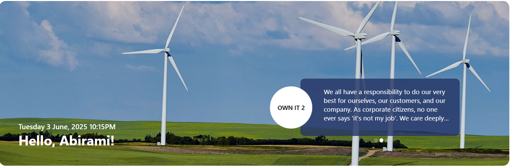

---

### List Config

Note: For the **Banner** section, create a list with the following columns

| 🏷️ Column Name (Case Sensitive) | 🔣 Column Type            |
| ------------------------------- | ------------------------- |
| **Title**                       | 🖼️ Text(default field)    |
| **Description**                 | 📄 Multiple lines of text |

### 🏷️ Welcome Banner Web Part – Property Pane Configuration

he WelcomeBanner web part allows customization of a personalized greeting banner with dynamic content and configurable appearance. Below are the property pane settings available:

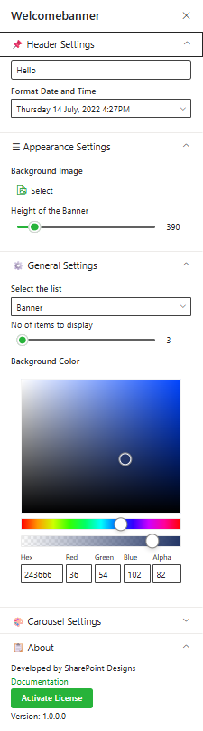

#### 🔖 Header Settings

This section allows customization of the **Welcome Banner** for a department or contact information display. The following configurable options are available:

| 🏷️ Name              | 🎯 Purpose                                           | 💡 Select Option/Type      |
| -------------------- | ---------------------------------------------------- | -------------------------- |
| Title                | Displays a personalized greeting (e.g., "Hello")     | Textbox                    |
| Format Date and Time | Shows the current date and time in a selected format | Date-Time Picker           |
| Display Name         | Either select First/last/full name to display        | Dropdown (First/Last/Full) |

#### 🎨 Appearance Settings

| 🏷️ Name                      | 🎯 Purpose                                            | 💡 Select Option/Type |
| ---------------------------- | ----------------------------------------------------- | --------------------- |
| Background Image             | Allows uploading or selecting a background image      | Image Selector        |
| Height of the Banner         | Sets the vertical size of the banner in pixels        | Slider (e.g., 390px)  |
| Height of the Content Banner | Sets the height of the content area within the banner | Slider (e.g., 135px)  |

#### ⚙️ General Settings

| 🏷️ Name                | 🎯 Purpose                                                       | Select Option/Type      |
| ---------------------- | ---------------------------------------------------------------- | ----------------------- |
| Select the list        | Chooses the SharePoint list from which banner content is fetched | Dropdown (e.g., Banner) |
| Hide Icon              | Toggle to show / hide arrow pointed icon in message circle       | No                      |
| No of items to display | Limits how many items to show on the banner                      | Slider (e.g., 3 items)  |
| Background color       | Sets the background color of the Content Area within the banner  | Color Picker            |

#### 🎠 Carousel Settings

| 🏷️ Name         | 🎯 Purpose                                                  | 💡 Select Option/Type  |
| --------------- | ----------------------------------------------------------- | ---------------------- |
| Enable AutoPlay | Toggles automatic slide rotation on or off                  | Toggle Switch (Yes/No) |
| Autoplay Speed  | Sets the time between slides in milliseconds (e.g., 8000ms) | 8000                   |

## 📰 2. Announcements

### 📋 Details

- The web part displays rotating announcements with a title, brief description, and a "Learn More" call-to-action button.
- It includes navigation controls to scroll through multiple announcements, enhancing user engagement with important updates.

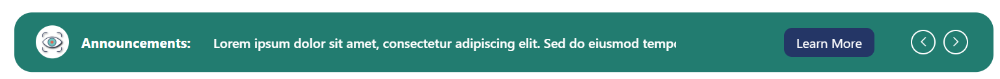

---

### List Config

Note: For the **Announcements** section, create a list with the following columns

| 🏷️ Column Name (Case Sensitive) | 🔣 Column Type                                        |
| ------------------------------- | ----------------------------------------------------- |
| **Description**                 | 📄 Multiple lines of text                             |
| **Link**                        | 🔗 Hyperlink                                          |
| **Orderby**                     | 🔢 Number                                             |
| **TargetWindow**                | 📁 Choice (Choices- Open in new tab,Open in self tab) |
| **ExpiryDate**                  | 📅 Date and Time                                      |

### 🏷️ Announcements Web Part – Property Pane Configuration

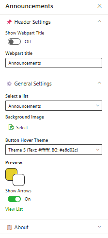

#### 📌 Header Settings

| 🏷️ Name            | 🎯 Purpose                                   | 💡 Select Option/Type  |
| ------------------ | -------------------------------------------- | ---------------------- |
| Show webpart title | Toggles the visibility of the web part title | Toggle Switch (On/Off) |
| Webpart title      | Sets the title of the web part               | Text Input             |

#### ⚙️ General Settings

| 🏷️ Name            | 🎯 Purpose                                                              | Select Option/Type                                 |
| ------------------ | ----------------------------------------------------------------------- | -------------------------------------------------- |
| Select a list      | Chooses the SharePoint list from which announcement items are retrieved | Dropdown (e.g., “Announcements”)                   |
| Background Image   | Allows uploading or selecting a custom background image                 | Image Selector                                     |
| Button Hover Theme | Sets the color scheme (text & background) for the “Learn More” button   | Dropdown (e.g., Theme 5: Text #ffffff, BG #243666) |
| Preview            | Shows a live preview of the chosen hover theme (button + arrow colors)  | Visual Display                                     |
| Show Arrows        | Toggles the visibility of left/right navigation arrows on/off           | Toggle Switch (On/Off)                             |
| View List          | Opens the selected SharePoint list in a new tab                         | Hyperlink (“View List”)                            |

#### 🎠 Carousel Settings

| 🏷️ Name         | 🎯 Purpose                                                  | 💡 Select Option/Type  |
| --------------- | ----------------------------------------------------------- | ---------------------- |
| Enable AutoPlay | Toggles automatic slide rotation on or off                  | Toggle Switch (Yes/No) |
| Autoplay Speed  | Sets the time between slides in milliseconds (e.g., 8000ms) | 8000                   |

## 📰 3. Quicklinks

### 📋 Details

- The **Quick Links** web part provides users with easy access to frequently used resources or internal tools via visually organized clickable tiles.
- Each link is represented with an icon and label, enabling quick identification, and the layout supports intuitive navigation with an optional “See All”.

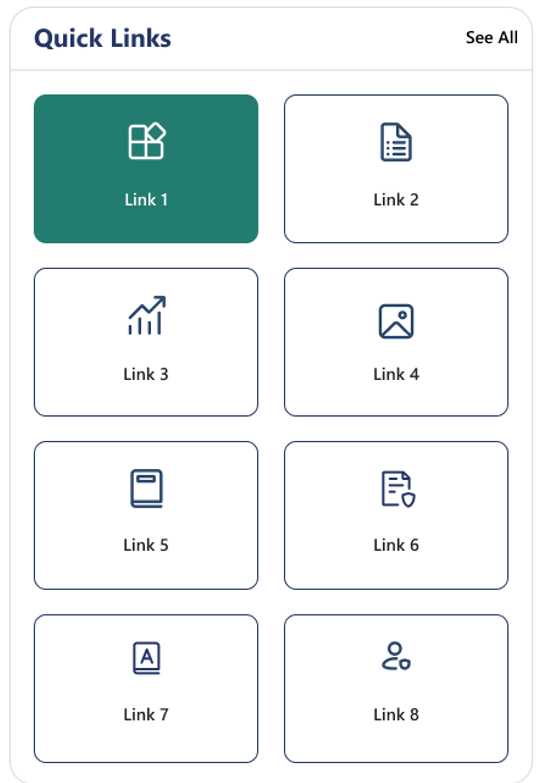

### List Config

Note: For the **Quicklinks** section, create a list with the following columns

| 🏷️ Column Name (Case Sensitive) | 🔣 Column Type              |
| ------------------------------- | --------------------------- |
| **Icon**                        | 🖼️ Image                    |
| **URL**                         | 🔗 Hyperlink                |
| **Order**                       | 🔢 Number                   |
| **TargetWindow**                | 📁 Choice (Choices- Yes,No) |

### 🏷️ Quicklinks Web Part – Property Pane Configuration

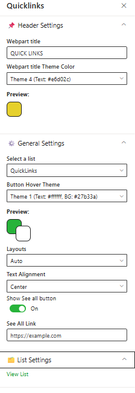

#### 📌 Header Settings

| 🏷️ Name                   | 🎯 Purpose                                         | 💡 Select Option/Type             |
| ------------------------- | -------------------------------------------------- | --------------------------------- |
| Webpart title             | Sets the display title of the Quick Links web part | Textbox (e.g., "Quick Links")     |
| Webpart title Theme Color | Defines the color theme for the web part title     | Dropdown (e.g., Theme 3: #243666) |
| Preview                   | Shows a color preview of the selected theme        | Color Block Display               |

#### ⚙️ General Settings

| 🏷️ Name             | 🎯 Purpose                                                        | 💡 Select Option/Type                |
| ------------------- | ----------------------------------------------------------------- | ------------------------------------ |
| Select a list       | Specifies the SharePoint list to pull quick links from            | Dropdown (e.g., "QuickLinks")        |
| Items to show       | Sets the maximum number of quick links to display                 | Slider (e.g., 8)                     |
| Button Hover Theme  | Sets the hover theme (text & background color) for action buttons | Dropdown (e.g., Theme 1: BG #227c70) |
| Preview             | Shows a preview of the selected button hover color                | Color Block Display                  |
| Layouts             | Sets the layout for displaying quick links                        | Dropdown (e.g., Auto)                |
| Text alignment      | Sets the alignment of the text within the quick links             | Dropdown (e.g., Center)              |
| Show see all button | Sets the visibility of the "See All" button                       | Toggle (On/Off)                      |
| Text alignment      | Sets the alignment of the text within the quick links             | Dropdown (e.g., Center)              |
| See All Link        | URL to navigate when clicking the "See All" button                | Textbox (e.g., https://example.com)  |

#### 📁 List Settings

| 🏷️ Name   | 🎯 Purpose                                  | 💡 Select Option/Type |
| --------- | ------------------------------------------- | --------------------- |
| View List | Opens the connected SharePoint list in view | Hyperlink             |

## 📰 4. News

### 📋 Details

- The **Latest News** web part displays recent company updates with category filters like Finance, Company News, and HR Updates for targeted browsing.
- Each news item includes a date, title, preview image, and short description, along with navigation arrows and a "See All" option.

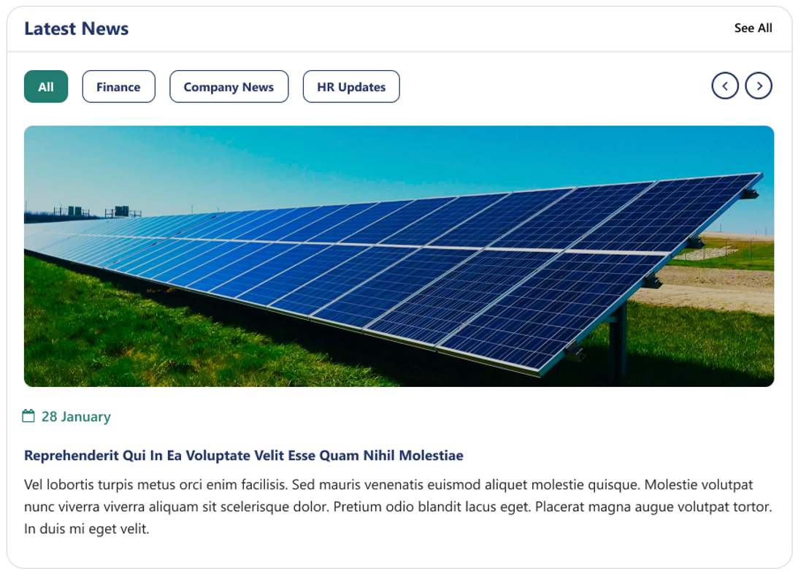

### 🏷️ News Web Part – Property Pane Configuration

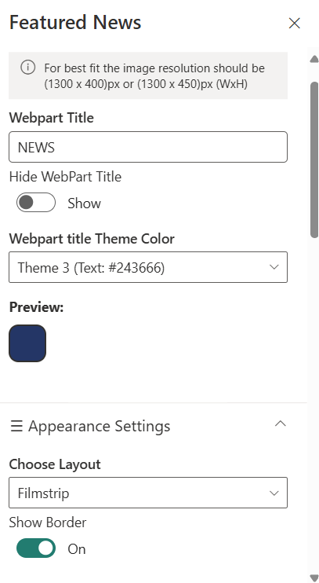

#### 🛠️ Header Settings

| 🏷️ Name                   | 🎯 Purpose                                     | 💡 Select Option/Type             |
| ------------------------- | ---------------------------------------------- | --------------------------------- |
| Webpart Title             | Sets the display title for the web part        | Textbox (e.g., NEWS)              |
| Hide WebPart Title        | Toggles visibility of the web part title       | Toggle (Show/Hide)                |
| Webpart title Theme Color | Defines the color theme for the web part title | Dropdown (e.g., Theme 3: #243666) |
| Preview                   | Shows a color preview of the selected theme    | Color Block Display               |

#### 🎨 Appearance Settings

| Name          | Purpose                                      | Select Option/Type         |
| ------------- | -------------------------------------------- | -------------------------- |
| Choose Layout | Determines how the news items are displayed  | Dropdown (e.g., Filmstrip) |
| Show Border   | Toggles border visibility around the content | Toggle (On/Off)            |

#### ⚙️ General Settings

| Name                 | Purpose                                     | Select Option                     |
| -------------------- | ------------------------------------------- | --------------------------------- |
| Search sites         | Search and select source site collections   | Search box                        |
| Filter by Tag        | Filter items by specific tags               | Dropdown (`All`)                  |
| Enable RSS Feed      | Toggle to enable fetching news via RSS      | `On` (toggle)                     |
| RSS Links            | Manage custom RSS feed links                | `Manage Links` button             |
| RSS API Key          | API Key for RSS functionality               | Text box (key shown)              |
| Get API Key          | Link to retrieve a new API key              | `Get API Key`                     |
| Show Category Filter | Show filter options based on categories     | `On` (toggle)                     |
| Show Search Box      | Display a search bar within the web part    | `Off` (toggle)                    |
| Show Sort By         | Option to sort news items                   | `Off` (toggle)                    |
| Show See All Button  | Toggle to show a link to view all news      | `On` (toggle)                     |
| View All URL         | URL that links to full news page            | `{siteUrl}/_layouts/15/news.aspx` |
| Target Audience      | Filter news items for specific audiences    | Text box                          |
| Manage News Posts    | Link to manage all news content in the list | `Manage News Posts`               |

#### 🛠️ Admin Settings

| Name            | Purpose                                       | Select Option   |
| --------------- | --------------------------------------------- | --------------- |
| Show Admin Menu | Show advanced options for site administrators | `Show` (toggle) |
| Show Admin Menu | Text box for further configuration            | Text box        |

## 📰 5. Message Center

### 📋 Details

- This web part showcases a personalized message from the CEO, including a profile image, name, title, and a highlighted message snippet.
- It provides a clean layout with a "Read More" button to access the full content, ensuring important leadership communication is prominently displayed.

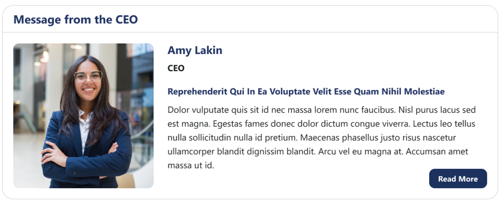

### 🏷️ Message Center Web Part – Property Pane Configuration

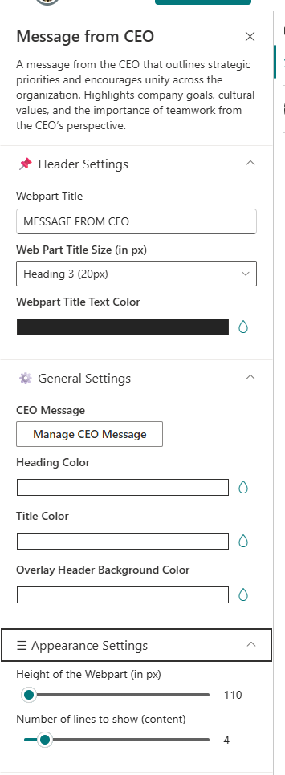

#### 📌 Header Settings

| 🏷️ Name                  | 🎯 Purpose                                   | 💡 Select Option     |
| ------------------------ | -------------------------------------------- | -------------------- |
| Web Part Title           | Title displayed at the top of the web part   | Message from the CEO |
| Web Part Title Size      | Defines the size of the web part title       | Heading 2/3/4        |
| Webpart Title Text Color | Defines the text color of the web part title | Color Picker         |

#### ⚙️ General Settings

| 🏷️ Name                         | 🎯 Purpose                                         | 💡 Select Option  |
| ------------------------------- | -------------------------------------------------- | ----------------- |
| Manage CEO Message              | Click the button to add or edit the CEO message    | Button (Add/Edit) |
| Heading color                   | Defines the heading color of the Message           | Color Picker      |
| Title Color                     | Defines the title color of the Message             | Color Picker      |
| Overlay header background color | Defines the background color of the overlay header | Color Picker      |

#### 🗂️ Appearance Settings

| 🏷️ Name                       | 🎯 Purpose                                              | 💡 Select Option |
| ----------------------------- | ------------------------------------------------------- | ---------------- |
| Height of the webpart         | Defines the height of the web part                      | Number (px)      |
| No. of line to show (content) | Defines the number of lines to show in the content area | Slider           |

## 📰 6. Employee Spotlights

### 📋 Details

- Employee Spotlights Web Part highlights upcoming Birthdays, Work Anniversaries, and New Joiners in a visually engaging format.
- It supports both Compact and Carousel layouts, making recognition easily accessible and aesthetically appealing

### List Config

Note: For the **Employee Spotlights** section, create a list with the following columns

| 🏷️ Column Name (Case Sensitive) | 🔣 Column Type                                             |
| ------------------------------- | ---------------------------------------------------------- |
| **Person**                      | 👥 Person or Group                                         |
| **Designation**                 | 📄 Text(default field)                                     |
| **ProfileImage**                | 🖼️ Image                                                   |
| **Date**                        | 📅 Date and Time                                           |
| **Category**                    | ☑️ Choice field Options: Birthday, Anniversary, New Joiner |

**Carousel View**

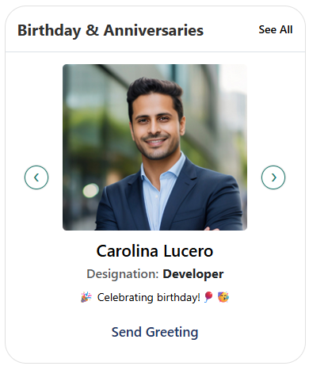

**Compact View**

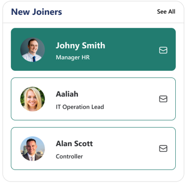

### 🏷️ Employee Spotlights Web Part – Property Pane Configuration

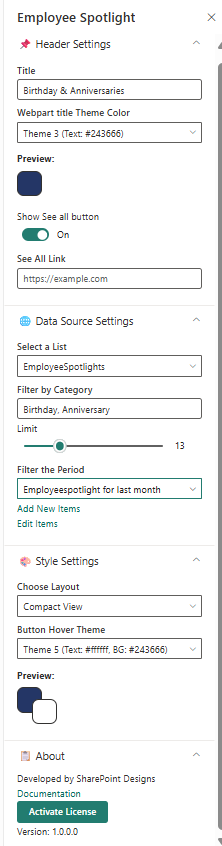

#### 🧷 Header Settings

| 🏷️ Name                   | 🎯 Purpose                                  | 💡 Select option         |
| ------------------------- | ------------------------------------------- | ------------------------ |
| Title                     | Sets the title of the web part              | Birthday & Anniversaries |
| Webpart title Theme Color | Sets the color of the web part title        | Theme 3 (Text: #243666)  |
| Show See all button       | Toggle to show or hide the “See all” button | On                       |
| See All Link              | Redirect URL when “See all” is clicked      | https://example.com      |

#### 🌐 Data Source Settings

| 🏷️ Name            | 🎯 Purpose                                         | 💡 Select option                 |
| ------------------ | -------------------------------------------------- | -------------------------------- |
| Select a List      | Specifies the data list to retrieve spotlight info | EmployeeSpotlights               |
| Filter by Category | Filters items based on selected category           | Birthday, Anniversary            |
| Limit              | Sets the number of spotlight items to display      | 15 (slider)                      |
| Filter the Period  | Filters spotlight entries based on time period     | Employeespotlight for last month |
| Add/Edit Items     | Provides option to modify the list data entries    | Add New Items / Edit Items       |

#### 🎨 Style Settings

| 🏷️ Name          | 🎯 Purpose                                                                                       | 💡 Select option                     |
| ---------------- | ------------------------------------------------------------------------------------------------ | ------------------------------------ |
| Choose Layout    | Sets how the spotlight items are displayed,Two available layouts: Carousel view and Compact view | Carousel View                        |
| Button Theme     | Defines hover color theme for action buttons                                                     | Theme 4 (Text: #243666, BG: #ffffff) |
| Greeting Message | Custom text for the greeting button                                                              | Send Greeting                        |

## 📰 7. Testimonials

### 📋 Details

- **Testimonials** Web Part allows showcasing user feedback or client quotes with support for images and personalized content.
- Includes an Upload Image button and presents testimonials in an interactive carousel-style view for visual impact.

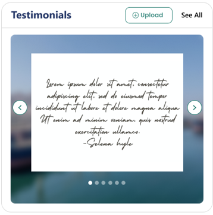

### 🏷️ Testimonials Web Part – Property Pane Configuration

#### 📌 Header Settings

| 🏷️ Name                   | 🎯 Purpose                                     | 💡 Select Option                  |
| ------------------------- | ---------------------------------------------- | --------------------------------- |
| Web Part Title            | Title displayed at the top of the web part     | Message from the CEO              |
| Webpart title Theme Color | Defines the color theme for the web part title | Dropdown (e.g., Theme 3: #243666) |
| Preview                   | Shows a color preview of the selected theme    | Color Block Display               |

#### 🌐 Data Source Settings

| 🏷️ Name          | 🎯 Purpose                                            | 💡 Select option |
| ---------------- | ----------------------------------------------------- | ---------------- |
| Select a Library | Specifies the data library to retrieve spotlight info | Testimonials     |

#### 🗂️ File Upload Settings

| 🏷️ Name                    | 🎯 Purpose                                      | 💡 Select option |
| -------------------------- | ----------------------------------------------- | ---------------- |
| Allow multiple file upload | Enables uploading of multiple testimonial files | Enabled          |

#### 🎠 Carousel Settings

| 🏷️ Name                | 🎯 Purpose                                                | 💡 Select option |
| ---------------------- | --------------------------------------------------------- | ---------------- |
| Enable AutoPlay        | Automatically plays the carousel slides                   | Yes              |
| AutoPlay Speed (ms)    | Sets the speed of auto slide transition (in milliseconds) | 8000             |
| Show Arrows            | Displays navigation arrows on the carousel                | Yes              |
| Show Dots              | Displays indicator dots for slides                        | Yes              |
| Enable Infinite Scroll | Enables continuous looping of carousel items              | Yes              |

## 📰 8. Company Directory

### 📋 Details

- **Company Directory** Web Part visually displays the company hierarchy, making it easy to understand team structures and reporting lines.
- Users can interact with the chart to view roles, names, and contact details in a clean, structured layout.

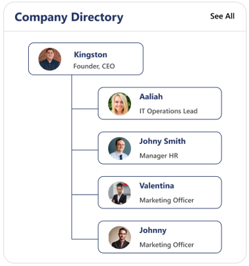

### 🗂️ Company Directory Web Part Settings

#### 📌 Header Settings

| 🏷️ Name                   | 🎯 Purpose                                     | 💡 Select Option                  |
| ------------------------- | ---------------------------------------------- | --------------------------------- |
| Web Part Title            | Title displayed at the top of the web part     | Message from the CEO              |
| Webpart title Theme Color | Defines the color theme for the web part title | Dropdown (e.g., Theme 3: #243666) |
| Preview                   | Shows a color preview of the selected theme    | Color Block Display               |

#### 🧭 Main Settings

| 🏷️ Name                   | 🎯 Purpose                                            | 💡 Select option  |
| ------------------------- | ----------------------------------------------------- | ----------------- |
| Company Hierarchy         | Selects the data source or hierarchy type             | Company Hierarchy |
| Max Depth                 | Sets the maximum depth level for chart display        | 5                 |
| Show Detail on Mouse Over | Displays additional details when hovering over a node | On                |

#### ⚙️ General Settings

| 🏷️ Name                 | 🎯 Purpose                                                                                   | 💡 Select option |
| ----------------------- | -------------------------------------------------------------------------------------------- | ---------------- |
| Excluded Users          | Selected users will be removed from the directory                                            | People Picker    |
| Enter UPN               | The Reorder Org Chart Users property becomes available when a valid email address is entered | [Text input]     |
| Reorder Org Chart Users | Enables reordering child users under a specific parent by entering the parent’s email ID     |                  |

#### 📘 About

| 🏷️ Name       | 🎯 Purpose                       | 💡 Select option          |
| ------------- | -------------------------------- | ------------------------- |
| Developed by  | Displays the developer credit    | SharePoint Designs        |
| Documentation | Link to documentation/help guide | Documentation button/link |

## 📰 9. Calendar

### 📋 Details

- Event Calendar Web Part displays upcoming meetings, holidays, and key events in a structured monthly or weekly calendar view.
- Users can easily browse, plan, and stay informed with clickable event entries and color-coded categories

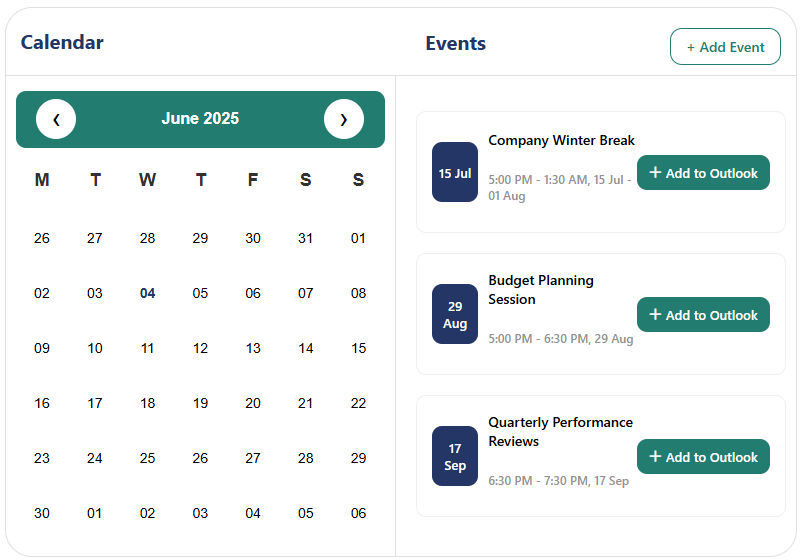

### 🏷️ Calendar Web Part – Property Pane Configuration

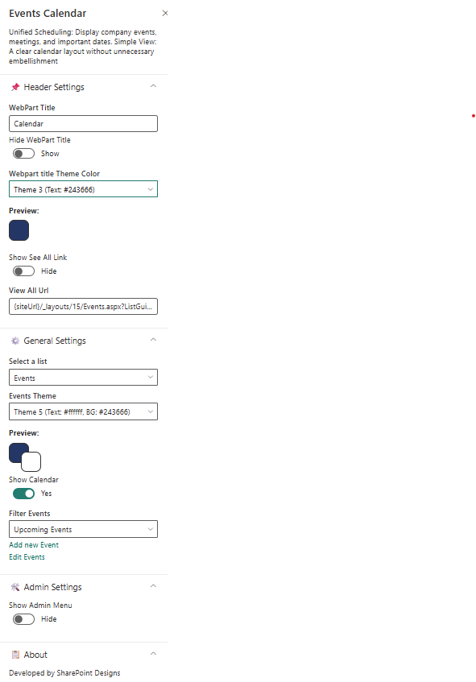

#### 📌 Header Settings

| 🏷️ Name                   | 🎯 Purpose                                           | 💡 Select Option                                 |
| ------------------------- | ---------------------------------------------------- | ------------------------------------------------ |
| Web Part Title            | Title displayed at the top of the web part           | Message from the CEO                             |
| Webpart title Theme Color | Defines the color theme for the web part title       | Dropdown (e.g., Theme 3: #243666)                |
| Preview                   | Shows a color preview of the selected theme          | Color Block Display                              |
| **Show See All Link**     | Display a link that leads to the full events view    | Show                                             |
| **View All URL**          | URL of the page where all calendar events are listed | `{siteUrl}/_layouts/15/Events.aspx?ListGuid=...` |

#### ⚙️ General Settings

| 🏷️ Name             | 🎯 Purpose                                              | 💡 Select Option |
| ------------------- | ------------------------------------------------------- | ---------------- |
| **Select a list**   | Dropdown to choose the list used for events             | Events           |
| **Show Calendar**   | Toggle to show calendar-style display                   | Yes              |
| **Filter Events**   | Dropdown to filter event types shown in the web part    | Upcoming Events  |
| **Add/Edit Events** | Links to create or update events in the configured list | Add/Edit Events  |
