This guide provides step-by-step configuration details for each web part, including list setups, property pane settings, and appearance options.

- - -

## 📚 Table of Contents

1. Set Up Wizard
2. Welcome Banner
3. [Announcements](#-2-announcements)
4. [Quicklinks](#-3-quicklinks)
5. [News](#-4-news)
6. [Message Center](#-5-message-center)
7. [Employee Spotlights](#-6-employee-spotlights)
8. [Testimonials](#-7-testimonials)
9. [Company Directory](#-8-company-directory)
10. [Calendar](#-9-calendar)

- - -

## 1. Set Up Wizard

1. Since this is a first-time setup (or setup was not previously completed), a **full-page Setup Wizard** will automatically appear — no need to manually add any web part.

   
2. Walk through the wizard steps:

   * **Organizational Details** — Enter your organization information.
   * **Branding** — Upload your site logo. The wizard uses AI to automatically generate a brand color palette from the logo. You can review, adjust, or change the suggested colors before clicking **Save and Apply Theme**. You can also upload a custom favicon and configure regional settings.
   * **Deploy & Template** — Deploy the intranet layout. Once deployed, the page is saved as a template so it can be reused later to recreate the site layout.
3. Do not close the browser during deployment. The wizard will create the required lists, libraries, and layout with sample data.
4. Once deployment is complete, you will be given the option to **set the newly created page as your homepage**. Click **View Page** to open the new page with the full Design 2 layout applied.

📸 View Property Panel Screenshots

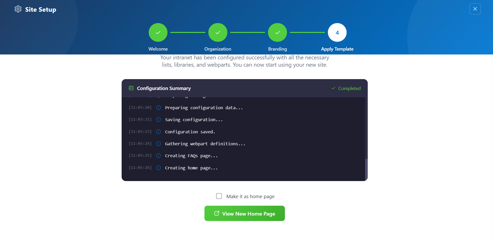

> **After Setup**
>
> * The full-page wizard will no longer appear on page load.
> * You can relaunch the Setup Wizard at any time from the **suite bar** at the top of the site to update settings.
> * Admins can return to the Deploy & Template step at any time to apply a saved template and recreate the site layout.

- - -

## 🏞️ 2. Welcome Banner

A personalized banner that greets users with their name, current date & time, and a motivational corporate message.

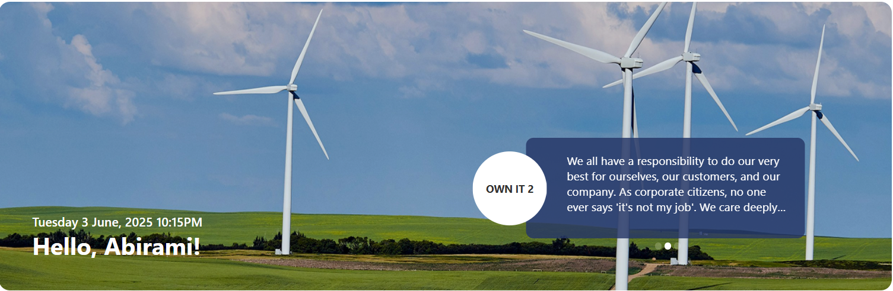

### 🧱 List Configuration

> **Note:** Create a SharePoint list named `Banner` with the following columns:

| 🏷️ Column Name (Case Sensitive) | 🔣 Column Type         | Description     |
| -------------------------------- | ---------------------- | --------------- |
| **Title**                        | Text (default field)   | Banner headline |
| **Description**                  | Multiple lines of text | Message content |

- - -

### ⚙️ Property Pane Configuration

📸 View Property Pane Screenshot

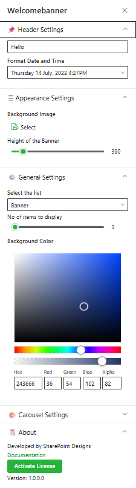

#### 🔖 Header Settings

| 🏷️ Name             | 🎯 Purpose                                          | 💡 Select Option/Type      |
| -------------------- | --------------------------------------------------- | -------------------------- |
| Title                | Displays a personalized greeting (e.g., "Hello")    | Textbox                    |
| Format Date and Time | Shows the current date & time                       | Date-Time Picker           |
| Display Name         | Choose whether to display First, Last, or Full Name | Dropdown (First/Last/Full) |
| Greeting Text Color  | Adjust the color of the Greeting Text               | Swatch Color Picker        |

#### 🎨 Appearance Settings

| 🏷️ Name                                     | 🎯 Purpose                         | 💡 Select Option/Type |
| -------------------------------------------- | ---------------------------------- | --------------------- |
| Background Image                             | Upload or select banner background | Image Selector        |
| Hide the Greetings Message in Welcome Banner | Toggle to show/hide the greetings  | Toggle (No)           |
| Height of Banner                             | Sets vertical banner height (px)   | Slider (e.g., 390 px) |
| Height of Content Banner                     | Sets content area height (px)      | Slider (e.g., 135 px) |
| Width of the Content Banner                  | Set Hortizontal banner width (%)   | Slider (e.g., 56%)    |

#### ⚙️ General Settings

| 🏷️ Name               | 🎯 Purpose                             | 💡 Select Option/Type   |
| ---------------------- | -------------------------------------- | ----------------------- |
| Select the list        | Source SharePoint list                 | Dropdown (e.g., Banner) |
| Hide Icon              | Show/hide arrow icon in message circle | Toggle (No)             |
| No of items to display | Limit items displayed in banner        | Slider (e.g., 3)        |
| Background color       | Background color of content area       | Color Picker            |

#### 🎠 Carousel Settings

| 🏷️ Name        | 🎯 Purpose                      | 💡 Select Option/Type |
| --------------- | ------------------------------- | --------------------- |
| Enable AutoPlay | Enable automatic slide rotation | Toggle (Yes/No)       |
| Autoplay Speed  | Delay between slides (ms)       | 8000                  |

- - -

## 📢 3. Announcements

Rotating announcement cards that display headlines, short descriptions, and a **Learn More** button — great for internal updates and campaigns.

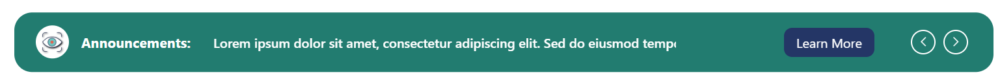

### 🧱 List Configuration

> **Create a list named `Announcements` with these columns:**

| 🏷️ Column Name (Case Sensitive) | 🔣 Column Type                      | Description                              |
| -------------------------------- | ----------------------------------- | ---------------------------------------- |
| **Description**                  | Multiple lines of text              | Announcement text                        |
| **Link**                         | Hyperlink                           | “Learn More” destination                 |
| **Orderby**                      | Number                              | Display order                            |
| **TargetWindow**                 | Choice (Open in new tab / self tab) | Controls link behavior                   |
| **ExpiryDate**                   | Date and Time                       | Hide expired announcements automatically |

- - -

### ⚙️ Property Pane Configuration

📸 View Property Pane Screenshot

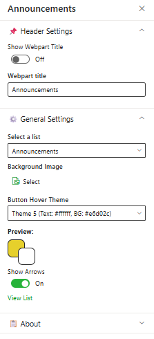

#### 📌 Header Settings

| 🏷️ Name                  | 🎯 Purpose                 | 💡 Select Option/Type |
| ------------------------- | -------------------------- | --------------------- |
| Show Web Part Title       | Toggle visibility of title | Switch (On/Off)       |
| Web Part Title            | Sets the section title     | Text Input            |
| WebPart Title Theme Color | Sets theme color for title | Dropdown              |
| Preview                   | Displays theme preview     | Color Block Display   |

#### ⚙️ General Settings

| 🏷️ Name           | 🎯 Purpose                               | 💡 Select Option/Type                     |
| ------------------ | ---------------------------------------- | ----------------------------------------- |
| Select a List      | Source list for announcements            | Dropdown (e.g., Announcements)            |
| View List          | Open the SharePoint list in new tab      | Hyperlink (View List)                     |
| Background Image   | Upload custom background                 | Image Selector                            |
| Button Hover Theme | Defines hover colors (text + background) | Dropdown (Theme 5: Text #fff, BG #243666) |
| Preview            | Live preview of hover theme              | Visual Display                            |
| Show Arrows        | Show/hide navigation arrows              | Switch (On/Off)                           |

#### 🎠 Carousel Settings

| 🏷️ Name        | 🎯 Purpose                | 💡 Select Option/Type |
| --------------- | ------------------------- | --------------------- |
| Enable AutoPlay | Automatic slide rotation  | Toggle (Yes/No)       |
| Autoplay Speed  | Delay between slides (ms) | 8000                  |

- - -

## 🔗 4. Quicklinks

Offer one-click access to frequently used tools, policies, or external resources with customizable icons and layouts.

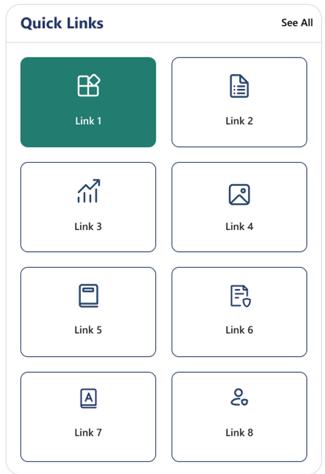

### 🧱 List Configuration

> **Create a list named `QuickLinks` with the following columns:**

| 🏷️ Column Name (Case Sensitive) | 🔣 Column Type  | Description               |
| -------------------------------- | --------------- | ------------------------- |
| **Icon**                         | Image           | Tile icon                 |
| **URL**                          | Hyperlink       | Target link               |
| **Order**                        | Number          | Item ordering             |
| **TargetWindow**                 | Choice (Yes/No) | Opens in new tab if “Yes” |

- - -

### ⚙️ Property Pane Configuration

📸 View Property Pane Screenshot

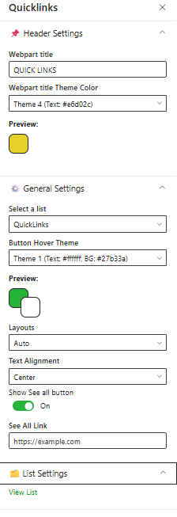

#### 📌 Header Settings

| 🏷️ Name                   | 🎯 Purpose                  | 💡 Select Option/Type       |
| -------------------------- | --------------------------- | --------------------------- |
| Web Part Title             | Title displayed on web part | “Quick Links”               |
| Web Part Title Theme Color | Sets theme color for title  | Dropdown (Theme 3: #243666) |
| Preview                    | Displays theme preview      | Color Block Display         |

#### ⚙️ General Settings

| 🏷️ Name                        | 🎯 Purpose                     | 💡 Select Option/Type          |
| ------------------------------- | ------------------------------ | ------------------------------ |
| Select a List                   | Source SharePoint list         | Dropdown (QuickLinks)          |
| Items to Show                   | Limit visible items            | Slider (8)                     |
| Button Hover Theme              | Hover style for buttons        | Dropdown (Theme 1: BG #227c70) |
| Layouts                         | Layout type for tiles          | Dropdown (Grid View)           |
| Grid Type                       | Sets the grid type             | Dropdown (Autofill/ Repeat)    |
| Number of Items to show in Grid | Limits grid repeat items       | Slider (1)                     |
| Height of the Webpart           | Sets the height of the webpart | Slider                         |
| Text Alignment                  | Alignment for labels           | Dropdown (Center)              |
| Show See All Button             | Toggle visibility of “See All” | Switch (On/Off)                |
| See All Link                    | URL for “See All” action       | Text box (https://example.com) |

#### 📁 List Settings

| 🏷️ Name  | 🎯 Purpose                         | 💡 Select Option/Type |
| --------- | ---------------------------------- | --------------------- |
| View List | Open the connected SharePoint list | Hyperlink (View List) |

- - -

## 📰 5. News

Deliver the latest updates and announcements through a dynamic, filterable news section featuring categories, sorting, and RSS integration.

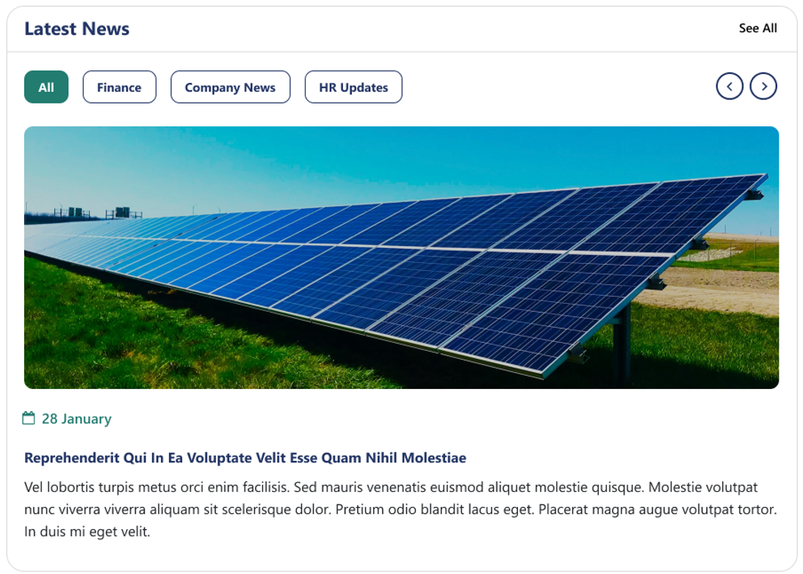

### ⚙️ Property Pane Configuration

📸 View Property Pane Screenshots

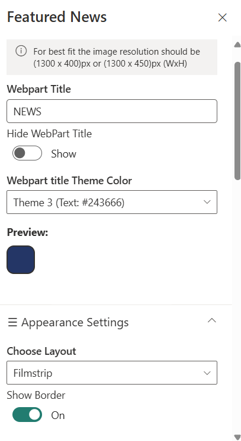

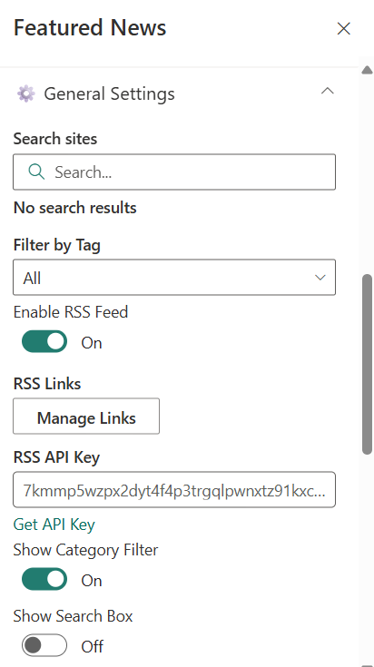

#### 🛠️ Header Settings

| 🏷️ Name                  | 🎯 Purpose                        | 💡 Select Option/Type       |
| ------------------------- | --------------------------------- | --------------------------- |
| Webpart Title             | Display title of the news section | Textbox (e.g., NEWS)        |
| Hide WebPart Title        | Toggle title visibility           | Switch (Show/Hide)          |
| Webpart Title Theme Color | Set the theme color               | Dropdown (Theme 3: #243666) |
| Preview                   | Show color preview                | Color Block Display         |

#### 🎨 Appearance Settings

| 🏷️ Name      | 🎯 Purpose                             | 💡 Select Option/Type |
| ------------- | -------------------------------------- | --------------------- |
| Choose Layout | Select display style (e.g., Filmstrip) | Dropdown              |
| Show Border   | Toggle border visibility               | Switch (On/Off)       |

#### ⚙️ General Settings

| 🏷️ Name             | 🎯 Purpose                        | 💡 Select Option/Type             |
| -------------------- | --------------------------------- | --------------------------------- |
| Search Sites         | Define source site collections    | Search Box                        |
| Filter by Tag        | Display filtered news by tag      | Dropdown (“All”)                  |
| Enable RSS Feed      | Fetch external RSS feeds          | Toggle (On)                       |
| RSS Links            | Manage RSS links                  | Manage Links button               |
| RSS API Key          | Enter API Key for secure access   | Textbox                           |
| Get API Key          | Generate or retrieve API Key      | Button                            |
| Show Category Filter | Enable filtering by categories    | Toggle (On)                       |
| Show Search Box      | Add search functionality          | Toggle (Off)                      |
| Show Sort By         | Enable sorting                    | Toggle (Off)                      |
| Show See All Button  | Include “See All” navigation      | Toggle (On)                       |
| View All URL         | Destination for full news list    | `{siteUrl}/_layouts/15/news.aspx` |
| Target Audience      | Restrict visibility by audience   | Textbox                           |
| Manage News Posts    | Open the list for content editing | Manage News Posts button          |

#### 🛠️ Admin Settings

| 🏷️ Name          | 🎯 Purpose               | 💡 Select Option |
| ----------------- | ------------------------ | ---------------- |
| Show Admin Menu   | Enable admin controls    | Toggle (Show)    |
| Additional Config | Define extended settings | Textbox          |

:::tip
Use descriptive tags and consistent images (1300×450 px) for better layout alignment and category filtering.
:::

- - -

## 💬 6. Message Center

Display personalized messages from leadership (e.g., CEO message) with profile image, name, and title, presented in a clean visual layout.

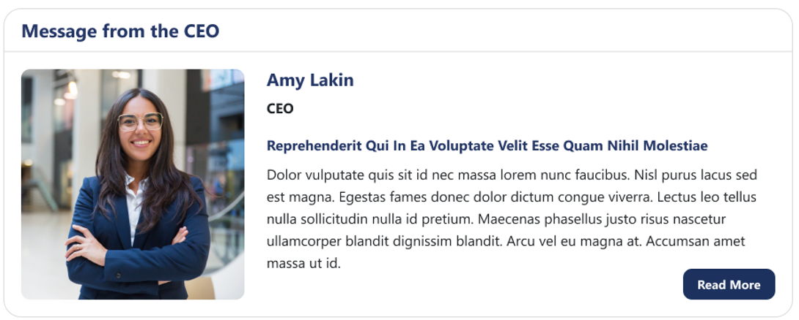

:::info
Perfect for high-impact internal communications — easily configurable via Webpart property panel.
:::

### ⚙️ Property Pane Configuration

📸 View Property Pane Screenshot

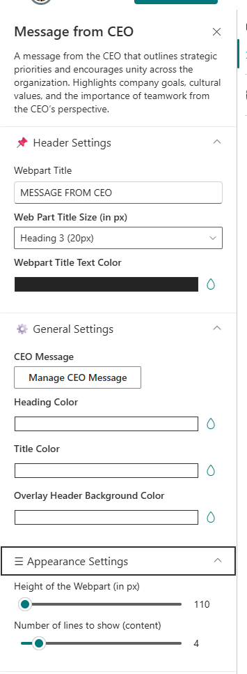

#### 📌 Header Settings

| 🏷️ Name                 | 🎯 Purpose                                   | 💡 Select Option/Type |
| ------------------------ | -------------------------------------------- | --------------------- |
| Web Part Title           | Section title (e.g., “Message from the CEO”) | Textbox               |
| Web Part Title Size      | Choose title heading level                   | Slider (20)           |
| Webpart Title Text Color | Define title text color                      | Color Picker          |

#### ⚙️ General Settings

| 🏷️ Name                        | 🎯 Purpose                   | 💡 Select Option/Type |
| ------------------------------- | ---------------------------- | --------------------- |
| Manage CEO Message              | Add/Edit CEO message content | Button (Add/Edit)     |
| Heading Color                   | Heading text color           | Color Picker          |
| Title Color                     | Sub-title or name color      | Color Picker          |
| Overlay Header Background Color | Overlay color for top header | Color Picker          |

#### 🗂️ Appearance Settings

| 🏷️ Name                       | 🎯 Purpose                                 | 💡 Select Option/Type |
| ------------------------------ | ------------------------------------------ | --------------------- |
| Height of Web Part             | Set the visual height of the web part (px) | Number Input          |
| No. of Lines to Show (Content) | Limit visible lines for preview            | Slider                |

- - -

## 🌟 7. Employee Spotlights

Celebrate your people! Showcase birthdays, anniversaries, and new joiners with vibrant cards or carousel views.

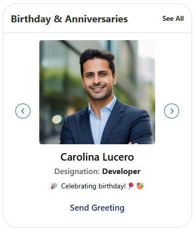

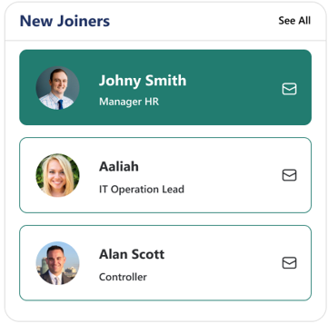

### 🧱 List Configuration

> **Create a list named `EmployeeSpotlights` with the following columns:**

| 🏷️ Column Name (Case Sensitive) | 🔣 Column Type  | Description                         |
| -------------------------------- | --------------- | ----------------------------------- |
| **Person**                       | Person or Group | Employee name reference             |
| **Designation**                  | Text            | Job title or role                   |
| **ProfileImage**                 | Image           | Employee photo                      |
| **Date**                         | Date and Time   | Event date                          |
| **Category**                     | Choice          | Birthday / Anniversary / New Joiner |

- - -

### ⚙️ Property Pane Configuration

📸 View Property Pane Screenshot

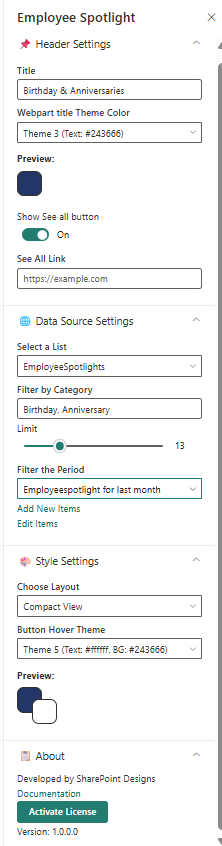

#### 🧷 Header Settings

| 🏷️ Name                  | 🎯 Purpose                  | 💡 Select Option           |
| ------------------------- | --------------------------- | -------------------------- |
| Title                     | Section title               | “Birthday & Anniversaries” |
| Webpart Title Theme Color | Theme color for title       | Theme 3 (Text: #243666)    |
| Preview                   | Show color preview          | Color Block Display        |
| Show See All Button       | Toggle to display “See All” | On                         |
| See All Link              | Destination URL             | `https://example.com`      |

#### 🌐 Data Source Settings

| 🏷️ Name           | 🎯 Purpose                   | 💡 Select Option       |
| ------------------ | ---------------------------- | ---------------------- |
| Select a List      | Choose SharePoint data list  | EmployeeSpotlights     |
| Filter by Category | Filter items by event type   | Birthday / Anniversary |
| Filter the Period  | Define date range for events | Last Month             |
| Add/Edit Items     | Open list for modification   | Add/Edit Items         |

#### 🎨 Style Settings

| 🏷️ Name                   | 🎯 Purpose                                                  | 💡 Select Option                |
| -------------------------- | ----------------------------------------------------------- | ------------------------------- |
| Choose Layout              | Select between Carousel or Compact view                     | Carousel View                   |
| Button Theme               | Button hover color and text color                           | Theme 4 (Text #243666, BG #fff) |
| Preview                    | Show Button Hover Color Preview                             | Color Block Display             |
| Hide Designation           | Toggle to show/hide the designation                         | Toggle (On/Off)                 |
| Hide Greetings             | Toggle to show/hide the Greetings text                      | Toggle (On/Off)                 |
| Change the wishing message | Customize the wishing message                               | Text Field                      |
| Greeting Message           | Customize greeting button text                              | “Send Greeting”                 |
| Enable Autoplay            | Toggle to show/hide the autoplay in carousel view           | Toggle (On/Off)                 |
| Autoplay Speed             | Set the customized speed of autoplay speed in carousel view | Slider                          |
| Enable Infinite Scroll     | Toggle to show/hide the infinite items in carousel view     | Toggle (On/Off)                 |

- - -

## 💭 8. Testimonials

Highlight client or employee feedback in a visually appealing carousel view with profile images and quotes.

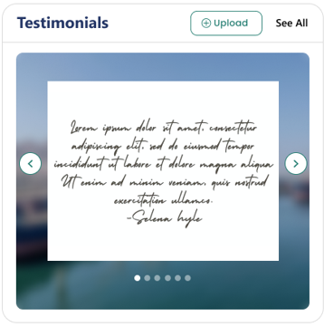

### ⚙️ Property Pane Configuration

📸 View Property Pane Screenshot

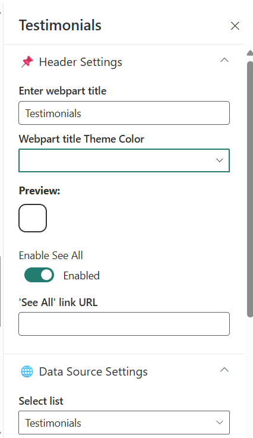

#### 📌 Header Settings

| 🏷️ Name                  | 🎯 Purpose                        | 💡 Select Option/Type      |
| ------------------------- | --------------------------------- | -------------------------- |
| Web Part Title            | Title displayed above the section | Textbox (“Testimonials”)   |
| Webpart Title Theme Color | Color theme for section heading   | Dropdown (Theme 3 #243666) |
| Preview                   | Displays live theme preview       | Color Block Display        |

#### 🌐 Data Source Settings

| 🏷️ Name         | 🎯 Purpose                           | 💡 Select Option |
| ---------------- | ------------------------------------ | ---------------- |
| Select a Library | Library containing testimonial items | Testimonials     |

#### 🗂️ File Upload Settings

| 🏷️ Name                   | 🎯 Purpose                                | 💡 Select Option |
| -------------------------- | ----------------------------------------- | ---------------- |
| Allow Multiple File Upload | Enable batch upload of testimonial images | Enabled          |

#### 🎠 Carousel Settings

| 🏷️ Name               | 🎯 Purpose                               | 💡 Select Option |
| ---------------------- | ---------------------------------------- | ---------------- |
| Enable AutoPlay        | Automatically cycle through testimonials | Yes              |
| AutoPlay Speed (ms)    | Slide-change speed                       | 8000             |
| Show Arrows            | Display navigation arrows                | Yes              |
| Show Dots              | Show pagination dots                     | Yes              |
| Enable Infinite Scroll | Loop carousel endlessly                  | Yes              |

:::tip
Use a consistent photo size (e.g., 200×200 px) and keep testimonial text under 120 characters for balance.
:::

- - -

## 🏢 9. Company Directory

Display your organizational hierarchy with interactive nodes showing employees, departments, and reporting lines.

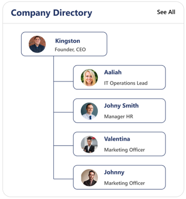

:::info
Ideal for visualizing reporting structures — users can hover to view names, titles, and contact details.
:::

### ⚙️ Property Pane Configuration

📸 View Property Pane Screenshot

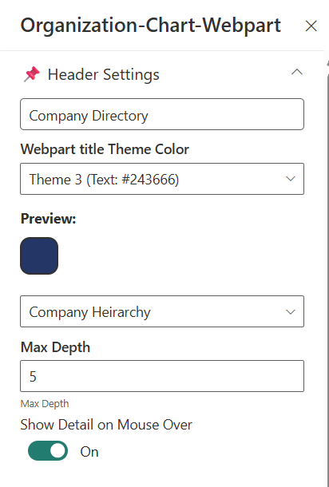

#### 📌 Header Settings

| 🏷️ Name                  | 🎯 Purpose                      | 💡 Select Option/Type      |
| ------------------------- | ------------------------------- | -------------------------- |
| Web Part Title            | Title displayed above the chart | “Company Directory”        |
| Webpart Title Theme Color | Choose theme color              | Dropdown (Theme 3 #243666) |
| Preview                   | Displays color preview          | Color Block Display        |

#### 🧭 Main Settings

| 🏷️ Name                  | 🎯 Purpose                       | 💡 Select Option  |
| ------------------------- | -------------------------------- | ----------------- |
| Company Hierarchy         | Select data source for org chart | Company Hierarchy |
| Max Depth                 | Control number of levels shown   | 5                 |
| Show Detail on Mouse Over | Display employee detail tooltip  | On                |

#### ⚙️ General Settings

| 🏷️ Name                | 🎯 Purpose                                | 💡 Select Option |
| ----------------------- | ----------------------------------------- | ---------------- |
| Height of the webpart   | Customize the height of the webpart       | Slider           |
| Excluded Users          | Remove specific users from chart          | People Picker    |
| Enter UPN               | Activate reorder option by valid email ID | Text Input       |
| Reorder Org Chart Users | Reorder children under a parent node      | Text Input       |

#### 📘 About

| 🏷️ Name      | 🎯 Purpose               | 💡 Select Option   |
| ------------- | ------------------------ | ------------------ |
| Developed By  | Credit attribution       | SharePoint Designs |
| Documentation | Opens help documentation | Documentation Link |

- - -

## 📅 10. Calendar

Show upcoming meetings, holidays, and key events in a clear monthly or weekly calendar format.

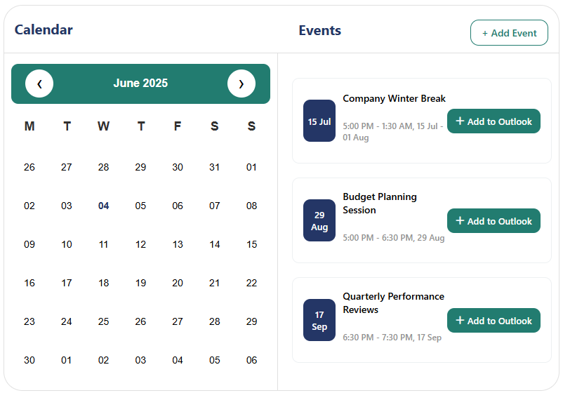

:::info
The **Calendar** web part pulls events directly from a SharePoint list, helping teams stay informed about important dates.
:::

### ⚙️ Property Pane Configuration

📸 View Property Pane Screenshot

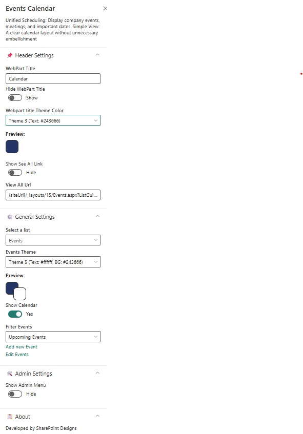

#### 📌 Header Settings

| 🏷️ Name                  | 🎯 Purpose                            | 💡 Select Option                                 |
| ------------------------- | ------------------------------------- | ------------------------------------------------ |
| Web Part Title            | Title displayed at the top            | “Event Calendar”                                 |
| Webpart Title Theme Color | Color theme for title                 | Dropdown (Theme 3 #243666)                       |
| Preview                   | Displays color preview                | Color Block Display                              |
| Hide Webpart Title        | Toggle to show/hide the webpart title | Toggle (on/off)                                  |
| Show See All Link         | Display link to full events view      | Show                                             |
| View All URL              | Destination for full events page      | `{siteUrl}/_layouts/15/Events.aspx?ListGuid=...` |

#### ⚙️ General Settings

| 🏷️ Name        | 🎯 Purpose                           | 💡 Select Option |
| --------------- | ------------------------------------ | ---------------- |
| Select a List   | Choose event list source             | Events           |
| Show Calendar   | Toggle calendar view display         | Yes              |
| Filter Events   | Filter types (Upcoming / Past / All) | Upcoming Events  |
| Add/Edit Events | Link to manage list items            | Add/Edit Events  |

- - -

> 📘 **Developed by:** [SharePoint Designs](https://sharepointdesigns.com)
