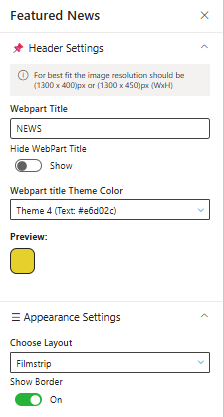
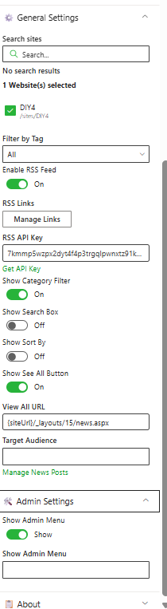
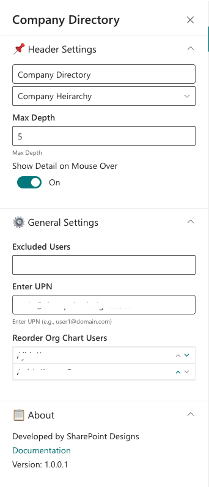

This guide provides step-by-step configuration details for each web part, including list setups, property pane settings, and appearance options.

- - -

## 📚 Table of Contents

1. [Welcome Banner](#-1-welcome-banner)
2. [Announcements](#-2-announcements)
3. [Quicklinks](#-3-quicklinks)
4. [News](#-4-news)
5. [Message Center](#-5-message-center)
6. [Employee Spotlights](#-6-employee-spotlights)
7. [Testimonials](#-7-testimonials)
8. [Company Directory](#-8-company-directory)
9. [Calendar](#-9-calendar)

- - -

## 🏞️ 1. Welcome Banner

A personalized banner that greets users with their name, current date & time, and a motivational corporate message.

### 🧱 List Configuration

> **Note:** Create a SharePoint list named `Banner` with the following columns:

| 🏷️ Column Name (Case Sensitive) | 🔣 Column Type         | Description     |
| -------------------------------- | ---------------------- | --------------- |
| **Title**                        | Text (default field)   | Banner headline |
| **Description**                  | Multiple lines of text | Message content |

- - -

### ⚙️ Property Pane Configuration

📸 View Property Pane Screenshot

#### 🔖 Header Settings

| 🏷️ Name             | 🎯 Purpose                                          | 💡 Select Option/Type      |
| -------------------- | --------------------------------------------------- | -------------------------- |
| Title                | Displays a personalized greeting (e.g., "Hello")    | Textbox                    |
| Format Date and Time | Shows the current date & time                       | Date-Time Picker           |
| Display Name         | Choose whether to display First, Last, or Full Name | Dropdown (First/Last/Full) |

#### 🎨 Appearance Settings

| 🏷️ Name                 | 🎯 Purpose                         | 💡 Select Option/Type |
| ------------------------ | ---------------------------------- | --------------------- |
| Background Image         | Upload or select banner background | Image Selector        |
| Height of Banner         | Sets vertical banner height (px)   | Slider (e.g., 390 px) |
| Height of Content Banner | Sets content area height (px)      | Slider (e.g., 135 px) |

#### ⚙️ General Settings

| 🏷️ Name               | 🎯 Purpose                             | 💡 Select Option/Type   |
| ---------------------- | -------------------------------------- | ----------------------- |
| Select the list        | Source SharePoint list                 | Dropdown (e.g., Banner) |
| Hide Icon              | Show/hide arrow icon in message circle | Toggle (No)             |
| No of items to display | Limit items displayed in banner        | Slider (e.g., 3)        |
| Background color       | Background color of content area       | Color Picker            |

#### 🎠 Carousel Settings

| 🏷️ Name        | 🎯 Purpose                      | 💡 Select Option/Type |
| --------------- | ------------------------------- | --------------------- |
| Enable AutoPlay | Enable automatic slide rotation | Toggle (Yes/No)       |
| Autoplay Speed  | Delay between slides (ms)       | 8000                  |

- - -

## 📢 2. Announcements

Rotating announcement cards that display headlines, short descriptions, and a **Learn More** button — great for internal updates and campaigns.

### 🧱 List Configuration

> **Create a list named `Announcements` with these columns:**

| 🏷️ Column Name (Case Sensitive) | 🔣 Column Type                      | Description                              |
| -------------------------------- | ----------------------------------- | ---------------------------------------- |
| **Description**                  | Multiple lines of text              | Announcement text                        |
| **Link**                         | Hyperlink                           | “Learn More” destination                 |
| **Orderby**                      | Number                              | Display order                            |
| **TargetWindow**                 | Choice (Open in new tab / self tab) | Controls link behavior                   |
| **ExpiryDate**                   | Date and Time                       | Hide expired announcements automatically |

- - -

### ⚙️ Property Pane Configuration

📸 View Property Pane Screenshot

#### 📌 Header Settings

| 🏷️ Name            | 🎯 Purpose                 | 💡 Select Option/Type |
| ------------------- | -------------------------- | --------------------- |
| Show Web Part Title | Toggle visibility of title | Switch (On/Off)       |
| Web Part Title      | Sets the section title     | Text Input            |

#### ⚙️ General Settings

| 🏷️ Name           | 🎯 Purpose                               | 💡 Select Option/Type                     |
| ------------------ | ---------------------------------------- | ----------------------------------------- |
| Select a List      | Source list for announcements            | Dropdown (e.g., Announcements)            |
| Background Image   | Upload custom background                 | Image Selector                            |
| Button Hover Theme | Defines hover colors (text + background) | Dropdown (Theme 5: Text #fff, BG #243666) |
| Preview            | Live preview of hover theme              | Visual Display                            |
| Show Arrows        | Show/hide navigation arrows              | Switch (On/Off)                           |
| View List          | Open the SharePoint list in new tab      | Hyperlink (View List)                     |

#### 🎠 Carousel Settings

| 🏷️ Name        | 🎯 Purpose                | 💡 Select Option/Type |
| --------------- | ------------------------- | --------------------- |
| Enable AutoPlay | Automatic slide rotation  | Toggle (Yes/No)       |
| Autoplay Speed  | Delay between slides (ms) | 8000                  |

- - -

## 🔗 3. Quicklinks

Offer one-click access to frequently used tools, policies, or external resources with customizable icons and layouts.

### 🧱 List Configuration

> **Create a list named `QuickLinks` with the following columns:**

| 🏷️ Column Name (Case Sensitive) | 🔣 Column Type  | Description               |
| -------------------------------- | --------------- | ------------------------- |
| **Icon**                         | Image           | Tile icon                 |
| **URL**                          | Hyperlink       | Target link               |
| **Order**                        | Number          | Item ordering             |
| **TargetWindow**                 | Choice (Yes/No) | Opens in new tab if “Yes” |

- - -

### ⚙️ Property Pane Configuration

📸 View Property Pane Screenshot

#### 📌 Header Settings

| 🏷️ Name                   | 🎯 Purpose                  | 💡 Select Option/Type       |
| -------------------------- | --------------------------- | --------------------------- |
| Web Part Title             | Title displayed on web part | “Quick Links”               |
| Web Part Title Theme Color | Sets theme color for title  | Dropdown (Theme 3: #243666) |
| Preview                    | Displays theme preview      | Color Block Display         |

#### ⚙️ General Settings

| 🏷️ Name            | 🎯 Purpose                     | 💡 Select Option/Type          |
| ------------------- | ------------------------------ | ------------------------------ |
| Select a List       | Source SharePoint list         | Dropdown (QuickLinks)          |
| Items to Show       | Limit visible items            | Slider (8)                     |
| Button Hover Theme  | Hover style for buttons        | Dropdown (Theme 1: BG #227c70) |
| Layouts             | Layout type for tiles          | Dropdown (Auto)                |
| Text Alignment      | Alignment for labels           | Dropdown (Center)              |
| Show See All Button | Toggle visibility of “See All” | Switch (On/Off)                |
| See All Link        | URL for “See All” action       | Text box (https://example.com) |

#### 📁 List Settings

| 🏷️ Name  | 🎯 Purpose                         | 💡 Select Option/Type |
| --------- | ---------------------------------- | --------------------- |
| View List | Open the connected SharePoint list | Hyperlink (View List) |

- - -

## 📰 4. News

Deliver the latest updates and announcements through a dynamic, filterable news section featuring categories, sorting, and RSS integration.

### ⚙️ Property Pane Configuration

📸 View Property Pane Screenshots

#### 🛠️ Header Settings

| 🏷️ Name                  | 🎯 Purpose                        | 💡 Select Option/Type       |
| ------------------------- | --------------------------------- | --------------------------- |
| Webpart Title             | Display title of the news section | Textbox (e.g., NEWS)        |
| Hide WebPart Title        | Toggle title visibility           | Switch (Show/Hide)          |
| Webpart Title Theme Color | Set the theme color               | Dropdown (Theme 3: #243666) |
| Preview                   | Show color preview                | Color Block Display         |

#### 🎨 Appearance Settings

| 🏷️ Name      | 🎯 Purpose                             | 💡 Select Option/Type |
| ------------- | -------------------------------------- | --------------------- |
| Choose Layout | Select display style (e.g., Filmstrip) | Dropdown              |
| Show Border   | Toggle border visibility               | Switch (On/Off)       |

#### ⚙️ General Settings

| 🏷️ Name             | 🎯 Purpose                        | 💡 Select Option/Type             |
| -------------------- | --------------------------------- | --------------------------------- |
| Search Sites         | Define source site collections    | Search Box                        |
| Filter by Tag        | Display filtered news by tag      | Dropdown (“All”)                  |
| Enable RSS Feed      | Fetch external RSS feeds          | Toggle (On)                       |
| RSS Links            | Manage RSS links                  | Manage Links button               |
| RSS API Key          | Enter API Key for secure access   | Textbox                           |
| Get API Key          | Generate or retrieve API Key      | Button                            |
| Show Category Filter | Enable filtering by categories    | Toggle (On)                       |
| Show Search Box      | Add search functionality          | Toggle (Off)                      |
| Show Sort By         | Enable sorting                    | Toggle (Off)                      |
| Show See All Button  | Include “See All” navigation      | Toggle (On)                       |
| View All URL         | Destination for full news list    | `{siteUrl}/_layouts/15/news.aspx` |
| Target Audience      | Restrict visibility by audience   | Textbox                           |
| Manage News Posts    | Open the list for content editing | Manage News Posts button          |

#### 🛠️ Admin Settings

| 🏷️ Name          | 🎯 Purpose               | 💡 Select Option |
| ----------------- | ------------------------ | ---------------- |
| Show Admin Menu   | Enable admin controls    | Toggle (Show)    |
| Additional Config | Define extended settings | Textbox          |

:::tip
Use descriptive tags and consistent images (1300×450 px) for better layout alignment and category filtering.
:::

- - -

## 💬 5. Message Center

Display personalized messages from leadership (e.g., CEO message) with profile image, name, and title, presented in a clean visual layout.

:::info
Perfect for high-impact internal communications — easily configurable via Webpart property panel.
:::

### ⚙️ Property Pane Configuration

📸 View Property Pane Screenshot

#### 📌 Header Settings

| 🏷️ Name                 | 🎯 Purpose                                   | 💡 Select Option/Type    |
| ------------------------ | -------------------------------------------- | ------------------------ |
| Web Part Title           | Section title (e.g., “Message from the CEO”) | Textbox                  |
| Web Part Title Size      | Choose title heading level                   | Dropdown (Heading 2/3/4) |
| Webpart Title Text Color | Define title text color                      | Color Picker             |

#### ⚙️ General Settings

| 🏷️ Name                        | 🎯 Purpose                   | 💡 Select Option/Type |
| ------------------------------- | ---------------------------- | --------------------- |
| Manage CEO Message              | Add/Edit CEO message content | Button (Add/Edit)     |
| Heading Color                   | Heading text color           | Color Picker          |
| Title Color                     | Sub-title or name color      | Color Picker          |
| Overlay Header Background Color | Overlay color for top header | Color Picker          |

#### 🗂️ Appearance Settings

| 🏷️ Name                       | 🎯 Purpose                                 | 💡 Select Option/Type |
| ------------------------------ | ------------------------------------------ | --------------------- |
| Height of Web Part             | Set the visual height of the web part (px) | Number Input          |
| No. of Lines to Show (Content) | Limit visible lines for preview            | Slider                |

- - -

## 🌟 6. Employee Spotlights

Celebrate your people! Showcase birthdays, anniversaries, and new joiners with vibrant cards or carousel views.

### 🧱 List Configuration

> **Create a list named `EmployeeSpotlights` with the following columns:**

| 🏷️ Column Name (Case Sensitive) | 🔣 Column Type  | Description                         |
| -------------------------------- | --------------- | ----------------------------------- |
| **Person**                       | Person or Group | Employee name reference             |
| **Designation**                  | Text            | Job title or role                   |
| **ProfileImage**                 | Image           | Employee photo                      |
| **Date**                         | Date and Time   | Event date                          |
| **Category**                     | Choice          | Birthday / Anniversary / New Joiner |

- - -

### ⚙️ Property Pane Configuration

📸 View Property Pane Screenshot

#### 🧷 Header Settings

| 🏷️ Name                  | 🎯 Purpose                  | 💡 Select Option           |
| ------------------------- | --------------------------- | -------------------------- |
| Title                     | Section title               | “Birthday & Anniversaries” |
| Webpart Title Theme Color | Theme color for title       | Theme 3 (Text: #243666)    |
| Show See All Button       | Toggle to display “See All” | On                         |
| See All Link              | Destination URL             | `https://example.com`      |

#### 🌐 Data Source Settings

| 🏷️ Name           | 🎯 Purpose                      | 💡 Select Option       |
| ------------------ | ------------------------------- | ---------------------- |
| Select a List      | Choose SharePoint data list     | EmployeeSpotlights     |
| Filter by Category | Filter items by event type      | Birthday / Anniversary |
| Limit              | Limit number of spotlight cards | Slider (15)            |
| Filter the Period  | Define date range for events    | Last Month             |
| Add/Edit Items     | Open list for modification      | Add/Edit Items         |

#### 🎨 Style Settings

| 🏷️ Name         | 🎯 Purpose                              | 💡 Select Option                |
| ---------------- | --------------------------------------- | ------------------------------- |
| Choose Layout    | Select between Carousel or Compact view | Carousel View                   |
| Button Theme     | Button hover color and text color       | Theme 4 (Text #243666, BG #fff) |
| Greeting Message | Customize greeting button text          | “Send Greeting”                 |

- - -

## 💭 7. Testimonials

Highlight client or employee feedback in a visually appealing carousel view with profile images and quotes.

### ⚙️ Property Pane Configuration

📸 View Property Pane Screenshot

#### 📌 Header Settings

| 🏷️ Name                  | 🎯 Purpose                        | 💡 Select Option/Type      |
| ------------------------- | --------------------------------- | -------------------------- |
| Web Part Title            | Title displayed above the section | Textbox (“Testimonials”)   |
| Webpart Title Theme Color | Color theme for section heading   | Dropdown (Theme 3 #243666) |
| Preview                   | Displays live theme preview       | Color Block Display        |

#### 🌐 Data Source Settings

| 🏷️ Name         | 🎯 Purpose                           | 💡 Select Option |
| ---------------- | ------------------------------------ | ---------------- |
| Select a Library | Library containing testimonial items | Testimonials     |

#### 🗂️ File Upload Settings

| 🏷️ Name                   | 🎯 Purpose                                | 💡 Select Option |
| -------------------------- | ----------------------------------------- | ---------------- |
| Allow Multiple File Upload | Enable batch upload of testimonial images | Enabled          |

#### 🎠 Carousel Settings

| 🏷️ Name               | 🎯 Purpose                               | 💡 Select Option |
| ---------------------- | ---------------------------------------- | ---------------- |
| Enable AutoPlay        | Automatically cycle through testimonials | Yes              |
| AutoPlay Speed (ms)    | Slide-change speed                       | 8000             |
| Show Arrows            | Display navigation arrows                | Yes              |
| Show Dots              | Show pagination dots                     | Yes              |
| Enable Infinite Scroll | Loop carousel endlessly                  | Yes              |

:::tip
Use a consistent photo size (e.g., 200×200 px) and keep testimonial text under 120 characters for balance.
:::

- - -

## 🏢 8. Company Directory

Display your organizational hierarchy with interactive nodes showing employees, departments, and reporting lines.

:::info
Ideal for visualizing reporting structures — users can hover to view names, titles, and contact details.
:::

### ⚙️ Property Pane Configuration

📸 View Property Pane Screenshot

#### 📌 Header Settings

| 🏷️ Name                  | 🎯 Purpose                      | 💡 Select Option/Type      |
| ------------------------- | ------------------------------- | -------------------------- |
| Web Part Title            | Title displayed above the chart | “Company Directory”        |
| Webpart Title Theme Color | Choose theme color              | Dropdown (Theme 3 #243666) |
| Preview                   | Displays color preview          | Color Block Display        |

#### 🧭 Main Settings

| 🏷️ Name                  | 🎯 Purpose                       | 💡 Select Option  |
| ------------------------- | -------------------------------- | ----------------- |
| Company Hierarchy         | Select data source for org chart | Company Hierarchy |
| Max Depth                 | Control number of levels shown   | 5                 |
| Show Detail on Mouse Over | Display employee detail tooltip  | On                |

#### ⚙️ General Settings

| 🏷️ Name                | 🎯 Purpose                                | 💡 Select Option |
| ----------------------- | ----------------------------------------- | ---------------- |
| Excluded Users          | Remove specific users from chart          | People Picker    |
| Enter UPN               | Activate reorder option by valid email ID | Text Input       |
| Reorder Org Chart Users | Reorder children under a parent node      | Text Input       |

#### 📘 About

| 🏷️ Name      | 🎯 Purpose               | 💡 Select Option   |
| ------------- | ------------------------ | ------------------ |
| Developed By  | Credit attribution       | SharePoint Designs |
| Documentation | Opens help documentation | Documentation Link |

- - -

## 📅 9. Calendar

Show upcoming meetings, holidays, and key events in a clear monthly or weekly calendar format.

:::info
The **Calendar** web part pulls events directly from a SharePoint list, helping teams stay informed about important dates.
:::

### ⚙️ Property Pane Configuration

📸 View Property Pane Screenshot

#### 📌 Header Settings

| 🏷️ Name                  | 🎯 Purpose                       | 💡 Select Option                                 |
| ------------------------- | -------------------------------- | ------------------------------------------------ |
| Web Part Title            | Title displayed at the top       | “Event Calendar”                                 |
| Webpart Title Theme Color | Color theme for title            | Dropdown (Theme 3 #243666)                       |
| Preview                   | Displays color preview           | Color Block Display                              |
| Show See All Link         | Display link to full events view | Show                                             |
| View All URL              | Destination for full events page | `{siteUrl}/_layouts/15/Events.aspx?ListGuid=...` |

#### ⚙️ General Settings

| 🏷️ Name        | 🎯 Purpose                           | 💡 Select Option |
| --------------- | ------------------------------------ | ---------------- |
| Select a List   | Choose event list source             | Events           |
| Show Calendar   | Toggle calendar view display         | Yes              |
| Filter Events   | Filter types (Upcoming / Past / All) | Upcoming Events  |
| Add/Edit Events | Link to manage list items            | Add/Edit Events  |

- - -

> 📘 **Developed by:** [SharePoint Designs](https://sharepointdesigns.com)
