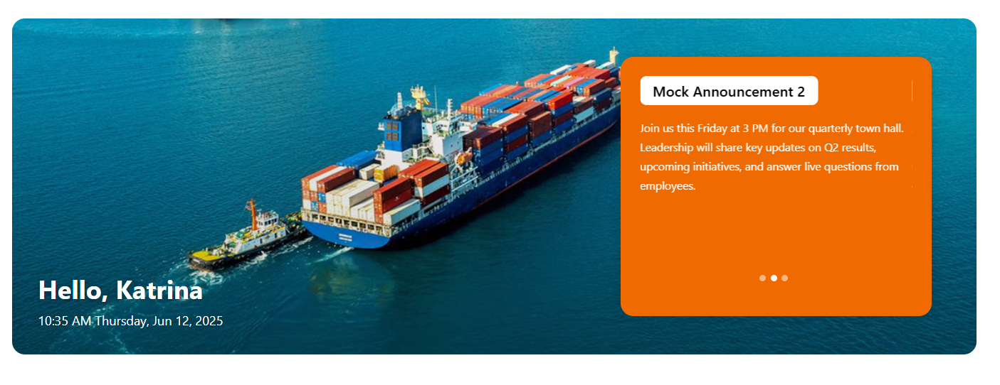
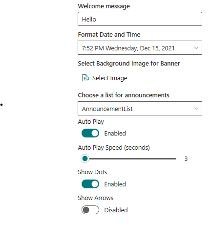
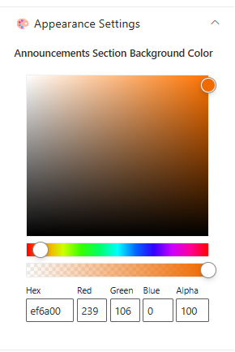
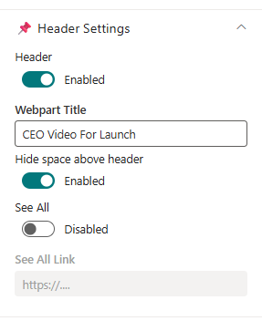
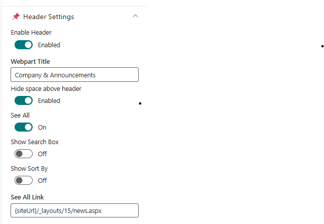
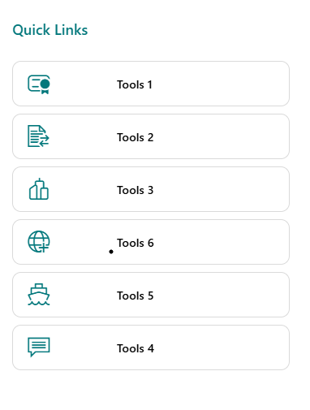
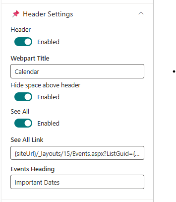
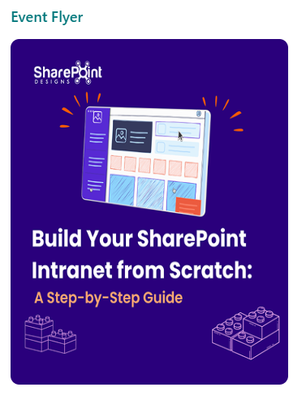

Configuration settings for each web part.

## 📰 Welcome Banner

The **Welcome Banner** is the visually prominent hero section of the DIY5 homepage. It provides a personalized welcome, real-time clock, and optionally features background visuals or announcement-driven content.

---

### ⚙️ Property Pane Configuration

Configuration options are grouped under intuitive sections:

---

### 🛠 General Settings

📸 View Property Pane Screenshots

| Field                               | Type         | Default / Example                | Description                                                                                 |
| ----------------------------------- | ------------ | -------------------------------- | ------------------------------------------------------------------------------------------- |
| **Welcome Message**                 | Textbox      | Hello                            | Displays a greeting with the current user's first name, above the date/time.                |
| **Format Date and Time**            | Dropdown     | 7:52 PM Wednesday, Dec 15, 2021  | Select how date and time are formatted in the banner.                                       |
| **Select Background Image**         | Image Picker | Upload / Choose                  | Upload or pick a static image used as the banner background.                                |
| **Choose a List for Announcements** | Dropdown     | DIY5Announcements (auto-created) | Selects the list containing announcement items. Created automatically during initial setup. |
| **Auto Play**                       | Toggle       | Enabled                          | Enables automatic cycling of carousel items.                                                |
| **Auto Play Speed (seconds)**       | Slider       | 3                                | Time interval between slide transitions.                                                    |
| **Show Dots**                       | Toggle       | Enabled                          | Displays indicator dots below the carousel.                                                 |
| **Show Arrows**                     | Toggle       | Disabled                         | Displays navigation arrows on the sides of the carousel.                                    |

---

### 🎨 Appearance Settings

📸 View Property Pane Screenshots

| Field                                     | Type         | Default | Description                                                |
| ----------------------------------------- | ------------ | ------- | ---------------------------------------------------------- |
| **Announcement Section Background Color** | Color Picker | ef6a00  | Customizes the background color for the announcement area. |

---

### 🧩 Layout

| Field           | Type         | Default       | Description                            |
| --------------- | ------------ | ------------- | -------------------------------------- |
| **Layout Mode** | Choice Field | Announcements | Select the layout mode for the banner. |

---

### ℹ️ About Section

📸 View Property Pane Screenshots

| 🏷️ Name                | 🎯 Purpose                                                        |
| ---------------------- | ----------------------------------------------------------------- |
| **Developer Info**     | Indicates the web part is built by **SharePoint Designs**.        |
| **Documentation Link** | Links to this documentation for easy reference.                   |
| **Activate License**   | Button to activate the licensed or premium version if applicable. |

---

### 📌 Usage Notes

- **AnnouncementList** list is created automatically when applying the template and comes with mock data.
- Carousel is auto-enabled with default settings unless manually changed.
- Announcement section background color enhances visual clarity for message visibility.
- The layout mode dictates how banner content is presented — Announcements is the default for internal comms.

---

## 🎥 CEO Video

The **CEO Video** web part provides a dedicated section to feature your CEO's latest message or announcement in a prominent video format. By default, it displays the title "CEO Video," a YouTube video, a subtitle, and a description—making it easy to spotlight leadership updates on your intranet homepage.

---

### 🛠️ Property Pane Configuration

The CEO Video web part offers flexible configuration grouped into the following categories:

- **Header**
- **General Settings**
- **Layout**
- **Appearance Settings**
- **About**

---

### 🏷️ Header

📸 View Property Pane Screenshots

| Field                       | Type       | Default / Example | Description                                                          |
| --------------------------- | ---------- | ----------------- | -------------------------------------------------------------------- |
| **Header**                  | Toggle     | Off               | Enable to show the header section for the web part.                  |
| **Webpart Title**           | Text Field | CEO Video         | Title for the web part. Visible only when Header is enabled.         |
| **Hide space above header** | Toggle     | Enabled           | Removes extra spacing above the header section when enabled.         |
| **See All**                 | Toggle     | Off               | Show a "See All" link in the header.                                 |
| **See All Link**            | Text Field | (Disabled)        | URL for the "See All" link. Enabled only when See All is toggled on. |

---

### ⚙️ General Settings

📸 View Property Pane Screenshots

|  |  |
| :-------------------------------------------------: | :-----------------------------------------------------: |

| Field                 | Type        | Default / Example                                                                    | Description                                                                                   |
| --------------------- | ----------- | ------------------------------------------------------------------------------------ | --------------------------------------------------------------------------------------------- |
| **Video Source**      | Toggle      | Off (Disabled by default)                                                            | Option to Video Source.                                                                       |
| **YouTube Video URL** | Text Field  | [Default YouTube video URL]                                                          | Paste a YouTube link for the CEO video. Visible only when "Video Source" is Disabled.         |
| **Select Video**      | File Picker | (No file selected)                                                                   | Choose a video file from SharePoint or OneDrive. Visible only when "Select Video" is Enabled. |
| **Subtitle**          | Text Field  | Hear directly from our CEO                                                           | Short subtitle displayed below the video.                                                     |
| **Description**       | Text Field  | Showcase the latest message or announcement from the CEO in a featured video format. | Supporting text or description for the video.                                                 |

**Note:**

- When **Video Source** is toggled **off**, the web part displays a YouTube video using the provided URL.
- When toggled **on**, a file picker replaces the YouTube URL field, allowing you to select a video file from SharePoint or OneDrive.

---

### 📐 Layout

📸 View Property Pane Screenshots

| Field      | Type   | Default | Description                         |
| ---------- | ------ | ------- | ----------------------------------- |
| **Height** | Slider | 528     | Adjusts the height of the web part. |

---

### 🎨 Appearance Settings

📸 View Property Pane Screenshots

|  |  |
| :-----------------------------------------------------: | :---------------------------------------------------------: |

| Field                        | Type         | Default | Description                                        |
| ---------------------------- | ------------ | ------- | -------------------------------------------------- |
| **Header Background Color**  | Color Picker | ffffff  | Set the background color for the header section.   |
| **Section Background Color** | Color Picker | ffffff  | Set the background color for the web part section. |

---

### ℹ️ About

📸 View Property Pane Screenshots

| Name                 | Purpose                                                    |
| -------------------- | ---------------------------------------------------------- |
| **Developer Info**   | Indicates the web part is developed by SharePoint Designs. |
| **Documentation**    | Provides access to further guidance and support.           |
| **Activate License** | Button to activate the premium or licensed version.        |

---

### 📌 Usage Notes

- The CEO Video web part supports embedding a YouTube video via URL or selecting a video from SharePoint/OneDrive.
- The "See All" link is only active when toggled on in the header settings.
- Height can be adjusted to fit the page design.
- Color pickers support Hex, RGB, and Alpha transparency formats.

---

## 📰 Company & Announcements

The **Company & Announcements** web part by SharePoint Designs delivers concise, visually engaging company news with powerful filtering and dynamic display options. Designed for clarity and flexibility, it allows organizations to keep everyone informed with targeted, up-to-date announcements and stories.

---

### 📋 Details

- **Focused Updates**: Keep everyone informed with concise company news.
- **Clear Presentation**: News displayed in an easy-to-read, minimalist format.

---

### 🗂️ Library Configuration

> **Note:** For category-based filtering, ensure a Choice column (e.g., "Category") is created in the Site Pages library before configuring the News Category field.

| 🏷️ Column Name (Case Sensitive) | 🔣 Column Type |
| ------------------------------- | -------------- |
| **Category**                    | 📁 Choice      |

---

### 🛠️ Property Pane Configuration

The Company & Announcements web part provides flexible configuration grouped into the following categories:

- **Header Settings**
- **General Settings**
- **Layout**
- **Appearance Settings**
- **Target Audience**
- **News Post Settings**
- **About**

---

### 🏷️ Header Settings

📸 View Property Pane Screenshots

| 🏷️ Name                     | Type   | Default / Example                  | Description                                                  |
| --------------------------- | ------ | ---------------------------------- | ------------------------------------------------------------ |
| **Enable Header**           | Toggle | Enabled                            | Show or hide the header section for the web part.            |
| **Webpart Title**           | Text   | Company & Announcements            | Title for the web part. Visible only when header is enabled. |
| **Hide space above header** | Toggle | Enabled                            | Removes extra spacing above the header section when enabled. |
| **See All**                 | Toggle | Enabled                            | Show a "See All" link in the header.                         |
| **Show Search Box**         | Toggle | Disabled                           | Display a search box for news items.                         |
| **Show Sort By**            | Toggle | Disabled                           | Enable sorting options (e.g., by date or title).             |
| **See All Link**            | Text   | \{siteUrl\}/\_layouts/15/news.aspx | URL for the "See All" link. Enabled only when See All is on. |

---

### ⚙️ General Settings

📸 View Property Pane Screenshots

|  |  |
| :-----------------------------------------------------: | :---------------------------------------------------------: |

| 🏷️ Name                  | Type         | Default / Example                   | Description                                                                                     |
| ------------------------ | ------------ | ----------------------------------- | ----------------------------------------------------------------------------------------------- |
| **Search Sites**         | Site Picker  | Current Site                        | Choose which site(s) to pull news from.                                                         |
| **Enable RSS Feed**      | Toggle       | Disabled                            | Toggle to display external RSS news feeds.                                                      |
| **RSS Links**            | Link Manager | -                                   | Manage external RSS feed links.                                                                 |
| **RSS API Key**          | Text         | -                                   | Provide or generate an API key for secure RSS integration.                                      |
| **Show Category Filter** | Toggle       | On                                  | Enable filtering content by category.                                                           |
| **News Category**        | Dropdown     | (Populated from Site Pages choices) | Select a choice column from Site Pages library for news categorization.                         |
| **Apply Filters**        | Multi-select | (Options from selected category)    | Choose one or more values from the selected category to filter and display relevant news items. |
| **Show Published Date**  | Toggle       | On                                  | Show or hide the published date for each news item.                                             |

> **Tip:** Before configuring **News Category**, ensure the relevant Choice column exists in your Site Pages library. Once a category is selected, the **Category Configuration Fields** will display all available options from that column for granular filtering.

---

### 📐 Layout

📸 View Property Pane Screenshots

| 🏷️ Name                     | Type     | Default / Example | Description                                   |
| --------------------------- | -------- | ----------------- | --------------------------------------------- |
| **Choose Layout**           | Dropdown | Filmstrip         | Select the visual layout for displaying news. |
| **Items to Show per Slide** | Slider   | 3                 | Set how many news items appear in each slide. |

---

### 🎨 Appearance Settings

📸 View Property Pane Screenshots

|  |  |
| :---------------------------------------------------------: | :-------------------------------------------------------------: |

| 🏷️ Name                      | Type         | Default / Example | Description                               |
| ---------------------------- | ------------ | ----------------- | ----------------------------------------- |
| **Header Background Color**  | Color Picker | ffffff            | Set the background color for the header.  |
| **Section Background Color** | Color Picker | ffffff            | Set the background color for the section. |

---

### 🎯 Target Audience

📸 View Property Pane Screenshots

| 🏷️ Name             | Type | Default / Example | Description                                            |
| ------------------- | ---- | ----------------- | ------------------------------------------------------ |
| **Target Audience** | Text | (Empty)           | Define audience targeting for news content visibility. |

---

### 📝 News Post Settings

📸 View Property Pane Screenshots

| 🏷️ Name              | Type | Default / Example | Description                                                |
| -------------------- | ---- | ----------------- | ---------------------------------------------------------- |
| **Manage News Post** | Link | Site Pages        | Link to the interface for managing and editing news posts. |

---

### ℹ️ About

📸 View Property Pane Screenshots

| Name                 | Purpose                                                    |
| -------------------- | ---------------------------------------------------------- |
| **Developer Info**   | Indicates the web part is developed by SharePoint Designs. |
| **Documentation**    | Provides access to further guidance and support.           |
| **Activate License** | Button to activate the premium or licensed version.        |

---

### 📌 Usage Notes

- The Company & Announcements web part supports dynamic filtering, sorting, and search for targeted news delivery.
- Ensure the **Category** column (or your selected column) exists in the Site Pages library before configuring category-based filters.
- RSS integration allows for external news sources to be displayed alongside internal news.
- Layout and appearance settings help match the news section to your intranet branding.

---

## 📁 Documents

The **Document Library** web part allows you to display and interact with files from a selected SharePoint document library directly on your intranet page. By default, the web part is configured to show the built-in **Documents** library, but you can select any available library on your site.

---

### 🛠️ Property Pane Configuration

📸 View Property Pane Screenshots

Configure the Document Library web part using the following options:

| Field                  | Type     | Default / Example       | Description                                                                               |
| ---------------------- | -------- | ----------------------- | ----------------------------------------------------------------------------------------- |
| **Document Library**   | Dropdown | Documents               | Choose which SharePoint document library to display. By default, "Documents" is selected. |
| **View**               | Dropdown | (Select view)           | Select a specific view from the chosen library.                                           |
| **Folder**             | Text     | (Enter folder path)     | Optionally enter a folder path to display only files from a specific folder.              |
| **Size**               | Dropdown | Medium (about 15 items) | Choose the display size: Autosize, Small, Medium, or Large.                               |
| **Command Bar Hidden** | Toggle   | Off                     | Hide or show the command bar (actions like New, Upload, etc.).                            |
| **See All**            | Toggle   | On                      | Show a "See All" link to open the full document library.                                  |
| **Dynamic Filtering**  | Toggle   | Off                     | Enable to filter this library based on selections from another list or library web part.  |

> **Dynamic Filtering:**  
> When enabled, you can connect this web part to another list or library on the page. This allows the Document Library to display only items that match the selected value in the connected web part. For example, you can filter documents by project, client, or any matching column between the two sources.  
> To configure:

📸 View Property Pane Screenshots

- Enable the **Dynamic Filtering** toggle in the property pane.
- Select the column in this library to filter.
- Choose the list or library to connect to, and the column containing the filter value.
- Click **Apply** to activate the dynamic connection[1][2][6][7].

> **Important:** After editing and configuring this web part, you must click **Apply** on the property pane to save and reflect your changes[2][6][7].

---

### 📌 Usage Notes

- By default, the web part displays the **Documents** library, but you can select any available document library on your site.
- You can filter to a specific folder by entering its path in the Folder field (use "/" for nested folders).
- Select a custom view to display files as needed, and adjust the size and command bar visibility to match your page layout and user needs.
- The "See All" link provides quick access to the full document library.
- **Dynamic Filtering** allows you to connect this library to another list or library web part for contextual, real-time filtering based on user selection[1][2][6][7].
- Always click **Apply** in the property pane after making changes to ensure your configuration is saved and visible.

---

## 🔗 Quick Links

The **Quick Links** web part by SharePoint Designs provides a streamlined way to display curated links to important tools, resources, or pages on your intranet homepage. It supports flexible list configuration, easy editing, and multiple layout options to fit your site’s design.

---

### 🏷️ Header Settings

| Field                       | Type   | Default / Example | Description                                                  |
| --------------------------- | ------ | ----------------- | ------------------------------------------------------------ |
| **Webpart Title**           | Text   | Quick Links       | Title for the web part.                                      |
| **Hide space above header** | Toggle | Enabled           | Removes extra spacing above the header section when enabled. |
| **See All**                 | Toggle | Off               | Show a "See All" link in the header.                         |
| **See All Link**            | Text   | (Empty)           | URL for the "See All" link. Enabled only when See All is on. |

---

### ⚙️ General Settings

| Field                        | Type        | Default / Example    | Description                                                                                                                                         |
| ---------------------------- | ----------- | -------------------- | --------------------------------------------------------------------------------------------------------------------------------------------------- |
| **Choose a QuickLinks List** | List Picker | Quick List (default) | Select the SharePoint list to display links from. By default, the Quick List created during page setup is mapped and pre-populated with mock items. |
| **View List**                | Link        | (Redirects to list)  | Quick link to open the selected Quick Links list for editing, adding, or deleting links.                                                            |

---

### 📐 Layout

| Field      | Type   | Default / Example | Description                                                      |
| ---------- | ------ | ----------------- | ---------------------------------------------------------------- |
| **Layout** | Choice | Vertical          | Choose how the links are displayed (e.g., Vertical, Horizontal). |

---

### ℹ️ About

| Name                 | Purpose                                                    |
| -------------------- | ---------------------------------------------------------- |
| **Developer Info**   | Indicates the web part is developed by SharePoint Designs. |
| **Documentation**    | Provides access to further guidance and support.           |
| **Activate License** | Button to activate the premium or licensed version.        |

---

### 📌 Usage Notes

- The Quick Links web part is ideal for providing fast access to frequently used resources, tools, or sites.
- By default, the Quick List is created and mapped with sample links during page setup, making it ready to use immediately.
- Use the **View List** link to manage your links directly in SharePoint—add, edit, or delete as needed.
- Layout settings allow you to display links vertically (default) or in other supported formats to match your site’s style.

---

## 📅 Calendar

The **Calendar** web part by SharePoint Designs provides a modern, interactive way to display and manage important dates and events directly on your intranet homepage. With configurable views, quick links to add or edit events, and flexible display options, it ensures your team stays informed and organized.

---

### 🏷️ Header Settings

📸 View Property Pane Screenshots

| Field                       | Type   | Default / Example                                        | Description                                                  |
| --------------------------- | ------ | -------------------------------------------------------- | ------------------------------------------------------------ |
| **Header**                  | Toggle | On                                                       | Show or hide the header section for the web part.            |
| **Webpart Title**           | Text   | Calendar                                                 | Title for the web part. Visible only when header is enabled. |
| **Hide space above header** | Toggle | Enabled                                                  | Removes extra spacing above the header section when enabled. |
| **See All**                 | Toggle | On                                                       | Show a "See All" link in the header.                         |
| **See All Link**            | Text   | \{siteUrl\}/\_layouts/15/Events.aspx?ListGuid=\{listID\} | URL for the "See All" link. Enabled only when See All is on. |
| **Events Heading**          | Text   | Important Dates                                          | Heading for the events section below the main title.         |

---

### ⚙️ General Settings

📸 View Property Pane Screenshots

| Field                    | Type        | Default / Example   | Description                                             |
| ------------------------ | ----------- | ------------------- | ------------------------------------------------------- |
| **Select a Events List** | List Picker | Events              | Choose the SharePoint list to display events from.      |
| **Go to Calendar List**  | Link        | (Redirects to list) | Quick link to open the selected calendar list.          |
| **Filter Events**        | Dropdown    | Upcoming Events     | Choose which events to display (e.g., Upcoming Events). |

---

### 📐 Layout

| Field             | Type   | Default / Example | Description                                                                                    |
| ----------------- | ------ | ----------------- | ---------------------------------------------------------------------------------------------- |
| **Show Calendar** | Toggle | On                | Show or hide the calendar grid. If hidden, a mini calendar appears in the header (if enabled). |

---

### 🛠️ Events Configuration

| Field             | Type | Description                                      |
| ----------------- | ---- | ------------------------------------------------ |
| **Add New Event** | Link | Redirects to the add new event form in the list. |
| **Edit Events**   | Link | Redirects to the Events List page for editing.   |

---

### ℹ️ About

📸 View Property Pane Screenshots

| Name                 | Purpose                                                    |
| -------------------- | ---------------------------------------------------------- |
| **Developer Info**   | Indicates the web part is developed by SharePoint Designs. |
| **Documentation**    | Provides access to further guidance and support.           |
| **Activate License** | Button to activate the premium or licensed version.        |

---

### 📌 Usage Notes

- The Calendar web part supports integration with SharePoint Events lists for seamless event management.
- If the calendar grid is hidden, a mini calendar will display in the header (ensure the header is enabled).
- Quick links are provided for adding new events and editing existing ones.
- Layout and display settings help match the calendar to your intranet branding and user needs.

---

## 🖼️ Event Flyer

The **Event Flyer** web part by SharePoint Designs is designed to visually promote key events and announcements on your intranet homepage. It displays a featured image with an optional link and caption, or you can enable a carousel to showcase multiple flyers from a dedicated library. By default, the web part displays a sample flyer from SharePoint Designs, which can be customized in the property pane.

---

### 🛠️ Property Pane Configuration

The Event Flyer web part provides flexible configuration grouped into the following categories:

- **General Settings**
- **Layout**
- **About**

---

### ⚙️ General Settings

| Field                       | Type        | Default / Example     | Description                                                                           |
| --------------------------- | ----------- | --------------------- | ------------------------------------------------------------------------------------- |
| **Header**                  | Toggle      | On                    | Show or hide the header section for the web part.                                     |
| **Webpart Title**           | Text        | Event Flyer           | Title for the web part. Visible only when header is enabled.                          |
| **Hide space above header** | Toggle      | Enabled               | Removes extra spacing above the header section when enabled.                          |
| **Carousel**                | Toggle      | Off                   | Enable to display multiple flyers as a carousel.                                      |
| **Change Image**            | File Picker | None                  | Select or upload an image for the flyer. Visible only when Carousel is off.           |
| **Flyer Redirect Link**     | Text        | (Disabled by default) | URL to redirect when the flyer is clicked. Enabled only after an image is configured. |
| **Flyer Caption**           | Text        | (None)                | Caption text displayed below the flyer image.                                         |

> By default, this web part displays a sample flyer from SharePoint Designs. You can replace it by uploading your own flyer image and configuring the redirect link.

#### Carousel Mode

When **Carousel** is enabled, the following options are available (and the image picker, redirect link, and caption fields are hidden):

| Field                                | Type     | Default / Example   | Description                                                |
| ------------------------------------ | -------- | ------------------- | ---------------------------------------------------------- |
| **Choose a Library for Event Flyer** | Dropdown | Event Flyer Library | Select the library to pull flyer images from.              |
| **Auto Play**                        | Toggle   | On                  | Enable automatic rotation of carousel slides.              |
| **Auto Play Speed (seconds)**        | Slider   | 3                   | Set the delay (in seconds) between slide transitions.      |
| **Show Dots**                        | Toggle   | Off                 | Show dot indicators below the carousel.                    |
| **Show Arrows**                      | Toggle   | Off                 | Show navigation arrows for manual control of the carousel. |

---

### 📐 Layout

| Field                | Type   | Default / Example | Description                              |
| -------------------- | ------ | ----------------- | ---------------------------------------- |
| **Set Image Height** | Slider | 472               | Adjust the height of the flyer image(s). |

---

### ℹ️ About

| Name                 | Purpose                                                    |
| -------------------- | ---------------------------------------------------------- |
| **Developer Info**   | Indicates the web part is developed by SharePoint Designs. |
| **Documentation**    | Provides access to further guidance and support.           |
| **Activate License** | Button to activate the premium or licensed version.        |

---

### 📌 Usage Notes

- The Event Flyer web part is ideal for visually highlighting events, campaigns, or important announcements.
- By default, it displays a sample flyer from SharePoint Designs; you can customize this in the property pane.
- The Flyer Redirect Link and Flyer Caption are only enabled after an image is selected.
- Enable the carousel to showcase multiple flyers from the Event Flyer Library, with advanced options for autoplay, speed, dots, and arrows.
- Layout settings allow you to adjust the flyer image height for optimal presentation[1].

---
