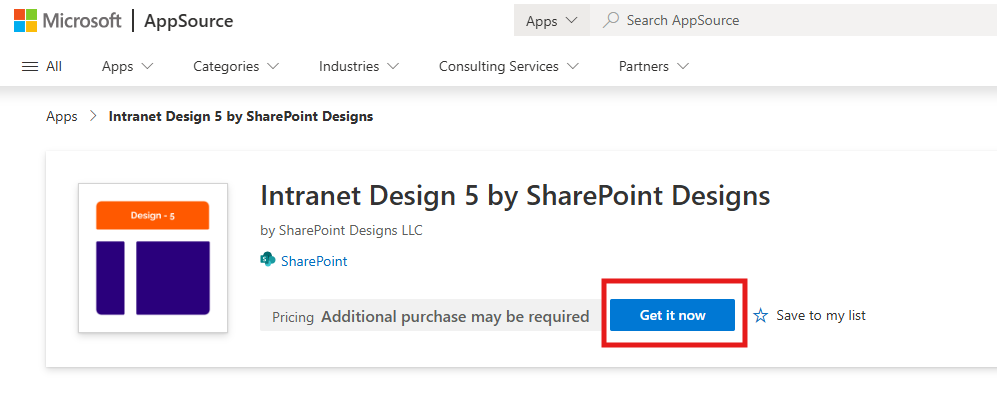
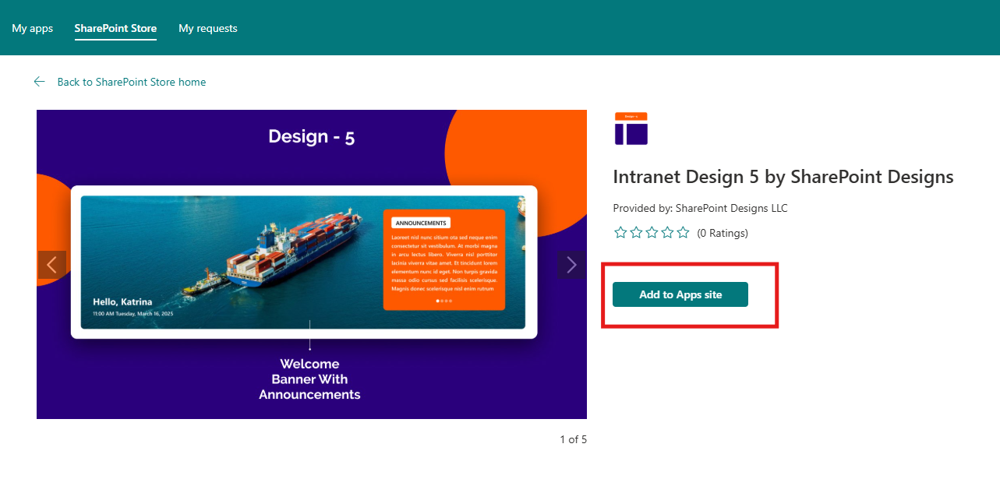
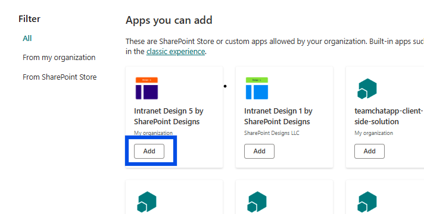
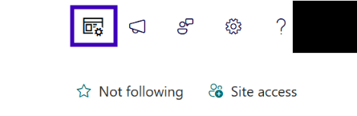
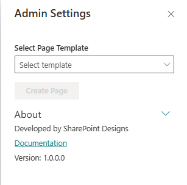

# Installation

## ⚙️ Installation Instructions

| Step | Description                                                                                                                                                                                                                                                                                                                                                                 |
| ---- | --------------------------------------------------------------------------------------------------------------------------------------------------------------------------------------------------------------------------------------------------------------------------------------------------------------------------------------------------------------------------- |
| 1    | Visit the [Intranet Design 5 – SharePoint Designs](https://appsource.microsoft.com/en-us/product/office/WA200008750?tab=Overview) listing on Microsoft AppSource and click **Get it now**.                                                                                                                                      |
| 2    | You will be redirected to the SharePoint Store. Click **Add to Apps Site** to add it to your tenant.  ⚠️ _If you don't have permission, a popup will appear saying "App requires permission approval." A request will be raised, and your tenant administrator needs to approve it before the app can be added._ |
| 3    | Navigate to your modern SharePoint site, click the **Settings (gear)** icon → select **“Add an app”**.                                                                                                                                                                                                                          |
| 4    | Choose **Intranet Design 5 by SharePoint Designs**.                                                                                                                                                                                                                                                                         |
| 5    | Click **Add**.                                                                                                                                                                                                                                                                                                                                                              |
| 6    | Confirm installation by checking under **Site Contents**.                                                                                                                                                                                                                                                              |

---

## 🧪 Testing Instructions

> **Note:** _A free **15-day trial** starts automatically when you apply the template._

### Steps to Test and Apply Template

1. On the SharePoint site, locate the new icon in the top command bar (on the right side of the header bar). This icon opens the design template panel.
   

2. Click the icon to open the Design 5 Logo Settings Panel.  
   

3. In the panel:

   - Select the **"Home Page"** template
   - Click the **Create Page** button  
     

4. Do not close or refresh the browser. A pop-up will appear to create the required lists and libraries:

   - `Quick Links` list
   - `AnnouncementList` list
   - `Welcome Banner` library
   - `Event Flyer` library
     (_Mock items are added automatically for Announcements, News, QuickLinks, and Events._)

5. After the items are created, the site page will **refresh automatically**, and it will continue to creating page and adding webparts.

6. Once setup is complete, a button will appear to open the newly created homepage. Click it to view the result.

   

---

## 🔑 Activating a License Key

> _After your trial ends, a valid license key is required to continue._

### License Activation Steps

| **Step** | **Action**            | **Details / Notes**                                                                                                                                                                                                                |
| -------- | --------------------- | ---------------------------------------------------------------------------------------------------------------------------------------------------------------------------------------------------------------------------------- |
| 1        | Go to the Home page   | Open the SharePoint page where the Design 5 template was applied.                                                                                                                                                                  |
| 2        | Open activation panel | - If trial expired, click the **"Activate"** button from the panel.  - If still active, go to **Edit Page** → open Web Part panel → click **"Activate License"**.  |
| 3        | Launch activation box | Enter your key into the license dialog.                                                                                                                                                              |
| 4        | Click **Get Key**     | You'll be redirected to the license purchase page.                                                                                                                                                                                 |
| 5        | Complete purchase     | A license key will be emailed to you. Check your spam/junk folders.                                                                                                                                                                |
| 6        | Paste and activate    | Return to SharePoint, enter the key, and click **Activate**.                                                                                                                                                                       |

✅ **You're all set! Design 5 is now fully activated.**

---

## ✅ Lists & Libraries Created Automatically

The following resources are provisioned upon applying the **Home** template:

- 📄 **Quick Links** (List)
- 📄 **AnnouncementList** (List)
- 🖼️ **Welcome Banner** (Library)
- 🖼️ **Event Flyer** (Library)

> Mock data is also auto-added for:
>
> - Company & Announcements (Featured News)
> - Quick Links
> - Events

_No manual configuration required._

---

## 🔍 Validate Each Web Part on the Provisioned Page

## HOME PAGE

| **Webpart**                    | **Description**                                                                                             |
| ------------------------------ | ----------------------------------------------------------------------------------------------------------- | --------------------------------------------- | --- |
| **👋 Welcome Banner**          | Personalized greeting with user's name and live date/time. Banner carousel can be configured via a library. |
| **🎥 CEO Video**               | Add a custom video message from leadership. Supports embed and upload.                                      |
| **📰 Company & Announcements** | Combined Featured News section showing company updates and announcements.                                   |
| **📅 Calendar**                | Highlights upcoming events, meetings, or holidays.                                                          |
| **🖼️ Events Flyer**            | Visual spotlight for featured events — static or linked image banner.                                       |
| **📄 Documents**               | List or tile-based document links for easy access.                                                          |
| **🔗 Quick Links**             | Essential tools and links grouped with icons and labels.                                                    |
| <!--                           | **📱 Social Media Highlights**                                                                              | Highlights from your official LinkedIn posts. | --> |

---

## 🧹 Uninstall Guide

To uninstall **DIY Design 5 by SharePoint Designs**:

1. Go to **Site Contents**.
2. Find **Design 5 by SharePoint Designs** in the installed apps list.
3. Click the ellipsis (···) → choose **Remove**.
4. If Classic Experience is prompted, follow it and confirm removal again.

---

## 🛠️ Troubleshooting Common Issues

### ⚠️ Top Bar Icon Not Showing

**Solution**: Make sure the app was added correctly. Refresh your browser or try a hard reload (Ctrl + Shift + R).

### 🗃️ Lists/Library Not Created

**Solution**: Confirm that you selected **"Home"** in the panel and clicked **Apply Template**. Retry if needed.

### 📝 Mock Data Missing

**Solution**: Reapply the template or manually add a few items to test functionality.

---

## 🌟 Best Practices

### 🔁 Content Maintenance

- Update banners, events, and quick links regularly.
- Remove outdated documents and announcements.

### 🎓 User Enablement

- Train content managers on maintaining web parts.
- Provide quick internal docs or video walkthroughs.

### 🔐 Permissions & Governance

- Keep editing rights limited to owners.
- Review user access to ensure data security.

### 🗣️ Collect Feedback

- Add a “Send Feedback” link to improve engagement.
- Use a list to track and act on suggestions.

---

## 🧑‍💼 User Permissions

| **Role**     | **Permissions**                                      |
| ------------ | ---------------------------------------------------- |
| **Owners**   | Full control — manage app, lists, license, settings. |
| **Members**  | Contribute content such as links, documents, events. |
| **Visitors** | Read-only access. General audience viewing.          |

> Stick to the **least privilege principle**. Review permissions regularly.

---

## 🆘 Support

Need help? Contact **SharePoint Designs**:  
🌐 [www.sharepointdesigns.com](http://www.sharepointdesigns.com)  
📧 support@sharepointdesigns.com
