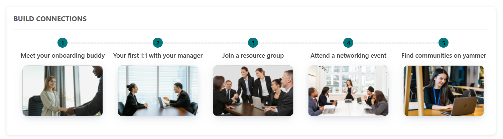

# Configuration

Configuration settings for each web part.

## 👋 1. Announcement

### 📋 Details

- **Personalized Notification**: Shows a warm welcome message tailored to the user's name with date and time info.
- **Warm Introduction Snippet**: Short, effective greeting module to kickstart new users’ day with positivity.
- **Friendly Message Tile**: Vibrant visual welcome designed to make new joiners feel instantly noticed.

---

### 🛠️ Announcement Web Part – Property Pane Configuration

Configuration options are grouped under intuitive sections:

#### 🎨 Appearance Settings

|  |  |  |
| ------------------------------------------- | ------------------------------------------- | ------------------------------------------- |

| Field                | Type         | Default / Example      | Description                                                                  |
| -------------------- | ------------ | ---------------------- | ---------------------------------------------------------------------------- |
| **Welcome Text**     | Textbox      | WELCOME                | Displays a greeting with the current user's first name, above the date/time. |
| **Show Full Name**   | Toggle       | Off                    | If enabled show full name orelse show first name.                            |
| **Date Format**      | Dropdown     | Thursday 19 June, 2025 | Select which date format required for Announcement.                          |
| **Time Format**      | Dropdown     | 12:50 PM               | Select which time format required for Announcement.                          |
| **Text Color**       | Color Picker | #000000                | Customizes the text color for Announcement.                                  |
| **Background Color** | Color Picker | #CCFF39                | Customizes the background color for Announcement.                            |

---

#### ℹ️ About Section

| 🏷️ Name                | 🎯 Purpose                                                        |
| ---------------------- | ----------------------------------------------------------------- |
| **Developer Info**     | Indicates the web part is built by **SharePoint Designs**.        |
| **Documentation Link** | Links to this documentation for easy reference.                   |
| **Activate License**   | Button to activate the licensed or premium version if applicable. |

---

#### 📌 Usage Notes

- Position the announcement at the top of the homepage or dashboard to ensure maximum visibility and create a strong first impression for new employees.
- Tooltip has added for welcome header part if name is too long it will shorthen and show it with (...)
- Ensure adequate contrast for text readability and screen-reader compatibility for user inclusivity.
- Color pickers support Hex, RGB, and Alpha transparency formats.

---

## 2. 🔗 Quick Links

### 📋 Details

- **Essential Resources**: Provide immediate access to frequently used tools and documents.
- **Minimalist Icons**: Use clean icons and labels for straightforward navigation.

---

### List Config

For the **Quick Links** webpart, create a list with the following columns.

#### 📋 Required Columns

| 🏷️ Column Name (Case Sensitive) | 🔣 Column Type | Column Value                                                             |
| ------------------------------- | -------------- | ------------------------------------------------------------------------ |
| **Icon**                        | Image          | Any of the image                                                         |
| **Title**                       | Text           | Any Title for Quick Link                                                 |
| **TargetWindow**                | Choice         | Open in New Window, Open in Same Window (Provide Specified Choice alone) |
| **Link**                        | Hyperlink      | Any URL for Quick Link                                                   |

### 🛠️ Quick Link Web Part – Property Pane Configuration

- The Quick Links web part offers centralized access to frequently used external applications and team tools. It improves efficiency by simplifying access to all essential resources from one place.

#### 🏷️ Header Settings

| Field                  | Type    | Default / Example | Description                                 |
| ---------------------- | ------- | ----------------- | ------------------------------------------- |
| **WebPart Title**      | Textbox | QUICK LINKS       | Title displayed at the top of the web part. |
| **Hide WebPart Title** | Toggle  | Off               | Toggle to show or hide the web part title.  |

#### ⚙️ General Settings

| Field           | Type      | Default / Example | Description                                        |
| --------------- | --------- | ----------------- | -------------------------------------------------- |
| **Select List** | DropDown  | QuickLinks        | Specifies the SharePoint list to pull quick links. |
| **View List**   | Hyperlink | -                 | On Click of it, will redirect to particular list.  |

---

#### 📌 Usage Notes

- Position the Quick Links section prominently on the dashboard to serve as the go-to entry point for frequently accessed tools and resources.
- Each tile should feature a descriptive label and a relevant, professional icon to aid quick recognition and accessibility.
- **WebPart Title** can be Toggled Off to get better UI experience.

---

## 3. 💬 Welcome Message from CEO

### 📋 Details

- A message from the CEO that outlines strategic priorities and encourages unity across the organization.
- Highlights company goals, cultural values, and the importance of teamwork from the CEO’s perspective.

---

### 🛠️ Welcome Message from CEO Web Part – Property Pane Configuration

This web part offers flexible configuration grouped into the following categories:

- **Header Settings**
- **General Settings**
- **Appearance Settings**
- **About**

#### 🏷️ Header Settings

| Field              | Type    | Default / Example        | Description                                 |
| ------------------ | ------- | ------------------------ | ------------------------------------------- |
| **Welcome Header** | Textbox | WELCOME MESSAGE FROM CEO | Title displayed at the top of the web part. |

#### ⚙️ General Settings

| Field           | Type            | Default / Example                 | Description                                     |
| --------------- | --------------- | --------------------------------- | ----------------------------------------------- |
| **People**      | People Picker   | Higher Authority People (Ex. CEO) | Select the People from Organization in the list |
| **Description** | Multi Line Text | I am a strong believer...         | Main body text of the CEO message               |

#### 🎨 Appearance Settings

| Field                     | Type   | Default / Example | Description                          |
| ------------------------- | ------ | ----------------- | ------------------------------------ |
| **Height of the Webpart** | Slider | 355px             | Customize the Height of description. |

---

#### 📌 Usage Notes

- Customize the **Height** to get better UI and it can customized from 200px to 700px.
- ToolTip has added for description content & Webpart Title too.
- On Hover of the Person it will display the team card contains all details about profile.
- On clicking the **Read More** button on the UI, a dialog box will open at the center of the page displaying the complete content in detail.

---

## 4. 👥 Meet The Team

### 📋 Details

👩‍💼 **Subject Matter Experts** Showcase Highlight key team members and their expertise to help employees connect with the right people.

- **Enhanced Visibility**: Showcase SMEs to increase awareness and foster collaboration.
- **Interactive Design**: Optional carousel for dynamic presentation

---

### List Config

For the **Meet The Team** webpart, create a list with the following columns.

#### 📋 Required Columns

| 🏷️ Column Name (Case Sensitive) | 🔣 Column Type  | Column Value                                                             |
| ------------------------------- | --------------- | ------------------------------------------------------------------------ |
| **Role**                        | Text            | Role of the person                                                       |
| **Icon**                        | Image           | Image of the person                                                      |
| **TargetWindow**                | Choice          | Open in New Window, Open in Same Window (Provide Specified Choice alone) |
| **TeamPerson**                  | Person or Group | Person from Organization                                                 |

### 🛠️ Meet The Team Web Part – Property Pane Configuration

#### 🏷️ Header Settings

| Field             | Type    | Default / Example | Description                                 |
| ----------------- | ------- | ----------------- | ------------------------------------------- |
| **WebPart Title** | Textbox | MEET THE TEAM     | Title displayed at the top of the web part. |

#### ⚙️ General Settings

| Field           | Type      | Default / Example | Description                                         |
| --------------- | --------- | ----------------- | --------------------------------------------------- |
| **Select List** | DropDown  | TeamCarousel      | Specifies the SharePoint list to pull teamcarousel. |
| **View List**   | Hyperlink | -                 | On Click of it, will redirect to particular list.   |

---

#### 📌 Usage Notes

- Ensure the **Team Person** column is populated for each team member. This should reference a valid user from your organization directory.
- If the **Role** column is filled, that value will be shown in the UI. If left blank, the role will be auto-fetched from the Team Person's user profile.
- Similarly, if the **Icon** column is filled, that icon will be shown in the UI. If left blank, the profile picture will be automatically retrieved from the Team Person's user profile.
- The **Name** and **Profile Picture** will be automatically retrieved based on the selected Team Person.
- On Hover of the Person it will display the team card contains all details about profile.
- Initial mock data has been added for the current user.

---

## 5. 🌐 Build Connections

### 📋 Details

- The **Build Connections** web part is designed to help new employees quickly connect with key individuals across the organization.
- It highlights colleagues they may want to reach out to during their onboarding journey — such as buddies, mentors, team leads, or cross-functional collaborators.

---

### List Config

For the **Build Connections** webpart, create a list with the following columns.

#### 📋 Required Columns

| 🏷️ Column Name (Case Sensitive) | 🔣 Column Type | Column Value                                                             |
| ------------------------------- | -------------- | ------------------------------------------------------------------------ |
| **Title**                       | Text           | Any Title for build connections                                          |
| **Icon**                        | Image          | Image for build connections                                              |
| **TargetWindow**                | Choice         | Open in New Window, Open in Same Window (Provide Specified Choice alone) |
| **Link**                        | Hyperlink      | Any URL for Quick Build COnnections                                      |

### 🛠️ Build Connections Web Part – Property Pane Configuration

|  |  |  |
| -------------------------------------------------- | --------------------------------------------------- | --------------------------------------------------- |

#### 🏷️ Header Settings

| Field             | Type    | Default / Example | Description                                 |
| ----------------- | ------- | ----------------- | ------------------------------------------- |
| **WebPart Title** | Textbox | BUILD CONNECTIONS | Title displayed at the top of the web part. |

#### ⚙️ General Settings

| Field           | Type      | Default / Example | Description                                             |
| --------------- | --------- | ----------------- | ------------------------------------------------------- |
| **Select List** | DropDown  | BuildConnections  | Specifies the SharePoint list to pull buildConnections. |
| **View List**   | Hyperlink | -                 | On Click of it, will redirect to particular list.       |

#### 🎨 Appearance Settings

| Field                              | Type         | Default / Example | Description                                          |
| ---------------------------------- | ------------ | ----------------- | ---------------------------------------------------- |
| **Layout Type**                    | Dropdown     | Carousel          | Controls how content is visually displayed.          |
| **Items to display**               | Slider       | 5                 | Customize the items to display in build connections. |
| **Background Color of the Circle** | Color Picker | #CCFF39         | Customize the background color of the circle.        |
| **Text Color of the Circle**       | Color Picker | #0000000          | Customize the Text Color of the circle.              |

---

#### 📌 Usage Notes

- By default, mock data is shown with 5 sample items if no list is connected.
- If the connected list contains more than 5 items, the carousel view is automatically enabled.
- The **Items to display** slider allows customization between 5 to 10 items. The default is 5.
- If 5 or fewer items are selected to display, the carousel will not be enabled and a static layout is shown.
- If the **Icon** column contains an image, it will be displayed in the UI instead of the user's mock data.

---

## 6. 📽️ Training Videos

### 📋 Details

- The **Training Video** web part helps streamline employee onboarding by embedding essential training materials directly into the SharePoint experience.
- It supports various video sources to ensure new hires can access learning content quickly and efficiently.
- Horizontal Carousel Navigation allows users to browse through available documents using left and right arrows.

---

### List Config

For the **Training Video** webpart, create a library with the following columns.

#### 📋 Required Columns

| 🏷️ Column Name (Case Sensitive) | 🔣 Column Type | Column Value                    |
| ------------------------------- | -------------- | ------------------------------- |
| **TargetWindow**                | Choice         | Open in New Window, Open in Same Window (Provide Specified Choice alone) |

### 🛠️ Training Videos Web Part – Property Pane Configuration

Configure the Training Videos web part using the following options:

|  |  |  |
| --------------------------------------------- | --------------------------------------------- | --------------------------------------------- |

#### 🏷️ Header Settings

| Field                  | Type    | Default / Example | Description                                       |
| ---------------------- | ------- | ----------------- | ------------------------------------------------- |
| **Show Webpart Title** | Toggle  | Yes               | Toggle switch to show or hide the web part title. |
| **Title**              | TextBox | TRAINING VIDEOS   | Text field to define the web part name.           |

### ⚙️ General Settings

| Field                | Type     | Default / Example               | Description                                                                                                     |
| -------------------- | -------- | ------------------------------- | --------------------------------------------------------------------------------------------------------------- |
| **Source**           | Dropdown | A document library on this site | Choose which SharePoint document library to display. By default, "A document library on this site" is selected. |
| **Select a Library** | Dropdown | TrainingVideo                   | Dropdown to choose a library from the site                                                                      |
| **Folder Name**      | Text     | (Blank)                         | Optionally enter a folder path to display only files from a specific folder.                                    |

### 🎨 Appearance Settings

| Field                 | Type     | Default / Example | Description                                 |
| --------------------- | -------- | ----------------- | ------------------------------------------- |
| **Layout Type**       | Dropdown | Film Strip        | Controls how content is visually displayed. |
| **Enable Borders**    | Toggle   | On                | Toggle to show/hide borders around items    |
| **Show See All**      | Toggle   | Off               | Toggle to display a "See All" link          |
| **Show thumbnail**    | Toggle   | On                | Toggle to display file previews             |
| **Show Folder Name**  | Toggle   | Off               | Toggle to display folder names              |
| **Show Author**       | Toggle   | Off               | Toggle to show the file creator             |
| **Slides per View**   | Slider   | 4                 | Number of items shown per slide             |
| **See All Link**      | Text     | (Blank)           | Custom URL for "See All" button             |
| **Enable Navigation** | Toggle   | On                | Toggle to enable left/right carousel arrows |
| **Enable Pagination** | Toggle   | Off               | Toggle to enable pagination controls        |

---

#### 📌 Usage Notes

- By default, the web part displays the **TrainingVideo** library, but you can select any available document library on your site.
- You can filter to a specific folder by entering its path in the Folder field (use "/" for nested folders).
- Select a custom view to display files as needed, and adjust the size and command bar visibility to match your page layout and user needs.
- The "See All" link provides quick access to the full document library.
- Always click Apply in the property pane after making changes to ensure your configuration is saved and visible.

---

## 7. 🗂️ Important Documents

### 📋 Details

- **Important Documents** Web Part displays documents in a row view layout.
- Vertical scroll allows users to browse through available documents.

---

### List Config

For the **Important Documents** webpart, create a library with the following columns.

#### 📋 Required Columns

| 🏷️ Column Name (Case Sensitive) | 🔣 Column Type | Column Value                    |
| ------------------------------- | -------------- | ------------------------------- |
| **TargetWindow**                | Choice         | Open in New Window, Open in Same Window (Provide Specified Choice alone) |

### 🛠️ Important Documents Web Part – Property Pane Configuration

Configure the Important Documents web part using the following options:

|  |  |  |
| ------------------------------------- | ------------------------------------- | ------------------------------------- |

#### 🏷️ Header Settings

| Field                  | Type    | Default / Example | Description                                       |
| ---------------------- | ------- | ----------------- | ------------------------------------------------- |
| **Show Webpart Title** | Toggle  | Yes               | Toggle switch to show or hide the web part title. |
| **Title**              | TextBox | Documents         | Text field to define the web part name.           |

### ⚙️ General Settings

| Field                | Type     | Default / Example               | Description                                                                                                     |
| -------------------- | -------- | ------------------------------- | --------------------------------------------------------------------------------------------------------------- |
| **Source**           | Dropdown | A document library on this site | Choose which SharePoint document library to display. By default, "A document library on this site" is selected. |
| **Select a Library** | Dropdown | Important Documents             | Dropdown to choose a library from the site                                                                      |
| **Folder Name**      | Text     | (Blank)                         | Optionally enter a folder path to display only files from a specific folder.                                    |

### 🎨 Appearance Settings

| Field                          | Type     | Default / Example | Description                                                       |
| ------------------------------ | -------- | ----------------- | ----------------------------------------------------------------- |
| **Layout Type**                | Dropdown | Row View          | Controls how content is visually displayed.                       |
| **Enable Borders**             | Toggle   | On                | Toggle to show/hide borders around items                          |
| **Show See All**               | Toggle   | Off               | Toggle to display a "See All" link                                |
| **Show thumbnail**             | Toggle   | On                | Toggle to display file previews                                   |
| **Show Folder Name**           | Toggle   | Off               | Toggle to display folder names                                    |
| **Show Author**                | Toggle   | Off               | Toggle to show the file creator                                   |
| **Slides per View**            | Slider   | 4                 | Number of items shown per slide                                   |
| **See All Link**               | Text     | (Blank)           | Custom URL for "See All" button                                   |
| **Enable Navigation**          | Toggle   | On                | Toggle to enable left/right carousel arrows                       |
| **Enable Pagination**          | Toggle   | Off               | Toggle to enable pagination controls                              |
| **Height of the container**    | Slider   | 300px             | Customize the Height of Documents container to disbale the scroll |
| **Number of items to display** | Slider   | 4                 | Customize the number of documents to show                         |

---

#### 📌 Usage Notes

- By default, the web part displays the **ImportantDocuments** library, but you can select any available document library on your site.
- You can filter to a specific folder by entering its path in the Folder field (use "/" for nested folders).
- Select a custom view to display files as needed, and adjust the size and command bar visibility to match your page layout and user needs.
- The "See All" link provides quick access to the full document library.
- Always click Apply in the property pane after making changes to ensure your configuration is saved and visible.
- You can Customize the Height of the container to override the scroll.

---

## 8. ❓FAQs

### 📋 Details

Provide a centralized knowledge base for commonly asked questions:

- **Self-Help Portal**: Easily accessible answers to frequent employee or customer inquiries.
- **Smart Navigation**: Expandable accordion format lets users drill down into topics with ease.

---

### List Config

For the **FAQ** webpart, create a list with the following columns.

#### 📋 Required Columns

| 🏷️ Column Name (Case Sensitive) | 🔣 Column Type         | Column Value         |
| ------------------------------- | ---------------------- | -------------------- |
| **FaqQuestion**                 | Text                   | Any Question for FAQ |
| **FaqAnswer**                   | Multiple lines of Text | Any Answer for FAQ   |

### 🛠️ FAQ Web Part – Property Pane Configuration

Configure the FAQ web part using the following options:

|  |  |
| ------------------------- | ------------------------- |

#### 🏷️ Header Settings

| Field             | Type    | Default / Example | Description                             |
| ----------------- | ------- | ----------------- | --------------------------------------- |
| **WebPart Title** | TextBox | FAQ's             | Text field to define the web part name. |

#### ⚙️ General Settings

| Field           | Type      | Default / Example | Description                                             |
| --------------- | --------- | ----------------- | ------------------------------------------------------- |
| **Select List** | DropDown  | BuildConnections  | Specifies the SharePoint list to pull buildConnections. |
| **View List**   | Hyperlink | -                 | On Click of it, will redirect to particular list.       |

### 🎨 Appearance Settings

| Field                       | Type   | Default / Example | Description                                                       |
| --------------------------- | ------ | ----------------- | ----------------------------------------------------------------- |
| **Show 'See All Link'**     | Toggle | Off               | Toggle to display a "See All" link                                |
| **See All Link URL**        | Text   | (Blank)           | Custom URL for "See All" button                                   |
| **Height of the container** | Slider | 310px             | Customize the Height of Documents container to disbale the scroll |
| **Items to display**        | Slider | 5                 | Customize the items to display in build connections.              |

#### 📌 Usage Notes

- You can Customize the Height of the container to override the scroll.
- View List link provides quicker access to list
