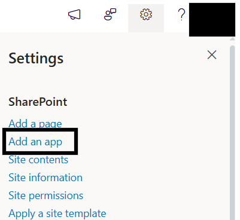

# Installation

## ⚙️ Installation Instructions

- Upload the `spd-employeeonboarding.sppkg` file to your App Catalog
- Navigate to your modern SharePoint site.
- Click the **Settings (gear)** icon → Select **“Add an app”**

  

- Choose **Employee Onboarding by SharePoint Designs**

  

- Click **Add**
- After installation, go to **Site Contents** to confirm it's added to the site.

  

---

## 🧪 Testing Instructions

> **Note:** _Upon adding the web part to the page, a **free 15-day trial** will start automatically._

## Steps to Test and Apply Template

1. On the SharePoint site, locate the new icon in the top command bar (on the right side of the header bar). This icon opens the design template panel.

   

2. Click the icon to open the Employee Onboarding extension side panel.

   

3. In the panel:

   - Select the **"Home Page"** template
   - Check the checkbox of **Full Site Setup**
   - Click the **Create Page** button

     

4. Do not close or refresh the browser. A pop-up will appear to create the required lists and libraries:

- `Quick Links` list
- `Team Carousel` list
- `Build Connections` list
- `FaqOnboarding` list
- `Training Video` library
- `Important Documents` library
  (_Mock items are added automatically for every list._)

5. After the items are created, the site page will **refresh automatically**, and it will continue to creating page and adding webparts.
6. Once setup is complete, a button will appear to open the newly created homepage. Click it to view the result.

   

7. Click the extension icon again and repeat the procedure: select the **Home Page**, check the **Full Site Setup** checkbox, and click the **Create Page** button. This will open a dialog box with the following details:

   

- Clicking **Yes** will delete the existing data from the lists and libraries in the site, and recreate them with mock data.
- Clicking **No** will create a new page and add only the web parts, along with mock data, without affecting existing lists or libraries.
---

## 🔑 Activating a License Key

> _Once your free trial ends, you'll need a license key to continue using the app._

### License Activation Steps

| **Step** | **Action**                 | **Details / Notes**                                                                                                                                                                                                                                                                                           |
| -------- | -------------------------- | ------------------------------------------------------------------------------------------------------------------------------------------------------------------------------------------------------------------------------------------------------------------------------------------------------------- |
| 1        | Go to the app page         | Navigate to the SharePoint page where the Employee Onboarding was installed.                                                                                                                                                                                                                                  |
| 2        | Open activation panel      | - If the trial**has expired**, you'll see an **"Activate"** button on the app — click it.  - If the trial **is still active** and you want to activate it, edit the page → open the **Web Part property panel** → click **"Activate License"**.  |
| 3        | Launch activation dialog   | A dialog box will appear prompting for a key.                                                                                                                                                                                                                                    |
| 4        | Click **Get Key**          | In the license dialog, click **Get Key** — this will take you to the payment page in a new tab.                                                                                                                                                                                                                |
| 5        | Purchase the license       | Complete the payment process. Once done, you’ll receive a license key via email. Be sure to check your spam/junk folder if you don't see it.                                                                                                                                                                  |
| 6        | Enter and activate the key | Go back to the SharePoint page, paste the license key into the dialog box, and **Activate** with license key for complete activation.                                                                                                                                                                          |

✅ **You're all set! Employee Onboarding is now fully activated**

---

### ✅ Expected Behaviour

The following resources are provisioned upon applying the Home template:

- 📄 **Quick Links** (List)
- 📄 **Team Carousel** (List)
- 📄 **Build Connections** (List)
- 📄 **Faq Onboarding** (List)
- 🖼️ **Training Video** (Library)
- 🖼️ **Important Documents** (Library)

> Mock data is also auto-added for:
>
> - Quick Links
> - Team Carousel(Current User data)
> - Faq Onboarding

> **No manual configuration required after clicking the Create Page button.**

---

## 🔍 Validate Each Web Part on the Provisioned Page

## HOME PAGE

| **Webpart**                     | **Description**                                                                                                                                                                                                                                                                  |
| ------------------------------- | -------------------------------------------------------------------------------------------------------------------------------------------------------------------------------------------------------------------------------------------------------------------------------- |
| **👋 Announcement**             | -**Personalized Announcement**: Greets new users with name and time, adding a personal touch to the digital workplace. |
| **🔗 Quick Links**              | - **Quick Reference Panel**: Offers shortcuts to essential onboarding and operational resources.  - **Operational Essentials**: Connects users with vital tools for HR, Finance, Company Policies and more.  |
| **💬 Welcome Message from CEO** | - **Leadership Introduction**: A message from the CEO that outlines strategic priorities and encourages unity across the organization.  - **Vision-Driven Address**: Highlights company goals, cultural values, and the importance of teamwork from the CEO’s perspective.  |
| **👥 Meet The Team**            | - **Team Overview Panel**: Presents key team members with roles and communication options to foster accessibility.  - **Department Contacts**: Empowers collaboration by making it easy to identify and reach department representatives.   |
| **🌠Build Connections**        | - **Guided Social Interaction**: Helps new employees build meaningful connections through structured interactions and touchpoints.  - **Scheduled Interaction Touchpoints**: Strategically placed activities that enhance familiarity with team members and company culture. |
| **📽️ Training Videos**          | - **Interactive Video Library**: Offers visual learning modules to reinforce company procedures and best practices.  - **Guided Orientation Videos**: Walkthroughs that introduce employees to platforms, culture, and operational essentials.                              |
| **🗂️ Important Documents**      | - **Centralized Document Hub**:Quick access to key company documents including policies, reports, and reference files.  - **Document Quick View**: Displays edit history to ensure employees are referencing the most current version.                                      |
| **❓FAQs**                      | - **Self-Help Portal**: Easily accessible answers to frequent employee or customer inquiries.  - **Smart Navigation**: Expandable accordion format lets users drill down into topics with ease.                                                                             |

## 🧹 Uninstall Guide

Follow the steps below to uninstall the **Employee Onboarding by SharePoint Designs** app from your SharePoint site:

1. Go to your SharePoint site and click on **Site Contents** from the left side navigation or the settings menu.
2. Find **Employee Onboarding by SharePoint Designs** in the list of installed apps.
3. Click the three dots (···) next to the app name and select **"Remove"**.
4. If prompted to switch to the **Classic Experience**, follow the prompt to proceed.
5. In the Classic Experience, hover over the app again, click the three dots (···), and then click **Remove** to finalize the uninstallation.

---

## 🛠️ Troubleshooting Common Issues

### ⚠️ Issue: Web Part Not Displaying Correctly

**Solution**: Ensure that the web part has been added to a modern SharePoint page and that the page has been republished. Check for any missing permissions that might be required for the web part to function correctly.

### 🗃️ Issue: Lists/Library Not Created

**Solution**: Verify that the **"Create Page"** button was clicked after adding the **"Onboarding Employee Setup"**. If the lists/Library are still not created, delete the page and reapply the design.

### 📝 Issue: Missing Demo Items

**Solution**: Check if the lists items are present in the Site Contents. If the lists are empty, manually add demo items or reapply the design.

---

## 🌟 Best Practices

### 🔁 Regular Updates

- **Keep Content Fresh**: Regularly update the content on your SharePoint site to keep it relevant and engaging.
- **Monitor Performance**: Regularly check the performance of your SharePoint site and make necessary adjustments to improve speed and user experience.

### 🎓 User Training

- **Provide Training**: Offer training sessions for users to help them understand how to use the SharePoint site effectively.
- **Create Documentation**: Develop comprehensive documentation to guide users on how to navigate and use the site.

### 🔐 Security Measures

- **Implement Security Protocols**: Ensure that proper security measures are in place to protect sensitive information.
- **Regular Audits**: Conduct regular security audits to identify and address potential vulnerabilities.

### 🗣️ User Feedback

- **Collect Feedback**: Regularly collect feedback from users to understand their needs and improve the site accordingly.
- **Act on Feedback**: Implement changes based on user feedback to enhance the overall user experience.

### 🤝 Collaboration

- **Encourage Collaboration**: Promote collaboration among team members by providing tools and features that facilitate communication and teamwork.
- **Use SharePoint Features**: Utilize SharePoint features such as document libraries, lists, and workflows to streamline collaboration and improve productivity.

---

## 🧑‍💼 User Permissions

| **Role**     | **Permissions**                                      |
| ------------ | ---------------------------------------------------- |
| **Owners**   | Full control — manage app, lists, license, settings. |
| **Members**  | Contribute content such as links, documents, events. |
| **Visitors** | Read-only access. General audience viewing.          |

> Stick to the **least privilege principle**. Review permissions regularly.

---

## 🆘 Support

Please contact **SharePoint Designs**
🌐 [www.sharepointdesigns.com](http://www.sharepointdesigns.com)
📧 support@sharepointdesigns.com
