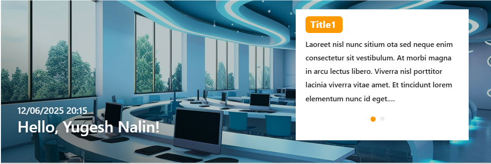
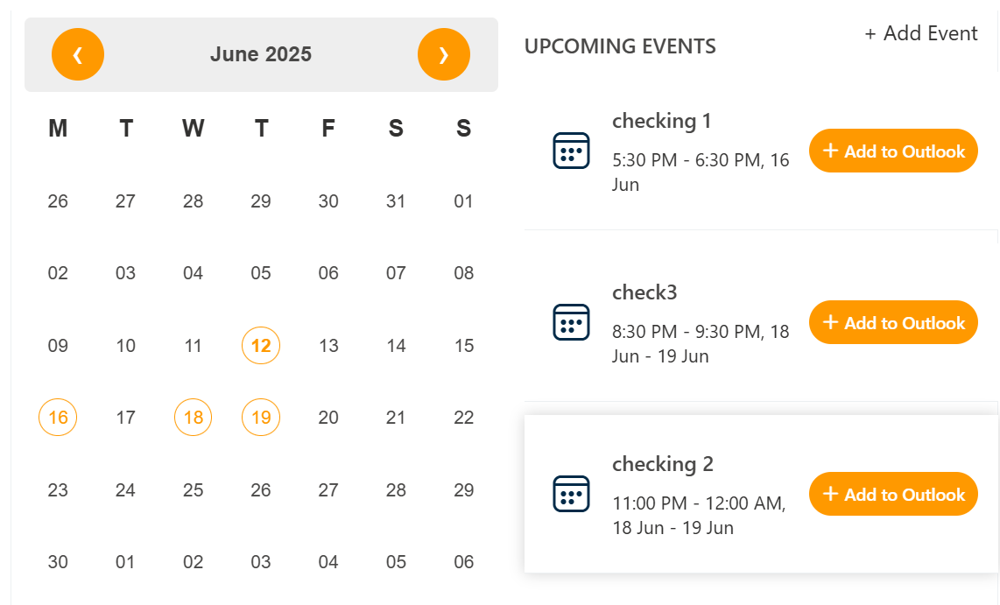

### Note:

The Home page should be configured using the "Free Template" extention to ensure that the required lists and libraries are created automatically. Without this configuration, users will need to manually create dedicated lists or libraries for the respective web parts.

## 📰 1. News Carousel

### 🚀️PREREQUISITE

For News section, create News Page in your SharePoint Site and publish it.
Make sure to include banner image and title for the newspage.
**No LIST** is needed!

### 📋 Details

- **Central Updates**: Keep everyone informed with company news.
- **Professional Display**: Present announcements/department news clearly and formally.
- **Structured Layout**: Organized sections for each department.

### 🏷️ Features News Carousel Web Part – Property Pane Configuration

📸 View Property Pane Screenshots

  

#### 📌 **Header Settings**

| 🏷️ Name             | 🎯 Purpose                                   | 💡 Select Option |
| ------------------- | -------------------------------------------- | ---------------- |
| WebPart Title       | Title displayed for the web part             | News             |
| Hide WebPart Title  | Toggle to show or hide the WebPart title     | Show/Hide        |
| Show See all button | Toggle to show or hide the See all button    | On/Off           |
| See All link        | If exists,enter custom news sites collection |                  |

---

#### 🎨 Appearance Settings

| 🏷️ Name                  | 🎯 Purpose                         | 💡 Select Option |
| :----------------------- | ---------------------------------- | ---------------- |
| Carousel Height(px)      | Set the height of the carousel     | 350              |
| Banner Image height (px) | Set the height of the banner image | 300              |

---

#### ⚙️ General Settings

|          🏷️ Name           | 🎯 Purpose                                                           | 💡 Select Option           |
| :------------------------: | -------------------------------------------------------------------- | -------------------------- |
| No. of news items to fetch | Set how many news pages you want to de displayed in the carosuel.    | 5                          |
|       Filer by Date        | Select how you want to filter the News pages.                        | This Month, This week, All |
|         Auto Play          | Enable / Disable the autoplay  of carousel                 | Enables/Disabled           |
|     AutoPlay duration      | Set the time (in seconds) at when it must  shuffle through | 2                          |

---

#### 📄 About

Links to Documentation of the WebPart.

## 🚨 2. New Associates

### 📋 Details

- **Interactive Welcome**: Showcases newly joined employees to foster a welcoming environment.
- **Send Greetings**: Includes a "Send Greetings" button that opens Outlook, thus improving team interaction.

### List Config

For the **New Associate** webpart, create a list with the following columns.

#### 📋 Required Columns

| 🏷️ Column Name (Case Sensitive) | 🔣 Column Type |
| ------------------------------- | -------------- |
| **Associate**                   | Person group   |
| **DateOfJoin**                  | Datetime       |

> Note:Include an image if the email of the person does not exist in the directory in the attachment column (a default column in SharePoint)

### 🏷️ New Associate Web Part – Property Pane Configuration

📸 View Property Pane Screenshots

#### 📌 **Header Settings**

| 🏷️ Name           | 🎯 Purpose                               | 💡 Select Option |
| ----------------- | ---------------------------------------- | ---------------- |
| WebPart Title     | Title displayed for the web part         | New Associate    |
| Header Visibility | Toggle to show or hide the WebPart title | Show/Hide        |

---

#### 🎨 Appearance Settings

| 🏷️ Name                    | 🎯 Purpose                                                                     |     💡 Select Option      |
| -------------------------- | ------------------------------------------------------------------------------ | :-----------------------: |
| Filter by Date             | Filter the new joinees by Date                                                 |  This week / This Month   |
| Enable Autoplay            | Enable or Display Autoplay                                                     | Autoplay On/ Autoplay Off |
| Autoplay Duration(seconds) | Set the time (in seconds) at when it must  shuffle through the data. |             3             |

---

#### ⚙️ General Settings

| 🏷️ Name              | 🎯 Purpose                             | 💡 Select Option |
| -------------------- | -------------------------------------- | ---------------- |
| Select List          | Select the list to fetch data from     | NewAssociates    |
| Add/Update list item | Directly add/ update items in the list |                  |

---

#### 📄 About

Links to Documentation of the WebPart.

## 🌼 3. Holiday

### 📋 Details

- **Global Calendar View**: Displays national and regional holidays relevant to company and its clients.
- **Location Filtering**: Filters holidays based on the user's selected region

### List Config

Note: For the **Holiday** webpart, create a list with the following columns.

#### 📋 Required Columns

| 🏷️ Column Name (Case Sensitive) |   🔣 Column Type    | 💡 Option       |
| ------------------------------- | :-----------------: | --------------- |
| Title                           |        Text         |                 |
| Country                         |       Choice        | Countries Names |
| StartDate                       |     DateandTime     |                 |
| Description                     | Single line of text |                 |
| HolidayLink                     |      Hyperlink      |                 |

### 🏷️ Holiday Web Part – Property Pane Configuration

📸 View Property Pane Screenshots

 

#### 📌 Header Settings

|      🏷️ Name       | 🎯 Purpose                       | 💡 Select Option   |
| :----------------: | -------------------------------- | ------------------ |
|   Web Part Title   | Title displayed for the web part | Holiday Highlights |
| Hide WebPart Title | Control the visibility of Header | Show/Hide          |

---

#### 🎨 Appearance Settings

| 🏷️ Name                         | 🎯 Purpose                                                     | 💡 Select Option |
| ------------------------------- | -------------------------------------------------------------- | ---------------- |
| Filter Holidays                 | Select how you want to filter data                             |                  |
| Show bullets                    | Show or hide the bullets                                       | On/Off           |
| Show Border                     | Show or hide the border                                        | On/Off           |
| No. of holidays to display | Select the number of holiday items to show in the webpart | 4                |

---

#### ⚙️ General Settings

| 🏷️ Name              | 🎯 Purpose                             | 💡 Select Option |
| -------------------- | -------------------------------------- | ---------------- |
| Select Holiday List  | Select the list to fetch data from     | Holidays         |
| Add/Update list Item | Directly update/ add items to the list |                  |

---

#### 📄 About

Links to Documentation of the WebPart.

## 👥 4. Announcement Banner

### 📋 Details

Easily browse and discover employee information across the organization:

- **Dynamic Welcome Banner** : Display a personalized greeting and current date/time to users, with a customizable background image.
- **Rotating Announcements** : Highlight key news or messages using an auto-rotating carousel that cycles through announcements.

### List Config

Note: For the **Announcement Banner** webpart, create a list with the following columns.

#### 📋 Required Columns

| 🏷️ Column Name (Case Sensitive) | 🔣 Column Type |
| ------------------------------- | -------------- |
| **Title**                       | Text           |
| **Description**                 | Text           |

### 🏷️ WelcomeBanner – Property Pane Configurations

📸 View Property Pane Screenshots

#### 📌 Header Settings

| 🏷️ Name                          | 🎯 Purpose                                                                           | 💡 Select Option |
| :------------------------------- | ------------------------------------------------------------------------------------ | ---------------- |
| Date&time Format                 | Choose the display format for date and time (e.g.,`en-GB-24`, `en-US-12`, `iso-24`). | Dropdown         |
| Date & Name   Position | Set vertical position (bottom %) of the date and greeting section.                   | Range Slider     |

#### ⚙️ General Settings

| 🏷️ Name                | 🎯 Purpose                               | 💡 Select Option  |
| ---------------------- | ---------------------------------------- | ----------------- |
| Select List            | Select the SharePoint list               | List Picker       |
| Auto Rotate            | Enables Automatic Cycling                | On / Off          |
| Carousel Duration      | Set the time interval of transition      | Range Slider      |
| Overlay Enabled        | dark overlay to improve text readability | On/Off   |
| Banner Height (px)     | Set banner height in pixels              | Range Slider      |
| Show Announcement card | Enables Announcement card                | On / Off          |

## 📰 5. Quick Links

### 📋 Details

Integrate external news sources directly into your intranet for broader visibility:

- **Customizable Links**: Add titles, URLs, icons.
- **Grouped Layout**: Organize links by categories.
- **Message Feedback**: Display helpful messages for configuration issues.

### 🏷️ Quick Link Web Part – Property Pane Configuration

- 

### List Config

Note: For the **Quick Links** webpart, create a list with the following columns.

#### 📋 Required Columns

| 🏷️ Column Name (Case Sensitive) | 🔣 Column Type |
| ------------------------------- | -------------- |
| **Title**                       | Text           |
| **IconName**                    | Text           |
| **LinkUrl**                     | Hyperlink      |
| **OpenInNewTab**                | Yes / No       |

## 🏷️ Quick Links – Property Pane Configurations

📸 View Property Pane Screenshots

#### 📌Appearance Settings

| 🏷️ Name | 🎯 Purpose                            | 💡 Select Option |
| ------- | ------------------------------------- | ---------------- |
| Layout  | Enter a custom title for the web part | Text input       |
| icon    | Enabling icon to show or hide         | On / Off         |

---

#### ⚙️ General Settings

| 🏷️ Name        | 🎯 Purpose                 | 💡 Select Option      |
| -------------- | -------------------------- | --------------------- |
| Max Links      | Number of Links to display | Slider / Number input |
| Webpart Height | Increasing the Height      | Slider / Number input |

---

## 📅 6. Events Calendar

### 📋 Details

Keep everyone updated with key organizational dates and activities:

- **Event Calendar**: Displays company meetings, events, holidays, and other important dates.
- **Detailed Info**: Includes date, time, location, and other essential details for each event.

### 🏷️ Events Calendar Web Part – Property Pane Configuration

📸 View Property Pane Screenshots

#### ⚙️ Configuration Options

#### Calendar List

| 🏷️ Name       | 🎯 Purpose                                              | 💡 Notes |
| ------------- | ------------------------------------------------------- | -------- |
| Calendar List | Quick access to the connected SharePoint**Events list** |          |

#### View Configurations

| 🏷️ Name       | 🎯 Purpose                                                                                                                                                                                                                                                                                                                                                                                                          |            💡 Notes            |
| ------------- | ------------------------------------------------------------------------------------------------------------------------------------------------------------------------------------------------------------------------------------------------------------------------------------------------------------------------------------------------------------------------------------------------------------------- | :----------------------------: |
| Webpart Title | Customize the title appearing above the calendar                                                                                                                                                                                                                                                                                                                                                                    |           Text input           |
| Select a List | Choose the**events list** from the dropdown to display event data                                                                                                                                                                                                                                                                                                                                                   |            Dropdown            |
| Filter Events | Note: If the filter option is set to "Upcoming Events", both the calendar and the events section will display only upcoming events.If the filter option is set to "Previous 3 months + Upcoming Events", the calendar will show both past (from the last 3 months) and upcoming events, while the events section will continue to display only upcoming events.Dropdown to filter event types shown in the web part | Dropdown months filter options |
| Show Calendar | Toggle to show or hide the visual calendar interface                                                                                                                                                                                                                                                                                                                                                                |            On / Off            |
| View All URL  | Link to full events listing page  Default: `{siteUrl}/_layouts/15/Events.aspx?ListGuid={listID}`                                                                                                                                                                                                                                                                                                                |           URL input            |
|               |                                                                                                                                                                                                                                                                                                                                                                                                                     |                                |

#### Event Configurations

| 🏷️ Name       | 🎯 Purpose                           | 💡 Notes      |
| ------------- | ------------------------------------ | ------------- |
| Add New Event | Opens form to add new event          | Button / Link |
| Edit Events   | Redirects to events list for editing | Button / Link |
