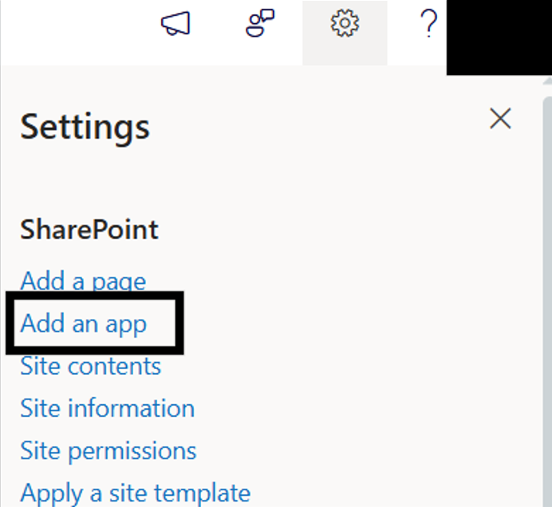
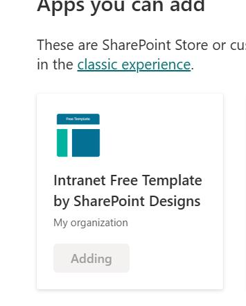
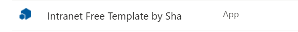
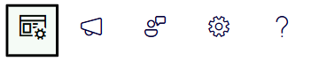
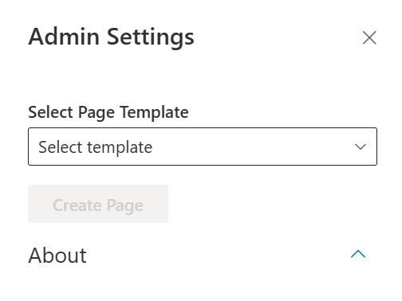
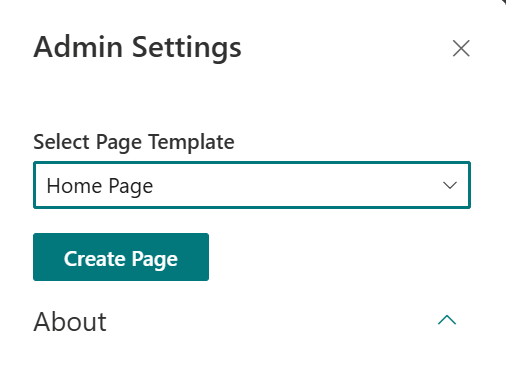
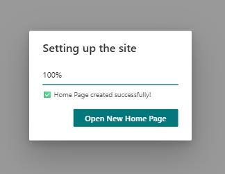

## ⚙️ Installation Instructions

1. Upload the `free-template.sppkg` file to your **App Catalog** .
2. Navigate to your modern SharePoint site.
3. Click the **Settings icon** --> Select **“Add an app”**.

4. Choose the **Free Template by SharePoint Designs**

5. Click **Add**
6. Confirm the installation by checking your **Site Contents**. The app must be included as _App_

## 🧪 Testing Instructions

### ➕ Add the Free Template Site Setup Web Part

1. Go to any modern SharePoint site, click on **Extention** icon. _(Please refer to the image below)_

   

2. When clicked, a side bar with options to **Select Page Template** will appear

   

3. Click on **Home Page** option from the dropdown list like so:

   

4. **Do not close** or **refresh** the browser. A pop-up will appear to create required lists:

   - `Announcement List` list
   - `Quick Links` list
   - `Events` list
   - `Holidays` list
   - `NewAssociates` list

5. After the items are created, the site page will **refresh automatically** , and it will continue to create the page with sections and webparts.
6. Once selected your site page will be ready to use!

   

---

### ✅ Expected Behaviour

A new homepage will be created as per this design:
🔗 [Home Page Design](https://www.sharepointdesigns.com/diy-intranet-designs)

**Automatically Created Lists (pre-filled with mock data):**

| List Name         | Purpose                    |
| :---------------- | -------------------------- |
| Announcement List | Company wide Announcements |
| Quick Links       | Shortcut to key resources  |
| Events            | Event to be shown          |
| Holidays          | Holiday Details            |
| NewAssociates     | Associate Details          |

> ✅ No manual configuration needed after applying the template.

> Note: In NewAssociates list only the columns will be configured, please include the data from the company's directory in the list. Include an image if the email of the person does not exist in the directory in the attachment column (a default column in SharePoint)

---

## 🔍 Validate Each Web Part on the Provisioned Page

| Web Part               | Description                                                |
| ---------------------- | ---------------------------------------------------------- |
| **🚩 Welcome Banner**  | Displays personalized welcome banner to users              |
| **🚨 News**            | Displays recent company news for easy access               |
| **🔗 Quick Links**     | Easy access to essential tools with icons                  |
| **👥 New Associates**  | Showcases newly joined employees                           |
| **📅 Events Calendar** | Highlights upcoming events, meetings, and important dates. |
| **🎈Holiday**          | Lists national holidays with location-based filtering      |

---

## 🧹 Uninstall Guide

| Step | Instruction                                                             |
| ---- | ----------------------------------------------------------------------- |
| 1    | Go to**Site Contents** in your SharePoint site.                         |
| 2    | Find**Intranet Free Template by SharePoint Designs**.                   |
| 3    | Click`···` next to the app and select **"Remove"**.                     |
| 4    | If prompted, switch to**Classic Experience**.                           |
| 5    | Hover over the app, click`···`, then click **Remove** again to confirm. |

---

## 🛠️ Troubleshooting Common Issues

| Issue                      | Description              | Solution                                                                      |
| :------------------------- | ------------------------ | ----------------------------------------------------------------------------- |
| ⚠️ Web Part Not Displaying | Web part missing on page | Ensure it is added to a modern page and republished                           |
| 🗃️ Lists Not Created       | Lists missing            | Ensure the**"Apply template"** button was clicked. If not, reapply the design |
| 📝 Missing Demo Items      | Lists are empty          | Check if lists exist. If so, reapply the design or add demo items manually    |

---

## 🌟 Best Practices

### 🔁 Regular Updates

- Update site content regularly.
- Monitor and optimize site performance.

### 🎓 User Training

- Conduct training sessions.
- Provide easy-to-follow documentation.

### 🔐 Security Measures

- Apply strong security protocols.
- Perform regular audits.

### 🗣️ User Feedback

- Collect feedback frequently.
- Implement improvements accordingly.

### 🤝 Collaboration

- Enable team collaboration with SharePoint features.
- Use document libraries, lists, and workflows.

---

## 🧑‍💼 User Permissions

### 🗂️ Assigning Roles

| Role              | Access Level                     |
| ----------------- | -------------------------------- |
| **Site Owners**   | Full control, manage permissions |
| **Site Members**  | Contribute content               |
| **Site Visitors** | Read-only access                 |

### 🛡️ Managing Permissions

- Use permission levels based on responsibilities.
- Create **custom permission levels** if needed.
- Manage **inheritance** across sites/subsites.

### 🧾 Permission Best Practices

- Apply **Least Privilege Principle**.
- Review permissions regularly.
- Keep a **permissions change log**.

---

## 🆘 Support

For help or inquiries, contact **SharePoint Designs**:
🌐 [www.sharepointdesigns.com](http://www.sharepointdesigns.com)
📧 support@sharepointdesigns.com
