### Note:

The Home page should be configured using the "Healthcare 1 Setup" web part to ensure that the required lists and libraries are created automatically. Without this configuration, users will need to manually create dedicated lists or libraries for the respective web parts.

Configuration settings for each web part.

## 📰 1. Welcome Banner

### 📋 Details

* **Personalized Greeting Web Part**: Displays a dynamic welcome message with the logged-in user’s name along with the current date and time..
* **Announcements Display**: Highlights important updates with preview text and a “Read More” option for detailed information.
* **Custom Background Support**: Allows a professional background image to enhance the visual appearance of the banner.
* **Draggable Components**:Enables repositioning of banner elements for flexible layout customization.
* **Integrated Quick Links Section**: Provides quick access to frequently used resources with icon-based navigation tiles..

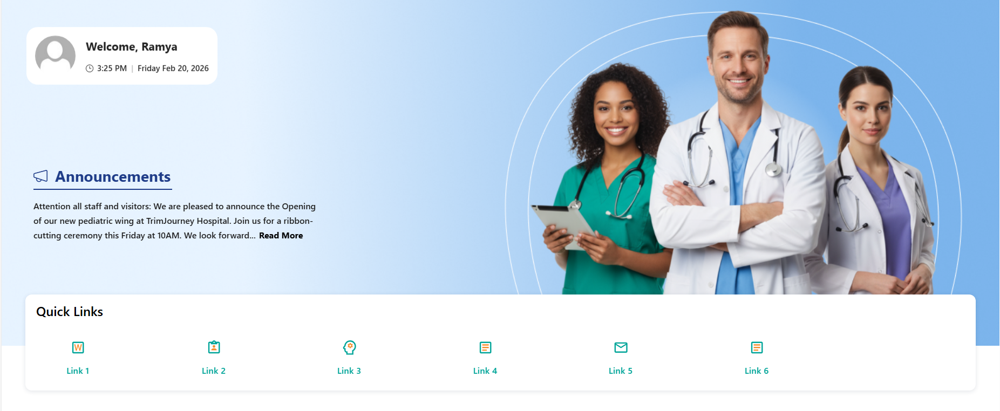

- - -

#### ☰ Appearance Settings

This section allows customization of the Welcome Banner and Quick Links display. The following configurable options are available:

📸 View Property Pane Screenshots

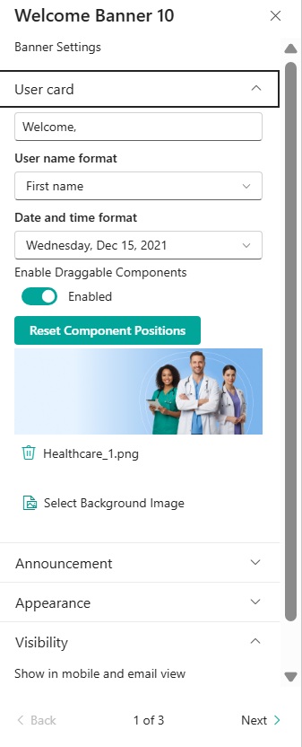

👤  User Card Settings

| 🏷️ Name                          | 🎯 Purpose                                                       | 💡 Select Option          |
| --------------------------------- | ---------------------------------------------------------------- | ------------------------- |
| 👋**Welcome Text**                | Customizes the greeting text displayed before the user name.     | `Welcome,`                |
| 👤**User Name Format**            | Defines how the logged-in user’s name appears (e.g., First name) | `First Name`              |
| 🕒**Date and Time Format**        | Controls the display format of the current date.                 | `Wednesday, Feb 19, 2026` |
| 🧩**Enable Draggable Components** | Allows repositioning of banner elements within the layout.       | `Enabled`                 |
| 🔄**Reset Component Positions**   | Restores banner layout to its default state.                     | `Button`                  |
| 🖼️**Select Background Image**    | Uploads or changes the banner background image.                  | `Healthcare_1.png`        |

🔗  Quick Links Settings

| 🏷️ Name                       | 🎯 Purpose                                                                                | 💡 Select Option          |
| ------------------------------ | ----------------------------------------------------------------------------------------- | ------------------------- |
| 🗂️**Select Data Source**      | Defines where the Quick Links data is collected from.                                     | `Data Collect From Panel` |
| 📏**Border Radius (%)**        | Adjusts the rounded corners of Quick Link tiles.                                          | `7`                       |
| 📐**Alignment**                | Aligns Quick Links horizontally within the section.                                       | `center`                  |
| 🌈**Border Radius (%)**        | Adjusts the rounded corners of Quick Link tiles.                                          | `Toggle`                  |
| 📏**Hide Gradient**            | Removes the gradient overlay from Quick Links.                                            | `7`                       |
| ✨**Hide Animation**            | Disables hover animation effects on Quick Links.                                          | `Toggle`                  |
| 📏**Icon Size**                | Controls the size of the Quick Link icons.                                                | `Dropdown`                |
| 🎨**Text Color**               | Allows customization of the Quick Link text color to match branding or theme preferences. | `Color Picker`            |
| 🖼️**Show Only Icon or Image** | When enabled, displays only the icon/image without link text.                             | `Off`                     |
| 🧱**Show Border**              | Adds or removes a border around Quick Link tiles.                                         | `Off`                     |
| 🔢**No of Items Display**      | Defines the total number of Quick Link items displayed in the section.                    | `6`                       |
| 🌫️**Show Box Shadow**         | Enables or disables shadow effect around Quick Link tiles                                 | `off`                     |

#### ℹ️ About Section

| 🏷️ Name                      | 🎯 Purpose                                                                           |
| ----------------------------- | ------------------------------------------------------------------------------------ |
| 👨‍💻**Developer Info**       | Indicates the web part is developed by**SharePoint Designs**.                        |
| 📚**Documentation Link**      | Provides access to user and admin documentation for further guidance.                |
| 🔑**Activate License Button** | A button to activate the premium or licensed version of the web part, if applicable. |

## 📰 2. Document Content

### 📋 Details

This web part offers support Document Content information, 

* Dynamic Document Display Web Part: Displays documents from a selected SharePoint document library in a structured card layout.
* Search Functionality: Allows users to quickly search and filter documents within the web part.
  *Category-Based Filtering: Supports filtering documents by category for better content organization.*
  Header Customization: Includes configurable title, heading level, and optional “See All” link.

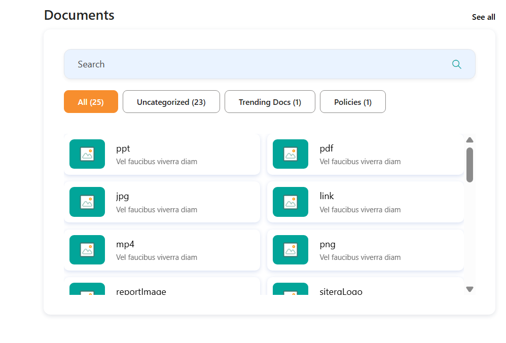

- - -

### ⚙️ Configuration Options

This section allows customization of the Document Library Web Part, including header configuration, content filtering, layout settings, and visibility options. The following configurable options are available:

📸 View Property Pane Screenshots

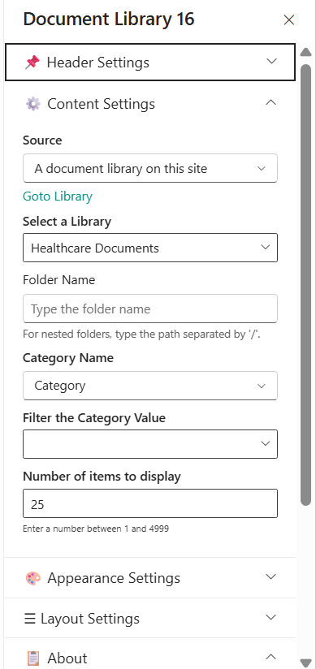

#### 📌 Header Settings Section

| 🏷️ Name                         | 🎯 Purpose                                               | 💡 Select Option |
| -------------------------------- | -------------------------------------------------------- | ---------------- |
| 📌**Show Header**                | Enables or disables the header section of the web part.  | Show             |
| 📝**Title**                      | Sets the display title of the document library section.  | Documents        |
| 🔠**Choose Title Heading Level** | Defines the HTML heading level for the title (H1–H6).    | Heading 3        |
| 🔗**Show See All**               | Displays or hides the “See All” link in the header.      | On               |
| 🌐**Show See All Link**          | Specifies the URL that opens when users click “See All”. | URL Field        |

#### ⚙️ Content settings Section

| 🏷️ Name                                                                                   | 🎯 Purpose                                                               | 💡 Select Option                |
| ------------------------------------------------------------------------------------------ | ------------------------------------------------------------------------ | ------------------------------- |
| 📚**Source**                                                                               | Defines the document source location.                                    | A document library on this site |
| 📂**Select a Library**                                                                     | Selects the document library to fetch documents from.                    | Healthcare Documents            |
| 📁**Folder Name**                                                                          | Filters documents from a specific folder (supports nested path using /). | Folder Path                     |
| 🏷️**Category Name**                                                                       | Specifies the column used for category-based filtering.                  | Category                        |
| 🔎**Filter the Category Value**                                                            | Filters documents by a selected category value.                          | Dropdown                        |
| 🔢**Number of Items to Display** Defines how many documents are displayed in the web part. | 25                                                                       |                                 |

#### ⚙️ Appearance settings Section

| 🏷️ Name                                                                                   | 🎯 Purpose                                                        | 💡 Select Option |
| ------------------------------------------------------------------------------------------ | ----------------------------------------------------------------- | ---------------- |
| 🧱**Enable Borders**                                                                       | Adds or removes borders around document cards.                    | off              |
| 🎨**Change Background Color**                                                              | Enables custom background color for the web part container.       | on               |
| 🎨**Height of the Web Part (px)**                                                          | Adjusts the vertical height of the web part container.            | 283              |
| 🏷️**Layout Type**                                                                         | Selects the visual layout style of the document display.          | Layout 09        |
| 🚫**Hide Web Part if Empty**                                                               | Automatically hides the web part when no documents are available. | checkbox         |
| 🔢**Number of Items to Display** Defines how many documents are displayed in the web part. | 25                                                                |                  |

#### ℹ️ About Section

| 🏷️ Name                      | 🎯 Purpose                                                                           |
| ----------------------------- | ------------------------------------------------------------------------------------ |
| 👨‍💻**Developer Info**       | Indicates the web part is developed by **SharePoint Designs**.                       |
| 📚**Documentation Link**      | Provides access to user and admin documentation for further guidance.                |
| 🔑**Activate License Button** | A button to activate the premium or licensed version of the web part, if applicable. |

## 📰 3. Knowledge Hub

### 📋 Details

* Centralized Knowledge Display Web Part: Displays documents from a selected document library in a clean and structured layout.
* Scrollable Content Area: Supports vertical scrolling when multiple documents are available.
* Category-Based Filtering: Enables filtering documents using category columns and values.
* Customizable Header Section: Allows control over title visibility and heading levels.
* Theme Customization Support: Provides icon color customization for branding consistency.
* Responsive & Visibility Control: Optimized for desktop, mobile, and email views.

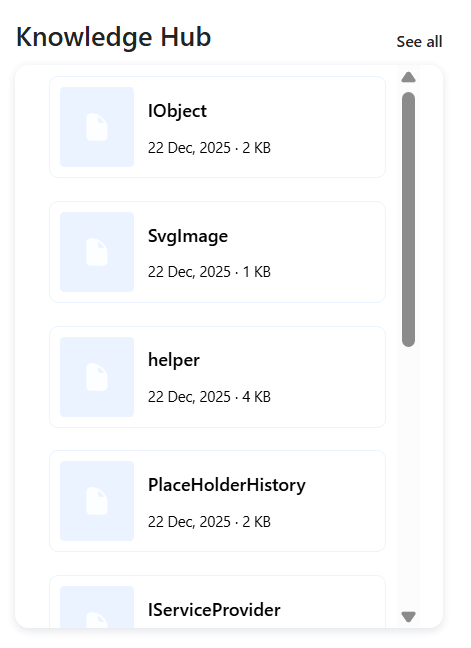

- - -

### ⚙️ Configuration Options

The Web Part configuration is divided into two main sections:

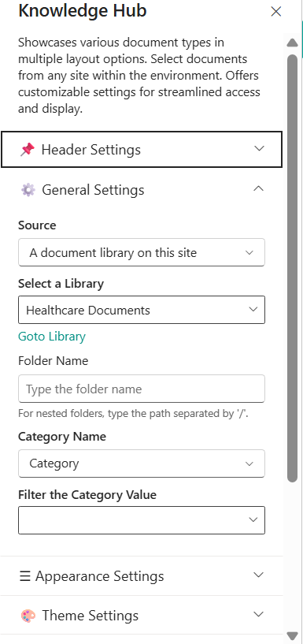

- - -

#### 📌 Header Settings Section

| 🏷️ Name                         | 🎯 Purpose                                                  | 💡 Select Option |
| -------------------------------- | ----------------------------------------------------------- | ---------------- |
| 📌**Show Webpart Title**         | Enables or disables the display of the Knowledge Hub title. | yes              |
| 📝**Webpart Title**              | Sets the display title of the web part.                     | Knowledge hub    |
| 🔠**Choose Title Heading Level** | Defines the HTML heading level for the title (H1–H6).       | Heading 3        |
| 🔗**Show See All**               | Displays or hides the “See All” link in the header.         | On               |
| 🌐**Show See All Link**          | Specifies the URL that opens when users click “See All”.    | URL Field        |

#### ⚙️General Settings Section

| 🏷️ Name                        | 🎯 Purpose                                                               | 💡 Select Option                |
| ------------------------------- | ------------------------------------------------------------------------ | ------------------------------- |
| 📚**Source**                    | Defines the document source location.                                    | A document library on this site |
| 📂**Select a Library**          | Selects the document library to fetch documents from.                    | Healthcare Documents            |
| 📁**Folder Name**               | Filters documents from a specific folder (supports nested path using /). | Folder Path                     |
| 🏷️**Category Name**            | Specifies the column used for category-based filtering.                  | Category                        |
| 🔎**Filter the Category Value** | Filters documents by a selected category value.                          | Dropdown                        |

#### ⚙️ Appearance settings Section

| 🏷️ Name | 🎯 Purpose | 💡 Select Option |
| -------- | ---------- | ---------------- |

\|🏷️**Layout Type** |Defines the visual layout style of the Knowledge Hub display. | Layout Option
| 🚫**Hide Web Part if Empty** |Automatically hides the web part when no documents are available.| checkbox

#### 🎨 Theme settings

| 🏷️ Name | 🎯 Purpose | 💡 Select Option |
| -------- | ---------- | ---------------- |

\|🎨**Color of the Icon** |Allows customization of the document icon color for branding consistency. | Color Picker

#### ℹ️ About Section

| 🏷️ Name                      | 🎯 Purpose                                                                           |
| ----------------------------- | ------------------------------------------------------------------------------------ |
| 👨‍💻**Developer Info**       | Indicates the web part is developed by**SharePoint Designs**.                        |
| 📚**Documentation Link**      | Provides access to user and admin documentation for further guidance.                |
| 🔑**Activate License Button** | A button to activate the premium or licensed version of the web part, if applicable. |

## 📰 4. News

Showcase concise company updates in a clean, minimal layout. Integrates with SharePoint news or RSS feeds.

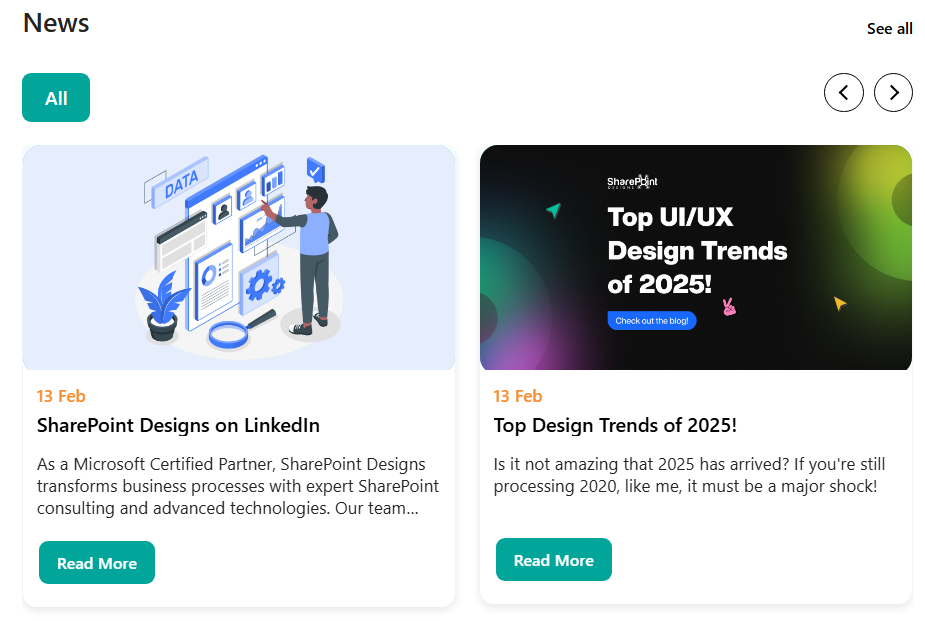

- - -

### ⚙️ Configuration

📸 View Property Pane Screenshots

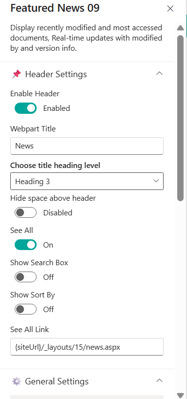

#### 📌 Header Settings Section

| 🏷️ Name                         | 🎯 Purpose                                                  | 💡 Select Option |
| -------------------------------- | ----------------------------------------------------------- | ---------------- |
| 📌**Show Webpart Title**         | Enables or disables the display of the Knowledge Hub title. | yes              |
| 📝**Webpart Title**              | Sets the display title of the web part.                     | Knowledge hub    |
| 🔠**Choose Title Heading Level** | Defines the HTML heading level for the title (H1–H6).       | Heading 3        |
| 🔗**Show See All**               | Displays or hides the “See All” link in the header.         | On               |
| 🌐**Show See All Link**          | Specifies the URL that opens when users click “See All”.    | URL Field        |
| 🌐**Show Search Box**            | Display or hide the search boxes”.                          | false            |
| 🌐**Show sort by**               | Display or hide the sort by options ”.                      | false            |

#### General Settings

| 🏷️ Name            | 🎯 Purpose             | 💡 Select Option |
| ------------------- | ---------------------- | ---------------- |
| **Search Sites**    | Select source sites    | Current site     |
| **Enable RSS Feed** | Enable RSS integration | On               |
| **RSS Links**       | Manage external feeds  | \[Manage Links]  |

#### Layout Settings

| 🏷️ Name          | 🎯 Purpose    | 💡 Select Option |
| ----------------- | ------------- | ---------------- |
| **Choose Layout** | Select Layout | Filmstrip        |

## 5. Organisation Chart

This web part will display a chart showing the organizational structure of the company based on the selected SharePoint site or list. It uses the Microsoft Graph API to query the user profiles and build the hierarchy.

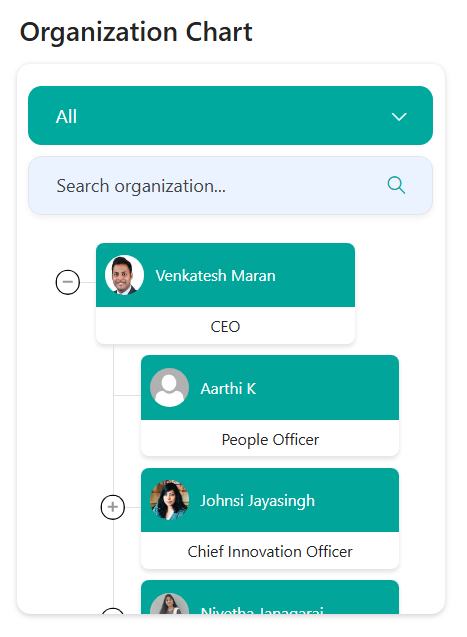

:::info
Ideal for visualizing reporting structures — users can hover to view names, titles, and contact details.
:::

### ⚙️ Configuration

#### Header Settings

📸 View Header settings Screenshot

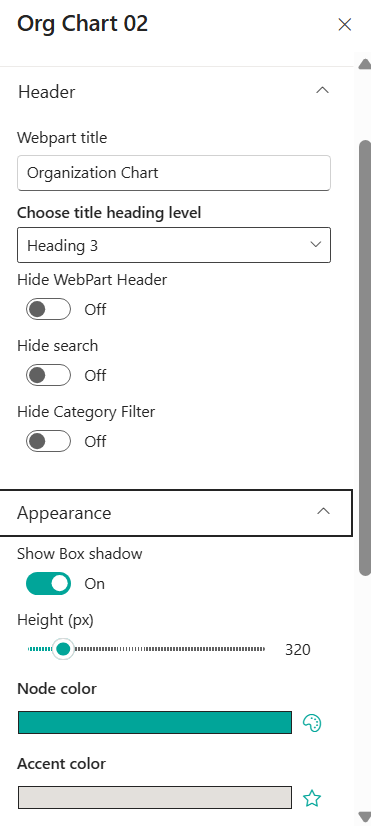

#### 📌 Header Settings Section

| 🏷️ Name                         | 🎯 Purpose                                                  | 💡 Select Option |
| -------------------------------- | ----------------------------------------------------------- | ---------------- |
| 📌**Show Webpart Title**         | Enables or disables the display of the Knowledge Hub title. | yes              |
| 📝**Webpart Title**              | Sets the display title of the web part.                     | Knowledge hub    |
| 🔠**Choose Title Heading Level** | Defines the HTML heading level for the title (H1–H6).       | Heading 3        |
| 🔗**Show See All**               | Displays or hides the “See All” link in the header.         | On               |
| 🌐**Show See All Link**          | Specifies the URL that opens when users click “See All”.    | URL Field        |
| 🌐**Show Search Box**            | Display or hide the search boxes”.                          | false            |

#### 📌 Appearance Settings Section

| 🏷️ Name             | 🎯 Purpose                                      | 💡 Select Option |
| -------------------- | ----------------------------------------------- | ---------------- |
| 📌**Show Boxshadow** | Enables or disables the display the box shadow. | on               |
| 📝**Height**         | Sets the height of the webpart .                | 320              |
| 🔠**Node Color**     | Allows to choose node color.                    | Color picker     |
| 🔠**Accent Color**   | Allows to choose Accent color.                  | Color picker     |

#### 📌 Filter Settings Section

| 🏷️ Name                     | 🎯 Purpose                                                              | 💡 Select Option |
| ---------------------------- | ----------------------------------------------------------------------- | ---------------- |
| 📌**Enable Category Filter** | Allows you to choose whether the category filter have to show or hide . | on               |
| 📝**Filter Field**           | We can able to filter it by fields  .                                   | Job Title        |

#### About

| Name          | Purpose                  | Select Option      |
| ------------- | ------------------------ | ------------------ |
| Developed By  | Credit attribution       | SharePoint Designs |
| Documentation | Opens help documentation | Documentation Link |

## 7. Calendar

Show upcoming meetings, holidays, and key events in a clear monthly or weekly calendar format.

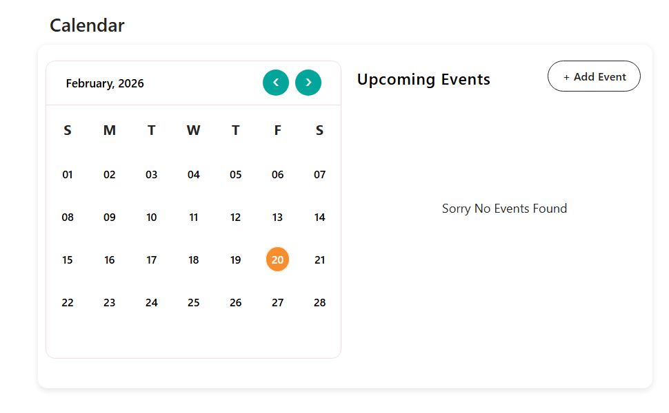

:::info
The **Calendar** web part pulls events directly from a SharePoint list, helping teams stay informed about important dates.
:::

### ⚙️ Configuration

#### 📌 Header Settings Section

| 🏷️ Name                         | 🎯 Purpose                                                  | 💡 Select Option |
| -------------------------------- | ----------------------------------------------------------- | ---------------- |
| 📌 **Hide Title**                | Enables or disables the display of the Knowledge Hub title. | yes              |
| 📝**Webpart Title**              | Sets the display title of the web part.                     | Knowledge hub    |
| 🔠**Choose Title Heading Level** | Defines the HTML heading level for the title (H1–H6).       | Heading 3        |
| 🔗**Show See All**               | Displays or hides the “See All” link in the header.         | On               |
| 🌐**Show See All Link**          | Specifies the URL that opens when users click “See All”.    | URL Field        |

#### General Settings

📸 View General Settings Screenshot

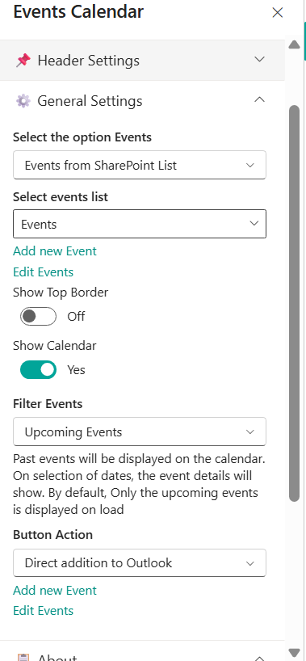

| 🏷️ Name                     | 🎯 Purpose                                                    | 💡 Select Option |
| ---------------------------- | ------------------------------------------------------------- | ---------------- |
| **Select the Option Events** | Allows to choose the list                                     | Dropdown         |
| **Selects events list**      | Allows to choose event type                                   | Dropdown         |
| **Add events**               | Add events from here                                          | Event creator    |
| **Edit list**                | Allows to edut the existing events                            | Event creator    |
| **Show calendar**            | Allows to choose display or hide the calendar                 | Boolean          |
| **Filter Events**            | can filter events as per our choice                           | Dropdown         |
| **Button Action**            | we can able to add this in to Outlook or download as ICS file | Dropdown         |

## 📰 8. Townhall Meeting video

### 📋 Details

* Townhall Showcase Web Part: Displays important townhall meetings, recordings, or announcements in a structured and engaging format.
* Content Type Selection: Allows selection of predefined content types such as Town Hall Recordings.
* Custom Description Support: Enables adding a custom description for context or messaging.
* Interactive Button Configuration: Supports customizable button icon and recording link integration.
* Flexible Media Source: Allows selecting the content source type (e.g., Video).

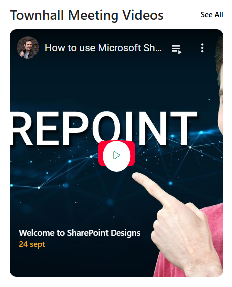

### ⚙️ Configuration

#### 📌 Header Settings Section

| 🏷️ Name                         | 🎯 Purpose                                                  | 💡 Select Option |
| -------------------------------- | ----------------------------------------------------------- | ---------------- |
| 📌 **Hide Title**                | Enables or disables the display of the Knowledge Hub title. | yes              |
| 📝**Webpart Title**              | Sets the display title of the web part.                     | Knowledge hub    |
| 🔠**Choose Title Heading Level** | Defines the HTML heading level for the title (H1–H6).       | Heading 3        |
| 🔗**Show See All**               | Displays or hides the “See All” link in the header.         | On               |
| 🌐**Show See All Link**          | Specifies the URL that opens when users click “See All”.    | URL Field        |

#### ⚙️ Appearance Settings

| 🏷️ Name                  | 🎯 Purpose                                                      | 💡 Select Option |
| ------------------------- | --------------------------------------------------------------- | ---------------- |
| 🧮**Choose Content Type** | Dropdown to choose the desired visual layout for Video Display. | `DropDown`       |

#### ⚙️ Apperance Settings

📸 View Property Pane Screenshots

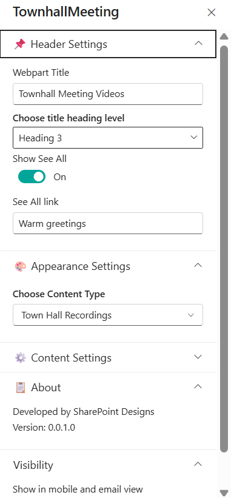

| 🏷️ Name                              | 🎯 Purpose                                                      | 💡 Select Option |
| ------------------------------------- | --------------------------------------------------------------- | ---------------- |
| 🧮**Enter description**               | Able to enter the description of our choice                     | `Text box`       |
| 🧮**Show Date**                       | Able to Show or hide the date                                   | `Boolean`        |
| 🧮**Enter Date**                      | Specifies the date of the townhall meeting.                     | `24 sept`        |
| 🔗**Enter Recording Link for Button** | Provides the URL for the townhall recording or related content. | `URL Field`      |
| 🎥**Choose the Source**               | Defines the media source type for the townhall content.         | `Video`          |
