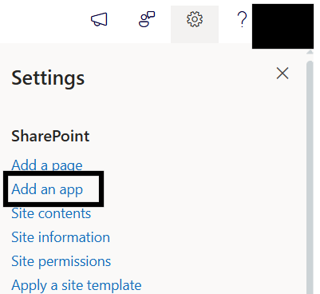
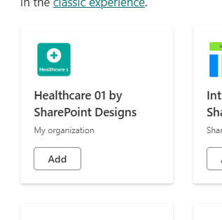
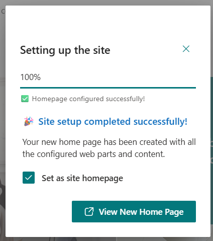

## ⚙️ Installation Instructions

* Upload the `spd-healthcare-01.sppkg` file to your App Catalog
* Navigate to your modern SharePoint site.
* Click the **Settings (gear)** icon → Select **“Add an app”**

  
* Choose **Healthcare 01 by SharePoint Designs**
* Click **Add**
* After installation, go to **Site Contents** to confirm it's added to the site.

  

- - -

## 🧪 Testing Instructions

> **Note:** *Upon adding the web part to the page, a **free 30-day trial** will start automatically.*

## Steps to Test and Apply Template

1. On the SharePoint site, locate the new icon in the top command bar (on the right side of the header bar). This icon opens the design template panel.

   
2. Click the icon to open the Employee Onboarding Logo Settings Panel.

   
3. In the panel:

   * Select the **"Home Page"** template
   * Click the **Create Page** button

     
4. Do not close or refresh the browser. A pop-up will appear to create the required lists and libraries:

* `Quick Links` list
* `Document Content` library
* `Knowledge Hub` library
* `Events` list
* `Training Video` library
  (_Mock items are added automatically for QuickLinks, Document Content, Knowledge hub, News)

5. After the items are created, the site page will **refresh automatically**, and it will continue to creating page and adding webparts.
6. Once setup is complete, a button will appear to open the newly created homepage. Click it to view the result.

   

- - -

## 🔑 Activating 30 Days Free Trial

### License Activation Steps

| Step | Action                   | Details / Notes                                                      |
| ---- | ------------------------ | -------------------------------------------------------------------- |
| 1    | Go to the app page       | Navigate to the SharePoint page where the app is installed           |
| 2    | Open activation panel    | If the subscription is pending, a **Buy Now** button will be visible |
| 3    | Launch activation dialog | Click **Buy Now** to open the purchase dialog                        |
| 4    | Purchase the license     | Complete the payment process                                         |
| 5    | Configure SaaS account   | After purchase, click **Configure your SaaS account**                |
| 6    | Subscribe to app         | On the landing page, click **Subscribe**                             |

- - -

## 🛒 Purchase License & Trial Information

* Purchasing the license automatically **activates a 30-day free trial**.
* No charges apply during the trial period.
* Once activation is completed successfully, the app is fully available for use.

- - -

### ✅ Expected Behaviour

The following resources are provisioned upon applying the Home template:

* 📄 **Quick Links** (List)
* 🖼️ **Document Contents** (Library)
* 🖼️ **Knowledge hub** (Library)
* 📄 **Events** (List)
* 🖼️ **Training Videos** 

> Mock data is also auto-added for:
>
> * Document Contents
> * Quicklinks
> * Knowledge hub
> * Events
>
> **No manual configuration required after clicking the Apply template button.**

- - -

## 🧹 Uninstall Guide

Follow the steps below to uninstall the **Healthcare Intranet Design 1 by SharePoint Designs** app from your SharePoint site:

1. Go to your SharePoint site and click on **Site Contents** from the left side navigation or the settings menu.
2. Find **Healthcare Intranet Design 1 by SharePoint Designs** in the list of installed apps.
3. Click the three dots (···) next to the app name and select **"Remove"**.
4. If prompted to switch to the **Classic Experience**, follow the prompt to proceed.
5. In the Classic Experience, hover over the app again, click the three dots (···), and then click **Remove** to finalize the uninstallation.

- - -

## 🛠️ Troubleshooting Common Issues

### ⚠️ Issue: Web Part Not Displaying Correctly

**Solution**: Ensure that the web part has been added to a modern SharePoint page and that the page has been republished. Check for any missing permissions that might be required for the web part to function correctly.

### 🗃️ Issue: Lists/Library Not Created

**Solution**: Verify that the **"Apply template"** button was clicked after adding the **"Healthcare 01 Setup"** web part. If the lists/Library are still not created, delete the page and reapply the design.

### 📝 Issue: Missing Demo Items

**Solution**: Check if the lists items are present in the Site Contents. If the lists are empty, manually add demo items or reapply the design.

- - -

## 🌟 Best Practices

### 🔁 Regular Updates

* **Keep Content Fresh**: Regularly update the content on your SharePoint site to keep it relevant and engaging.
* **Monitor Performance**: Regularly check the performance of your SharePoint site and make necessary adjustments to improve speed and user experience.

### 🎓 User Training

* **Provide Training**: Offer training sessions for users to help them understand how to use the SharePoint site effectively.
* **Create Documentation**: Develop comprehensive documentation to guide users on how to navigate and use the site.

### 🔐 Security Measures

* **Implement Security Protocols**: Ensure that proper security measures are in place to protect sensitive information.
* **Regular Audits**: Conduct regular security audits to identify and address potential vulnerabilities.

### 🗣️ User Feedback

* **Collect Feedback**: Regularly collect feedback from users to understand their needs and improve the site accordingly.
* **Act on Feedback**: Implement changes based on user feedback to enhance the overall user experience.

### 🤝 Collaboration

* **Encourage Collaboration**: Promote collaboration among team members by providing tools and features that facilitate communication and teamwork.
* **Use SharePoint Features**: Utilize SharePoint features such as document libraries, lists, and workflows to streamline collaboration and improve productivity.

- - -

## 🧑‍💼 User Permissions

| **Role**     | **Permissions**                                      |
| ------------ | ---------------------------------------------------- |
| **Owners**   | Full control — manage app, lists, license, settings. |
| **Members**  | Contribute content such as links, documents, events. |
| **Visitors** | Read-only access. General audience viewing.          |

> Stick to the **least privilege principle**. Review permissions regularly.

- - -

## 🆘 Support

Please contact **SharePoint Designs**
🌐 [www.sharepointdesigns.com](http://www.sharepointdesigns.com)
📧 support@sharepointdesigns.com
