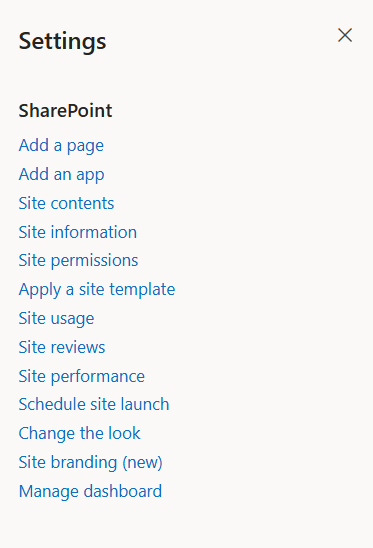

## ⚙️ Installation Instructions

* Upload the `spd-healthcare-03.sppkg` file to your **App Catalog** and click **Deploy**.
* In the SharePoint Admin Center → **Advanced → API access**, approve the pending Microsoft Graph permission requests (`Calendars.Read`, `Calendars.Read.Shared`, `User.Read.All`, `Group.Read.All`, `Sites.Read.All`).
* Navigate to your modern SharePoint site.
* Click the **Settings (gear)** icon → select **"Add an app"**.

  
* Choose **Healthcare Intranet Design 3 – SharePoint with KPIs & Wellness** (by SharePoint Designs).
* Click **Add**.
* After installation, go to **Site Contents** to confirm it's added to the site.

- - -

## 🧪 Testing Instructions

## Steps to Set Up and Apply the Site Template

The extension runs a **guided setup wizard** with 4 steps. It opens automatically the first time; you can also reopen it any time from the **launcher icon in the top suite bar** (right side of the header).

1. **Welcome** — The wizard opens on a welcome screen summarizing what it will configure (organization details, branding, and auto-deployed web parts). Click **Get Started**.

2. **Organization Details** — Fill in your organization information:

   * **Organization Name** (required — auto-filled from your tenant)
   * **Site Title** (writes live to the SharePoint site header)
   * **Industry**
   * **Vision Title** and **Vision** statement (shown in the Welcome Banner)

   > Existing users whose home page is already set up can click **Exit Setup** to keep their current page as-is.

3. **Branding** — Customize the look and feel (all changes shown in a live preview):

   * Upload your **Site Logo** — brand colors are auto-extracted from it.
   * Review/adjust the **theme colors**, name the theme, and click **Apply Theme** (or pick from **Available Site Themes**).
   * Upload a **Favicon**.
   * Optionally open **Regional Settings** and adjust **Appearance Settings** (header color, logo/title visibility, web part spacing, full-width page, footer alignment, border radius, fonts).

4. **Review & Apply** — The final step shows a summary of your organization and branding choices. Click **Apply Template** to begin provisioning.

5. **Do not close or refresh the browser.** A progress screen with a live log appears while the wizard automatically creates the required lists and libraries:

   * `QuickLinks` list
   * `Appointments` list
   * `Anniversaries` list
   * `Mindfullness` list
   * `Facilities` list
   * `Events` list
   * `TrainingVideos` library
   * News items
     (_Mock/seed items are added automatically so the web parts render with content._)

6. After the lists are created, the wizard continues to **build the home page** (`NewHome`) and add all the configured web parts.

7. Once setup is complete, a **Completed** screen appears with a button to **open the newly created homepage**. You can also tick **Set as home page** before viewing it.

- - -

## 🔑 Activating 30 Days Free Trial

### License Activation Steps

| Step | Action                   | Details / Notes                                                      |
| ---- | ------------------------ | -------------------------------------------------------------------- |
| 1    | Go to the app page       | Navigate to the SharePoint page where the app is installed           |
| 2    | Open activation panel    | If the subscription is pending, a **Buy Now** button will be visible |
| 3    | Launch activation dialog | Click **Buy Now** to open the purchase dialog                        |
| 4    | Purchase the license     | Complete the payment process                                         |
| 5    | Configure SaaS account   | After purchase, click **Configure your SaaS account**                |
| 6    | Subscribe to app         | On the landing page, click **Subscribe**                             |

- - -

## 🛒 Purchase License & Trial Information

* Purchasing the license automatically **activates a 30-day free trial**.
* No charges apply during the trial period.
* Once activation is completed successfully, the app is fully available for use.

- - -

### ✅ Expected Behaviour

The following resources are provisioned upon applying the Home template:

* 📄 **Quick Links** (List)
* 🖼️ **Document Contents** (Library)
* 🖼️ **Knowledge hub** (Library)
* 📄 **Events** (List)
* 🖼️ **Training Videos**

> Mock data is also auto-added for:
>
> * Document Contents
> * Quicklinks
> * Knowledge hub
> * Events
>
> **No manual configuration required after clicking the Apply template button.**

- - -

## 🧹 Uninstall Guide

Follow the steps below to uninstall the **Healthcare Intranet Design 1 by SharePoint Designs** app from your SharePoint site:

1. Go to your SharePoint site and click on **Site Contents** from the left side navigation or the settings menu.
2. Find **Healthcare Intranet Design 1 by SharePoint Designs** in the list of installed apps.
3. Click the three dots (···) next to the app name and select **"Remove"**.
4. If prompted to switch to the **Classic Experience**, follow the prompt to proceed.
5. In the Classic Experience, hover over the app again, click the three dots (···), and then click **Remove** to finalize the uninstallation.

- - -

## 🛠️ Troubleshooting Common Issues

### ⚠️ Issue: Web Part Not Displaying Correctly

**Solution**: Ensure that the web part has been added to a modern SharePoint page and that the page has been republished. Check for any missing permissions that might be required for the web part to function correctly.

### 🗃️ Issue: Lists/Library Not Created

**Solution**: Verify that the **"Apply template"** button was clicked after adding the **"Healthcare 01 Setup"** web part. If the lists/Library are still not created, delete the page and reapply the design.

### 📝 Issue: Missing Demo Items

**Solution**: Check if the lists items are present in the Site Contents. If the lists are empty, manually add demo items or reapply the design.

- - -

## 🌟 Best Practices

### 🔁 Regular Updates

* **Keep Content Fresh**: Regularly update the content on your SharePoint site to keep it relevant and engaging.
* **Monitor Performance**: Regularly check the performance of your SharePoint site and make necessary adjustments to improve speed and user experience.

### 🎓 User Training

* **Provide Training**: Offer training sessions for users to help them understand how to use the SharePoint site effectively.
* **Create Documentation**: Develop comprehensive documentation to guide users on how to navigate and use the site.

### 🔐 Security Measures

* **Implement Security Protocols**: Ensure that proper security measures are in place to protect sensitive information.
* **Regular Audits**: Conduct regular security audits to identify and address potential vulnerabilities.

### 🗣️ User Feedback

* **Collect Feedback**: Regularly collect feedback from users to understand their needs and improve the site accordingly.
* **Act on Feedback**: Implement changes based on user feedback to enhance the overall user experience.

### 🤝 Collaboration

* **Encourage Collaboration**: Promote collaboration among team members by providing tools and features that facilitate communication and teamwork.
* **Use SharePoint Features**: Utilize SharePoint features such as document libraries, lists, and workflows to streamline collaboration and improve productivity.

- - -

## 🧑‍💼 User Permissions

| **Role**     | **Permissions**                                      |
| ------------ | ---------------------------------------------------- |
| **Owners**   | Full control — manage app, lists, license, settings. |
| **Members**  | Contribute content such as links, documents, events. |
| **Visitors** | Read-only access. General audience viewing.          |

> Stick to the **least privilege principle**. Review permissions regularly.

- - -

## 🆘 Support

Please contact **SharePoint Designs**
🌐 [www.sharepointdesigns.com](https://www.sharepointdesigns.com)
📧 support@sharepointdesigns.com
