### Note:

The Home page should be configured using the "Healthcare 2 Setup" web part to ensure that the required lists and libraries are created automatically. Without this configuration, users will need to manually create dedicated lists or libraries for the respective web parts.

Configuration settings for each web part.

## 🧪1. Site config (Application customizer)

## Steps to Test and Apply Template

1. On the SharePoint site, locate the new icon in the top suite bar (on the right side of the header bar). This icon opens the design template panel.

   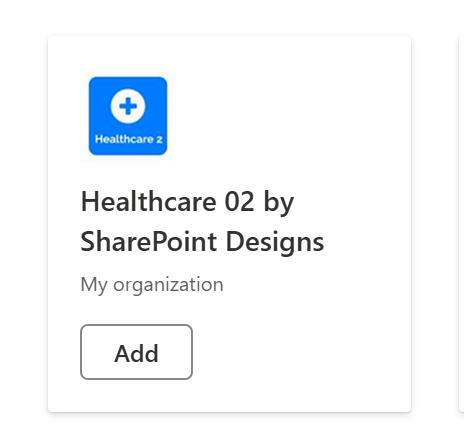
2. Click the icon to open the Page creation Panel.

   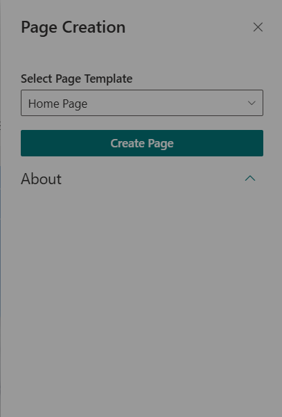
3. In the panel:

   * Select the **"Home Page"** template
   * Click the **Create Page** button

     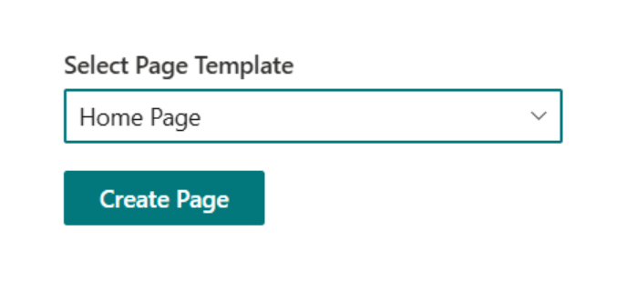
4. Do not close or refresh the browser. A pop-up will appear to create the required lists and libraries:

* `Employee Spotlight` list
* `Document Content` library
* `Take a Breath` library
* `Gallery` library
  (_Mock items are added automatically for Employee Spotlight, Document Content, Take a Breath, Gallery, News)

5. After the items are created, the site page will **refresh automatically**, and it will continue to creating page and adding webparts.
6. Once setup is complete, a button will appear to open the newly created homepage. Click it to view the result.

   

- - -

# Healthcare 2 – Web Parts Configuration

- - -

## 🟦 2. Welcome Banner

A customizable home section with flexible greeting, announcements, and quick links for every user. Move, resize, and theme components easily.

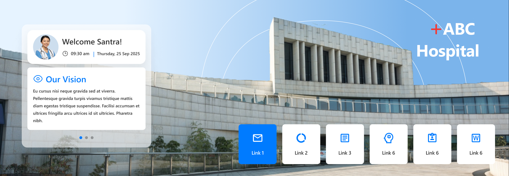

### 🛠️ General Settings

| Name               | Description                   | Example/Options |
| ------------------ | ----------------------------- | --------------- |
| Welcome Message    | Main greeting, can use tokens | "Good Morning"  |
| Show Header        | Show/hide webpart title       | Yes / No        |
| Heading Level      | h2, h3, custom px             | h2              |
| Custom Font Size   | Font size if custom heading   | 30              |
| Show User Card     | Show/hide user info panel     | Yes / No        |
| Show Announcements | Enable announcement tile      | Yes / No        |
| Show Quick Links   | Enable quick links tile       | Yes / No        |

### 🖼️ Background & Positioning

| Name             | Description                       | Example/Options |
| ---------------- | --------------------------------- | --------------- |
| Background Image | Upload/choose banner background   | Image Picker    |
| Enable Dragging  | Allow moving of banner components | On / Off        |
| Reset Layout     | Snap all elements back to default | Button          |

### 🔗 Quick Links Configuration

| Name              | Description                   | Example/Options       |
| ----------------- | ----------------------------- | --------------------- |
| Data Source       | Where quick links are managed | Panel / List          |
| Border Radius (%) | How rounded link tiles are    | 7                     |
| Alignment         | Arrange horizontal alignment  | Center / Left / Right |
| Icon Size         | Select tile icon size         | Dropdown              |
| Text Color        | Quick link text color         | Color Picker          |
| Items to Display  | Max links shown               | 6                     |

### 🎨 Appearance

| Name            | Description                   | Example/Options |
| --------------- | ----------------------------- | --------------- |
| Theme Colors    | Select global banner theme    | Color Picker    |
| Show Box Shadow | Enable shadow for quick links | On / Off        |
| Hide Animation  | Remove click/hover motion     | On / Off        |

### ℹ️ About

| Name               | Description              | Example/Options    |
| ------------------ | ------------------------ | ------------------ |
| Developer Info     | Credits & support        | SharePoint Designs |
| Documentation Link | Official user/admin docs | \[Link]            |
| Activate License   | Enable premium features  | Button             |

- - -

## 🟦 3. Announcement

Display rotating banners for important updates—using icons, links, colors, and expiry.

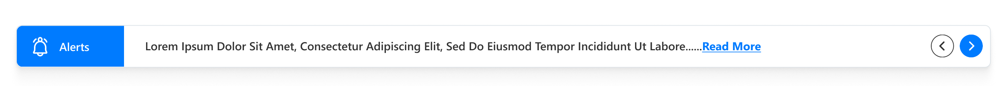

### 🛠️ General Settings

| Name              | Description      | Example/Options |
| ----------------- | ---------------- | --------------- |
| Header Title      | Main bar heading | \[Text field]   |
| Announcement Icon | Featured icon    | Icon Picker     |

### 🗄️ Announcement Items

| Name              | Description                        | Example/Options |
| ----------------- | ---------------------------------- | --------------- |
| Add/Edit Items    | Create collection of announcements | Collection List |
| Title/Link/Expiry | Each item has link + end date      | Fill-in fields  |

### 🎨 Appearance Settings

| Name               | Description             | Example/Options |
| ------------------ | ----------------------- | --------------- |
| Accent Color Theme | Banner color set        | Theme dropdown  |
| Hide If Empty      | Remove part if no items | Yes / No        |

### 🚦 Carousel/Functionality

| Name                 | Description               | Example/Options |
| -------------------- | ------------------------- | --------------- |
| Enable Auto Play     | Auto-rotate cards         | Yes / No        |
| Auto Play Speed      | Seconds per rotation      | 1–20            |
| Enable Infinite Loop | Repeat carousel in loop   | Yes / No        |
| Show Arrows          | Show next/previous arrows | Yes / No        |

### ℹ️ About

| Name               | Description             | Example/Options    |
| ------------------ | ----------------------- | ------------------ |
| Developer Info     | Credits & support       | SharePoint Designs |
| Documentation Link | Access official guides  | \[Link]            |
| Activate License   | Enable premium features | Button             |

- - -

## 🟦 4. Document Content

Display documents from a SharePoint library, enabling sorting, notification badges, and external launch.

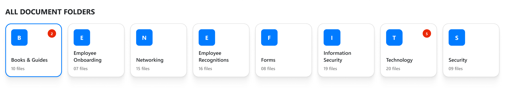

### 🛠️ General Settings

| Name               | Description            | Example/Options  |
| ------------------ | ---------------------- | ---------------- |
| Webpart Title      | Section name           | Document Content |
| Show Webpart Title | Show/hide title        | Yes / No         |
| Heading Level      | h2/h3/h4/custom px     | h3               |
| Custom Font Size   | Title size (if custom) | 12–72 px         |
| Select Library     | Target SP library      | Library Picker   |
| Goto Library       | Open list in new tab   | Yes / No         |

### 🗄️ Content/Display

| Name                      | Description                | Example/Options   |
| ------------------------- | -------------------------- | ----------------- |
| Enable Notification Badge | Highlight new/changed docs | On / Off          |
| Highlight by              | Show by created/modified   | Uploaded/Modified |
| Show changes from         | Recent doc window          | 7, 30, 365 days   |
| Choose layout             | Select grid/card style     | Document Content  |
| Show folder title         | Folder name display        | Yes / No          |
| Folders per row           | Density of grid            | 1–12              |
| Show Navigation           | Pagination between pages   | On / Off          |

### 🎨 Appearance

| Name                  | Description               | Options            |
| --------------------- | ------------------------- | ------------------ |
| Enable borders        | Card edge display         | Yes / No           |
| Enable shadow         | Card shadow effect        | Yes / No           |
| Open files in new tab | Link opens away from page | New tab / Same tab |

### 🛠️ Admin/Permissions

| Name       | Description               | Options       |
| ---------- | ------------------------- | ------------- |
| Show Admin | Extra features for admins | Yes / No      |
| Admins     | Choose admin persons      | People Picker |

### ℹ️ About

| Name               | Description             | Example/Options    |
| ------------------ | ----------------------- | ------------------ |
| Developer Info     | Credits & support       | SharePoint Designs |
| Documentation Link | Access official guides  | \[Link]            |
| Activate License   | Enable premium features | Button             |

- - -

## 🟦 5. Employee Spotlight

Highlight employee birthdays, anniversaries, and new joiners in a dynamic, branded carousel. Fine-tune its appearance, layout, and data connections with the grouped settings below.

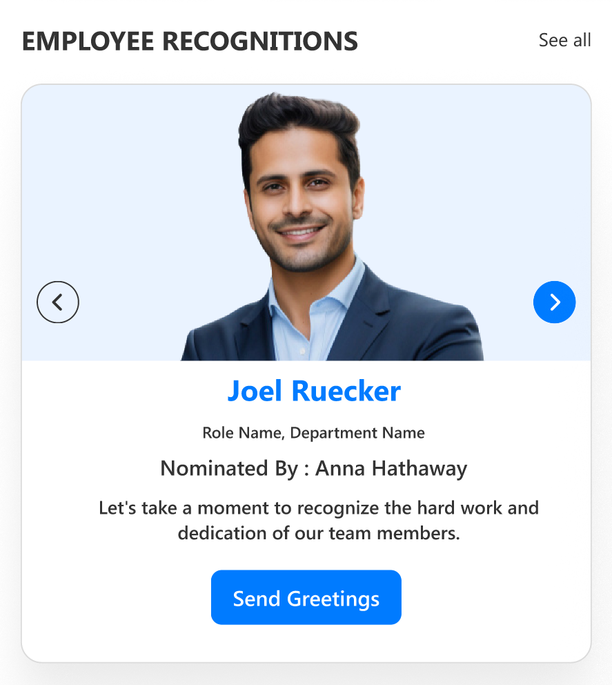

### 🛠️ General Settings

| Name             | Description                                   | Example/Options    |
| ---------------- | --------------------------------------------- | ------------------ |
| Web Part Title   | Section heading text                          | Employee Spotlight |
| Show Header      | Toggle header visibility                      | Yes / No           |
| Heading Level    | Title HTML heading (h1–h6 or custom px)       | h3, custom         |
| Custom Font Size | Font size (if heading is custom)              | 18                 |
| Select List      | Choose target SharePoint list                 | List picker        |
| Show Admin Menu  | Restrict advanced controls to selected admins | Yes / No           |
| Admins           | Person(s) who can admin web part              | People Picker      |

### 🗄️ Data & Filtering

| Name                      | Description                                   | Example/Options              |
| ------------------------- | --------------------------------------------- | ---------------------------- |
| Filter Period             | Restrict by date/time                         | Today, This Month, Last Week |
| Show Category Filter      | Enable buttons for Birthday, Anniversary etc. | Yes / No                     |
| Filter by Category        | Select visible event types                    | All, Birthday, Anniversary   |
| Category Filter Alignment | Align filter buttons                          | Left / Center / Right        |

### 🎨 Appearance Settings

| Name                      | Description                                 | Example/Options            |
| ------------------------- | ------------------------------------------- | -------------------------- |
| Color Mode                | Theme/Manual/Branding customisation         | Dropdown                   |
| Custom Colors             | Title, element & category colors            | Theme picker/color chooser |
| Show Border               | Enable/disable card border                  | Yes / No                   |
| Show Shadow               | Card shadow                                 | Yes / No                   |
| Border Radius             | Roundness of cards                          | 8–25 px                    |
| Enable Background Image 1 | Show background behind carousel             | Yes / No, Image Picker     |
| Background Image 1        | Upload or select background                 | Image Picker               |
| Enable Top Flag Image     | Show decorative “flag” image above carousel | Yes / No, Image Picker     |
| Top Flag Image            | Select flag image                           | Image Picker               |

### 🚦 Carousel/Functionality

| Name                   | Description                   | Example/Options  |
| ---------------------- | ----------------------------- | ---------------- |
| Carousel Auto-Play     | Automatic rotation            | Enable / Disable |
| Auto Play Speed        | Seconds per transition        | 1–60             |
| Show Navigation Arrows | Show/hide left–right controls | Yes / No         |

### ℹ️ About

| Name               | Description             | Example/Options    |
| ------------------ | ----------------------- | ------------------ |
| Developer Info     | Credits & support       | SharePoint Designs |
| Documentation Link | Access official guides  | \[Link]            |
| Activate License   | Enable premium features | Button             |

- - -

## 🟦 6. Take a Breath

Breathing exercise block with animation and admin-editable commentary—remind users to pause and reset.

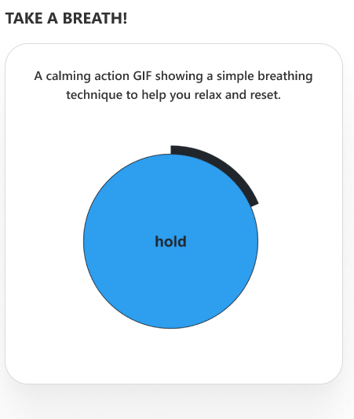

### 🛠️ General Settings

| Name             | Description                        | Example/Options |
| ---------------- | ---------------------------------- | --------------- |
| Webpart Title    | Title above the animation          | Take a Breath   |
| Show Header      | Toggle header                      | Yes / No        |
| Heading Level    | h2/h3/custom px                    | h2, custom      |
| Custom Font Size | Font size if custom selected       | 24              |
| Select Library   | List or library for the commentary | Library Picker  |
| Goto Library     | Quick access to edit source        | Yes / No        |

### 📋 Content & Carousel

| Name              | Description                       | Example/Options   |
| ----------------- | --------------------------------- | ----------------- |
| Descriptions      | Add/manage calming instructions   | Inline Collection |
| Carousel Settings | Control slides/auto-play/infinity | Sliders/Toggles   |

### 🎨 Appearance

| Name        | Description                    | Example/Options |
| ----------- | ------------------------------ | --------------- |
| Show Border | Card border                    | Yes / No        |
| Show Shadow | Drop shadow                    | Yes / No        |
| Theme Color | Branding accent for this block | Color Picker    |

### ℹ️ About

| Name               | Description              | Example/Options    |
| ------------------ | ------------------------ | ------------------ |
| Developer Info     | Credits & support        | SharePoint Designs |
| Documentation Link | Official user/admin docs | \[Link]            |
| Activate License   | Enable premium features  | Button             |

- - -

## 🟦 7. Organization Chart

Visualize your company's hierarchical structure with advanced filtering and layout controls.

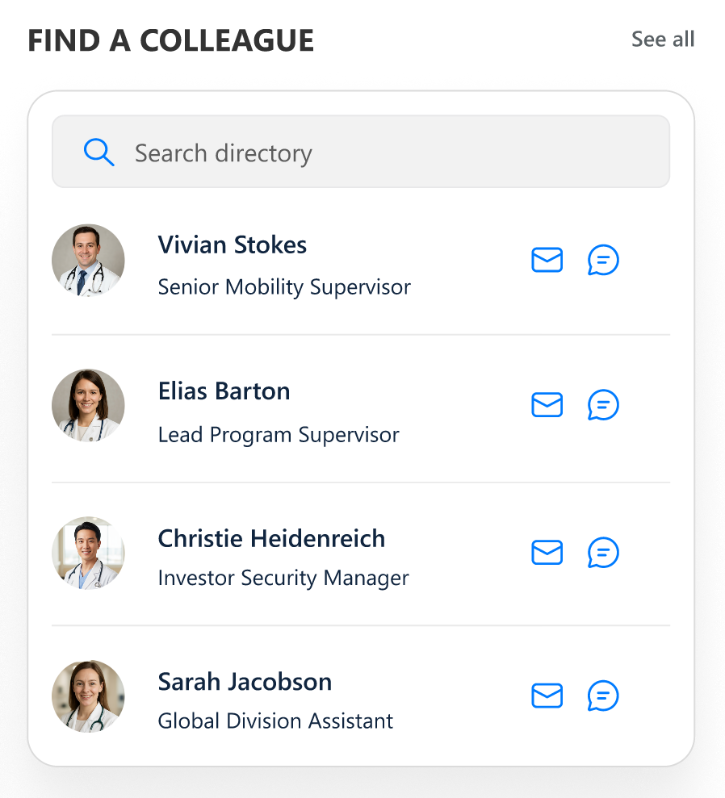

### 🛠️ General Settings

| Name             | Description                            | Example/Options    |
| ---------------- | -------------------------------------- | ------------------ |
| Webpart Title    | Section header text                    | Organization Chart |
| Show Header      | Toggle visibility of header            | Yes / No           |
| Heading Level    | Title HTML heading (h1–h6 / custom px) | h3, custom         |
| Custom Font Size | Font size if heading is custom         | 24                 |

### 🗄️ Data & Filtering

| Name                   | Description                                        | Example/Options |
| ---------------------- | -------------------------------------------------- | --------------- |
| Filter Field           | Choose field for filtering (e.g. department, role) | Dropdown        |
| Enable Category Filter | Show filter controls for org structure             | Yes / No        |

### 🎨 Appearance Settings

| Name         | Description              | Example/Options |
| ------------ | ------------------------ | --------------- |
| Show Border  | Enable card border       | Yes / No        |
| Show Shadow  | Add card shadow          | Yes / No        |
| Height       | Chart vertical size (px) | 320 px          |
| Node Color   | Set node color           | Color Picker    |
| Accent Color | Accent node/line color   | Color Picker    |

### 🚦 Layout & Functionality

| Name              | Description                     | Example/Options      |
| ----------------- | ------------------------------- | -------------------- |
| Card Layout       | Select between possible layouts | Layout 1             |
| Card Height/Width | Card sizing                     | px fields (flexible) |

### ℹ️ About

| Name               | Description              | Example/Options    |
| ------------------ | ------------------------ | ------------------ |
| Developer Info     | Credits & support        | SharePoint Designs |
| Documentation Link | Official user/admin docs | \[Link]            |
| Activate License   | Enable premium features  | Button             |

- - -

## 🟦 8. News

Aggregate updates from sites, filtered by audience and category, with tailored layout and appearance.

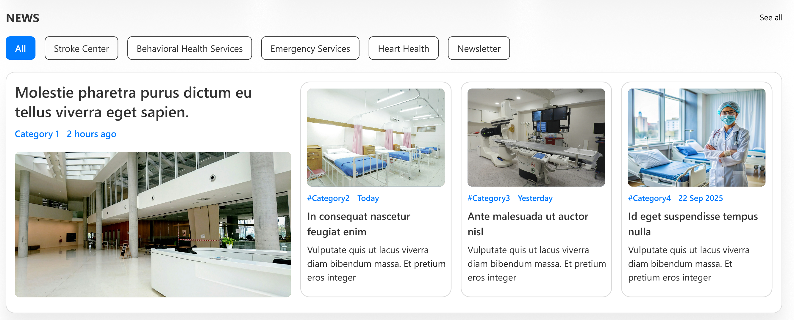

### 🛠️ General Settings

| Name                | Description                | Example/Options |
| ------------------- | -------------------------- | --------------- |
| Webpart Title       | Title for news rollup      | News            |
| Show Header         | Show/hide top header       | Yes / No        |
| Heading Level       | h1–h6/custom px            | h3, custom      |
| Custom Font Size    | Custom height for header   | px              |
| Show See All Button | Quick link to news archive | Yes / No        |
| See All Link        | URL to full news           | URL             |

### 🗄️ Content, Data & Filtering

| Name            | Description                         | Example/Options |
| --------------- | ----------------------------------- | --------------- |
| Search Sites    | Which SharePoint sites to aggregate | Site Picker     |
| Target Audience | User/groups to restrict readers     | People Picker   |
| News Category   | Managed term for filtering          | Dropdown        |
| Apply Filters   | Further filtering                   | Multi-select    |
| Items to Show   | How many updates are visible        | Numeric         |

### 🎨 Appearance & Layout

| Name            | Description                | Example/Options |
| --------------- | -------------------------- | --------------- |
| Show Border     | Border styling             | Yes / No        |
| Show Shadow     | Add a drop shadow          | Yes / No        |
| Layout          | Layout/arrangement of news | News2/Other     |
| Open in New Tab | Links open externally      | Yes / No        |

### ℹ️ About

| Name               | Description              | Example/Options    |
| ------------------ | ------------------------ | ------------------ |
| Developer Info     | Credits & support        | SharePoint Designs |
| Documentation Link | Official user/admin docs | \[Link]            |
| Activate License   | Enable premium features  | Button             |

- - -

## 🟦 9. Gallery

Showcase image libraries with upload/button/appearance controls and full layout flexibility.

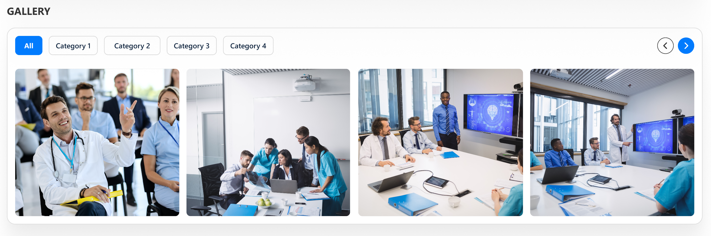

### 🛠️ General Settings

| Name              | Description             | Options        |
| ----------------- | ----------------------- | -------------- |
| Webpart Title     | Section title           | Gallery        |
| Heading Level     | h1–h6/custom px         | h3             |
| Custom Font Size  | Only if custom selected | 12–72 px       |
| Title Theme Color | Branded title accent    | Color dropdown |
| Select Library    | Library data source     | Library Picker |
| Goto Library      | Quick open list/library | Yes / No       |

### 🗄️ Gallery Settings

| Name                   | Description             | Options  |
| ---------------------- | ----------------------- | -------- |
| Show Categories        | Display category filter | On / Off |
| Show Pagination        | Pagination controls     | Yes / No |
| Items Per Row          | Gallery density         | 2–10     |
| Show Image Titles      | Show captions           | Yes / No |
| Show Navigation Arrows | Carousel controls       | Yes / No |
| Show Upload Button     | Add images if allowed   | Yes / No |

### 🎨 Appearance

| Name        | Description          | Options  |
| ----------- | -------------------- | -------- |
| Show Border | Bordered image cards | On / Off |
| Show Shadow | Card shadow          | On / Off |

### ℹ️ About

| Name               | Description             | Example/Options    |
| ------------------ | ----------------------- | ------------------ |
| Developer Info     | Credits & support       | SharePoint Designs |
| Documentation Link | Access official guides  | \[Link]            |
| Activate License   | Enable premium features | Button             |
