### Note: 
 
The Home page should be configured using the "Healthcare 3 Setup" web part to ensure that the required lists and libraries are created automatically. Without this configuration, users will need to manually create dedicated lists or libraries for the respective web parts.

Configuration settings for each web part.

## 🧪1. Site config (Application customizer)

## Steps to Test and Apply Template

1. On the SharePoint site, locate the new icon in the top suite bar (on the right side of the header bar). This icon opens the design template panel.

   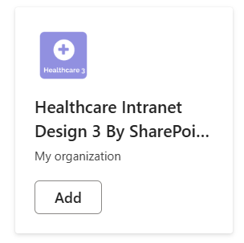
2. Click the icon to open the Page creation Panel.

   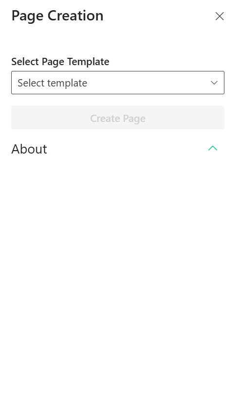
3. In the panel:

   * Select the **"Home Page"** template
   * Click the **Create Page** button

     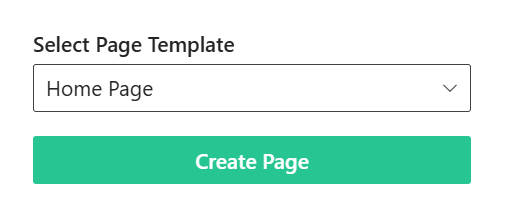
4. Do not close or refresh the browser. A pop-up will appear to create the required lists and libraries:

* `KPI Appointments` list
* `Quick Links` list
* `Anniversaries/Kudos` list
* `Mindfulness` list
* `Events` list
* `Training Video` library
* `Location` list
  (_Mock items are added automatically for QuickLinks, KPI Appoinments, Anniversaries, Mindfulness, News, Training Videos, Location)

5. After the items are created, the site page will **refresh automatically**, and it will continue to creating page and adding webparts.
6. Once setup is complete, a button will appear to open the newly created homepage. Click it to view the result.

   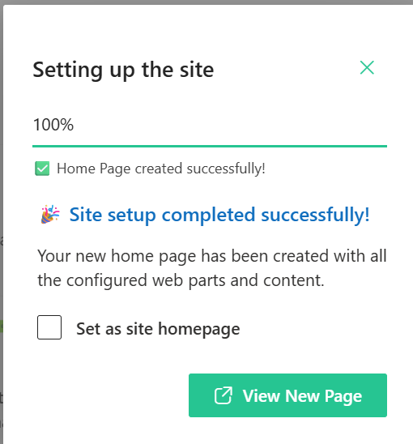

- - -

## 👋 2. Welcome Banner

### 📋 Details

* **Personalized Greeting Web Part**: Displays a dynamic welcome message with the logged-in user’s name along with the current date and time..
* **Announcements Display**: Highlights important updates with preview text and a “Read More” option for detailed information.
* **Custom Background Support**: Allows a professional background image to enhance the visual appearance of the banner.
* **Draggable Components**:Enables repositioning of banner elements for flexible layout customization.

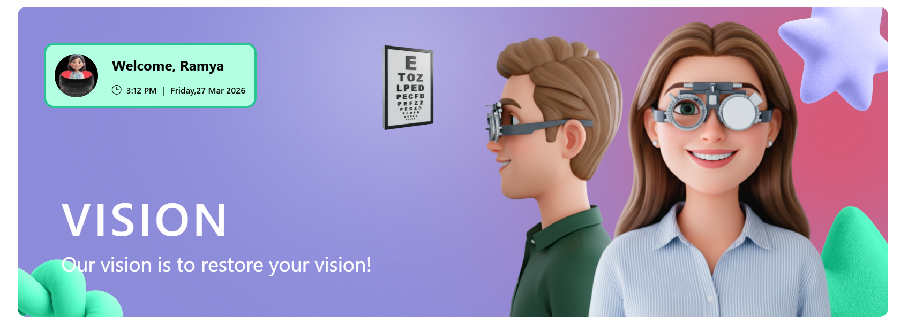

- - -

#### ☰ General Settings

This section allows customization of the welcome text, user display format, and layout behavior. The following configurable options are available:

📸 View Property Pane Screenshots

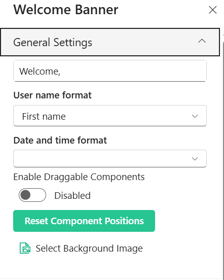

| 🏷️ Name                           | 🎯 Purpose                                                       | 💡 Select Option |
| ---------------------------------- | ---------------------------------------------------------------- | ---------------- |
| 👋 **Welcome Text**                | Customizes the greeting text displayed before the user name.     | `Welcome,`       |
| 👤 **User Name Format**            | Defines how the logged-in user’s name appears (e.g., First name) | `First name`     |
| 🕒 **Date and Time Format**        | Controls the display format of the current date and time.        | `Not Selected`   |
| 🧩 **Enable Draggable Components** | Allows repositioning of components within the layout.            | `Disabled`       |
| 🔄 **Reset Component Positions**   | Restores layout to its default state.                            | `Button`         |
| 🖼️ **Select Background Image**    | Uploads or changes the background image.                         | `Not Selected`   |

#### 📢 Announcement Settings

This section allows customization of announcement title, message, and visibility options.

📸 View Property Pane Screenshots

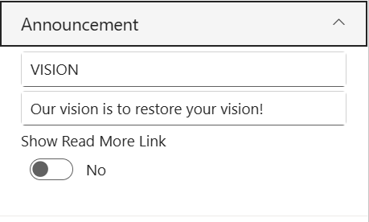

#### 📝 Announcement Configuration

| 🏷️ Name                   | 🎯 Purpose                                            | 💡 Select Option                        |
| -------------------------- | ----------------------------------------------------- | --------------------------------------- |
| 🏷️ **Title**              | Defines the heading of the announcement section.      | `VISION`                                |
| 📝 **Description**         | Displays the main announcement message to users.      | `Our vision is to restore your vision!` |
| 🔗 **Show Read More Link** | Toggles visibility of an additional “Read More” link. | `No`                                    |

#### 🎨 Appearance Settings

📸 View Property Pane Screenshots

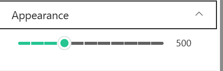

| 🏷️ Name      | 🎯 Purpose                                     | 💡 Select Option |
| ------------- | ---------------------------------------------- | ---------------- |
| 📏 **Height** | Adjusts the height of the component. | `500`            |

#### ℹ️ About Section

📸 View Property Pane Screenshots
 

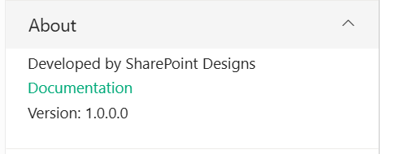

| 🏷️ Name                      | 🎯 Purpose                                                                           |
| ----------------------------- | ------------------------------------------------------------------------------------ |
| 👨‍💻**Developer Info**       | Indicates the web part is developed by**SharePoint Designs**.                        |
| 📚**Documentation Link**      | Provides access to user and admin documentation for further guidance.                |
| 🔑**Activate License Button** | A button to activate the premium or licensed version of the web part, if applicable. |

## 📊 3. KPI Appointments

### 📋 Details

This web part provides a quick overview of key appointment metrics in a visually structured layout.

* **KPI Metrics Display**: Shows important appointment statistics such as daily, next day, and monthly bookings.
* **Real-Time Insights**: Displays dynamic counts to help track appointment trends and performance.
* **Clean Card Layout**: Presents data in a horizontal card format with clear separation for each metric.
* **Highlighted Values**: Uses visually distinct badges to emphasize key numbers for quick readability.
* **Customizable Title**: Includes a configurable header section (e.g., KPI Appointments).

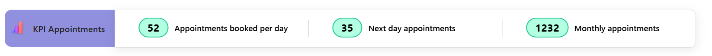

- - -

#### 📌 Header Settings

This section allows customization of the web part header including title, heading level, and background image.

📸 View Property Pane Screenshots

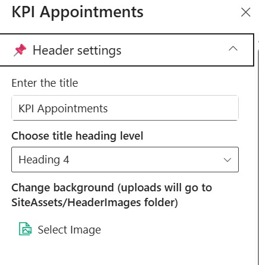

#### 🧾 Header Configuration

| 🏷️ Name                 | 🎯 Purpose                                                    | 💡 Select Option   |
| ------------------------ | ------------------------------------------------------------- | ------------------ |
| 📝 **Title**             | Defines the title displayed at the top of the web part.       | `KPI Appointments` |
| 🔤 **Heading Level**     | Sets the semantic heading level for the title (e.g., H1–H6).  | `Heading 4`        |
| 🖼️ **Background Image** | Uploads or selects a background image for the header section. | `Select Image`     |

#### 🧱 Layout Settings

This section allows configuration of data source and layout filtering options.

📸 View Property Pane Screenshots

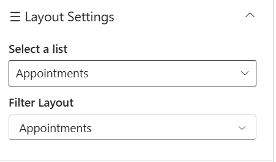

#### 📂 Layout Configuration

| 🏷️ Name             | 🎯 Purpose                                                   | 💡 Select Option |
| -------------------- | ------------------------------------------------------------ | ---------------- |
| 📋 **Select a List** | Chooses the SharePoint list used as the data source.         | `Appointments`   |
| 🔍 **Filter Layout** | Defines the layout or category view for displaying the data. | `Appointments`   |

#### ⚙️ General Settings

This section allows configuration of automatic scrolling behavior.

📸 View Property Pane Screenshots

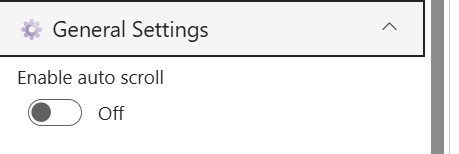

| 🏷️ Name                  | 🎯 Purpose                                                  | 💡 Select Option |
| ------------------------- | ----------------------------------------------------------- | ---------------- |
| 🔁 **Enable Auto Scroll** | Toggles automatic scrolling of content within the web part. | `Off`            |

#### ℹ️ About Section

📸 View Property Pane Screenshots

| 🏷️ Name                      | 🎯 Purpose                                                                           |
| ----------------------------- | ------------------------------------------------------------------------------------ |
| 👨‍💻**Developer Info**       | Indicates the web part is developed by **SharePoint Designs**.                       |
| 📚**Documentation Link**      | Provides access to user and admin documentation for further guidance.                |
| 🔑**Activate License Button** | A button to activate the premium or licensed version of the web part, if applicable. |

## 🔗 4. QuickLinks

### 📋 Details

This web part provides quick access to important resources and frequently used links in a clean, card-based layout.

* **Quick Navigation**: Displays commonly used links for easy and fast access.
* **Icon-Based Representation**: Each link is visually represented with an icon for better recognition.
* **Card Layout Design**: Presents links in a structured and responsive card format.
* **Customizable Links**: Allows configuration of link titles, icons, and navigation URLs.
* **User-Friendly Interface**: Ensures a simple and intuitive experience for end users.

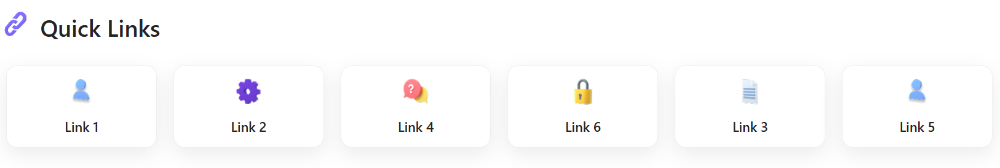

- - -

#### 📌 Header Settings

This section allows customization of the web part header including title, heading level, background image, and visibility.

📸 View Property Pane Screenshots

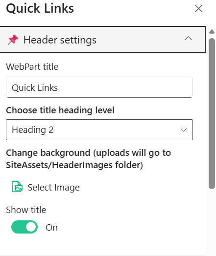

#### 🧾 Header Configuration

| 🏷️ Name                 | 🎯 Purpose                                                    | 💡 Select Option |
| ------------------------ | ------------------------------------------------------------- | ---------------- |
| 📝 **WebPart Title**     | Defines the title displayed at the top of the web part.       | `Quick Links`    |
| 🔤 **Heading Level**     | Sets the semantic heading level for the title (e.g., H1–H6).  | `Heading 2`      |
| 🖼️ **Background Image** | Uploads or selects a background image for the header section. | `Select Image`   |
| 👁️ **Show Title**       | Toggles visibility of the web part title.                     | `On`             |

#### ⚙️ General Settings

This section allows configuration of data source, list selection, and number of items to display.

📸 View Property Pane Screenshots

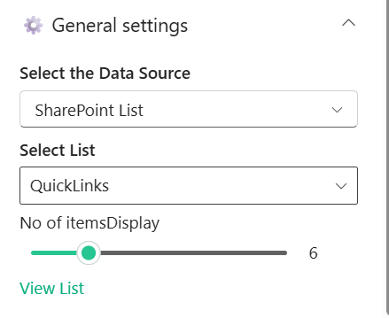

#### 📂 Data Configuration

| 🏷️ Name                   | 🎯 Purpose                                                         | 💡 Select Option  |
| -------------------------- | ------------------------------------------------------------------ | ----------------- |
| 🗂️ **Select Data Source** | Chooses the source type for fetching data (e.g., SharePoint List). | `SharePoint List` |
| 📋 **Select List**         | Selects the list from which quick links are retrieved.             | `QuickLinks`      |
| 🔢 **No of Items Display** | Controls the number of links displayed in the web part.            | `6`               |
| 🔗 **View List**           | Provides quick navigation to view the selected SharePoint list.    | `Link`            |

#### 🎨 Appearance Settings

This section allows customization of visual styles such as border radius, colors, and icon display.

📸 View Property Pane Screenshots

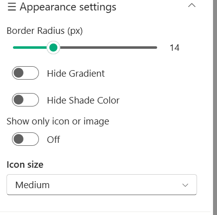

| 🏷️ Name                     | 🎯 Purpose                                                      | 💡 Select Option |
| ---------------------------- | --------------------------------------------------------------- | ---------------- |
| 🔲 **Border Radius (px)**    | Adjusts the roundness of the card corners.                      | `14`             |
| 🌈 **Hide Gradient**         | Toggles visibility of gradient background effects.              | `Off`            |
| 🎨 **Hide Shade Color**      | Toggles display of shade/overlay color on cards.                | `Off`            |
| 🎯 **Hover & Text Colors**   | Allows selection of predefined color themes for hover and text. | `Custom Theme`   |
| 🖼️ **Show Only Icon/Image** | Displays only icon/image without text when enabled.             | `Off`            |
| 🔠 **Icon Size**             | Controls the size of icons displayed in the cards.              | `Medium`         |

#### 🛠️ Admin Settings

This section allows control over admin-specific options and visibility.

📸 View Property Pane Screenshots

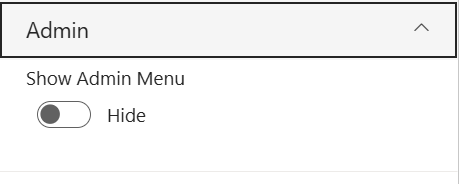

| 🏷️ Name                | 🎯 Purpose                                                     | 💡 Select Option |
| ----------------------- | -------------------------------------------------------------- | ---------------- |
| 👁️ **Show Admin Menu** | Toggles visibility of the admin menu for managing quick links. | `Hide`           |

#### ℹ️ About Section

📸 View Property Pane Screenshots

| 🏷️ Name                      | 🎯 Purpose                                                                           |
| ----------------------------- | ------------------------------------------------------------------------------------ |
| 👨‍💻**Developer Info**       | Indicates the web part is developed by**SharePoint Designs**.                        |
| 📚**Documentation Link**      | Provides access to user and admin documentation for further guidance.                |
| 🔑**Activate License Button** | A button to activate the premium or licensed version of the web part, if applicable. |

## 📰 5. Latest News

Showcase concise company updates in a clean, minimal layout. Integrates with SharePoint news or RSS feeds.

- - -

#### 📰 Header Settings

This section allows customization of the Latest News web part header, including title, visibility, background, and navigation options.

📸 View Property Pane Screenshots

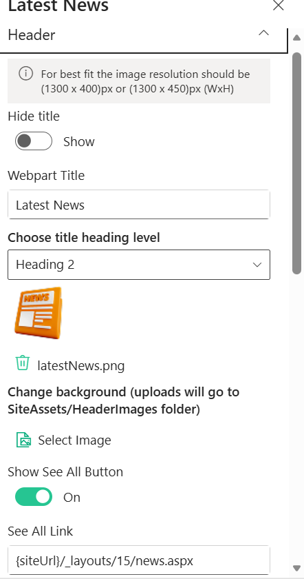

#### 🧾 Header Configuration

| 🏷️ Name                   | 🎯 Purpose                                                    | 💡 Select Option                  |
| -------------------------- | ------------------------------------------------------------- | --------------------------------- |
| 👁️ **Hide Title**         | Toggles visibility of the web part title.                     | `Show`                            |
| 📝 **Webpart Title**       | Defines the title displayed at the top of the web part.       | `Latest News`                     |
| 🔤 **Heading Level**       | Sets the semantic heading level for the title (e.g., H1–H6).  | `Heading 2`                       |
| 🖼️ **Header Image**       | Displays or uploads an image/icon for the header.             | `latestNews.png`                  |
| 🌄 **Background Image**    | Uploads or selects a background image for the header section. | `Select Image`                    |
| 🔘 **Show See All Button** | Toggles visibility of the “See All” navigation button.        | `On`                              |
| 🔗 **See All Link**        | Defines the navigation URL for the “See All” button.          | `{siteUrl}/_layouts/15/news.aspx` |

#### 🧱 Layout Settings

This section allows selection of the layout style for displaying news content.

📸 View Property Pane Screenshots

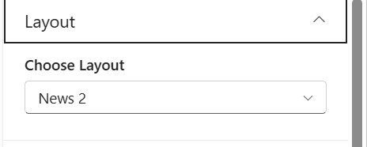

| 🏷️ Name             | 🎯 Purpose                                           | 💡 Select Option |
| -------------------- | ---------------------------------------------------- | ---------------- |
| 🧩 **Choose Layout** | Selects the layout style used to display news items. | `News 2`         |

#### ⚙️ General Settings

This section allows configuration of news sources, audience targeting, and category filtering.

📸 View Property Pane Screenshots

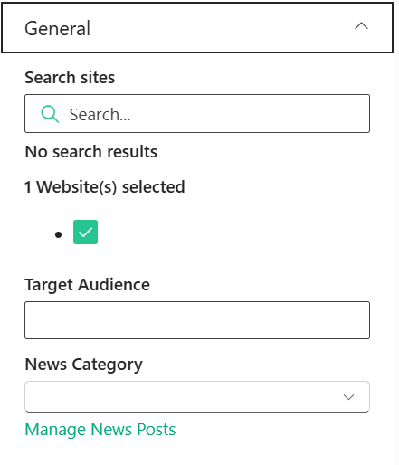

#### 📰 News Configuration

| 🏷️ Name                 | 🎯 Purpose                                                       | 💡 Select Option     |
| ------------------------ | ---------------------------------------------------------------- | -------------------- |
| 🔍 **Search Sites**      | Allows searching and selecting SharePoint sites as news sources. | `1 Website Selected` |
| 👥 **Target Audience**   | Defines audience targeting for displaying specific news content. | `Not Selected`       |
| 🗂️ **News Category**    | Filters news posts based on selected category.                   | `Not Selected`       |
| 🔗 **Manage News Posts** | Provides quick navigation to manage news content.                | `Link`               |

#### 🎨 Appearance Settings

This section allows customization of visual styling such as borders and shadows.

📸 View Property Pane Screenshots

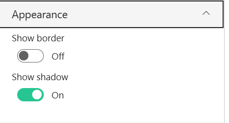

| 🏷️ Name           | 🎯 Purpose                                        | 💡 Select Option |
| ------------------ | ------------------------------------------------- | ---------------- |
| 🔲 **Show Border** | Toggles visibility of border around the web part. | `Off`            |
| 🌑 **Show Shadow** | Toggles shadow effect for better visual depth.    | `On`             |

#### ℹ️ About Section

📸 View Property Pane Screenshots

| 🏷️ Name                      | 🎯 Purpose                                                                           |
| ----------------------------- | ------------------------------------------------------------------------------------ |
| 👨‍💻**Developer Info**       | Indicates the web part is developed by**SharePoint Designs**.                        |
| 📚**Documentation Link**      | Provides access to user and admin documentation for further guidance.                |
| 🔑**Activate License Button** | A button to activate the premium or licensed version of the web part, if applicable. |

## 👏 6. Kudos

### 📋 Details

This web part highlights employee recognition, celebrations, and appreciation moments in an engaging card layout.

* **Employee Recognition** : Displays kudos, achievements, or special occasions like birthdays.
* **Highlight Card Design** : Uses a visually appealing card to spotlight an individual.
* **Personalized Message** : Shows custom messages such as birthday wishes or appreciation notes.
* **Quick Action Button** : Includes a “Send Appreciation” button to encourage user interaction.
* **See All Navigation** : Provides a “See all” option to view more recognition posts.
* **User-Friendly Layout** : Ensures a clean and engaging experience for end users.

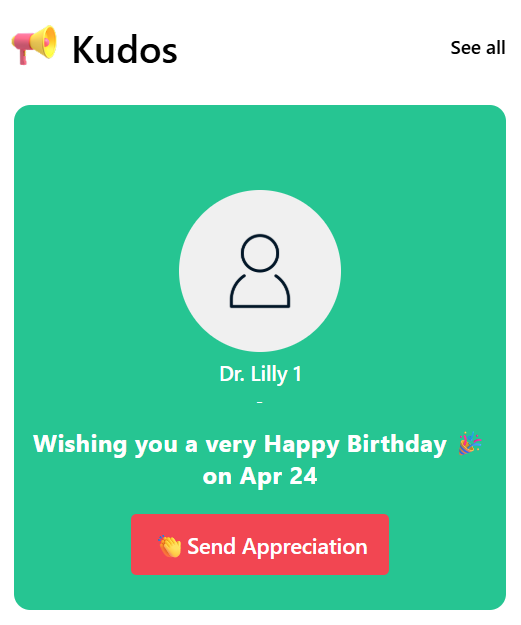

#### 📌 Header Settings

This section allows customization of the Kudos web part header, including visibility, title, navigation, and background.

📸 View Property Pane Screenshots

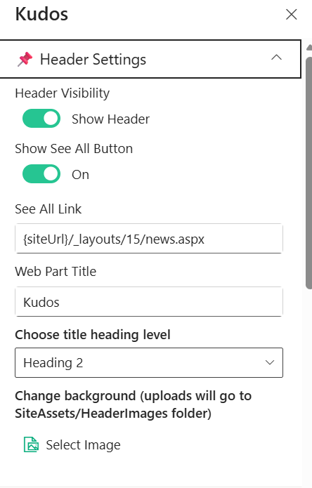

#### 🧾 Header Configuration

| 🏷️ Name                   | 🎯 Purpose                                                    | 💡 Select Option                  |
| -------------------------- | ------------------------------------------------------------- | --------------------------------- |
| 👁️ **Header Visibility**  | Toggles visibility of the web part header.                    | `Show Header`                     |
| 🔘 **Show See All Button** | Toggles visibility of the “See All” navigation button.        | `On`                              |
| 🔗 **See All Link**        | Defines the navigation URL for the “See All” button.          | `{siteUrl}/_layouts/15/news.aspx` |
| 📝 **Web Part Title**      | Defines the title displayed at the top of the web part.       | `Kudos`                           |
| 🔤 **Heading Level**       | Sets the semantic heading level for the title (e.g., H1–H6).  | `Heading 2`                       |
| 🖼️ **Background Image**   | Uploads or selects a background image for the header section. | `Select Image`                    |

#### ⚙️ General Settings

This section allows configuration of data source, time-based filtering, and category options for the Kudos web part.

📸 View Property Pane Screenshots

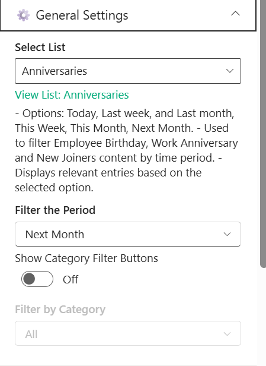

| 🏷️ Name                            | 🎯 Purpose                                                              | 💡 Select Option |
| ----------------------------------- | ----------------------------------------------------------------------- | ---------------- |
| 📋 **Select List**                  | Chooses the SharePoint list used to fetch kudos or anniversary data.    | `Anniversaries`  |
| 🔗 **View List**                    | Provides quick navigation to view the selected SharePoint list.         | `Anniversaries`  |
| ⏳ **Filter the Period**             | Filters entries based on selected time range (e.g., Today, This Month). | `Next Month`     |
| 🧩 **Show Category Filter Buttons** | Toggles visibility of category filter buttons in the UI.                | `Off`            |
| 🗂️ **Filter by Category**          | Filters content by specific category (e.g., Birthday, Anniversary).     | `All`            |

#### 🎨 Appearance Settings

This section allows customization of visual styles such as borders, shadows, and background images.

📸 View Property Pane Screenshots

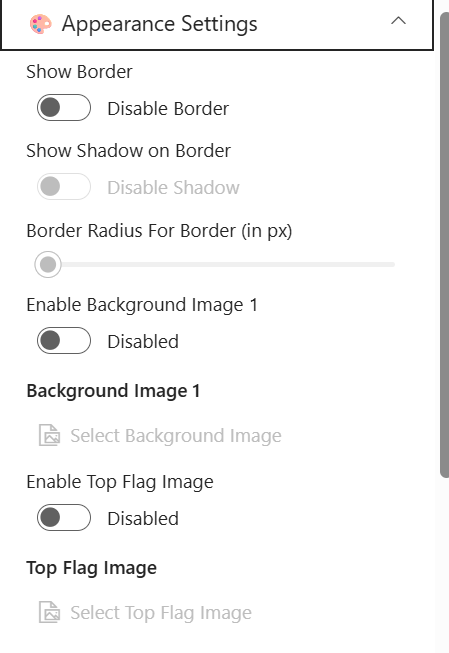

| 🏷️ Name                         | 🎯 Purpose                                             | 💡 Select Option |
| -------------------------------- | ------------------------------------------------------ | ---------------- |
| 🔲 **Show Border**               | Toggles visibility of the border around the component. | `Disable Border` |
| 🌑 **Show Shadow on Border**     | Enables or disables shadow effect on the border.       | `Disable Shadow` |
| 🔘 **Border Radius (px)**        | Adjusts the roundness of the border corners.           | `Not Set`        |
| 🌄 **Enable Background Image 1** | Toggles background image usage for the component.      | `Disabled`       |
| 🖼️ **Background Image 1**       | Uploads or selects a background image.                 | `Not Selected`   |
| 🚩 **Enable Top Flag Image**     | Toggles visibility of a top flag image element.        | `Disabled`       |
| 🏳️ **Top Flag Image**           | Uploads or selects a top flag image.                   | `Not Selected`   |

#### 🎠 Carousel Settings

This section allows configuration of carousel behavior such as auto play and speed.

📸 View Property Pane Screenshots

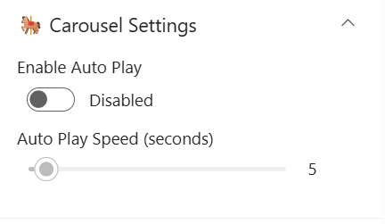

| 🏷️ Name                         | 🎯 Purpose                                        | 💡 Select Option |
| -------------------------------- | ------------------------------------------------- | ---------------- |
| ▶️ **Enable Auto Play**          | Toggles automatic sliding of carousel items.      | `Disabled`       |
| ⏱️ **Auto Play Speed (seconds)** | Controls the delay between each slide transition. | `5`              |

#### 🛠️ Admin Settings

This section allows control over admin-specific options and visibility.

📸 View Property Pane Screenshots

| 🏷️ Name                | 🎯 Purpose                                                 | 💡 Select Option |
| ----------------------- | ---------------------------------------------------------- | ---------------- |
| 👁️ **Show Admin Menu** | Toggles visibility of the admin menu for managing content. | `Hide`           |

#### ℹ️ About Section

📸 View Property Pane Screenshots

| 🏷️ Name                      | 🎯 Purpose                                                                           |
| ----------------------------- | ------------------------------------------------------------------------------------ |
| 👨‍💻**Developer Info**       | Indicates the web part is developed by **SharePoint Designs**.                       |
| 📚**Documentation Link**      | Provides access to user and admin documentation for further guidance.                |
| 🔑**Activate License Button** | A button to activate the premium or licensed version of the web part, if applicable. |

## 🧘7. Mindfullness

### 📋 Details

This web part promotes mindfulness and well-being by displaying calming techniques and guided exercises in a structured layout.

* **Mindfulness Techniques**: Displays guided exercises like grounding techniques for mental wellness.
* **Structured Content Display**: Presents steps clearly (e.g., 5-4-3-2-1 technique) for easy understanding.
* **Engaging UI**: Uses icons and cards to represent each step interactively.
* **Customizable Content**: Allows configuration of title, description, and resource list.
* **Resource Integration**: Fetches mindfulness items dynamically from a selected SharePoint list.
* **User-Friendly Design**: Ensures a clean and calming experience for end users.

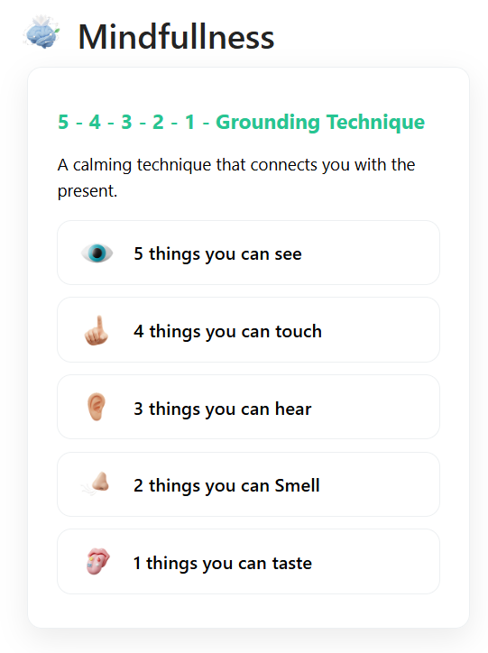

- - -

#### 📌 Header Settings

This section allows customization of the web part header including title, visibility, and background.

📸 View Property Pane Screenshots

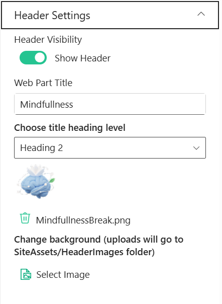

| 🏷️ Name                  | 🎯 Purpose                                                    | 💡 Select Option        |
| ------------------------- | ------------------------------------------------------------- | ----------------------- |
| 👁️ **Header Visibility** | Toggles visibility of the web part header.                    | `Show Header`           |
| 📝 **Web Part Title**     | Defines the title displayed at the top of the web part.       | `Mindfullness`          |
| 🔤 **Heading Level**      | Sets the semantic heading level for the title (e.g., H1–H6).  | `Heading 2`             |
| 🖼️ **Header Image**      | Displays or uploads an image/icon for the header.             | `MindfullnessBreak.png` |
| 🌄 **Background Image**   | Uploads or selects a background image for the header section. | `Select Image`          |

- - -

#### 🧠 Content Settings

This section allows customization of the main content displayed in the web part.

📸 View Property Pane Screenshots

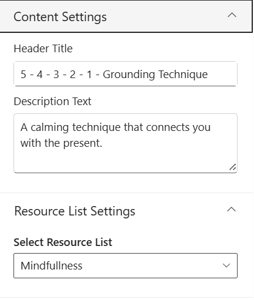

| 🏷️ Name                | 🎯 Purpose                                           | 💡 Select Option                                          |
| ----------------------- | ---------------------------------------------------- | --------------------------------------------------------- |
| 🏷️ **Header Title**    | Defines the main heading of the mindfulness content. | `5 - 4 - 3 - 2 - 1 - Grounding Technique`                 |
| 📝 **Description Text** | Displays supporting description for the technique.   | `A calming technique that connects you with the present.` |

- - -

#### 📂 Resource List Settings

This section allows selection of the data source for mindfulness resources.

📸 View Property Pane Screenshots

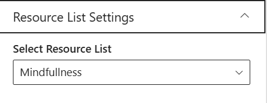

| 🏷️ Name                    | 🎯 Purpose                                                   | 💡 Select Option |
| --------------------------- | ------------------------------------------------------------ | ---------------- |
| 📚 **Select Resource List** | Chooses the SharePoint list used to fetch mindfulness items. | `Mindfullness`   |

- - -

#### ℹ️ About

This section provides information about the web part version and documentation.

📸 View Property Pane Screenshots

| 🏷️ Name               | 🎯 Purpose                                    | 💡 Value             |
| ---------------------- | --------------------------------------------- | -------------------- |
| 👨‍💻 **Developed By** | Displays the developer or organization name.  | `SharePoint Designs` |
| 📄 **Documentation**   | Provides link to web part documentation.      | `Available`          |
| 🧾 **Version**         | Displays the current version of the web part. | `1.0.0.0`            |

## 🎥 8.Training Videos

### 📋 Details

This web part showcases training videos in a visually engaging card layout with category-based filtering and playback options.

* **Video Library Display**: Displays training videos from selected document libraries.
* **Category-Based Filtering**: Allows users to filter videos by categories such as General Ophthalmology, Surgical Procedures, etc.
* **Interactive Video Cards**: Shows thumbnails, views count, date, and description for each video.
* **Play Overlay UI**: Includes a play button overlay for quick video access.
* **Dynamic Content Loading**: Fetches videos dynamically from SharePoint libraries.
* **User-Friendly Layout**: Ensures a clean and responsive viewing experience.

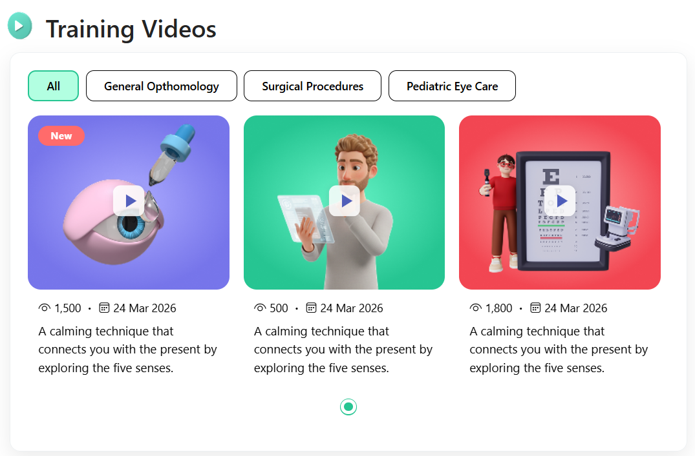

- - -

#### 📌 Header Settings

This section allows customization of the web part header including title, visibility, and navigation options.

📸 View Property Pane Screenshots

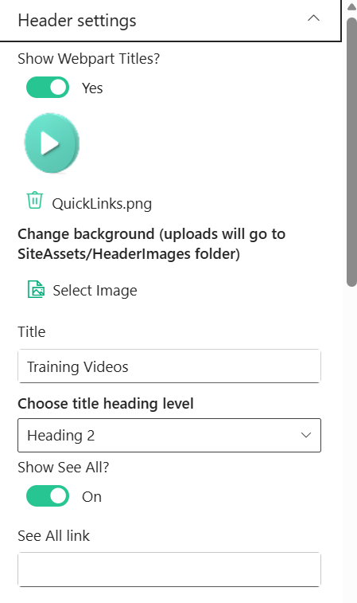

| 🏷️ Name                    | 🎯 Purpose                                                    | 💡 Select Option     |
| --------------------------- | ------------------------------------------------------------- | -------------------- |
| 👁️ **Show Webpart Titles** | Toggles visibility of the web part title.                     | `Yes`                |
| 🖼️ **Header Icon/Image**   | Displays or uploads an icon/image for the header.             | `TrainingVidoes.png` |
| 🌄 **Background Image**     | Uploads or selects a background image for the header section. | `Select Image`       |
| 📝 **Title**                | Defines the title displayed at the top of the web part.       | `Training Videos`    |
| 🔤 **Heading Level**        | Sets the semantic heading level for the title (e.g., H1–H6).  | `Heading 2`          |
| 🔘 **Show See All Button**  | Toggles visibility of the “See All” navigation button.        | `On`                 |
| 🔗 **See All Link**         | Defines the navigation URL for the “See All” button.          | `Configured Link`    |

- - -

#### 🧱 Layout Settings

This section allows configuration of data source and library selection.

📸 View Property Pane Screenshots

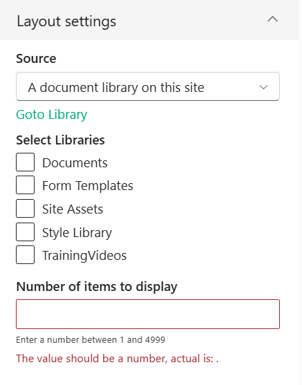

| 🏷️ Name                          | 🎯 Purpose                                             | 💡 Select Option                  |
| --------------------------------- | ------------------------------------------------------ | --------------------------------- |
| 📡 **Source**                     | Defines the source of videos (e.g., document library). | `A document library on this site` |
| 📚 **Select Libraries**           | Chooses libraries from which videos are fetched.       | `TrainingVideos`                  |
| 🔢 **Number of Items to Display** | Controls how many videos are shown in the web part.    | `Not Set`                         |

- - -

#### 🎨 Appearance Settings

This section allows customization of layout, visibility, and display options.

📸 View Property Pane Screenshots

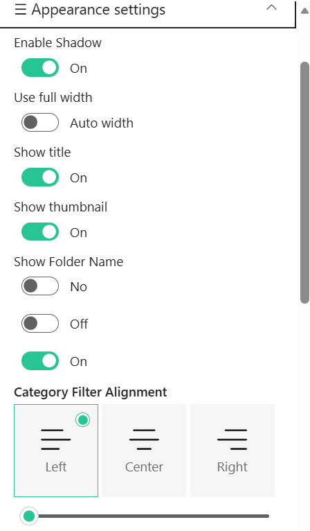

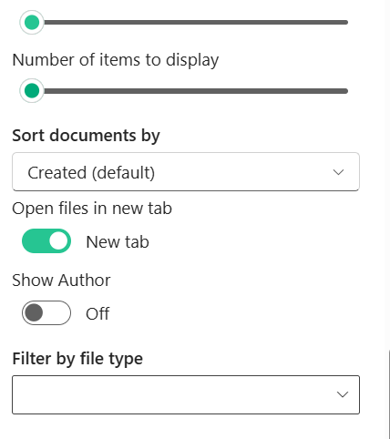

| 🏷️ Name                         | 🎯 Purpose                                            | 💡 Select Option    |
| -------------------------------- | ----------------------------------------------------- | ------------------- |
| 🌑 **Enable Shadow**             | Toggles shadow effect for visual depth.               | `On`                |
| 📐 **Use Full Width**            | Adjusts layout width to full container or auto width. | `Auto width`        |
| 📝 **Show Title**                | Toggles visibility of video titles.                   | `On`                |
| 🖼️ **Show Thumbnail**           | Displays video thumbnail images.                      | `On`                |
| 📁 **Show Folder Name**          | Toggles display of folder/library name.               | `No`                |
| 🎯 **Category Filter Alignment** | Aligns category filter buttons (Left, Center, Right). | `Left`              |
| 🔢 **Number of Items Slider**    | Controls number of items displayed via slider.        | `Configured`        |
| 🔽 **Sort Documents By**         | Defines sorting order for videos.                     | `Created (default)` |
| 🔗 **Open Files in New Tab**     | Opens video links in a new browser tab.               | `New tab`           |
| 👤 **Show Author**               | Toggles display of video author details.              | `Off`               |
| 🗂️ **Filter by File Type**      | Filters videos based on file type.                    | `Not Selected`      |

- - -

#### ℹ️ About

This section provides information about the web part version and documentation.

📸 View Property Pane Screenshots

| 🏷️ Name               | 🎯 Purpose                                    | 💡 Value             |
| ---------------------- | --------------------------------------------- | -------------------- |
| 👨‍💻 **Developed By** | Displays the developer or organization name.  | `SharePoint Designs` |
| 📄 **Documentation**   | Provides link to web part documentation.      | `Available`          |
| 🧾 **Version**         | Displays the current version of the web part. | `1.0.0.0`            |

## 📆 9. Calendar

### 📋 Details

This web part provides a structured calendar view to manage and display events with filtering and quick access options.

* **Event Management**: Displays events from a selected SharePoint list.
* **Calendar View**: Provides an interactive calendar to visualize events by date.
* **Event Filtering**: Supports filtering events such as upcoming or past events.
* **Quick Actions**: Includes options to add and edit events directly.
* **Dynamic Data Display**: Fetches event data dynamically from SharePoint.
* **User-Friendly Interface**: Ensures a clean and intuitive calendar experience.

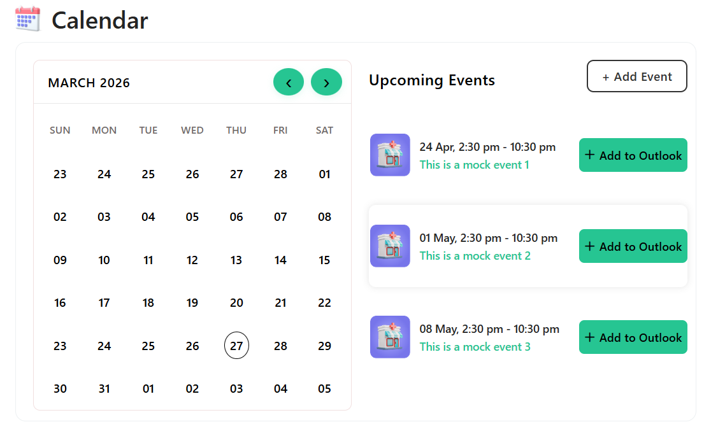

- - -

#### 📌 Header Settings

This section allows customization of the web part header including title, visibility, and navigation.

📸 View Property Pane Screenshots

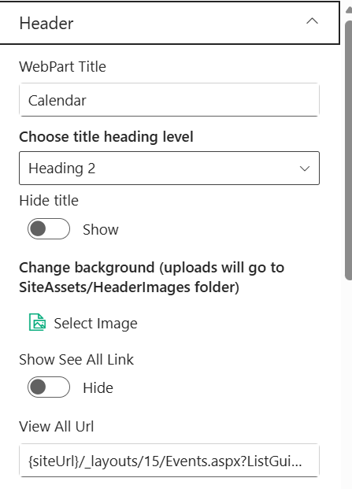

| 🏷️ Name                 | 🎯 Purpose                                                    | 💡 Select Option                        |
| ------------------------ | ------------------------------------------------------------- | --------------------------------------- |
| 📝 **WebPart Title**     | Defines the title displayed at the top of the web part.       | `Calendar`                              |
| 🔤 **Heading Level**     | Sets the semantic heading level for the title (e.g., H1–H6).  | `Heading 2`                             |
| 👁️ **Hide Title**       | Toggles visibility of the web part title.                     | `Show`                                  |
| 🌄 **Background Image**  | Uploads or selects a background image for the header section. | `Select Image`                          |
| 🔘 **Show See All Link** | Toggles visibility of the “See All” navigation link.          | `Hide`                                  |
| 🔗 **View All URL**      | Defines the navigation URL for viewing all events.            | `{siteUrl}/_layouts/15/Events.aspx?...` |

- - -

#### 🧠 Content Settings

This section allows configuration of event source, display options, and filtering.

📸 View Property Pane Screenshots

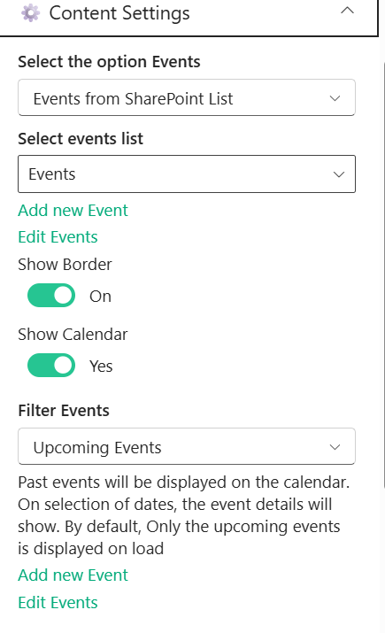

| 🏷️ Name                        | 🎯 Purpose                                                | 💡 Select Option              |
| ------------------------------- | --------------------------------------------------------- | ----------------------------- |
| 📡 **Select the Option Events** | Defines the source type for events.                       | `Events from SharePoint List` |
| 📋 **Select Events List**       | Chooses the SharePoint list used to fetch events.         | `Events`                      |
| ➕ **Add New Event**             | Provides quick action to create a new event.              | `Available`                   |
| ✏️ **Edit Events**              | Provides quick action to edit existing events.            | `Available`                   |
| 🔲 **Show Border**              | Toggles border visibility around the calendar component.  | `On`                          |
| 📅 **Show Calendar**            | Toggles visibility of the calendar view.                  | `Yes`                         |
| 🔍 **Filter Events**            | Filters events based on criteria (e.g., upcoming events). | `Upcoming Events`             |

- - -

#### 🛠️ Admin Settings

This section allows control over admin-specific options.

📸 View Property Pane Screenshots

| 🏷️ Name                | 🎯 Purpose                                                | 💡 Select Option |
| ----------------------- | --------------------------------------------------------- | ---------------- |
| 👁️ **Show Admin Menu** | Toggles visibility of the admin menu for managing events. | `Hide`           |

- - -

#### ℹ️ About

This section provides information about the web part version and documentation.

📸 View Property Pane Screenshots

| 🏷️ Name               | 🎯 Purpose                                    | 💡 Value             |
| ---------------------- | --------------------------------------------- | -------------------- |
| 👨‍💻 **Developed By** | Displays the developer or organization name.  | `SharePoint Designs` |
| 📄 **Documentation**   | Provides link to web part documentation.      | `Available`          |
| 🧾 **Version**         | Displays the current version of the web part. | `1.0.0.0`            |

## 🏥 10. Locations

### 📋 Details

This web part displays organizational locations or facilities in a visually rich card layout with quick navigation options.

* **Location Showcase**: Displays facility details with image, name, and location.
* **Card-Based Layout**: Uses a clean and modern card UI for better visual presentation.
* **Quick Navigation**: Includes a “View Location” button for easy access.
* **Dynamic Data Source**: Fetches location details from a SharePoint list.
* **User-Friendly Design**: Ensures a simple and intuitive browsing experience.

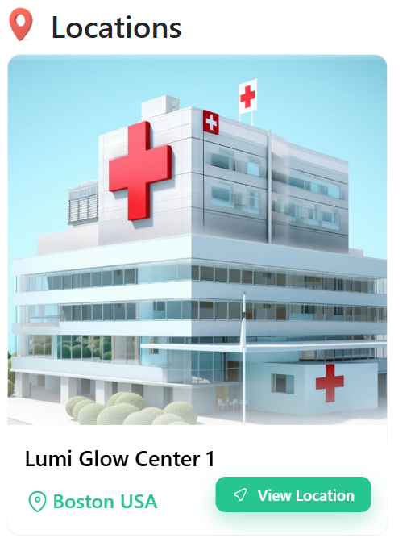

- - -

#### 📌 Header Settings

This section allows customization of the web part header including title, visibility, and background.

📸 View Property Pane Screenshots

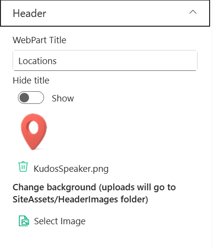

| 🏷️ Name                  | 🎯 Purpose                                                    | 💡 Select Option   |
| ------------------------- | ------------------------------------------------------------- | ------------------ |
| 📝 **WebPart Title**      | Defines the title displayed at the top of the web part.       | `Locations`        |
| 👁️ **Hide Title**        | Toggles visibility of the web part title.                     | `Show`             |
| 🖼️ **Header Icon/Image** | Displays or uploads an icon/image for the header.             | `KudosSpeaker.png` |
| 🌄 **Background Image**   | Uploads or selects a background image for the header section. | `Select Image`     |

- - -

#### 🧠 Content Settings

This section allows configuration of the data source for locations.

📸 View Property Pane Screenshots

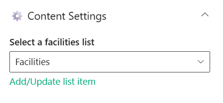

| 🏷️ Name                      | 🎯 Purpose                                                  | 💡 Select Option |
| ----------------------------- | ----------------------------------------------------------- | ---------------- |
| 📋 **Select Facilities List** | Chooses the SharePoint list used to fetch location details. | `Facilities`     |
| ➕ **Add/Update List Item**    | Provides quick action to manage location entries.           | `Available`      |

- - -

#### 🧱 Layout Settings

This section allows configuration of navigation and display options.

📸 View Property Pane Screenshots

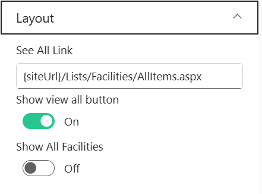

| 🏷️ Name                    | 🎯 Purpose                                           | 💡 Select Option                           |
| --------------------------- | ---------------------------------------------------- | ------------------------------------------ |
| 🔗 **See All Link**         | Defines the navigation URL to view all locations.    | `{siteUrl}/Lists/Facilities/AllItems.aspx` |
| 🔘 **Show View All Button** | Toggles visibility of the “View All” button.         | `On`                                       |
| 🏢 **Show All Facilities**  | Toggles display of all facilities without filtering. | `Off`                                      |

- - -

#### 🛠️ Admin Settings

This section allows control over admin-specific options.

📸 View Property Pane Screenshots

| 🏷️ Name                | 🎯 Purpose                                                   | 💡 Select Option |
| ----------------------- | ------------------------------------------------------------ | ---------------- |
| 👁️ **Show Admin Menu** | Toggles visibility of the admin menu for managing locations. | `Hide`           |

- - -

#### ℹ️ About

This section provides information about the web part version and documentation.

📸 View Property Pane Screenshots

| 🏷️ Name               | 🎯 Purpose                                    | 💡 Value             |
| ---------------------- | --------------------------------------------- | -------------------- |
| 👨‍💻 **Developed By** | Displays the developer or organization name.  | `SharePoint Designs` |
| 📄 **Documentation**   | Provides link to web part documentation.      | `Available`          |
| 🧾 **Version**         | Displays the current version of the web part. | `1.0.0.0`            |
