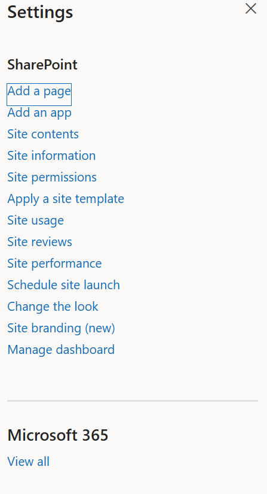
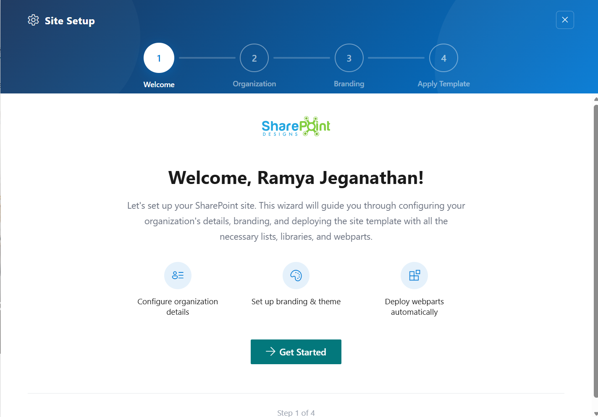
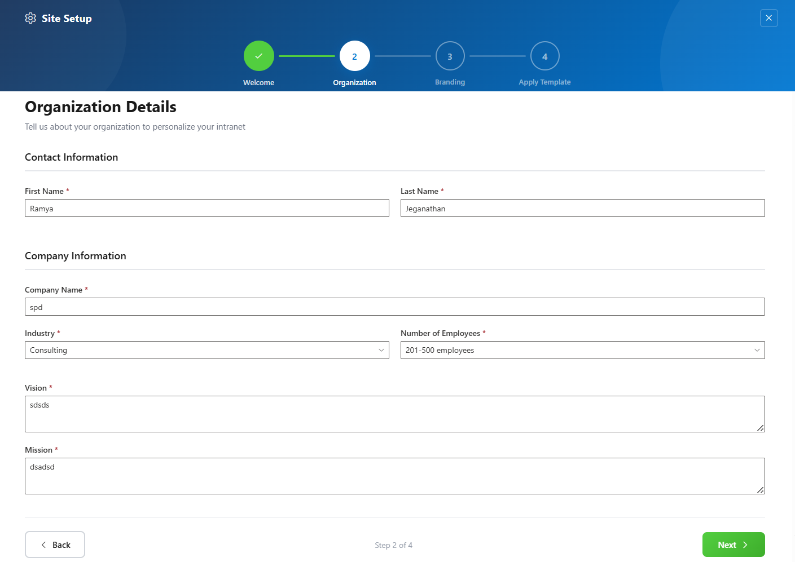
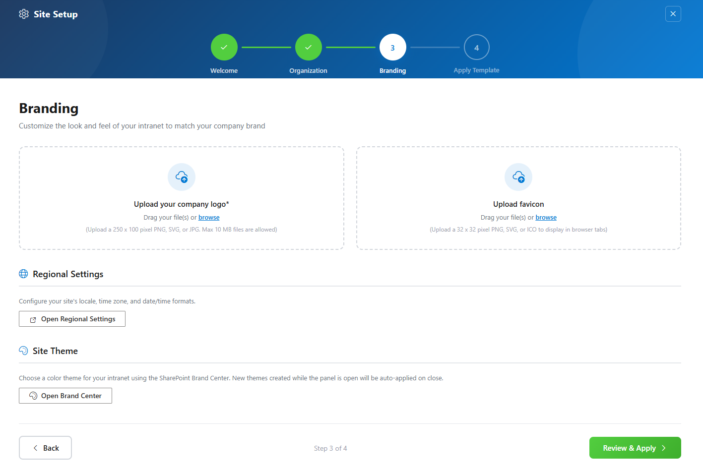
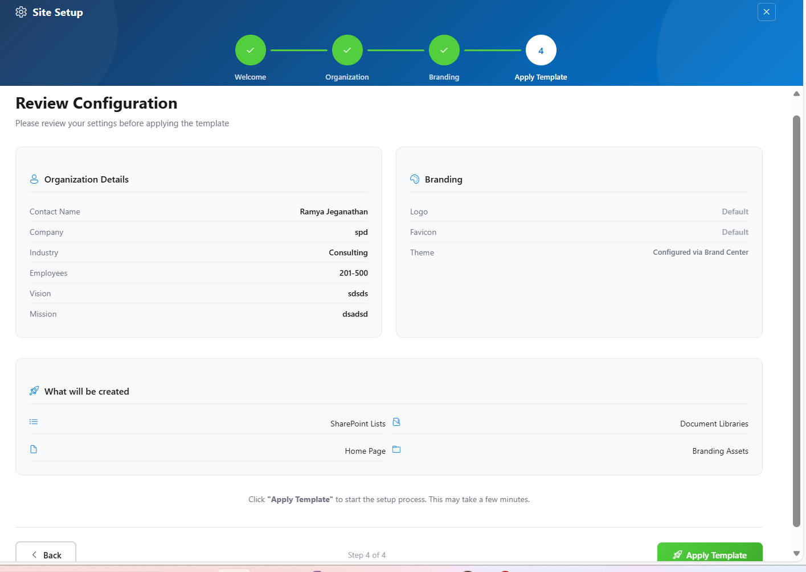
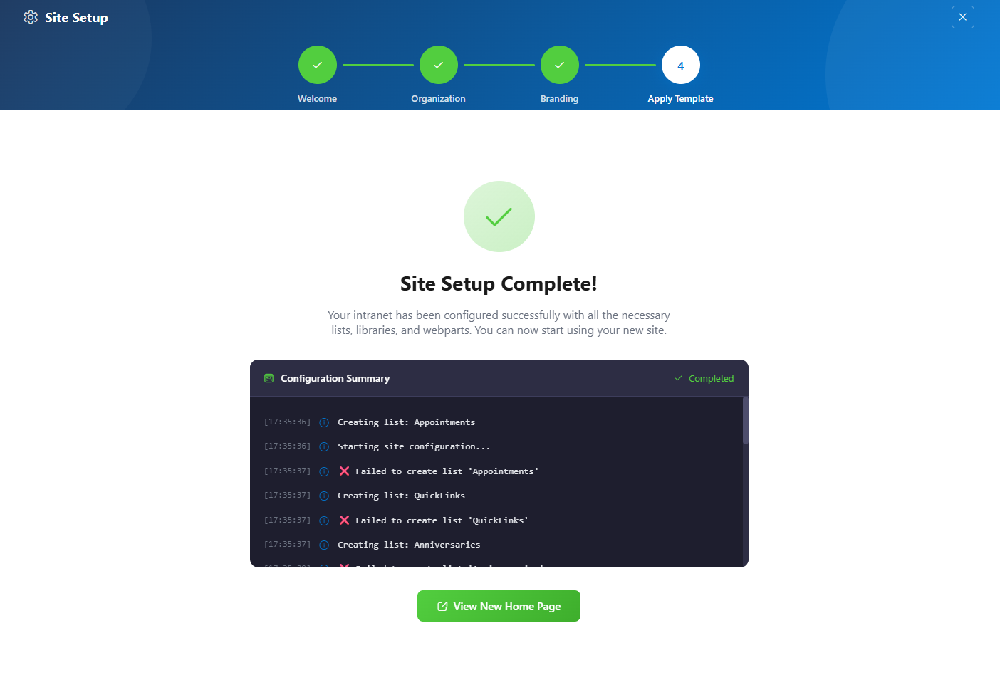

## ⚙️ Installation Instructions

- Upload the `spd-healthcare-03.sppkg` file to your App Catalog
- Navigate to your modern SharePoint site.
- Click the **Settings (gear)** icon → Select **“Add an app”**

  

- Choose **Healthcare 03 by SharePoint Designs**
- Click **Add**
- After installation, go to **Site Contents** to confirm it's added to the site.

  

---

## 🧪 Testing Instructions

## 🧪 Steps to Set Up and Apply Template

Follow the steps below to configure your SharePoint site using the setup wizard:

---

### 🔹 Step 1: Welcome Screen

1. Open the **Site Setup panel** from the top suite bar.
2. You will land on the **Welcome screen**.
3. This screen provides an overview of what will be configured:
   - Organization details
   - Branding and theme
   - Automatic deployment of web parts

4. Click **Get Started** to proceed.

📸 View Apply template Screenshots

---

### 🔹 Step 2: Organization Details

1. Enter the required **Contact Information**:
   - First Name
   - Last Name

2. Fill in **Company Information**:
   - Company Name
   - Industry
   - Number of Employees

3. Provide additional details:
   - Vision
   - Mission

4. Click **Next** to continue.

📸 View Apply Template Screenshots

---

### 🔹 Step 3: Branding

1. Upload your organization branding:
   - Company Logo
   - Favicon

2. Configure regional settings if required:
   - Click **Open Regional Settings**

3. Apply site theme:
   - Click **Open Brand Center** to choose or create a theme

4. Once done, click **Review & Apply**

📸 View Apply Template Screenshots

---

### 🔹 Step 4: Review Configuration

1. Review all the configured details:
   - Organization Details
   - Branding Settings

2. Check the **What will be created** section:
   - SharePoint Lists
   - Document Libraries
   - Home Page
   - Branding Assets

3. Click **Apply Template** to start the setup process.

📸 View Apply Template Screenshots

---

### 🔹 Step 5: Setup Completion

1. The system will begin configuring your site and display a **Configuration Summary**.
2. You can track:
   - List creation progress
   - Library setup
   - Web part deployment

3. Once completed, a success message will appear:\
   **“Site Setup Complete!”**
4. Click **View New Home Page** to open your newly created site.

📸 View Apply Template Screenshots

> 💡 **Note:**
>
> - If any step fails during setup, it will be highlighted in the configuration summary.
> - Do not refresh the page while the setup is in progress.

---

## 🔑 Activating 30 Days Free Trial

### License Activation Steps

| Step | Action                   | Details / Notes                                                      |
| ---- | ------------------------ | -------------------------------------------------------------------- |
| 1    | Go to the app page       | Navigate to the SharePoint page where the app is installed           |
| 2    | Open activation panel    | If the subscription is pending, a **Buy Now** button will be visible |
| 3    | Launch activation dialog | Click **Buy Now** to open the purchase dialog                        |
| 4    | Purchase the license     | Complete the payment process                                         |
| 5    | Configure SaaS account   | After purchase, click **Configure your SaaS account**                |
| 6    | Subscribe to app         | On the landing page, click **Subscribe**                             |

---

## 🛒 Purchase License & Trial Information

- Purchasing the license automatically **activates a 30-day free trial**.
- No charges apply during the trial period.
- Once activation is completed successfully, the app is fully available for use.

---

### ✅ Expected Behaviour

The following resources are provisioned upon applying the Home template:

- 📄 **Appointments** (List)
- 📄 **Quick Links** (List)
- 📄 **Anniversaries** (List)
- 📄 **Mindfullness** (List)
- 📄 **Events** (List)
- 🖼️ **Training Videos** (Library)
- 📄 **Facilities** (List)

> Mock data is also auto-added for:
>
> - Appointments
> - Quicklinks
> - Anniversaries
> - Mindfullness
> - Training Videos
> - Facilities
>
> **No manual configuration required after clicking the Apply template button.**

---

## 🧹 Uninstall Guide

Follow the steps below to uninstall the **Healthcare Intranet Design 3 by SharePoint Designs** app from your SharePoint site:

1. Go to your SharePoint site and click on **Site Contents** from the left side navigation or the settings menu.
2. Find **Healthcare Intranet Design 3 by SharePoint Designs** in the list of installed apps.
3. Click the three dots (···) next to the app name and select **"Remove"**.
4. If prompted to switch to the **Classic Experience**, follow the prompt to proceed.
5. In the Classic Experience, hover over the app again, click the three dots (···), and then click **Remove** to finalize the uninstallation.

---

## 🛠️ Troubleshooting Common Issues

### ⚠️ Issue: Web Part Not Displaying Correctly

**Solution**: Ensure that the web part has been added to a modern SharePoint page and that the page has been republished. Check for any missing permissions that might be required for the web part to function correctly.

### 🗃️ Issue: Lists/Library Not Created

**Solution**: Verify that the **"Apply template"** button was clicked after adding the **"Healthcare 03 Setup"** web part. If the lists/Library are still not created, delete the page and reapply the design.

### 📝 Issue: Missing Demo Items

**Solution**: Check if the lists items are present in the Site Contents. If the lists are empty, manually add demo items or reapply the design.

---

## 🌟 Best Practices

### 🔁 Regular Updates

- **Keep Content Fresh**: Regularly update the content on your SharePoint site to keep it relevant and engaging.
- **Monitor Performance**: Regularly check the performance of your SharePoint site and make necessary adjustments to improve speed and user experience.

### 🎓 User Training

- **Provide Training**: Offer training sessions for users to help them understand how to use the SharePoint site effectively.
- **Create Documentation**: Develop comprehensive documentation to guide users on how to navigate and use the site.

### 🔐 Security Measures

- **Implement Security Protocols**: Ensure that proper security measures are in place to protect sensitive information.
- **Regular Audits**: Conduct regular security audits to identify and address potential vulnerabilities.

### 🗣️ User Feedback

- **Collect Feedback**: Regularly collect feedback from users to understand their needs and improve the site accordingly.
- **Act on Feedback**: Implement changes based on user feedback to enhance the overall user experience.

### 🤝 Collaboration

- **Encourage Collaboration**: Promote collaboration among team members by providing tools and features that facilitate communication and teamwork.
- **Use SharePoint Features**: Utilize SharePoint features such as document libraries, lists, and workflows to streamline collaboration and improve productivity.

---

## 🧑‍💼 User Permissions

| **Role**     | **Permissions**                                      |
| ------------ | ---------------------------------------------------- |
| **Owners**   | Full control — manage app, lists, license, settings. |
| **Members**  | Contribute content such as links, documents, events. |
| **Visitors** | Read-only access. General audience viewing.          |

> Stick to the **least privilege principle**. Review permissions regularly.

---

## 🆘 Support

Please contact **SharePoint Designs**
🌐 [www.sharepointdesigns.com](https://www.sharepointdesigns.com)
📧 support@sharepointdesigns.com
