Each web part is configured through its **settings panel**. To open it, click the web part while editing the page and click the **pencil (edit) icon**.

- - -

1. Document Welcome Banner

## 1. Document Welcome Banner

The Document Welcome Banner is the full-width hero at the top of the page. It displays a background image and a department or page title that identifies the document area to visitors.

### 📌 Header

| Name                   | Purpose                                                       | Control Type |
| ---------------------- | ------------------------------------------------------------- | ------------ |
| Department Title       | The main heading shown over the banner image                  | Text field   |
| Department Title Color | Picks a colour for the title text from the site theme palette | Color picker |

📸 View Header Screenshots

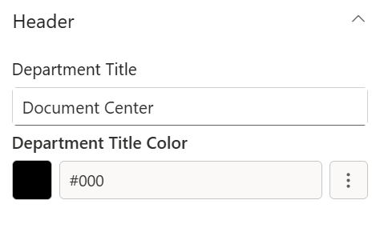

- - -

### 📸 Background Image

| Name                     | Purpose                                                                             | Control Type |
| ------------------------ | ----------------------------------------------------------------------------------- | ------------ |
| Change Background        | Select or upload the banner background image                                        | Image picker |
| Background Image Scaling | How the background image fills the banner: Cover, Contain, Auto, Stretch, or Centre | Dropdown     |

📸 View Background Image Screenshots

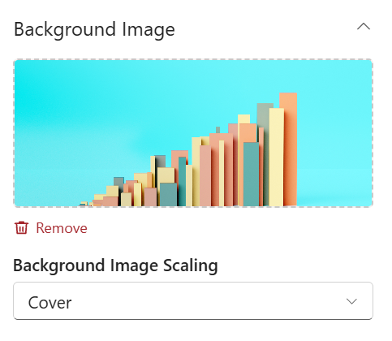

- - -

### 🎨 Appearance

| Name           | Purpose                                       | Control Type        |
| -------------- | --------------------------------------------- | ------------------- |
| Title Position | Moves the title text up or down on the banner | Slider (1–87%)      |
| Banner Height  | Controls the overall height of the banner     | Slider (250–550 px) |

📸 View Appearance Screenshots

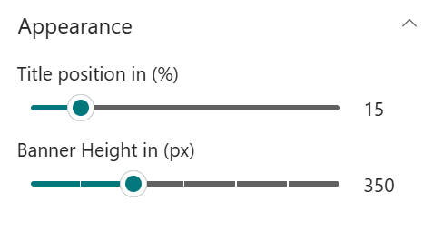

- - -

2. Document Contents

## 2. Document Contents

Document Contents is the main document browsing section. It pulls files from a SharePoint library and presents them in a chosen view, with optional filtering by folder, category, and file type.

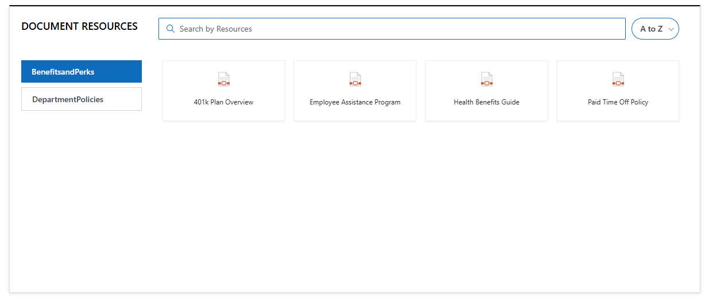

### 📌 Header

| Name                | Purpose                                                                                               | Control Type      |
| ------------------- | ----------------------------------------------------------------------------------------------------- | ----------------- |
| Show Header         | Shows or hides the web part title and "See All" link                                                  | Toggle            |
| Title               | Heading text shown above the document list (visible only when Show Header is on)                      | Text field        |
| Heading Level       | Font size for the title heading                                                                       | Dropdown          |
| Custom Font Size    | Exact font size in pixels (visible only when Heading Level is set to Custom)                          | Slider (10–68 px) |
| Webpart Title Color | Picks a colour for the title from the site theme palette (visible only when a title is entered)       | Color picker      |
| Show See All        | Shows a "See All" link that opens the full library (visible only when Source is "A document library") | Toggle            |

📸 View Header Screenshots

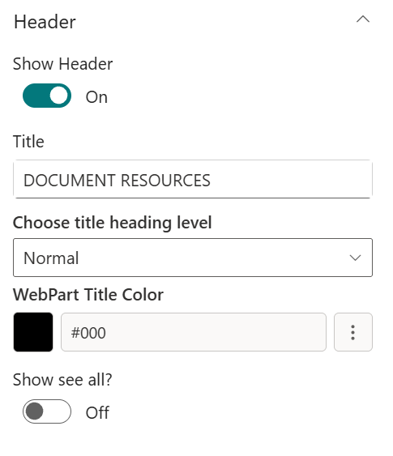

- - -

### ⚙️ General

| Name                       | Purpose                                                                                                  | Control Type   |
| -------------------------- | -------------------------------------------------------------------------------------------------------- | -------------- |
| Source                     | Choose between this site's documents, a specific library, or multiple sites                              | Dropdown       |
| Select Sites               | Pick SharePoint sites to aggregate documents from (visible only when Source is "Multiple Sites")         | Site picker    |
| Select Document Libraries  | Choose which libraries to include from the selected sites (visible only when Source is "Multiple Sites") | Multi-select   |
| Select Libraries           | Pick the library to display (visible only when Source is "A document library")                           | Library picker |
| Goto Library               | Opens the selected library directly to manage files                                                      | Link           |
| Folder Name                | Filter to show only files from a specific folder; use `/` for nested folders                             | Text field     |
| Include Sub-Folder Files   | Also shows files inside folders within the selected folder                                               | Toggle         |
| Category Name              | The choice column to use for filtering (auto-detected from the library)                                  | Dropdown       |
| Filter the Category Value  | Pre-filter documents to selected category values                                                         | Multi-select   |
| Include File Types         | Limit results to Videos or Images (visible only when Source is "This site")                              | Multi-select   |
| Number of Items to Display | Maximum number of files to show (1–4999)                                                                 | Number field   |

📸 View General Screenshots

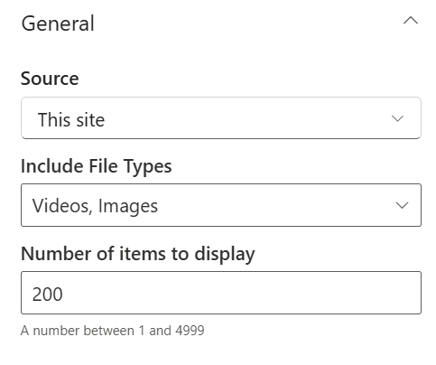

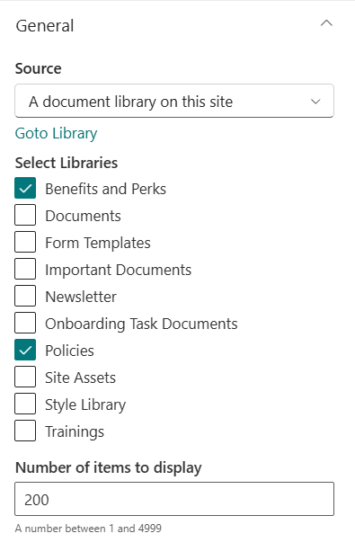

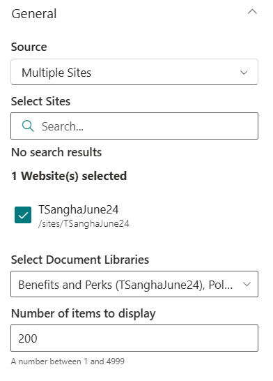

- - -

### 📐 Layout

| Name                        | Purpose                                                                  | Control Type |
| --------------------------- | ------------------------------------------------------------------------ | ------------ |
| Choose Layout               | Switch between Standard (all-round border) and Accent Bar (top bar only) | Choicegroup  |
| Hide This Web Part if Empty | Hides the entire web part when no documents match the current filter     | Checkbox     |

📸 View Layout Screenshots

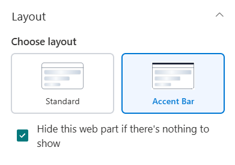

- - -

### 🎨 Appearance

| Name                 | Purpose                                                                                            | Control Type         |
| -------------------- | -------------------------------------------------------------------------------------------------- | -------------------- |
| Hide Category Filter | Hides the category filter tabs visible to users (visible only when Source is "A document library") | Toggle               |
| Height               | Controls the height of the document section                                                        | Slider (400–2000 px) |

📸 View Appearance Screenshots

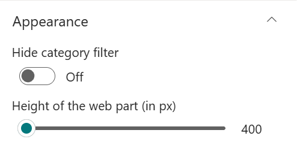

- - -

3. FAQs

## 3. FAQs

FAQs displays a list of questions and answers as an expandable accordion. Questions can come from a SharePoint list or be entered and managed directly within the web part settings.

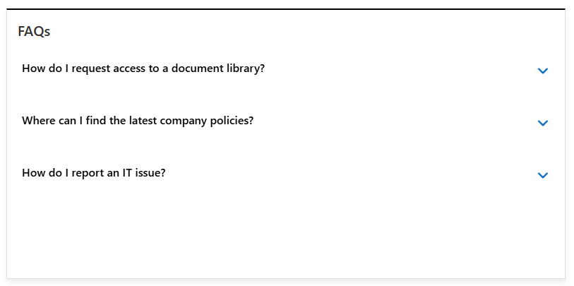

### 📌 Header

| Name                | Purpose                                                                                         | Control Type |
| ------------------- | ----------------------------------------------------------------------------------------------- | ------------ |
| Webpart Title       | The heading shown above the FAQ list                                                            | Text field   |
| Webpart Title Color | Picks a colour for the title from the site theme palette (visible only when a title is entered) | Color picker |
| Show Title          | Toggle to turn on and off the webpart title                                                     | Toggle       |

📸 View Header Screenshots

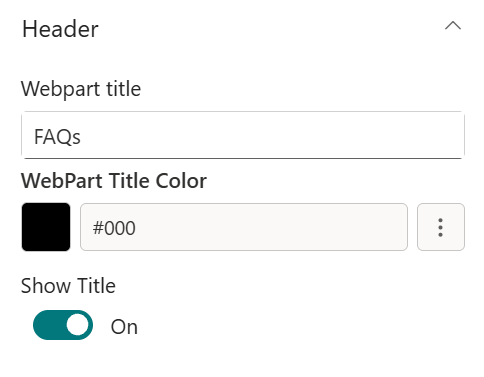

- - -

### ⚙️ General

| Name              | Purpose                                                                                                        | Control Type  |
| ----------------- | -------------------------------------------------------------------------------------------------------------- | ------------- |
| Data Source       | Choose whether FAQs come from a SharePoint list or are entered as custom items                                 | Dropdown      |
| Choose Layout     | Switch between Standard and Accent Bar                                                                         | Choicegroup   |
| Select FAQs List  | Pick the SharePoint list containing FAQ items (visible only when Layout is "Accordion (SharePoint list)")      | List picker   |
| Go to FAQ's List  | Opens the selected list to add or edit items                                                                   | Link          |
| FAQ Items         | Opens a panel to add, edit, and reorder FAQ entries (visible only when Layout is "Accordion (Custom items)")   | Manage panel  |
| Display All Items | Shows all FAQ items without a limit                                                                            | Toggle        |
| Items to Show     | Limits how many FAQs are visible before a "View All" link appears (visible only when Display All Items is off) | Slider (1–20) |
| View All URL      | URL for the "View All" link (visible only when Display All Items is off)                                       | Text field    |
| Sort By           | Sort order for FAQ items: Default, Ascending, or Descending                                                    | Dropdown      |

📸 View General Settings Screenshots

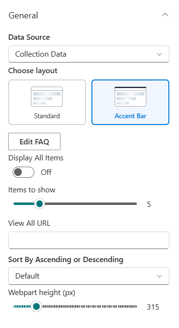

| **FAQ Items Panel Fields:** |
| --------------------------- |

| Field       | Purpose                                                  |
| ----------- | -------------------------------------------------------- |
| Order       | Order to show items in UI                                |
| Description | The answer text shown when the accordion row is expanded |

- - -

4. Contact

## 4. Contact

Contact displays one or more key contacts with their photo, name, role, and a description. Choose between showing two named contacts side by side or building a full multi-person collection.

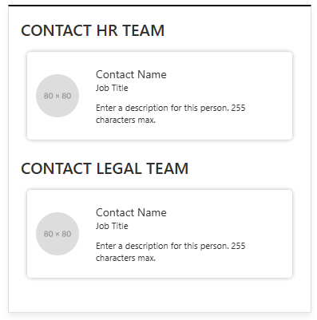

### 📌 Header Settings

| Name                        | Purpose                                                                            | Control Type          |
| --------------------------- | ---------------------------------------------------------------------------------- | --------------------- |
| Webpart Title for Contact 1 | Heading for the first contact card (visible only when Layout is "User Selection")  | Text field            |
| Webpart Title for Contact 2 | Heading for the second contact card (visible only when Layout is "User Selection") | Text field            |
| Title Theme Color           | Picks a colour for the contact heading text from the site theme palette            | Theme colour dropdown |

📸 View Header Settings Screenshots

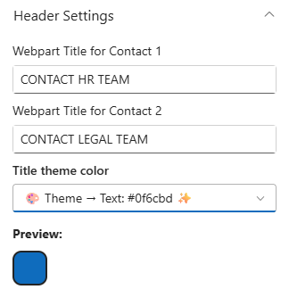

- - -

### ⚙️ General Settings

| Name               | Purpose                                                                                                         | Control Type        |
| ------------------ | --------------------------------------------------------------------------------------------------------------- | ------------------- |
| Select Contact 1   | Pick the first contact from the organisation directory (visible only when Layout is "User Selection")           | People picker       |
| Select Contact 2   | Pick the second contact from the organisation directory (visible only when Layout is "User Selection")          | People picker       |
| Description 1      | Short text shown below the first contact's name (visible only when Layout is "User Selection")                  | Text field          |
| Description 2      | Short text shown below the second contact's name (visible only when Layout is "User Selection")                 | Text field          |
| Contact Collection | Opens a panel to add, edit, and manage multiple contact entries (visible only when Layout is "Collection View") | Manage panel        |
| Height             | Controls the height of the contact section                                                                      | Slider (200–500 px) |

📸 View General Settings Screenshots

|                                                                                 |                                                                                 |
| ------------------------------------------------------------------------------- | ------------------------------------------------------------------------------- |
| 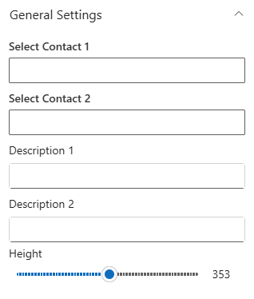 | 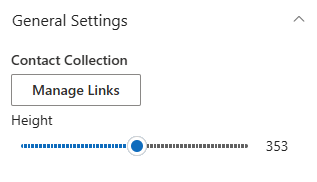 |

**Contact Collection Panel Fields:**

| Field       | Purpose                                                       |
| ----------- | ------------------------------------------------------------- |
| Title       | The contact's display heading or section label                |
| Description | A short description or message for this contact               |
| Person      | Pick a person from the organisation directory (people picker) |
| Job Title   | The contact's job title                                       |

- - -

### 📐 Layout Settings

| Name                       | Purpose                                                                                   | Control Type |
| -------------------------- | ----------------------------------------------------------------------------------------- | ------------ |
| Select Layout to Show Data | Switch between User Selection (two named contacts) and Collection View (multiple entries) | Dropdown     |
| Selected Design            | Switch between Standard and Accent Bar                                                    | Dropdown     |
| Show Shadow                | Adds a drop shadow to the contact cards                                                   | Toggle       |

📸 View Layout Settings Screenshots

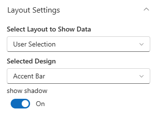

