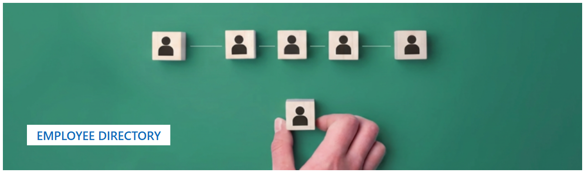
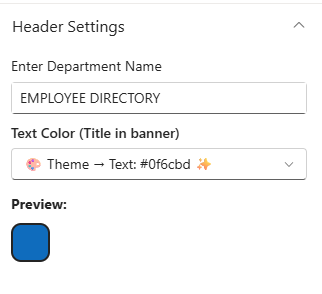
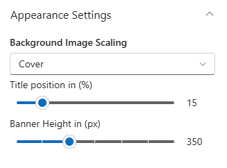
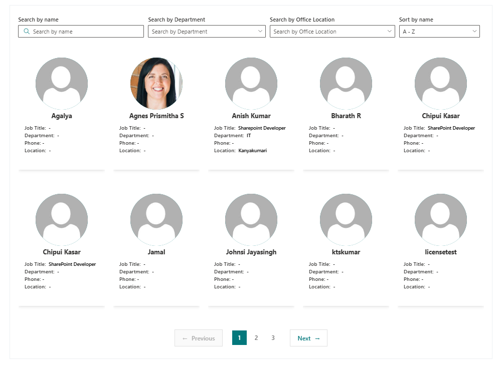
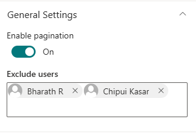

Each web part is configured through its **settings panel**. To open it, click the web part while editing the page and click the **pencil (edit) icon**.

- - -

## 1. Employee Welcome Banner

The Employee Welcome Banner is the branded hero at the top of the directory page. It displays a full-width background image with an overlay title that names the page for visitors.

### 📌 Header Settings

| Name                         | Purpose                                                                   | Control Type          |
| ---------------------------- | ------------------------------------------------------------------------- | --------------------- |
| Enter Department Name        | The main heading shown over the banner image (e.g., "Employee Directory") | Text field            |
| Text Color (Title in Banner) | Picks a colour for the title text from the site theme palette             | Theme colour dropdown |

📸 View Header Settings Screenshots

- - -

### ⚙️ General Settings

| Name              | Purpose                                      | Control Type |
| ----------------- | -------------------------------------------- | ------------ |
| Change Background | Select or upload the banner background image | Image picker |

📸 View General Settings Screenshots

- - -

### 🎨 Appearance Settings

| Name                     | Purpose                                                                             | Control Type        |
| ------------------------ | ----------------------------------------------------------------------------------- | ------------------- |
| Background Image Scaling | How the background image fills the banner: Cover, Contain, Auto, Stretch, or Centre | Dropdown            |
| Title Position           | Moves the title text up or down on the banner                                       | Slider (1–87%)      |
| Banner Height            | Controls the overall height of the banner                                           | Slider (250–550 px) |

📸 View Appearance Settings Screenshots 

- - -

## 2. Employee Directory

Employee Directory automatically reads all active user profiles from Microsoft 365 and presents them as a searchable, filterable staff list. Employees can search by name, department, or job title without any content management by the admin.

### ⚙️ General Settings

| Name              | Purpose                                                                                   | Control Type  |
| ----------------- | ----------------------------------------------------------------------------------------- | ------------- |
| Enable Pagination | Splits the directory into pages for easier browsing in large organisations                | Toggle        |
| Exclude Users     | Pick specific users (e.g., service accounts, shared mailboxes) to hide from the directory | People picker |

> **Note:** The directory content is populated automatically from Microsoft 365. There are no manual content settings — only pagination and exclusion controls.

📸 View General Settings Screenshots

