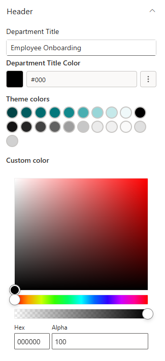
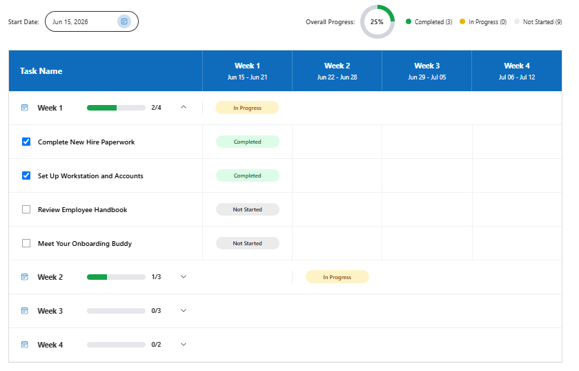
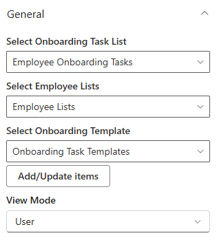

Each web part is configured through its **settings panel**. To open it, click the web part while editing the page and click the **pencil (edit) icon**.

- - -

1. Employee Welcome

## 1. Employee Welcome

The Employee Welcome banner sits at the top of the onboarding page and creates a warm, branded first impression for new joiners.

### 📌 Header

| Name                         | Purpose                                                                     | Control Type |
| ---------------------------- | --------------------------------------------------------------------------- | ------------ |
| Department Title             | The main heading shown over the banner image (e.g., "Welcome to the Team!") | Text field   |
| Text Color (Title in Banner) | Picks a colour for the title text from the site theme palette               | Color picker |

📸 View Header Screenshots

- - -

### 📸 Background Image

| Name                     | Purpose                                                                             | Control Type |
| ------------------------ | ----------------------------------------------------------------------------------- | ------------ |
| Change Background        | Select or upload the banner background image                                        | Image picker |
| Background Image Scaling | How the background image fills the banner: Cover, Contain, Auto, Stretch, or Centre | Dropdown     |

📸 View General Screenshots

- - -

### 🎨 Appearance

| Name           | Purpose                                       | Control Type        |
| -------------- | --------------------------------------------- | ------------------- |
| Title Position | Moves the title text up or down on the banner | Slider (1–87%)      |
| Banner Height  | Controls the overall height of the banner     | Slider (250–550 px) |

📸 View Appearance Screenshots

- - -

2. Employee Onboarding

## 2. Employee Onboarding

Employee Onboarding connects to three SharePoint lists to deliver a personalised task checklist to each new employee. Admins can see all employees and their progress; employees see only their own tasks.

### ⚙️ General

| Name                        | Purpose                                                                                              | Control Type |
| --------------------------- | ---------------------------------------------------------------------------------------------------- | ------------ |
| Select Onboarding Task List | Pick the SharePoint list that holds individual onboarding task items                                 | List picker  |
| Select Employee Lists       | Pick the SharePoint list that holds records of employees currently being onboarded                   | List picker  |
| Select Onboarding Template  | Pick the SharePoint list that defines the default task template assigned to new employees            | List picker  |
| View Mode                   | Switch between Admin view (all employees and their progress) and User view (personal checklist only) | Dropdown     |

📸 View General Screenshots

**View Mode Options:**

| Option | Who Sees It      | What They See                                                                          |
| ------ | ---------------- | -------------------------------------------------------------------------------------- |
| Admin  | HR / People Team | A full table of all employees currently being onboarded, with task progress per person |
| User   | New Employees    | Their own personal checklist of onboarding tasks to complete                           |

> **Tip:** Set View Mode to **Admin** on the HR team's version of the page and **User** on the employee-facing version. You can use SharePoint page audiences or separate pages to show each view to the right people.

