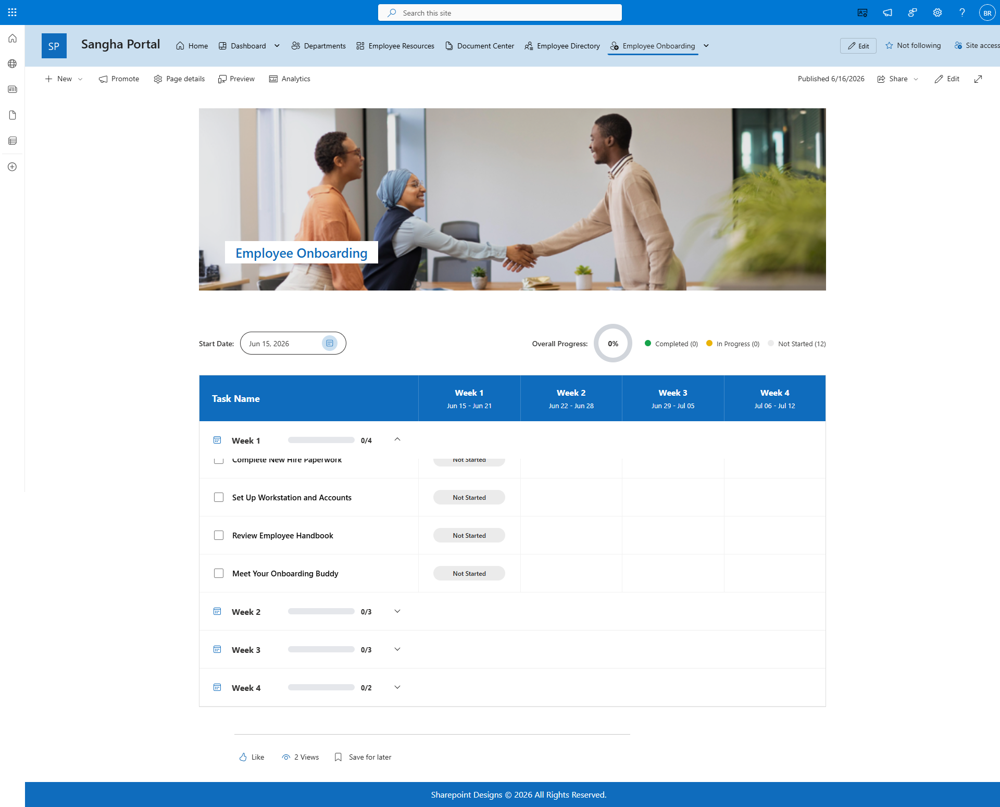

## What Is DIY Sangha Employee Onboarding?

DIY Sangha Employee Onboarding is a ready-built SharePoint solution that gives your HR team and new employees a structured, task-based onboarding experience on a dedicated SharePoint page. Admins configure onboarding task templates and employee records using SharePoint lists, and the web part presents the right checklist to each new joiner — all within their familiar SharePoint environment.

- - -

## Who Is This For?

| Audience                  | How They Use It                                                                                                    |
| ------------------------- | ------------------------------------------------------------------------------------------------------------------ |
| HR / People Team (Admins) | Create and manage onboarding task templates, set up employee records in the list and review progress in Admin view |
| New Employees (Users)     | Log in and see their personal onboarding checklist with tasks to complete                                          |
| Site Owners               | Deploy the page, configure the web part to point to the right lists, and manage access                             |

- - -

## What's Included?

| \#  | Web Part            | Description                                                                                                                            |
| --- | ------------------- | -------------------------------------------------------------------------------------------------------------------------------------- |
| 1   | Employee Welcome    | Hero banner with a background image and a welcome heading for the onboarding page                                                      |
| 2   | Employee Onboarding | Task-based onboarding tracker that connects to SharePoint lists for templates and employee records, with separate Admin and User views |

- - -

## Key Highlights

* **Template-Driven Tasks** - Onboarding tasks are defined in a SharePoint list template, making it easy for HR to update the checklist without changing the web part.
* **Dual View Mode** -  Admins see all employees and their task progress; new employees see only their own checklist.
* **SharePoint List Integration** - Connects to three SharePoint lists: onboarding tasks, employee records and the task template, all of which can be managed through familiar SharePoint list views.
* **Branded Welcome Banner** -  A full-width hero banner with a customisable background image sets the tone for new joiners.
* **No Coding Required** - All settings are managed through the web part settings panel and standard SharePoint lists.

- - -

## Microsoft Graph Permission Required

| Permission    | Purpose                                                                              |
| ------------- | ------------------------------------------------------------------------------------ |
| User.Read.All | Reads Microsoft 365 user profiles to match new employees to their onboarding records |

This permission must be approved by a Global Admin or SharePoint Admin in the SharePoint Admin Centre after the package is deployed.

- - -

## How It Works

1. HR creates onboarding task items in the **Onboarding Task List** and defines a task template in the **Onboarding Tasks Template** list.
2. When a new employee joins, HR adds them to the **Employee List**.
3. The Employee Onboarding web part reads these lists and shows each new joiner their personalised checklist.
4. New employees tick off tasks as they complete them. Admins can monitor progress across all employees.

- - -

## Supported Environments

* SharePoint Online (Microsoft 365)

- - -

## Screenshots

- - -

## Version

**Current Version:** 1.0.1.0
**Developed by:** SharePoint Designs — [www.sharepointdesigns.com](https://www.sharepointdesigns.com)
