This page covers how to configure each web part in DIY Intranet Home. All settings are managed through the property panel on the right-hand side of the page — no code or technical knowledge is required.

To open the settings panel, edit the page and click the **Edit Properties (icon)** on any web part.

- - -

## Understanding Layouts

Every web part supports two layout options that can be switched at any time from the **Layout** settings group.

| Layout                    | Description                                                    |
| ------------------------- | -------------------------------------------------------------- |
| **Layout 1 — Standard**   | Clean card-based style with borders on all sides of each item. |
| **Layout 2 — Accent Bar** | Modern style with a coloured top border only.                  |

- - -

## Understanding Theme Colours

All colour dropdowns in DIY Intranet Home read your site's theme palette automatically. When you select a colour, a swatch preview appears below the dropdown so you can see the result before saving. You can also use the full colour picker to enter any custom hex value.

- - -

## About Each Web Part

Every web part's settings panel also includes a collapsed **About** group at the bottom, with a link to this documentation page and the current solution version. It isn't repeated in the sections below.

- - -

1. Welcome Banner

## 1. Welcome Banner

The Welcome Banner greets each employee by name with a live clock and a customisable background image. Below the greeting, personal dashboard cards surface the user's meetings, tasks, and training from their Microsoft 365 account.

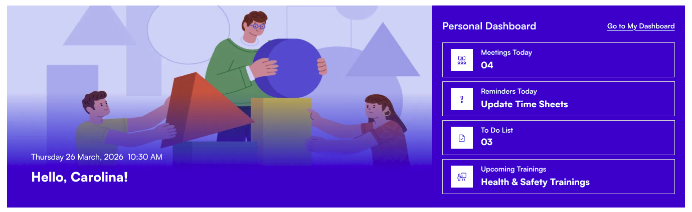

### ⚙️ General

| Name                   | Purpose                                                                                                                                                                                  | Control Type |
| ---------------------- | ---------------------------------------------------------------------------------------------------------------------------------------------------------------------------------------- | ------------ |
| Welcome message        | The greeting text displayed on the banner. Use `{firstName}`, `{lastName}`, or `{fullName}` as placeholders replaced with the logged-in user's name (e.g. `Welcome back, {firstName}!`). | Text field   |
| Date & Time Format     | Controls how the date and time are displayed below the greeting.                                                                                                                         | Dropdown     |
| Dashboard URL          | The web address for the "Go to My Dashboard" link on the banner. Leave blank to hide the link.                                                                                           | Text field   |
| Show Dashboard Section | When on, the personal dashboard cards are shown below the greeting. When off, only the greeting banner is shown. The Appearance fields below only apply when this is on.                 | Toggle       |

📸 View General Settings Screenshots

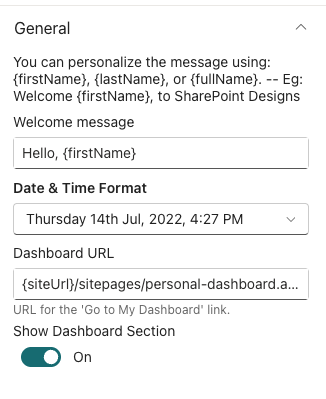

- - -

### 🖼️ Background Image

| Name              | Purpose                                                                                         | Control Type |
| ----------------- | ----------------------------------------------------------------------------------------------- | ------------ |
| Change background | Upload or select a background image for the banner. Stored in Site Assets.                      | File picker  |
| Image Scaling     | How the background image fills the banner area. Options: Cover, Contain, Auto, Stretch, Center. | Dropdown     |

📸 View Background Settings Screenshots

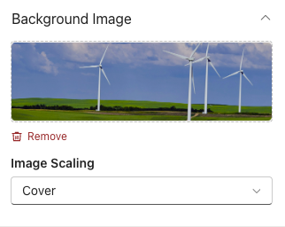

- - -

### 📐 Layout

| Name          | Purpose                                                                                                | Control Type |
| ------------- | ------------------------------------------------------------------------------------------------------ | ------------ |
| Choose Layout | Switch between Layout 1 (standard banner) and Layout 2 (banner with a separate dashboard panel below). | Dropdown     |

- - -

📸 View Layout Settings Screenshots

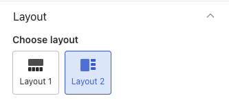

### 🎨 Appearance

| Name                          | Purpose                                                                                                                                | Control Type  |
| ----------------------------- | -------------------------------------------------------------------------------------------------------------------------------------- | ------------- |
| Text color                    | Colour of the greeting text and clock.                                                                                                 | Colour picker |
| Background color              | Background colour behind the greeting text area. Useful for readability over busy photos.                                              | Colour picker |
| Dashboard card color          | Background colour for the personal dashboard cards. Visible only when Show Dashboard Section (General) is on.                          | Colour picker |
| Dashboard background gradient | Choose a gradient from your site's theme palette for the dashboard section background. Visible in Layout 2 when Enable Gradient is on. | Dropdown      |
| Dashboard background color    | Solid colour for the dashboard background. Visible in Layout 2 when Enable Gradient is off.                                            | Colour picker |
| Enable Gradient               | Toggle the gradient effect on or off for the dashboard background. Visible only when Show Dashboard Section (General) is on.           | Toggle        |

📸 View Appearance Settings Screenshots

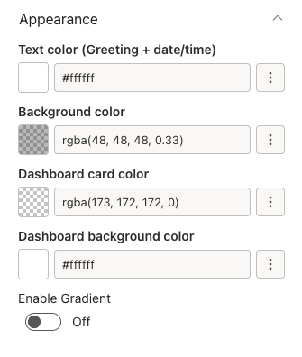

- - -

### 🤚🏻 Draggable Configuration

| Name             | Purpose                                                                          | Control Type |
| ---------------- | -------------------------------------------------------------------------------- | ------------ |
| Enable Draggable | When on, users can drag user welcome cards around and their positions are saved. | Toggle       |
| Reset Positions  | Moves cards back to their original default positions.                            | Button       |

📸 View Draggable Settings Screenshots

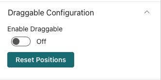

- - -

2. Announcement

## 2. Announcement

The Announcement web part shows a rotating carousel of company messages. Each announcement can include a link, an expiry date for automatic removal, and an optional icon image.

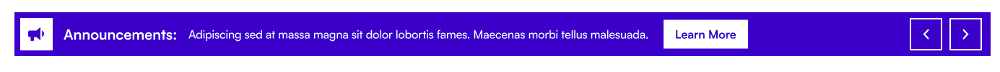

### 📌 Header

| Name                      | Purpose                                                                                                                             | Control Type |
| ------------------------- | ----------------------------------------------------------------------------------------------------------------------------------- | ------------ |
| Show Title                | Toggle the title bar above the carousel on or off.                                                                                  | Toggle       |
| Webpart title             | The heading text shown above the carousel (e.g. "Announcements"). Visible only when the title is on.                                | Text field   |
| WebPart Title Theme Color | Colour for the title text, chosen from the site's theme palette. Visible only when the title is on. A preview swatch appears below. | Dropdown     |

📸 View Header Settings Screenshots

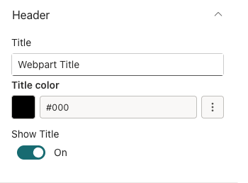

- - -

### ⚙️ General

| Name                     | Purpose                                                                                          | Control Type    |
| ------------------------ | ------------------------------------------------------------------------------------------------ | --------------- |
| Edit Announcements       | Opens a panel to add, edit, remove, and reorder announcements.                                   | Collection data |
| Select announcement icon | Upload or select an image to use as an icon beside the announcement text. Stored in Site Assets. | File picker     |

**Fields inside Manage Announcement Data:**

| Field        | Purpose                                                           | Control Type |
| ------------ | ----------------------------------------------------------------- | ------------ |
| URL          | A web address the announcement links to. Leave blank for no link. | URL field    |
| TargetWindow | Whether the link opens in a new tab or the same tab.              | Dropdown     |
| ExpiryDate   | The date after which this announcement is hidden automatically.   | Date picker  |
| Description  | The announcement text. Required. Supports multiple lines.         | Text area    |

📸 View General Settings Screenshots

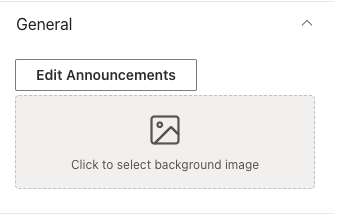

- - -

### 🎨 Appearance

| Name             | Purpose                                                                    | Control Type |
| ---------------- | -------------------------------------------------------------------------- | ------------ |
| Button color     | Colour theme for the carousel navigation buttons, from the site's palette. | Dropdown     |
| Background color | Colour theme for the carousel's background, from the site's palette.       | Dropdown     |

📸 View General Settings Screenshots

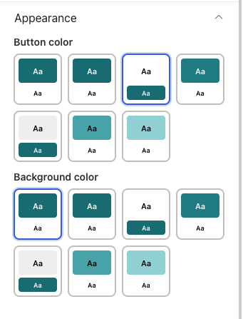

- - -

### 🎠 Carousel

| Name                     | Purpose                                                                                                  | Control Type |
| ------------------------ | -------------------------------------------------------------------------------------------------------- | ------------ |
| Show Arrows              | Toggle the left/right navigation arrows on the carousel.                                                 | Toggle       |
| Enable AutoPlay          | When on, the carousel advances automatically.                                                            | Toggle       |
| Autoplay Speed (seconds) | How long each slide is shown before advancing. Range: 1–60. Default: 5. Active only when AutoPlay is on. | Slider       |

📸 View Carousel Settings Screenshots

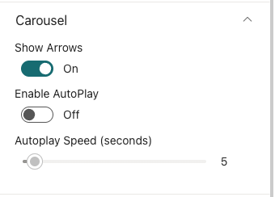

- - -

3. Featured News

## 3. Featured News

The Featured News web part aggregates SharePoint news posts from one or more sites and displays them in a variety of layouts. It also supports RSS feeds and audience targeting.

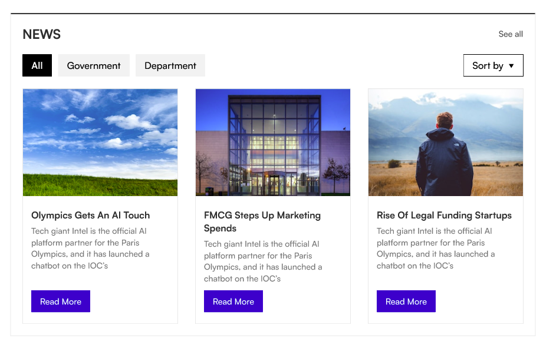

### 📌 Header

| Name                | Purpose                                                                                    | Control Type  |
| ------------------- | ------------------------------------------------------------------------------------------ | ------------- |
| Show Header         | Toggle the title bar on or off.                                                            | Toggle        |
| Webpart Title       | Heading shown above the news feed (e.g. "Latest News"). Visible only when the title is on. | Text field    |
| Webpart title color | Colour for the title text. Visible only when the title is on.                              | Colour picker |

> For best fit, the banner image resolution should be 1300×400px or 1300×450px (width × height).

📸 View Header Settings Screenshots

- - -

### ⚙️ General

| Name                 | Purpose                                                                                                                                                  | Control Type    |
| -------------------- | -------------------------------------------------------------------------------------------------------------------------------------------------------- | --------------- |
| Search sites         | Select one or more SharePoint sites to pull news from. The current site is selected by default.                                                          | Site picker     |
| Enable RSS Feed      | Toggle to add external RSS news sources alongside SharePoint news.                                                                                       | Toggle          |
| RSS Links            | Add RSS feed URLs with optional titles. Visible only when RSS Feed is enabled.                                                                           | Collection data |
| RSS API Key          | API key from rss2json.com to convert RSS feeds. A "Get API Key" link to rss2json.com is provided below the field. Visible only when RSS Feed is enabled. | Text field      |
| Show Search Box      | Toggle a keyword search box for users to filter news.                                                                                                    | Toggle          |
| Show Sort By         | Toggle a sort control so users can sort news by date or relevance.                                                                                       | Toggle          |
| Show See All Button  | Toggle a "See All" button linking to the full news listing.                                                                                              | Toggle          |
| View All URL         | Web address for the "See All" button. Visible only when the button is on.                                                                                | Text field      |
| Show Category Filter | Toggle category tabs above the news for filtering by topic.                                                                                              | Toggle          |
| News Category        | The choice column used to drive the category filter tabs. Populated automatically from selected sites.                                                   | Dropdown        |
| Apply filters        | Pre-select one or more category values to filter the feed to specific topics only.                                                                       | Multi-select    |
| Target Audience      | Restrict who sees this web part to specific people or security groups. Leave blank to show to everyone.                                                  | People picker   |
| Manage News Posts    | Quick link to the news management page for the current site.                                                                                             | Link            |

📸 View General Settings Screenshots

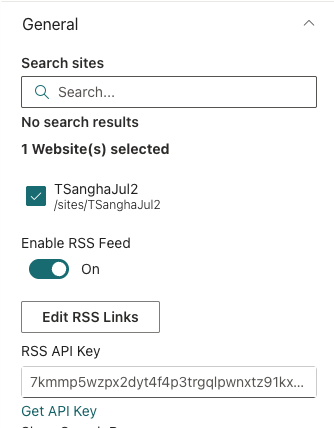

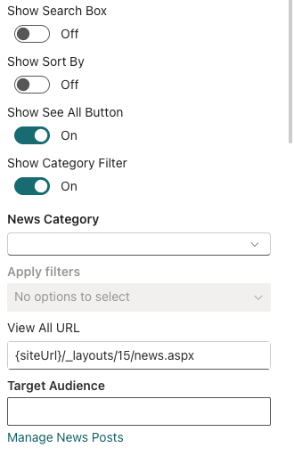

- - -

### 📐 Layout

| Name                    | Purpose                                                                                                  | Control Type  |
| ----------------------- | -------------------------------------------------------------------------------------------------------- | ------------- |
| Choose Layout           | Display style for the news feed: Top Story, Grid, Filmstrip, Filmstrip One, or Tiles.                    | Visual picker |
| Select Design           | Border style for the news cards: Standard (border on all sides) or Accent Bar (top border only).         | Visual picker |
| Border Color            | Colour of the top accent border. Visible only when Select Design is Accent Bar.                          | Colour picker |
| One view height (px)    | Height of the news display area. Range: 100–500 px. Visible for the Top Story and Filmstrip One layouts. | Slider        |
| Items to show           | Number of news items to display. Range: 3–50. Visible for the Top Story layout.                          | Slider        |
| Items to show per page  | Number of items shown per page. Range: 4–16. Visible for the Grid layout.                                | Slider        |
| Items to show per slide | Number of news cards shown side-by-side in the filmstrip. Range: 1–6. Visible for the Filmstrip layout.  | Slider        |

📸 View Layout Settings Screenshots

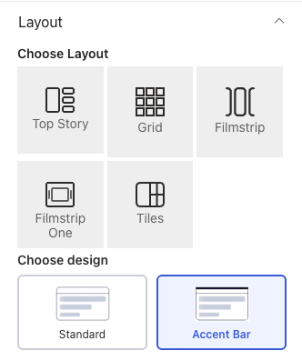

- - -

### 🛠 Admin

| Name         | Purpose                                                                             | Control Type  |
| ------------ | ----------------------------------------------------------------------------------- | ------------- |
| Admin Menu   | Toggle an admin badge visible only to designated administrators.                    | Toggle        |
| Select Admin | People or groups who are administrators of this web part. They see the admin badge. | People picker |

📸 View Admin Settings Screenshots

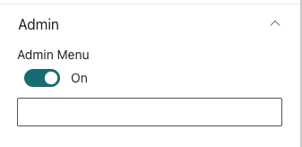

- - -

4. Quicklinks

## 4. Quicklinks

The Quicklinks web part is a quick links panel for the apps and tools your team uses every day. Each link supports a title, URL, Fluent UI icon, and open-in option.

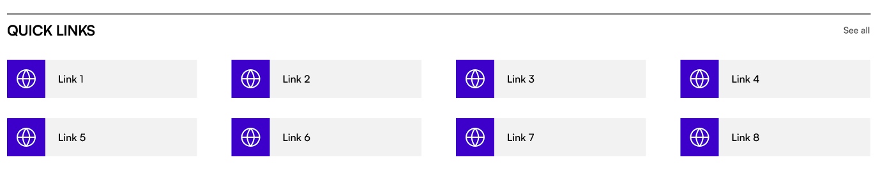

### 📌 Header

| Name                | Purpose                                                                                      | Control Type  |
| ------------------- | -------------------------------------------------------------------------------------------- | ------------- |
| Show Title          | Toggle the title bar on or off.                                                              | Toggle        |
| Title               | Heading shown above the quick links (e.g. "Quick Links"). Visible only when the title is on. | Text field    |
| WebPart Title Color | Colour for the title text. Visible only when the title is on.                                | Colour picker |

📸 View Header Settings Screenshots

- - -

### ⚙️ General

| Name            | Purpose                                                                                 | Control Type    |
| --------------- | --------------------------------------------------------------------------------------- | --------------- |
| Edit Quicklinks | Opens a panel to add, edit, remove, and reorder links.                                  | Collection data |
| See All URL     | Web address for a "See All" link at the top-right of the web part. Leave blank to hide. | Text field      |

**Fields inside Manage Quicklinks:**

| Field   | Purpose                                                               | Control Type |
| ------- | --------------------------------------------------------------------- | ------------ |
| Title   | Display name for the link tile (e.g. "HR Portal"). Required.          | Text field   |
| Link    | The full URL the tile navigates to. Required.                         | URL field    |
| Icon    | A Fluent UI icon shown on the tile. Choose from a visual icon picker. | Icon picker  |
| Open In | Whether the link opens in a new tab or the same tab.                  | Dropdown     |

📸 View General Settings Screenshots

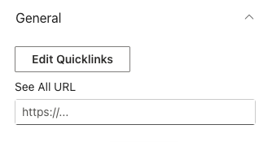

- - -

### 📐 Layout

| Name          | Purpose                                                                         | Control Type  |
| ------------- | ------------------------------------------------------------------------------- | ------------- |
| Choose design | Switch between Standard (icon tile grid) and Accent Bar (list with top border). | Visual picker |

📸 View Layout Settings Screenshots

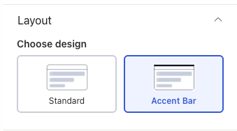

- - -

### 🎨 Appearance

| Name                   | Purpose                                                                           | Control Type  |
| ---------------------- | --------------------------------------------------------------------------------- | ------------- |
| Show Gradient on hover | When on, a gradient overlay appears on tiles when a user hovers over them.        | Toggle        |
| QuickLinks title color | Colour for the link title text.                                                   | Colour picker |
| Background color       | Background colour for the quicklinks tiles.                                       | Colour picker |
| Icon color             | Background and icon colour theme for icon boxes. Shown only in Accent Bar layout. | Dropdown      |
| Background hover color | Hover colour theme for link tiles, from the site's theme palette.                 | Dropdown      |

📸 View Appearance Settings Screenshots

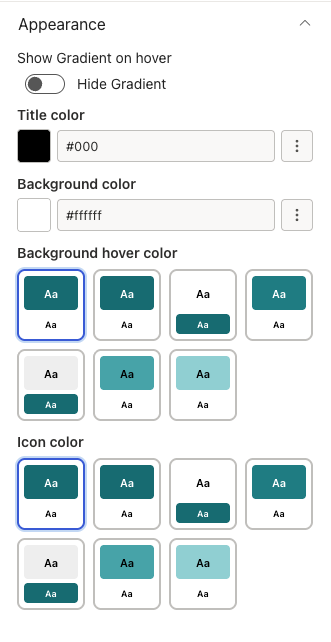

- - -

5. Employee Spotlight

## 5. Employee Spotlight

The Employee Spotlight web part surfaces upcoming birthdays, work anniversaries, and recent new joiners. Data is pulled automatically from Azure Active Directory or managed manually.

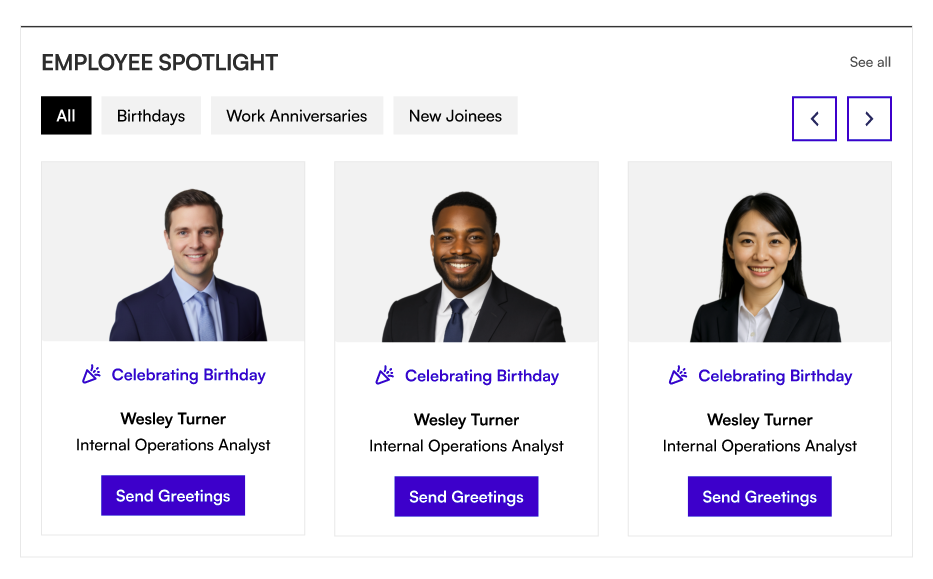

### 📌 Header

| Name                      | Purpose                                                                | Control Type |
| ------------------------- | ---------------------------------------------------------------------- | ------------ |
| Webpart Title             | Heading shown above the spotlight cards (e.g. "Celebrate Our People"). | Text field   |
| WebPart Title Theme Color | Colour for the title text, from the site's theme palette.              | Dropdown     |
| Hide / Show title         | Toggle the title bar on or off.                                        | Toggle       |

📸 View Header Settings Screenshots

- - -

### ⚙️ General

| Name                                               | Purpose                                                                                                                 | Control Type    |
| -------------------------------------------------- | ----------------------------------------------------------------------------------------------------------------------- | --------------- |
| Source                                             | Choose where data comes from: **Azure Active Directory** (automatic) or **Property Collection** (manual).               | Dropdown        |
| Spotlight data                                     | Opens a panel to add people manually. Only shown when Source is set to Property Collection — hidden entirely otherwise. | Collection data |
| Visible Categories                                 | Choose which milestones to show: Birthdays, Work Anniversaries, New Joinees — any combination.                          | Multi-select    |
| Upcoming window — birthdays & anniversaries (days) | How many days ahead to look for upcoming birthdays and anniversaries. Range: 1–180 days. Default: 7.                    | Slider          |
| New joinee look-back window (days)                 | How many days back to consider someone a new joiner. Range: 7–365 days. Default: 90.                                    | Slider          |
| Cards per page                                     | How many spotlight cards are shown at once. Range: 1–6. Default: 3.                                                     | Slider          |

**Fields inside Spotlight data (Property Collection mode):**

| Field                    | Purpose                                                                        | Control Type       |
| ------------------------ | ------------------------------------------------------------------------------ | ------------------ |
| Person                   | Search for and select a person from your organisation.                         | People picker      |
| Job Title                | The person's job title.                                                        | Text field         |
| Department               | The person's department.                                                       | Text field         |
| Category                 | The milestone type: Birthday, Anniversary, or New Joinee (singular). Required. | Dropdown           |
| Celebration Date (MM-DD) | The month and day of the person's birthday or anniversary.                     | Custom date picker |

📸 View General Settings Screenshots

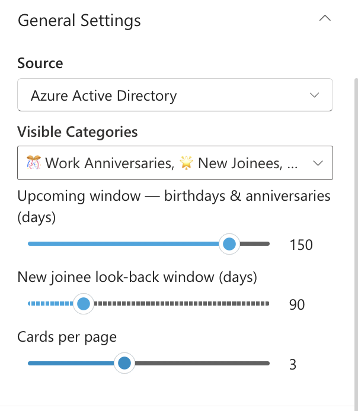

- - -

### 📐 Layout settings

| Name          | Purpose                                                            | Control Type |
| ------------- | ------------------------------------------------------------------ | ------------ |
| Choose Layout | Switch between Layout 1 (Standard) and Layout 2 (Accent Bar).      | Dropdown     |
| See All URL   | Web address for a "See All" link at the top-right of the web part. | Text field   |

📸 View Layout Settings Screenshots

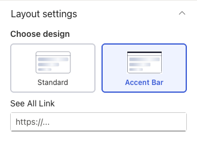

- - -

### 🎨 Appearance

| Name                   | Purpose                                                                          | Control Type |
| ---------------------- | -------------------------------------------------------------------------------- | ------------ |
| Card Photo Height (px) | Height of the employee photo area on each card. Range: 140–400 px. Default: 240. | Slider       |

📸 View Appearance Settings Screenshots

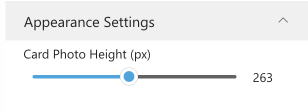

- - -

6. Org Chart

## 6. Org Chart

The Org Chart web part draws an interactive organisational tree from Microsoft 365. Hover over any person to see their contact details.

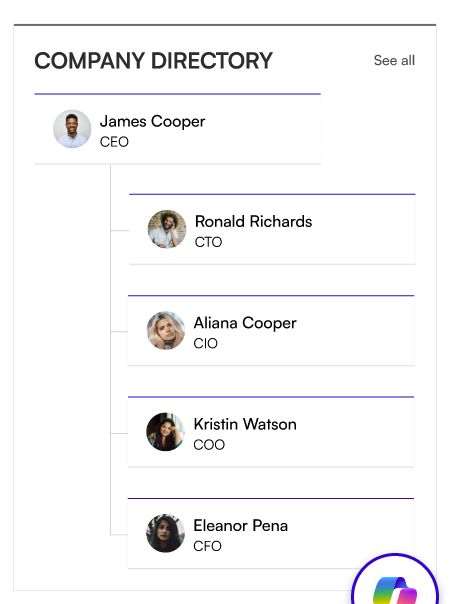

### 📌 Header

| Name        | Purpose                                                               | Control Type  |
| ----------- | --------------------------------------------------------------------- | ------------- |
| Show Title  | Toggle the title bar on or off.                                       | Toggle        |
| Title       | Heading shown above the org chart. Visible only when the title is on. | Text field    |
| Title color | Colour for the title text. Visible only when the title is on.         | Colour picker |

📸 View Header Settings Screenshots

- - -

### ⚙️ General

| Name                      | Purpose                                                                                                                                                               | Control Type           |
| ------------------------- | --------------------------------------------------------------------------------------------------------------------------------------------------------------------- | ---------------------- |
| View Options              | What the chart displays: **Show My Team** (the logged-in user's team), **Company Hierarchy** (full company tree), or **Show Other Team** (a specific manager's team). | Dropdown               |
| Max Depth                 | How many hierarchy levels are expanded automatically. Range: 1–10.                                                                                                    | Number field           |
| Show Detail on Mouse Over | When on, hovering over a person shows a popup with their contact details.                                                                                             | Toggle                 |
| Excluded Users            | Email addresses (comma-separated) of people who should not appear in the chart.                                                                                       | Text field             |
| Manager                   | Search for and select the manager whose team to display. Required when View Options is set to Show Other Team.                                                        | People picker          |
| Reorder Org Chart Users   | Use the up/down buttons to change the display order of a manager's direct reports. Appears once a Manager is selected and their direct reports have loaded.           | Custom reorder control |

📸 View General Settings Screenshots

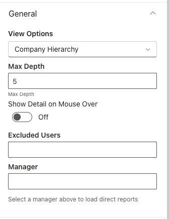

- - -

### 📐 Layout

| Name   | Purpose                                                       | Control Type |
| ------ | ------------------------------------------------------------- | ------------ |
| Layout | Switch between Standard (Layout 1) and Accent Bar (Layout 2). | Dropdown     |

📸 View Layout Settings Screenshots

- - -

### 🎨 Appearance

| Name                          | Purpose                                                                   | Control Type |
| ----------------------------- | ------------------------------------------------------------------------- | ------------ |
| Height of the Webpart in (px) | How tall the org chart display area is. Range: 100–1200 px. Default: 535. | Slider       |

📸 View Appearance Settings Screenshots

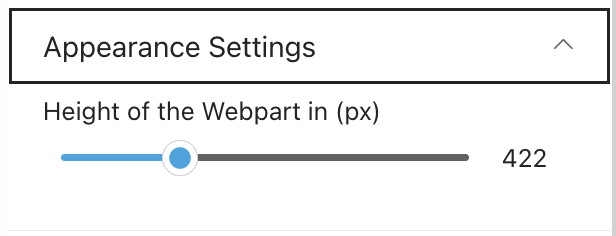

- - -

7. Upcoming Events

## 7. Upcoming Events

The Upcoming Events web part shows company events and dates from a SharePoint calendar, a shared mailbox, or the logged-in user's Outlook calendar.

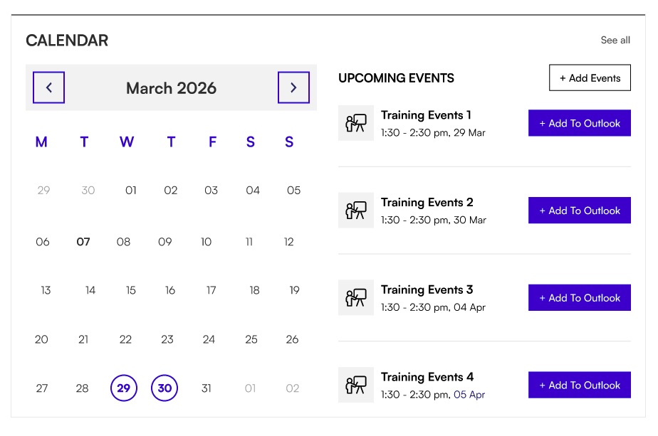

### 📌 Header

| Name         | Purpose                                                                                          | Control Type  |
| ------------ | ------------------------------------------------------------------------------------------------ | ------------- |
| Show Title   | Toggle the title bar on or off.                                                                  | Toggle        |
| Title        | Heading shown above the events list (e.g. "Upcoming Events"). Visible only when the title is on. | Text field    |
| Title color  | Colour for the title text. Visible only when the title is on.                                    | Colour picker |
| View All Url | Web address for a "View All Events" link. Visible only when calendar view is off.                | Text field    |

📸 View Header Settings Screenshots

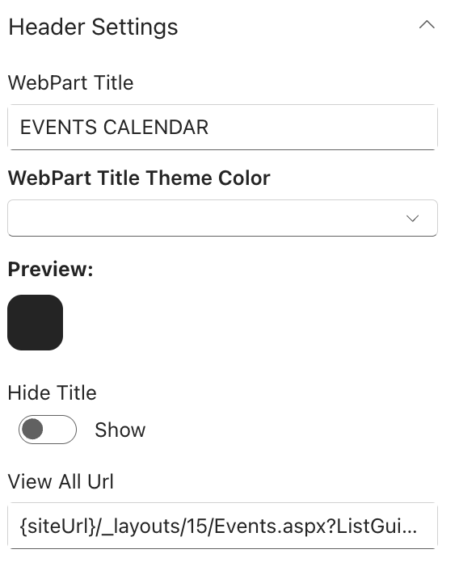

- - -

### ⚙️ General

| Name                     | Purpose                                                                                                                             | Control Type |
| ------------------------ | ----------------------------------------------------------------------------------------------------------------------------------- | ------------ |
| Select the option Events | Choose the event source: **Events from SharePoint List**, **Events from Shared Mailbox**, or **Events from Current User Outlook**.  | Dropdown     |
| Select events list       | Pick the calendar list on the current site. Visible only when SharePoint List is selected.                                          | List picker  |
| Add new Event            | Quick link to add an event to the SharePoint calendar. Visible only when SharePoint List is selected.                               | Link         |
| Edit Events              | Quick link to manage events in the calendar. Visible only when SharePoint List is selected.                                         | Link         |
| Shared Mailbox Email ID  | Email address of the shared mailbox to pull events from. Visible only when Shared Mailbox is selected.                              | Text field   |
| Show Calendar            | Toggle between a full monthly calendar view (Yes) or an events list only (No).                                                      | Toggle       |
| Filter Events            | Date range to display: Upcoming only, Previous 3 months + upcoming, Previous 6 months + upcoming, or Previous 12 months + upcoming. | Dropdown     |

📸 View General Settings Screenshots

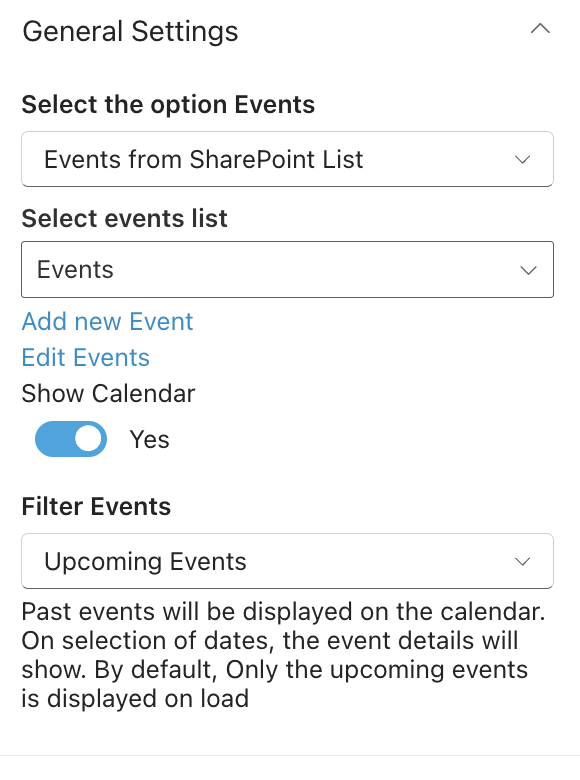

- - -

### 📐 Layout

| Name          | Purpose                                                       | Control Type |
| ------------- | ------------------------------------------------------------- | ------------ |
| Choose Layout | Switch between Layout 1 (Standard) and Layout 2 (Accent Bar). | Dropdown     |

- - -

### 🛠 Admin

| Name         | Purpose                                                          | Control Type  |
| ------------ | ---------------------------------------------------------------- | ------------- |
| Admin Menu   | Toggle an admin badge visible only to designated administrators. | Toggle        |
| Select Admin | People or groups who are administrators of this web part.        | People picker |

📸 View Admin Settings Screenshots

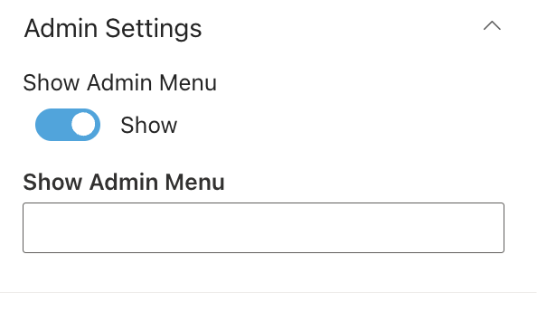

- - -

8. Facilities

## 8. Facilities

The Facilities web part showcases your organisation's offices and locations with photos, descriptions, and map links.

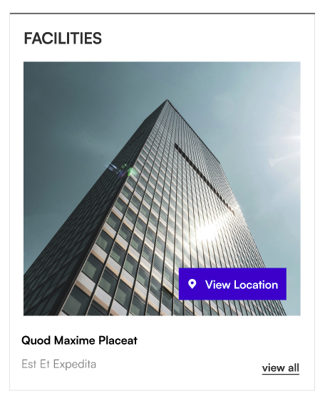

### 📌 Header

| Name        | Purpose                                                                      | Control Type  |
| ----------- | ---------------------------------------------------------------------------- | ------------- |
| Show Title  | Toggle the title bar on or off.                                              | Toggle        |
| Title       | Heading shown above the facilities panel. Visible only when the title is on. | Text field    |
| Title color | Colour for the title text. Visible only when the title is on.                | Colour picker |

📸 View Header Settings Screenshots

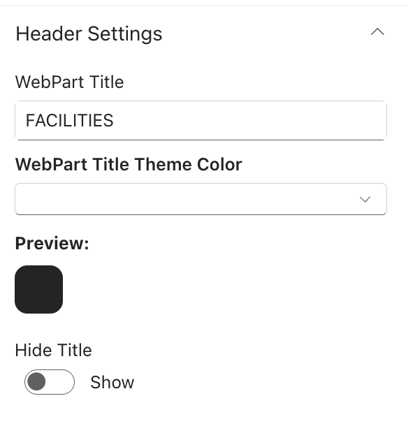

- - -

### ⚙️ General

| Name              | Purpose                                                           | Control Type    |
| ----------------- | ----------------------------------------------------------------- | --------------- |
| Manage Facilities | Opens a panel to add, edit, remove, and reorder facility entries. | Collection data |

**Fields inside Manage Facilities:**

| Field       | Purpose                                                                     | Control Type |
| ----------- | --------------------------------------------------------------------------- | ------------ |
| Title       | Name of the facility (e.g. "Head Office — London"). Required.               | Text field   |
| Map Address | A Google Maps or map URL for the location. Optional.                        | URL field    |
| Content     | A short description of the facility. Optional.                              | Text area    |
| Thumbnail   | Upload or select a photo for the facility. Stored in Site Assets. Optional. | File picker  |

📸 View General Settings Screenshots

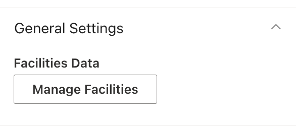

- - -

### 📐 Layout

| Name          | Purpose                                                | Control Type |
| ------------- | ------------------------------------------------------ | ------------ |
| Select Layout | Switch between Standard and Accent Bar display styles. | Dropdown     |

📸 View Layout Settings Screenshots

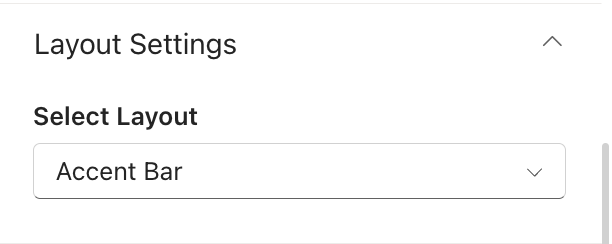

- - -

### 🎨 Appearance

| Name                      | Purpose                                                                                                         | Control Type |
| ------------------------- | --------------------------------------------------------------------------------------------------------------- | ------------ |
| See All URL               | Web address for a "View All" link to a full facilities listing page.                                            | Text field   |
| Show Navigation           | Toggle the navigation arrows and dots for browsing between facilities.                                          | Toggle       |
| Enable Auto Scroll        | When on, the web part advances through facilities automatically. Visible only when navigation is on.            | Toggle       |
| Select duration to scroll | Seconds each facility is shown before auto-advancing. Range: 1–15 seconds. Visible only when Auto Scroll is on. | Slider       |
| Height                    | Height of the facilities display area in pixels. Range: 250–600 px.                                             | Slider       |

📸 View Appearance Settings Screenshots

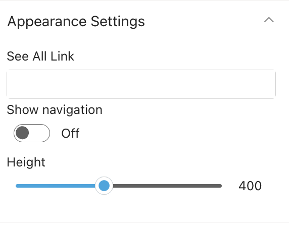

- - -

9. Message from CEO

## 9. Message from CEO

The Message from CEO web part displays a leadership message with a profile photo, designation, and message body. The full message opens in a modal overlay when users click to read more.

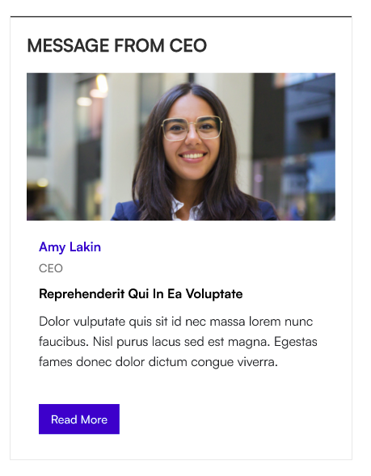

### 📌 Header

| Name        | Purpose                                                                                                | Control Type  |
| ----------- | ------------------------------------------------------------------------------------------------------ | ------------- |
| Show Title  | Toggle the title bar on or off.                                                                        | Toggle        |
| Title       | Heading shown above the message card (e.g. "Message from the CEO"). Visible only when the title is on. | Text field    |
| Title color | Colour for the title text. Visible only when the title is on.                                          | Colour picker |

📸 View Header Settings Screenshots

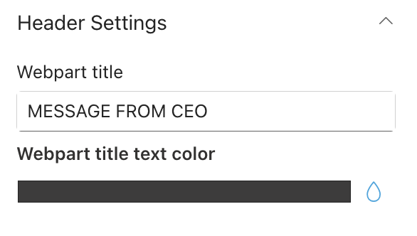

- - -

### ⚙️ General

| Name                            | Purpose                                                                                  | Control Type    |
| ------------------------------- | ---------------------------------------------------------------------------------------- | --------------- |
| Manage CEO Message              | Opens a panel to set up the leadership message. Only one message is supported at a time. | Collection data |
| Overlay Heading Color           | Colour of the heading text inside the modal overlay panel.                               | Colour picker   |
| Title Color                     | Colour of the topic title text on the message card.                                      | Colour picker   |
| Overlay Header Background Color | Background colour of the header area inside the modal overlay panel.                     | Colour picker   |

**Fields inside Manage CEO Message:**

| Field         | Purpose                                                                                                            | Control Type  |
| ------------- | ------------------------------------------------------------------------------------------------------------------ | ------------- |
| Select Person | Search for and select the leader (e.g. the CEO) from your organisation. Their profile photo is used automatically. | People picker |
| Custom Image  | Upload a custom photo to use instead of the person's directory photo. Stored in Site Assets. Optional.             | File picker   |
| Designation   | The person's title or role (e.g. "Chief Executive Officer").                                                       | Text field    |
| Heading       | Heading shown inside the overlay panel (e.g. "A Message from Our CEO").                                            | Text field    |
| Title         | Short topic title shown on the message card preview.                                                               | Text field    |
| Content       | The full message text. Required. Supports multiple lines.                                                          | Text area     |

📸 View General Settings Screenshots

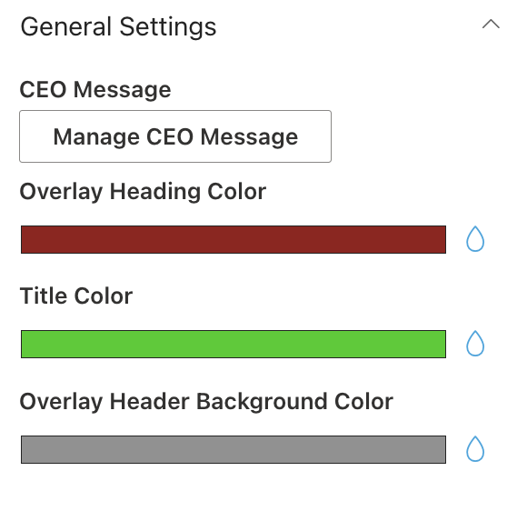

- - -

### 📐 Layout

| Name          | Purpose                                                                            | Control Type |
| ------------- | ---------------------------------------------------------------------------------- | ------------ |
| Choose Layout | Switch between Layout 1 (Standard card) and Layout 2 (Accent Bar with top border). | Dropdown     |

- - -

### 🎨 Appearance

| Name                              | Purpose                                                                                                                | Control Type |
| --------------------------------- | ---------------------------------------------------------------------------------------------------------------------- | ------------ |
| Height of the Webpart (in px)     | How tall the message card is. Range: 65–700 px.                                                                        | Slider       |
| Number of lines to show (content) | How many lines of the message preview are shown before cutting off with a "Read More" prompt. Range: 2–20. Default: 8. | Slider       |
| Show Heading in Modal Popup       | When on (the default), the heading text is shown inside the overlay panel. Turn off to hide it.                        | Toggle       |

📸 View Appearance Settings Screenshots

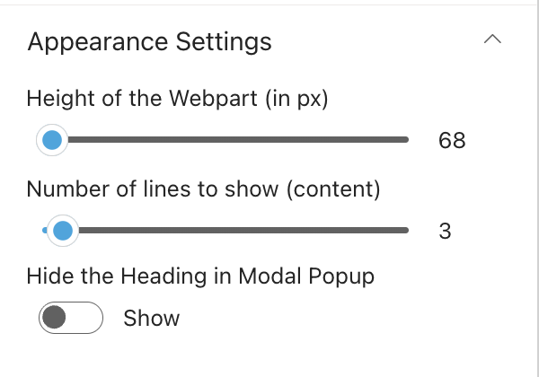

