- - -

## Introduction

This guide walks a SharePoint Administrator through the complete process of installing Intranet Sangha and running the Setup Wizard to deploy a fully configured company intranet.

By the end of this process, your SharePoint site will have:

* A branded homepage and intranet pages
* A structured top navigation
* Configured user roles and permissions
* Automatically created lists, libraries, and content

**Approximate setup time:** 5-10 minutes, depending on the plan selected and the number of users being configured.

**Who should run this guide:** A SharePoint Administrator or Global Administrator with access to the SharePoint App Catalog.

**What to prepare beforehand:**

* Your organization logo file (PNG or SVG recommended)
* Preferred brand colors (hex codes if known)
* A list of users who will be given admin or owner access
* The SharePoint site URL where the intranet will be installed

- - -

## Prerequisites

| Requirement                                   | Purpose                                                                            |
| --------------------------------------------- | ---------------------------------------------------------------------------------- |
| SharePoint Administrator access               | Required to upload the solution package and approve API permissions                |
| Access to the SharePoint App Catalog          | Required to deploy the solution to your Microsoft 365 tenant                       |
| Microsoft 365 Global or SharePoint Admin role | Required to approve the Microsoft Graph permission during setup                    |
| A modern SharePoint site                      | The intranet pages are built on modern SharePoint; classic sites are not supported |
| Supported browser                             | Microsoft Edge or Google Chrome (latest version recommended)                       |

- - -

## Installation Overview

Setting up Intranet Sangha involves two phases: installing the package, then running the Setup Wizard.

1. Upload the solution package to the SharePoint App Catalog
2. Approve required Microsoft 365 permissions
3. Open the SharePoint site and add the Setup Wizard
4. Run the six-step guided Setup Wizard
5. Review the deployed intranet
6. Complete post-installation checks

- - -

# Step-by-Step Installation Guide

- - -

## Step 1 — Upload the Solution Package

The solution package (`.sppkg` file) is the installer for Intranet Sangha. It is uploaded to the SharePoint App Catalog, which makes it available across your Microsoft 365 tenant.

### How to Upload

1. Sign in to the **Microsoft 365 Admin Center** at [admin.microsoft.com](https://admin.microsoft.com)
2. In the left navigation, select **SharePoint** under Admin Centers
3. In the SharePoint Admin Center, select **More features** in the left menu
4. Under **Apps**, click **Open**
5. Click **App Catalog** — if prompted to create one, follow the on-screen steps
6. In the App Catalog, click **Apps for SharePoint** in the left navigation
7. Click **Upload** and select the `spd-product-sangha.sppkg` file provided by SharePoint Designs
8. When prompted, review the deployment options:

### Deployment Options

| Option                                                        | What It Does                                                                                | Recommendation                               |
| ------------------------------------------------------------- | ------------------------------------------------------------------------------------------- | -------------------------------------------- |
| Make this solution available to all sites in the organization | Enables the Setup Wizard on any modern SharePoint site without adding it manually each time | **Recommended**                              |
| Only enable this app                                          | Limits availability to manually selected sites                                              | Use only if you want to restrict to one site |

9. Select your preferred deployment option and click **Deploy**

### Why This Step Is Required

The App Catalog is Microsoft's trusted location for SharePoint solutions. Uploading the package here ensures the wizard installs securely and is recognized by SharePoint as an approved solution.

📸 Upload Package Screenshot

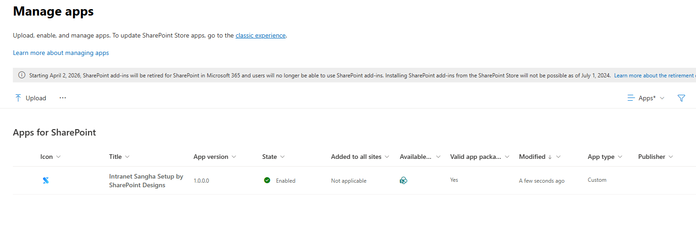

- - -

## Step 2 — Approve Required Permissions

Intranet Sangha uses one Microsoft 365 permission to read basic organization information during setup. This permission must be approved by an administrator before the Setup Wizard can complete certain steps.

### Permissions Required

| Permission                              | Why It Is Needed                                                                                                |
| --------------------------------------- | --------------------------------------------------------------------------------------------------------------- |
| Microsoft Graph - Organization.Read.All | Reads your organization's name from Microsoft 365 to pre-fill the organization details step in the Setup Wizard |

### How to Approve

1. In the SharePoint Admin Center, go to **More features → API access**
2. Under **Pending approvals**, find the request for `Organization.Read.All`
3. Select it and click **Approve**
4. Confirm the approval in the dialog that appears

### What Happens If This Permission Is Not Approved

The Setup Wizard will still run, but the organization name field will not be pre-filled automatically. You can type the organization name manually in Step 2 of the wizard. No other wizard functionality is blocked.

📸 API Permission Approval Screenshot

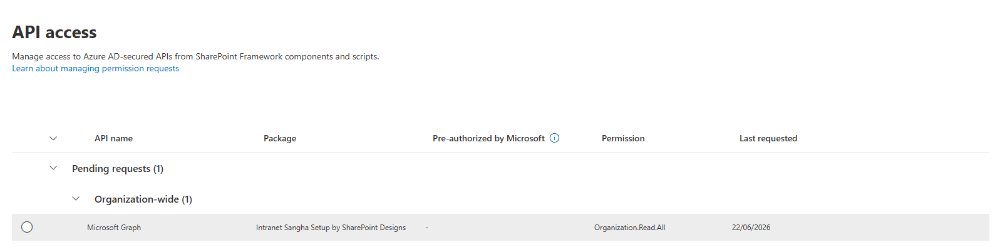

- - -

## Step 3 — Add the Setup Wizard to Your Site

Once the package is deployed, you activate the Setup Wizard on the specific SharePoint site where you want to build the intranet.

### How to Add the Setup Wizard

1. Open the SharePoint site where the intranet will be deployed
2. Click the **gear icon** (Settings) in the top-right corner
3. Select **Add an app**
4. Search for **Intranet Sangha Setup**
5. Click **Add** to install it on the site

Once added, the Setup Wizard will appear automatically the next time the site is opened by a Site Collection Administrator.

### What Administrators See

The Setup Wizard opens as a full-screen overlay on top of the SharePoint site. It guides you through each configuration step in sequence. Non-administrator users will not see the wizard and will continue to see the standard site.

📸 Setup Wizard Launch Screenshot

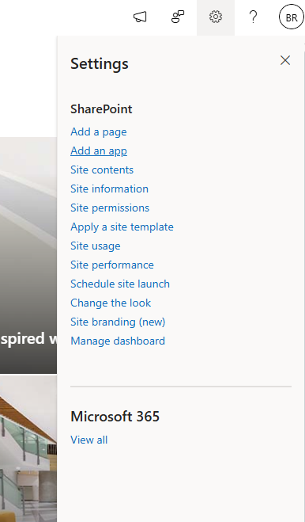

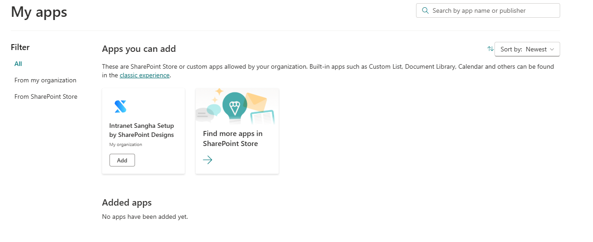

- - -

# Setup Wizard Walkthrough

- - -

Step 1 - Welcome & Plan Selection

## Step 1 — Welcome & Plan Selection

### Purpose

This screen introduces the wizard and allows administrators to select the subscription plan that determines which intranet pages will be deployed.

### What Administrators Configure

Review the available plans and activate the one that fits your organization.

### Available Plans

| Plan                 | Monthly Price | Pages Included                                                         |
| -------------------- | ------------- | ---------------------------------------------------------------------- |
| Free Trial (15 days) | $0            | All pages - full access for evaluation                                 |
| Spark                | $199/month    | Homepage, Personal Dashboard, Admin Dashboard, AI based navigation     |
| Flame                | $499/month    | Spark pages + Departments, Employee Resources                          |
| Blaze                | $999/month    | Flame pages + Document Center, Employee Directory, Employee Onboarding |

### What Happens After Completion

The selected plan is validated and saved. The wizard unlocks the remaining steps. If a paid plan is selected, a Stripe checkout window opens to complete payment before proceeding.

### Notes

* Annual billing is available for paid plans and offers a discounted rate
* If a previous payment was completed but pages were not fully deployed, a **Deploy pending pages** button appears to resume from where setup stopped
* The current active plan is shown with a badge if a subscription is already in place

📸 View Plan Selection Screenshots

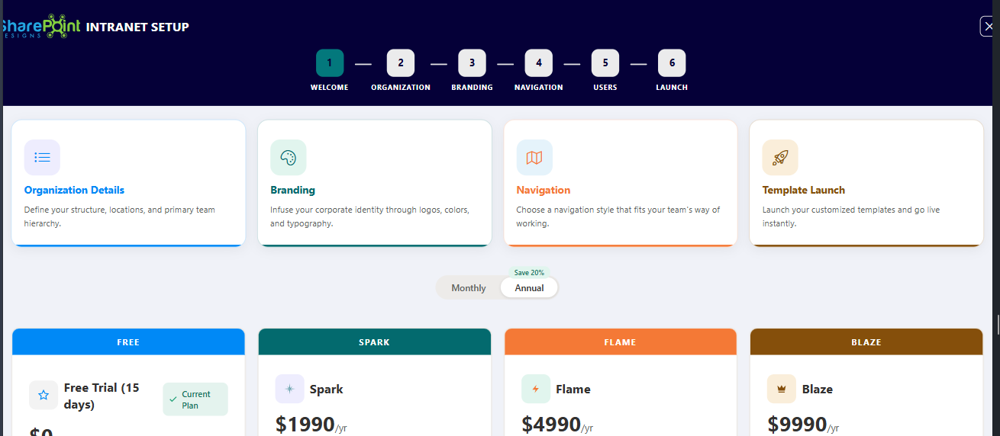

- - -

Step 2 - Organization Details

## Step 2 — Organization Details

### Purpose

This step personalizes the intranet for your organization by capturing its name, site title, and industry.

### What Administrators Configure

| Setting           | Purpose                                                                                             |
| ----------------- | --------------------------------------------------------------------------------------------------- |
| Organization Name | Sets the organization name used across the intranet. Pre-filled from your Microsoft 365 tenant name |
| Site Title        | Sets the title displayed in the SharePoint site header. Can be hidden later in the branding step    |
| Industry          | Classifies the organization type. Used to tailor sample content and navigation defaults             |

### Available Industries

Technology, Healthcare, Finance, Education, Manufacturing, Retail, Real Estate, Consulting, Legal, Media & Entertainment, Hospitality, Transportation, Energy, Agriculture, Government, Non-Profit, Other.

### What Happens After Completion

The SharePoint site title is updated immediately. Organization name and industry are saved to the setup configuration and referenced throughout later steps.

### Notes

* The organization name can be edited at any time by returning to this step
* If the Microsoft Graph permission was not approved, the organization name field will be blank and must be filled in manually

📸 View Organization Details Screenshots

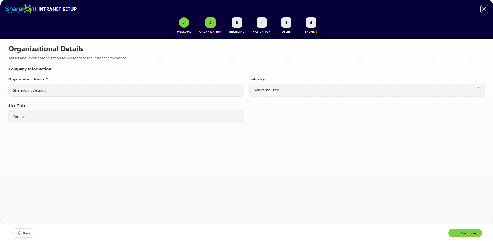

- - -

Step 3 - Branding Configuration

## Step 3 — Branding Configuration

### Purpose

This step applies your organization's visual identity to the intranet — logo, colors, fonts, layout style, and display preferences.

### What Administrators Configure

#### Logo & Colors

| Setting         | Purpose                                                                                  |
| --------------- | ---------------------------------------------------------------------------------------- |
| Logo Upload     | Sets the site logo displayed in the header and on the homepage. Accepts PNG, SVG, or JPG |
| Primary Color   | The main brand color applied to buttons, links, and highlights across the site           |
| Secondary Color | A supporting color used for accents and secondary elements                               |
| Theme Name      | A label for the custom brand theme saved in SharePoint                                   |

When a logo is uploaded, the wizard automatically analyzes it and suggests matching brand colors based on the logo's dominant palette. These suggestions can be accepted or adjusted.

#### Appearance Settings

| Setting             | Purpose                                                                                         |
| ------------------- | ----------------------------------------------------------------------------------------------- |
| Border Radius       | Controls the roundness of cards and panels. Options: 0px (sharp), 12px, 16px, or 32px (rounded) |
| Theme Mode          | Sets the site to Light mode or Dark mode                                                        |
| Font Package        | Selects the typography used across all pages                                                    |
| Page Layout         | Chooses between Layout 1 and Layout 2 (different homepage arrangements)                         |
| Full-Width Page     | Expands the page content area to fill the full browser width                                    |
| Footer Alignment    | Sets footer content alignment: Left, Center, or Right                                           |
| Hide Site Title     | Hides the SharePoint site title text from the header if desired                                 |
| Header Nav Emphasis | Hides brand color emphasis to the site header navigation.                                       |

#### Favicon

| Setting        | Purpose                                                                    |
| -------------- | -------------------------------------------------------------------------- |
| Favicon Upload | Sets the small icon that appears in browser tabs when the intranet is open |

#### Existing Themes

Administrators can also browse and apply existing SharePoint themes (including any previously created Brand Center themes) instead of creating a new one.

### What Happens After Completion

* The logo is uploaded to the site's asset library
* A custom SharePoint theme is created and applied using the selected colors
* Font, border radius, theme mode, layout, and footer settings are saved and applied to all pages
* The favicon is applied site-wide

### Notes

* All changes show a live preview on the right side of the screen as they are made
* The branding step can be revisited at any time to make adjustments
* Colors can be entered as hex codes or selected using the color picker

📸 View Branding Configuration Screenshots

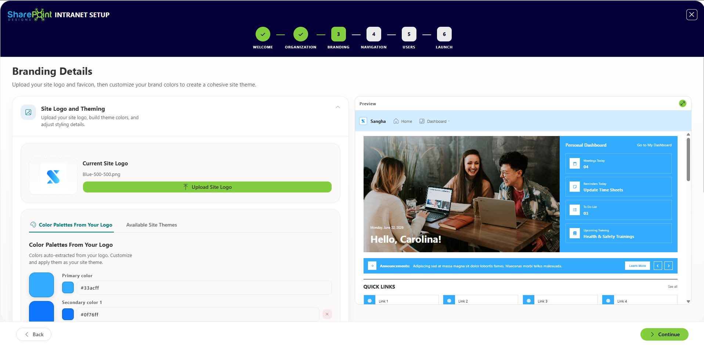

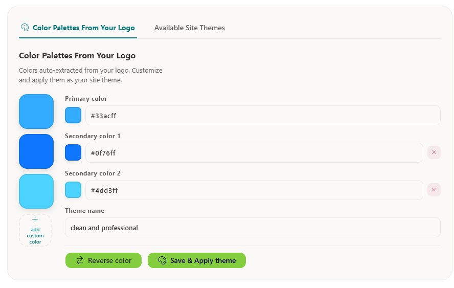

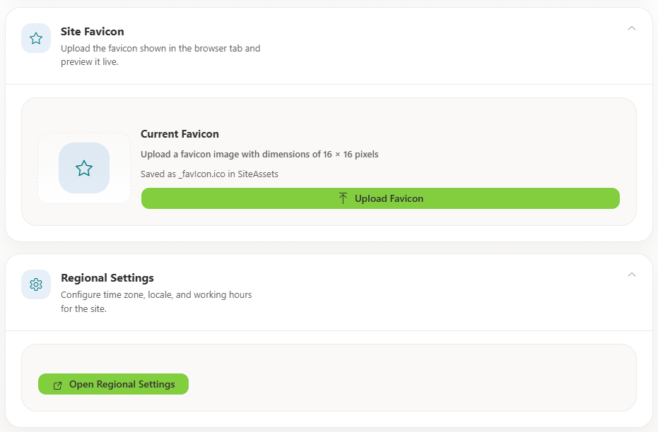

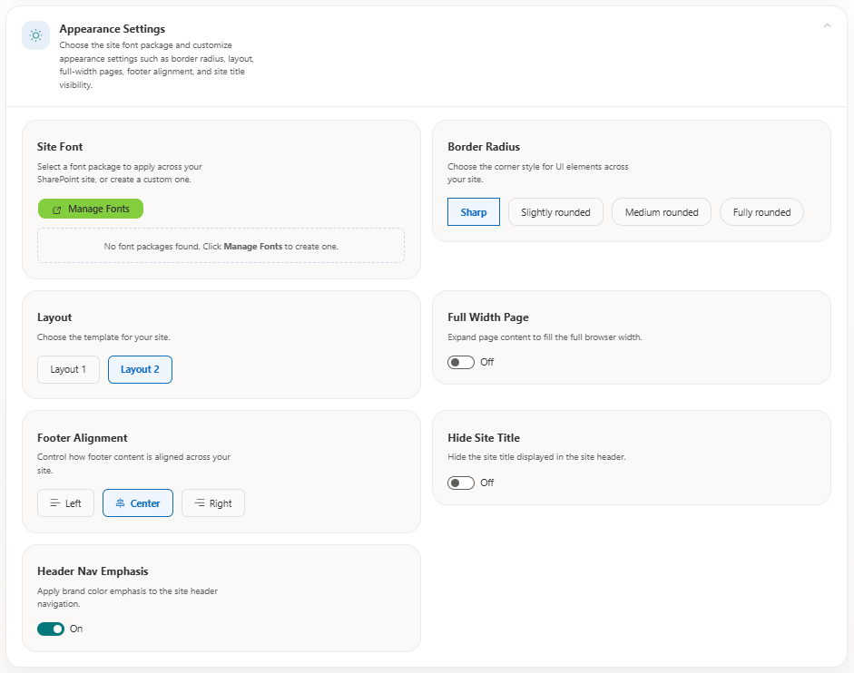

- - -

Step 4 - Navigation Setup

## Step 4 — Navigation Setup

### Purpose

This step builds the top navigation that employees use to move around the intranet. The navigation editor supports multi-level menus, icons, audience targeting, and AI-generated suggestions.

### What Administrators Configure

| Setting               | Purpose                                                               |
| --------------------- | --------------------------------------------------------------------- |
| Navigation Item Label | The text that appears in the navigation bar                           |
| Link URL              | The page or site the item links to                                    |
| Open in New Tab       | Opens the link in a new browser tab instead of the current window     |
| Icon                  | A Fluent UI icon displayed next to the label in the navigation        |
| Sub-menu Items        | Child links that appear when hovering or clicking a parent item       |
| Divider               | A visual separator between navigation groups                          |
| Audience Targeting    | Restricts visibility of a navigation item to specific users or groups |

### Audience Targeting Options

Navigation items can be shown to everyone, or restricted to:

* Specific Microsoft 365 users or security groups
* Site Admins
* Site Owners

### AI Navigation Generation

The wizard includes an option to generate a suggested navigation structure automatically based on your organization type and selected plan pages. This can be used as a starting point and edited further.

### What Happens After Completion

The navigation structure is saved to a SharePoint list and applied to the site. The custom navigation web part reads from this list to render the menu for employees.

### Notes

* Navigation items can be reordered using drag-and-drop
* Changes are shown in a live preview alongside the navigation editor
* Audience targeting requires that users are signed in to their Microsoft 365 account for targeting to take effect

📸 View Navigation Setup Screenshots

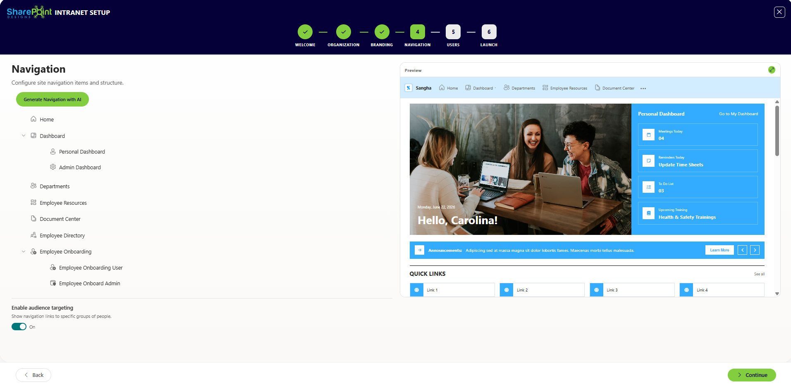

- - -

Step 5 - User Access & Permissions

## Step 5 — User Access & Permissions

### Purpose

This step defines who can access the intranet, assigns user roles, and optionally sends a launch announcement to selected staff.

### What Administrators Configure

#### Access Control Type

| Option          | Description                                                                          |
| --------------- | ------------------------------------------------------------------------------------ |
| All Users       | Opens the intranet to all Microsoft 365 users in your tenant, including guests       |
| Internal Only   | Restricts access to internal staff; external and guest accounts cannot view the site |
| Specific Groups | Limits access to selected SharePoint security groups only                            |

#### User Roles

| Role        | Permissions                                                                   |
| ----------- | ----------------------------------------------------------------------------- |
| Admin       | Full site administration — can manage all settings, pages, and users          |
| Owner       | Can edit and manage content but cannot change site-level settings             |
| Contributor | Can add and edit content in designated areas but cannot manage site structure |

#### Launch Notification

| Setting             | Purpose                                                                                   |
| ------------------- | ----------------------------------------------------------------------------------------- |
| Enable launch email | Sends an announcement email to all users added in this step when the intranet is deployed |

### What Happens After Completion

* SharePoint permission groups are updated with the selected users and roles
* The Visitors group is configured based on the chosen access control type
* If launch notifications are enabled, emails are sent to all listed users after deployment completes

### Notes

* Users are searched and selected by name or email address using the people picker
* Multiple users can be added in bulk
* The access control setting can be changed after deployment by returning to this step or through the SharePoint Admin Center

📸 View User Access & Permissions Screenshots

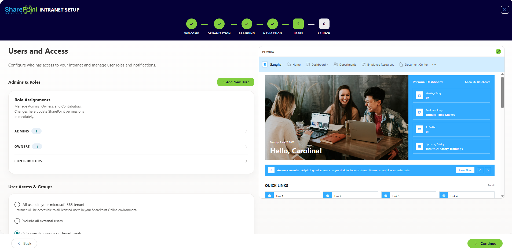

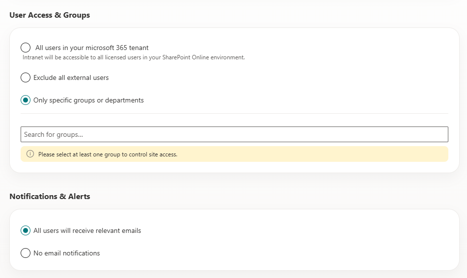

- - -

Step 6 - Deploy

## Step 6 — Deploy

### Purpose

This is the final configuration step. The wizard deploys everything configured in the previous steps — creating all SharePoint resources, installing pages, applying branding, and setting permissions.

### What Administrators Do

Review the deployment summary and click **Deploy** to begin.

### What the Wizard Deploys Automatically

The deployment runs in phases and shows a live progress bar with status messages.

#### Phase 1 — Lists & Libraries (5–45% progress)

| Resource Created          | Purpose                                                        |
| ------------------------- | -------------------------------------------------------------- |
| News list                 | Stores company news posts displayed on the homepage            |
| Announcements list        | Stores short announcements for the homepage feed               |
| Events list               | Stores upcoming events for the events calendar                 |
| Tasks list                | Used by the personal dashboard for task tracking               |
| SiteAssets library        | Stores uploaded images, logos, and other media                 |
| Department-specific lists | Created for each department page included in the selected plan |
| Employee Directory list   | Stores employee profile information (Blaze plan)               |
| Document Center library   | Stores organizational documents (Blaze plan)                   |
| Onboarding lists          | Stores employee onboarding tasks and resources (Blaze plan)    |
| Personal Dashboard lists  | Stores personal productivity data                              |
| Admin Dashboard data      | Stores intelligence and analytics data for admins              |

#### Phase 2 — Configuration (46–50% progress)

* Organization name, logo, branding, and layout settings are applied
* Theme colors are saved to the SharePoint Brand Center
* Font package and appearance preferences are activated

#### Phase 3 — Page Deployment (51–100% progress)

Each page is created and its web parts installed. Pages deployed depend on the selected plan:

| Page                | Included In     |
| ------------------- | --------------- |
| Homepage            | All plans       |
| Personal Dashboard  | All plans       |
| Admin Dashboard     | All plans       |
| Departments         | Flame and Blaze |
| Employee Resources  | Flame and Blaze |
| Document Center     | Blaze only      |
| Employee Directory  | Blaze only      |
| Employee Onboarding | Blaze only      |

As each page is created, a **View \[Page Name]** button appears so administrators can preview it immediately.

#### After Deployment Completes

* All pages are live and accessible
* Navigation is published
* User permissions are applied
* Launch notification emails are sent (if enabled)
* The wizard shows a completion screen with links to all deployed pages

### Notes

* Deployment typically takes 5–15 minutes depending on the plan
* Do not close the browser or navigate away during deployment
* If deployment is interrupted, the wizard can be reopened and will detect which steps were completed; use the **Deploy pending pages** button on the Welcome screen to resume
* After deployment, any pending API permissions requested by installed web parts will be listed for administrator review

📸 View Deployment Screenshots

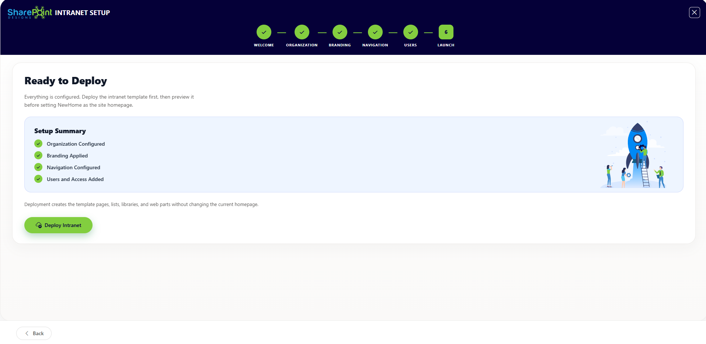

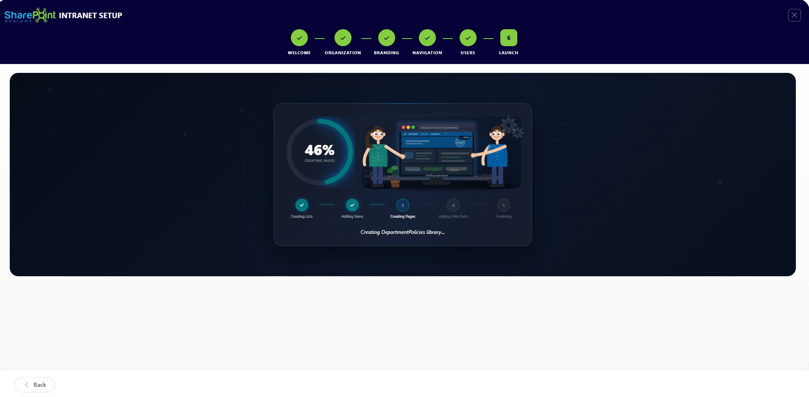

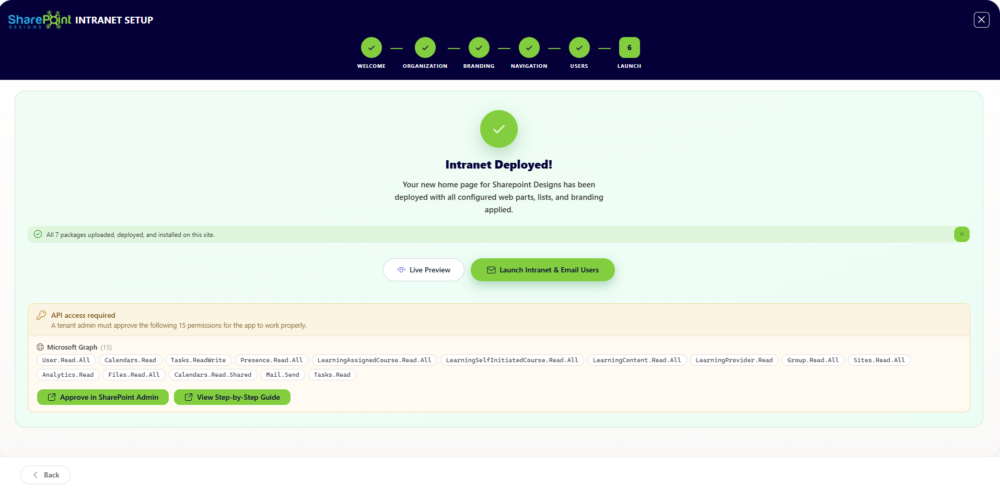

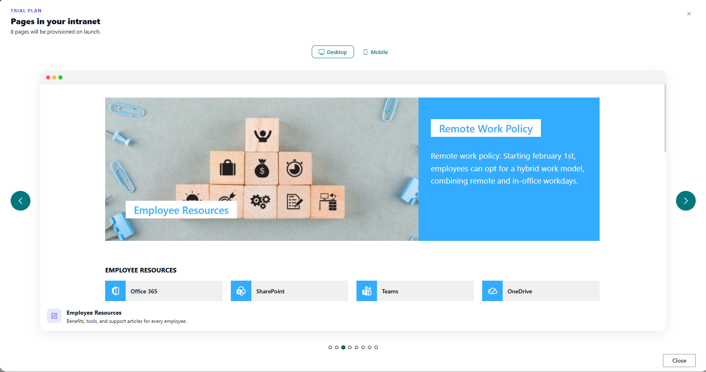

- - -

Step 7 — Templates (Post-Launch)

## Step 7 — Templates (Post-Launch)

### Purpose

After the initial deployment, administrators can create additional custom pages using pre-built templates from the template gallery.

### What Administrators Configure

| Setting            | Purpose                                      |
| ------------------ | -------------------------------------------- |
| Template Selection | Choose a template from the available gallery |
| Page Name          | Enter a name for the new page                |

### What Happens After Completion

A new SharePoint page is created from the selected template and added to the site. A link to the newly created page is displayed immediately.

### Notes

* There is no limit to the number of pages that can be created from templates
* Created pages are independent and can be edited using standard SharePoint page editing tools

📸 View Template Gallery Screenshots

- - -

# Troubleshooting

| Issue                                                 | Possible Cause                                                                                     | Resolution                                                                                                                              |
| ----------------------------------------------------- | -------------------------------------------------------------------------------------------------- | --------------------------------------------------------------------------------------------------------------------------------------- |
| Setup Wizard does not appear after installing the app | The solution was not installed on the correct site, or you are not a Site Collection Administrator | Verify the app was added to the specific site. Confirm your account has Site Collection Administrator access                            |
| Plan selection shows "payment failed"                 | Stripe payment did not complete                                                                    | Retry payment using the plan selection screen. Ensure pop-ups are allowed in your browser for the checkout window                       |
| Organization name is blank in Step 2                  | Microsoft Graph permission was not approved                                                        | Approve the `Organization.Read.All` permission in the SharePoint Admin Center API access screen, or type the organization name manually |
| Logo does not appear after upload                     | File format not supported or file size too large                                                   | Use PNG or SVG format. Keep file size under 2 MB                                                                                        |
| Colors do not match brand                             | Wrong hex values entered                                                                           | Use the color picker or enter exact hex codes. Check that the SharePoint theme was saved and applied                                    |
| Navigation is not visible to employees                | Navigation step was not completed before deployment                                                | Return to the Navigation step, save your navigation items, and re-deploy or publish the navigation from the wizard                      |
| Deployment stops midway                               | Network interruption or browser timeout                                                            | Reopen the wizard and use the **Deploy pending pages** button on the Welcome screen to resume from where it stopped                     |
| Permissions step shows an error                       | Admin consent required for Graph permissions                                                       | Ensure a Global Administrator or SharePoint Administrator approves all pending API permission requests                                  |
| Employee Directory page is missing                    | Plan does not include the Employee Directory                                                       | Upgrade to the Blaze plan to unlock this page                                                                                           |
| Users do not receive launch emails                    | Email notifications were not enabled in Step 5, or user email addresses were not added             | Return to the Users step, confirm users are added and notifications are enabled, then re-run deployment                                 |
| Web parts show an error after deployment              | API permissions from installed packages are pending approval                                       | Go to the SharePoint Admin Center API access screen and approve any pending requests listed after deployment                            |

- - -

# Post-Installation Checklist

Use this checklist after the Setup Wizard completes to confirm the intranet is ready for employees.

* **Homepage loads correctly** — Open the intranet homepage and confirm content, logo, and layout appear as expected
* **Branding is applied** — Verify logo, brand colors, and fonts display correctly across all pages
* **Navigation works** — Click each top navigation item and confirm it links to the correct page
* **User access is correct** — Sign in as a standard employee and confirm they can access the site
* **Permissions are applied** — Confirm Admin, Owner, and Contributor users have the correct level of access
* **Pages are live** — Open each deployed page (Homepage, Dashboard, Departments, etc.) and confirm content is present
* **Web parts are functional** — Scroll each page and confirm news, events, and other web parts load without errors
* **Mobile experience** — Open the intranet on a mobile device or resize the browser and confirm the layout is responsive
* **API permissions are approved** — Check the SharePoint Admin Center API access screen for any pending approvals from installed web parts
* **Launch email delivered** — Confirm launch notification emails were received by the users added in Step 5
