- - -

## Product Overview

**Intranet Sangha** by SharePoint Designs is a ready-made intranet solution for Microsoft 365 organizations. It transforms a blank SharePoint site into a fully branded, structured, and populated company intranet — without any manual configuration or technical expertise.

At the heart of the solution is the **Setup Wizard** — a guided, step-by-step experience that walks administrators through every aspect of the intranet: branding, navigation, user access, and page deployment. Once the wizard completes, the site is ready for employees to use immediately.

Organizations use Intranet Sangha to eliminate the weeks of manual work typically required to stand up a SharePoint intranet. Rather than configuring lists, uploading logos, building navigation menus, and setting permissions one by one, the Setup Wizard handles all of it in a single session — usually completed in under an hour.

- - -

## Product Information

| Item              | Details                                     |
| ----------------- | ------------------------------------------- |
| Product Name      | Intranet Sangha Setup by SharePoint Designs |
| Version           | 1.0.0.0                                     |
| Compatible With   | SharePoint Online (Microsoft 365)           |
| Deployment Type   | SharePoint Online                           |
| Intended Audience | Administrators, Site Owners                 |

- - -

## Who Uses This Solution

| User Type                                     | How They Use It                                                                                                                     |
| --------------------------------------------- | ----------------------------------------------------------------------------------------------------------------------------------- |
| SharePoint Administrator + Site Administrator | Installs the package, runs the Setup Wizard, configures branding and permissions, and deploys the intranet to the organization      |
| Site Owner                                    | Uses the intranet after launch; may return to the wizard to adjust navigation, add users, or create additional pages from templates |
| Content Manager                               | Publishes news, announcements, and department content using the pages and lists automatically created during setup                  |
| End User                                      | Browses the finished intranet — homepage, department pages, employee directory, resources, and more                                 |

- - -

## Key Highlights

* **Guided setup experience** — A clear, step-by-step wizard that prevents errors and skipped configuration
* **Automated intranet configuration** — Lists, libraries, pages, and web parts are created automatically
* **Branding setup** — Upload a logo, pick colors, select fonts, and apply your corporate identity in minutes
* **Navigation configuration** — Build a structured top navigation with icons, sub-menus, and audience targeting
* **User access control** — Assign roles (Admin, Owner, Contributor) and control who can access the site
* **Quick deployment** — The full intranet deploys in a single guided session, typically under one hour
* **Tenant-wide setup support** — The solution installs once and can be activated on any modern SharePoint site
* **Flexible subscription plans** — Choose the page set that fits your organization size and needs
* **Live preview** — See branding and navigation changes in real time before deploying
* **Template-based page creation** — Add new pages after launch using pre-built templates

- - -

## What the Setup Wizard Does

The Setup Wizard guides administrators through the complete intranet configuration process from start to finish. It presents each decision — branding, navigation, users, pages — as a simple screen with clear options, then applies those choices to your SharePoint site automatically.

The wizard reduces the need for manual SharePoint configuration. Administrators do not need to create lists, build page layouts, upload assets individually, or manage permissions through the SharePoint admin center. The wizard handles all of that behind the scenes.

Each step validates the choices made before moving forward, ensuring the intranet is set up correctly. After the final deploy step, the site is live and ready for use.

- - -

## Setup Wizard Flow

The Setup Wizard guides administrators through seven steps. Each step builds on the previous one to produce a fully configured intranet.

### Step 1 — Welcome & Plan Selection

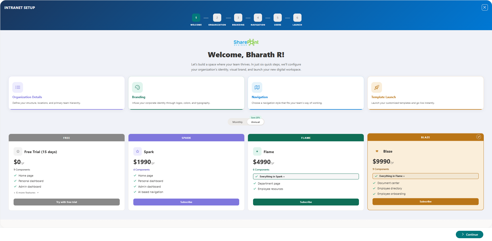

The wizard opens with a welcome screen that shows available subscription plans: **Free Trial**, **Spark**, **Flame**, and **Blaze**. Each plan includes a different set of intranet pages. Administrators select the plan that matches their needs and activate it before proceeding.

**What administrators do:** Review plans, select a plan, activate a free trial or complete payment.
**What happens after:** The plan is confirmed and the wizard unlocks the remaining steps.

- - -

### Step 2 — Organization Details

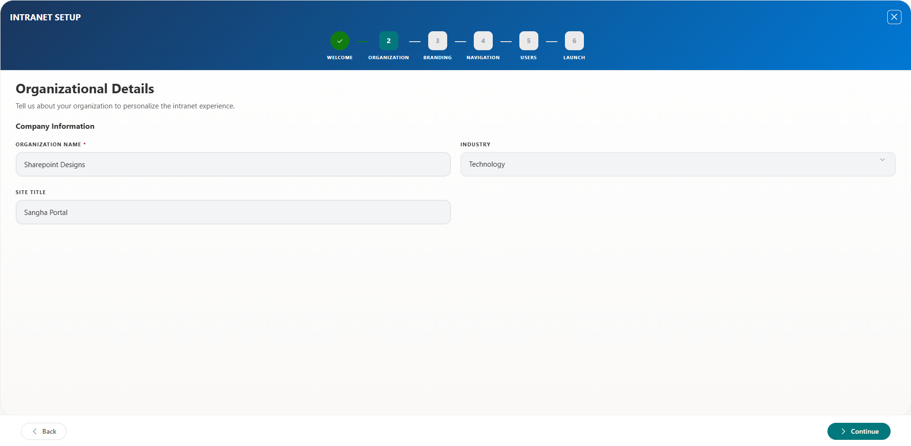

The wizard collects basic information about the organization to personalize the intranet.

**What administrators do:** Confirm the organization name (pre-filled from Microsoft 365), set the site title, and select the industry that best describes the business.
**What happens after:** The site title is updated in SharePoint and the organization details are saved for use throughout the intranet.

- - -

### Step 3 — Branding Configuration

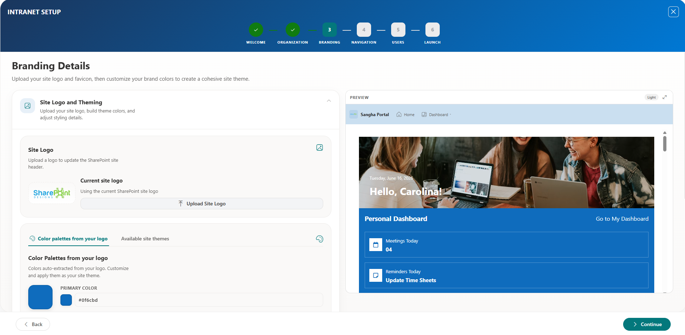

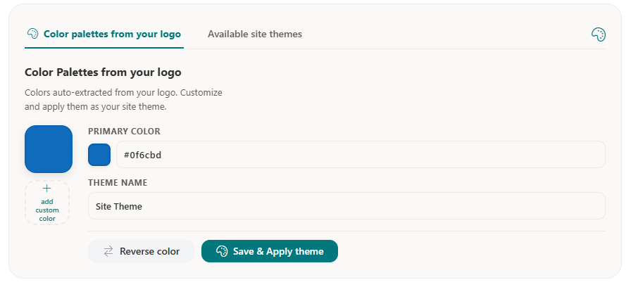

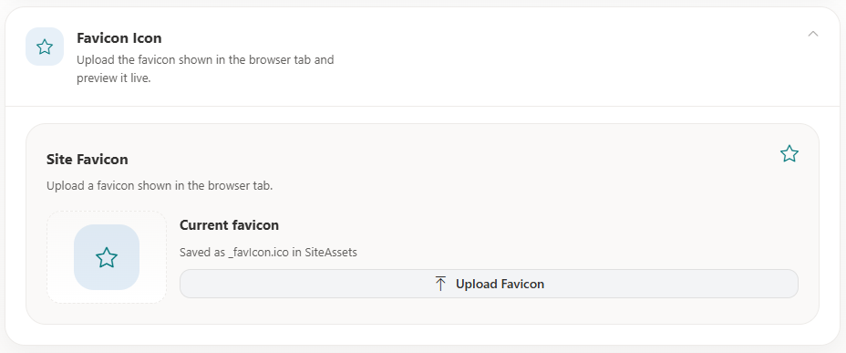

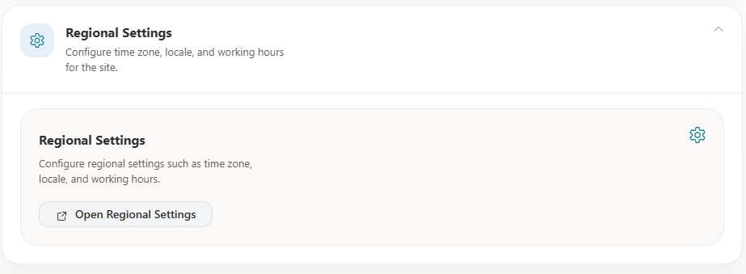

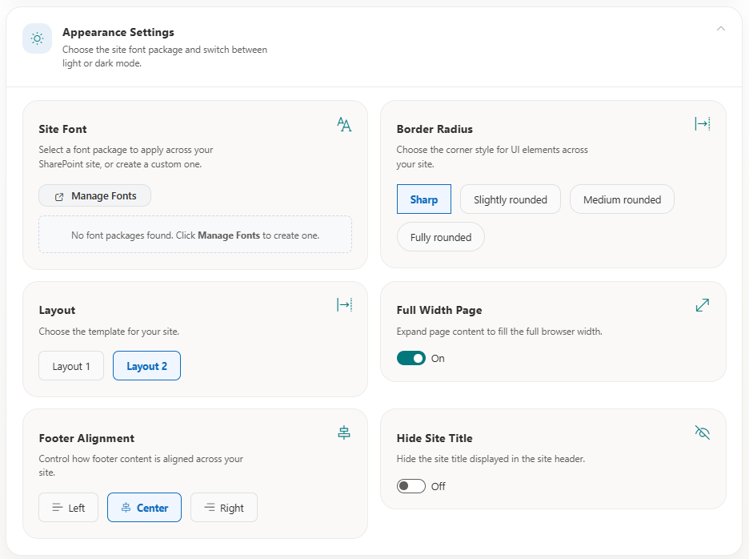

Administrators apply the organization's visual identity — logo, colors, fonts, and layout style.

**What administrators do:** Upload a logo, review auto-suggested brand colors, adjust if needed, choose a font, select a page layout, and set display preferences such as rounded corners.
**What happens after:** The logo is saved, brand colors are applied as a SharePoint theme, and the selected fonts and layout settings are activated across the site.

- - -

### Step 4 — Navigation Setup

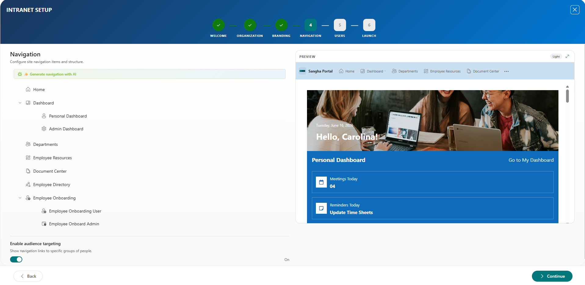

Administrators build the top navigation structure that employees will use to move around the intranet.

**What administrators do:** Add navigation items, organize them into groups, assign icons, configure links, and optionally target items to specific audiences (e.g., show a section only to managers).
**What happens after:** The navigation is saved and published to the site.

- - -

### Step 5 — User Access & Permissions

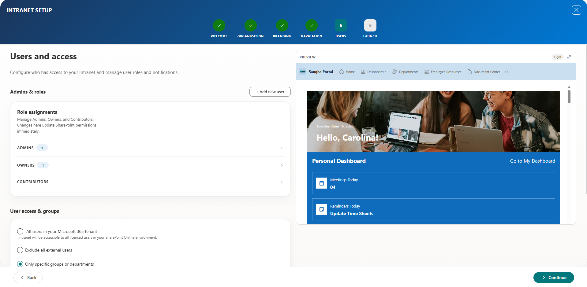

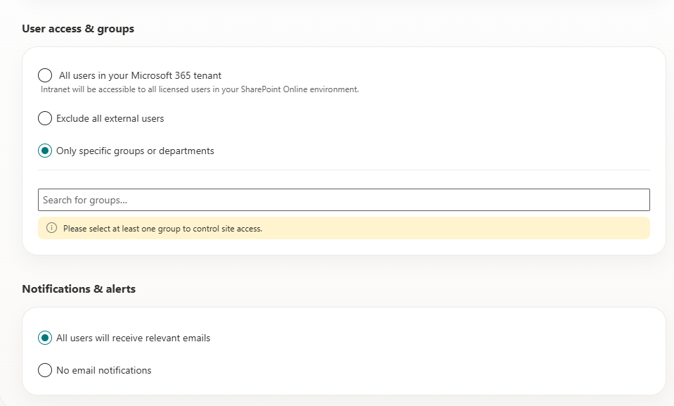

Administrators define who can access the intranet and at what level.

**What administrators do:** Add users by name or email, assign roles (Admin, Owner, or Contributor), set the overall access level (all staff, internal-only, or specific groups), and optionally enable a launch announcement email.
**What happens after:** SharePoint permission groups are updated and any selected users receive email notifications about the new intranet.

- - -

### Step 6 — Deploy

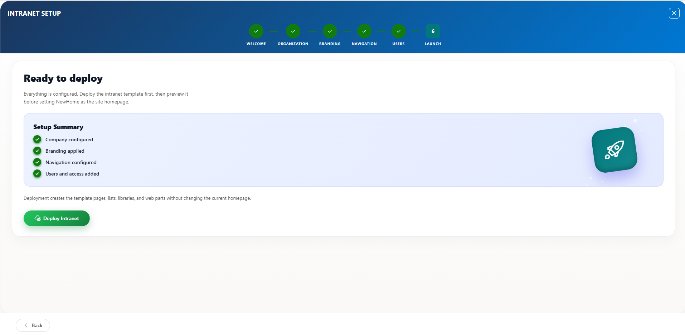

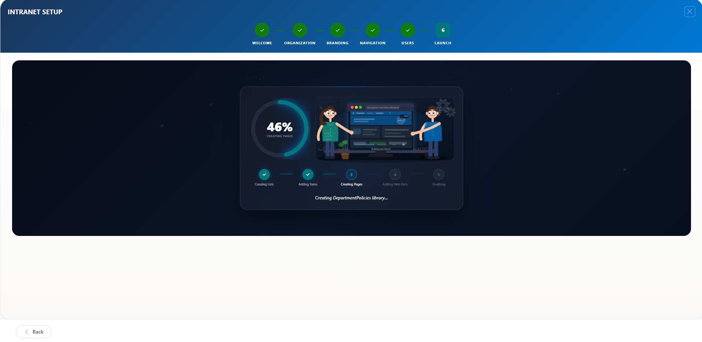

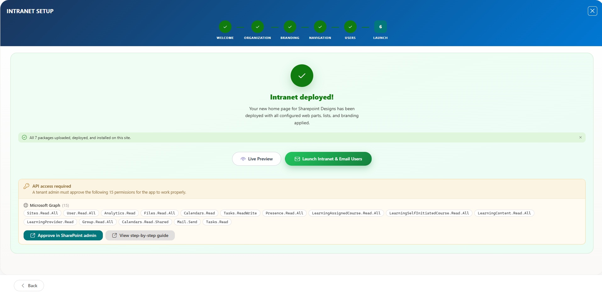

The wizard deploys all configured settings and creates the intranet pages and data.

**What administrators do:** Review the summary and click Deploy.
**What happens after:** The wizard creates all required SharePoint lists, libraries, and pages, installs the intranet web parts, applies branding, sets navigation, and configures user permissions. A progress bar tracks completion.

- - -

### Step 7 — Templates (Post-Launch)

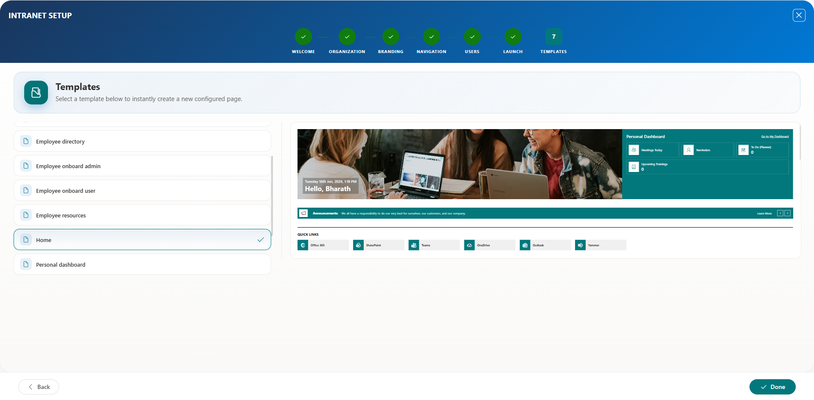

After deployment, administrators can create additional pages from pre-built templates.

**What administrators do:** Select a template, provide a page name, and create the page.
**What happens after:** A new page is created from the selected template and added to the site.

- - -

## Included Features

| Feature                | Description                                                                                                                                      |
| ---------------------- | ------------------------------------------------------------------------------------------------------------------------------------------------ |
| Branding Configuration | Upload a logo, set brand colors, choose fonts, select layout styles, and apply a favicon — all reflected across the entire site                  |
| Navigation Setup       | Build a multi-level top navigation with icons, sub-menus, audience targeting, and a drag-and-drop editor                                         |
| Site Provisioning      | Automatically creates SharePoint lists, document libraries, site pages, and content columns required by each intranet page                       |
| Theme Application      | Generates and applies a custom SharePoint theme using your brand colors                                                                          |
| Permission Assignment  | Assigns users to Admin, Owner, and Contributor roles and controls whether the site is open to all staff, internal users only, or specific groups |
| Content Setup          | Populates pages with starter content including sample news, announcements, events, and department structures                                     |
| Page Templates         | Provides a template gallery for creating additional custom pages after the initial deployment                                                    |
| Launch Notification    | Sends an announcement email to selected users when the intranet is ready                                                                         |

- - -

## Supported Microsoft 365 Environments

* **SharePoint Online** — Modern SharePoint experience required
* **Communication Sites** — Recommended site type for company intranets
* **Team Sites** — Supported for department or project-based intranets
* **Microsoft 365 Groups** — Supported for integrated team workspaces
* **Microsoft Teams** — Links and integrations supported within intranet pages

- - -
