Each web part is configured through its **settings panel**. To open it, click the web part while editing the page and click the **pencil (edit) icon**.

- - -

## 1. Welcome Banner

The Welcome Banner sits at the top of each sub-page and displays a full-width background image, department name, and an optional announcement or message strip. It offers two styles: **Department Banner** (Layout 1) and **Employee Resource Banner** (Layout 2).

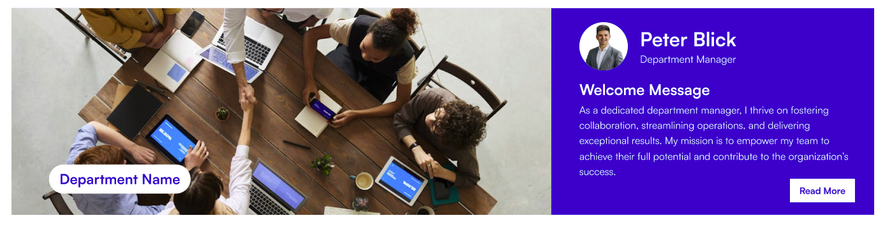

### 📐 Layout Settings

| Name          | Purpose                                                       | Control Type |
| ------------- | ------------------------------------------------------------- | ------------ |
| Select Layout | Switch between Department Banner and Employee Resource Banner | Dropdown     |

- - -

### ⚙️ General Settings (Department Banner — Layout 1)

| Name                         | Purpose                                                             | Control Type        |
| ---------------------------- | ------------------------------------------------------------------- | ------------------- |
| Enter Department Name        | The main heading shown on the banner                                | Text field          |
| Title Position               | Moves the department name up or down on the banner                  | Slider (1–87)       |
| Banner Height                | Controls the overall height of the banner                           | Slider (250–550 px) |
| Announcement                 | Opens a panel to add or edit announcement entries (see table below) | Manage panel        |
| Enable Announcement Section  | Shows or hides the announcement strip beneath the banner            | Toggle              |
| Enter Manager Message Header | Heading label above the manager message                             | Text field          |
| Enter Read More Text         | Label for the "read more" link in the announcement                  | Text field          |
| Change Background            | Select or upload the banner background image                        | Image picker        |

**Announcement Panel Fields:**

| Field               | Purpose                                                       |
| ------------------- | ------------------------------------------------------------- |
| Name                | Pick a person from the organisation directory (people picker) |
| Role                | The person's role or title                                    |
| Message Description | Short message or announcement text to display                 |

📸 View General Settings Screenshots

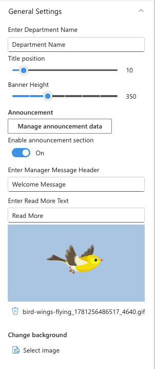

- - -

### ⚙️ General Settings (Employee Resource Banner — Layout 2)

| Name                           | Purpose                                      | Control Type          |
| ------------------------------ | -------------------------------------------- | --------------------- |
| Enter Department Name          | Heading text shown on the banner             | Text field            |
| Enter Announcement Title       | Bold title for the announcement block        | Text field            |
| Enter Announcement Description | Body text for the announcement               | Multi-line text field |
| Change Background              | Select or upload the banner background image | Image picker          |
| Enable Announcement Section    | Shows or hides the announcement block        | Toggle                |

📸 View General Settings (Layout 2) Screenshots

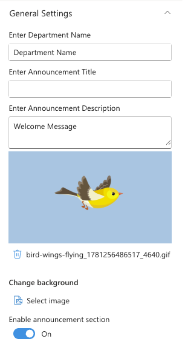

- - -

### 🤚🏻 Draggable Configuration Settings

| Name                        | Purpose                                                       | Control Type |
| --------------------------- | ------------------------------------------------------------- | ------------ |
| Enable Draggable Components | Allows content panels on the banner to be freely repositioned | Toggle       |
| Reset Component Positions   | Moves all draggable panels back to their default positions    | Button       |

📸 View Draggable Settings Screenshots

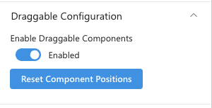

- - -

## 2. Featured News

Featured News pulls news posts from one or more SharePoint sites and displays them in a chosen layout. You can filter by category, audience, or add RSS feeds from external sources.

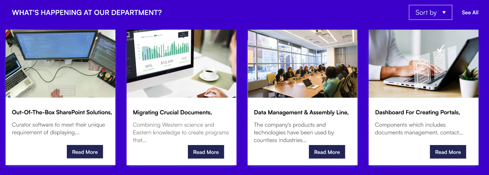

### 📌 Header Settings

| Name          | Purpose                                | Control Type |
| ------------- | -------------------------------------- | ------------ |
| Webpart Title | The title shown above the news section | Text field   |
| Hide Title    | Shows or hides the web part title      | Toggle       |

📸 View Header Settings Screenshots

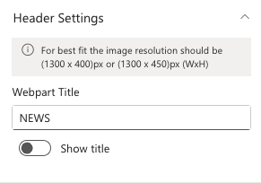

- - -

### ⚙️ General Settings

| Name                 | Purpose                                                                                    | Control Type  |
| -------------------- | ------------------------------------------------------------------------------------------ | ------------- |
| Search Sites         | Select one or more SharePoint sites to pull news from                                      | Site picker   |
| Enable RSS Feed      | Enables news from external RSS feeds alongside SharePoint news                             | Toggle        |
| RSS Links            | Opens a panel to add RSS feed URLs (visible only when RSS Feed is enabled)                 | Manage panel  |
| RSS API Key          | API key for the RSS-to-JSON service (visible only when RSS Feed is enabled)                | Text field    |
| Show Search Box      | Shows a search bar above the news grid                                                     | Toggle        |
| Show Sort By         | Shows a sort dropdown above the news grid                                                  | Toggle        |
| Show See All Button  | Shows a "See All" link at the top of the web part                                          | Toggle        |
| View All URL         | URL for the "See All" link (visible only when Show See All is on)                          | Text field    |
| Show Category Filter | Shows tabs to filter news by category (visible only when the news site has choice columns) | Toggle        |
| News Category        | The choice column to use for category filtering                                            | Dropdown      |
| Apply Filters        | Pre-filter news to show only selected category values                                      | Multi-select  |
| Target Audience      | Restrict news visibility to specific users or security groups                              | People picker |
| Manage News Posts    | Opens the site's news library directly to add or edit posts                                | Link          |

**RSS Links Panel Fields:**

| Field    | Purpose                                  |
| -------- | ---------------------------------------- |
| Title    | A friendly label for the feed (optional) |
| RSS Link | The full URL of the RSS feed             |

📸 View General Settings Screenshots

| | |
|---|---|
| 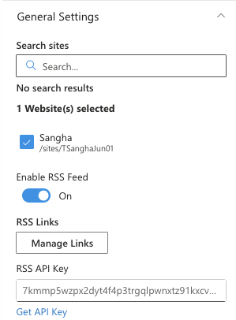 | 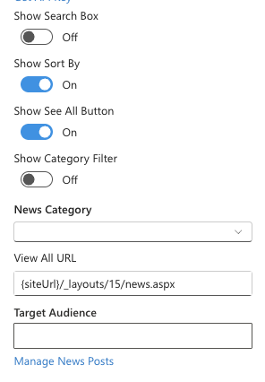 |

- - -

### 📐 Layout Settings

| Name          | Purpose                                                                                                          | Control Type |
| ------------- | ---------------------------------------------------------------------------------------------------------------- | ------------ |
| Choose Layout | Sets the display style: Top Story, Grid, Filmstrip, or Tiles                                                     | Dropdown     |
| Border Style  | Switches between Standard (all-round border) and Accent Bar (top bar only) — visible only when Show Border is on | Dropdown     |

📸 View Layout Settings Screenshots

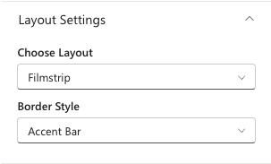

- - -

### 🎨 Appearance Settings

| Name                    | Purpose                                                              | Control Type  |
| ----------------------- | -------------------------------------------------------------------- | ------------- |
| Show Border             | Adds a border around each news card                                  | Toggle        |
| Height                  | Controls the height of the news section (Top Story and Grid layouts) | Slider        |
| Items to Show           | Number of news items to display (Top Story layout)                   | Slider (3–50) |
| Items to Show per Page  | Number of items per page (Grid layout)                               | Slider (4–16) |
| Items to Show per Slide | Number of items visible per carousel slide (Filmstrip layout)        | Slider (1–6)  |

📸 View Appearance Settings Screenshots

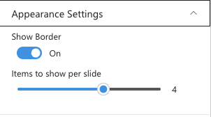

- - -

### 🛠 Admin Settings

| Name        | Purpose                                                                      | Control Type  |
| ----------- | ---------------------------------------------------------------------------- | ------------- |
| Show Admin  | Shows or hides the admin section on the web part for specified users         | Toggle        |
| Admin Users | Pick people who can see the admin tools (visible only when Show Admin is on) | People picker |

- - -

## 3. Common Tools

Common Tools displays a grid of quick-access link tiles with icons. Editors add and arrange links in a manage panel, choose how each link opens, and customize colours to match the site theme.

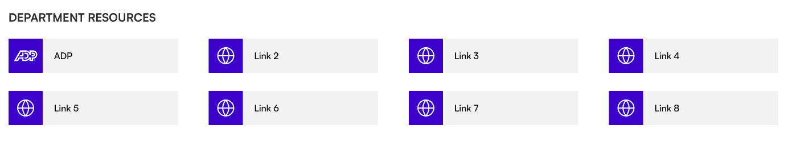

### 📌 Header Settings

| Name                      | Purpose                                                           | Control Type          |
| ------------------------- | ----------------------------------------------------------------- | --------------------- |
| Webpart Title             | The title shown above the links grid                              | Text field            |
| WebPart Title Theme Color | Picks a colour for the web part title from the site theme palette | Theme colour dropdown |
| Hide Title                | Shows or hides the web part title                                 | Toggle                |

📸 View Header Settings Screenshots

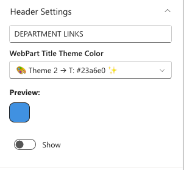

- - -

### ⚙️ General Settings

| Name            | Purpose                                                      | Control Type |
| --------------- | ------------------------------------------------------------ | ------------ |
| Quicklinks Data | Opens a panel to add, edit, reorder, and delete link tiles   | Manage panel |
| See All URL     | Optional URL for a "See All" link at the top of the web part | Text field   |

**Quicklinks Data Panel Fields:**

| Field   | Purpose                                             |
| ------- | --------------------------------------------------- |
| Title   | The label shown on the tile                         |
| Link    | The destination URL                                 |
| Icon    | Fabric icon shown on the tile (icon picker)         |
| Open In | Whether the link opens in the same tab or a new tab |

📸 View General Settings Screenshots

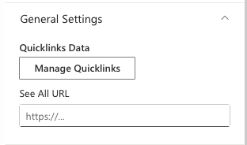

- - -

### 📐 Layout Settings

| Name          | Purpose                                                                           | Control Type |
| ------------- | --------------------------------------------------------------------------------- | ------------ |
| Select Layout | Switch between Standard (bordered tiles) and Accent Bar (icon boxes with top bar) | Dropdown     |

- - -

### 🎨 Appearance Settings

| Name                          | Purpose                                                                     | Control Type          |
| ----------------------------- | --------------------------------------------------------------------------- | --------------------- |
| Show Gradient on Hover        | Adds a gradient effect when a user hovers over a tile                       | Toggle                |
| QuickLinks Title Color        | Picks a colour for the link label text from the site theme palette          | Theme colour dropdown |
| Icon Background & Color Theme | Picks colours for the icon box background and icon (Accent Bar layout only) | Theme colour dropdown |
| Button Hover Theme            | Picks the hover highlight colour from the site theme palette                | Theme colour dropdown |

📸 View Appearance Settings Screenshots

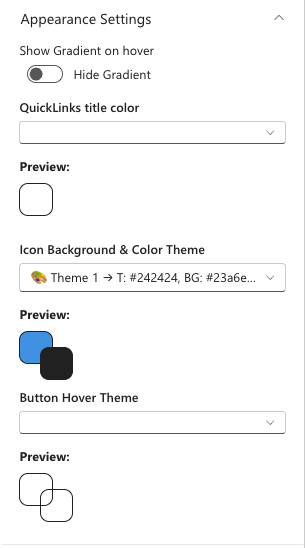

- - -

## 4. Document Contents

Document Contents surfaces files from a SharePoint document library in a chosen view. Editors can filter by folder, category, and control which file details are visible.

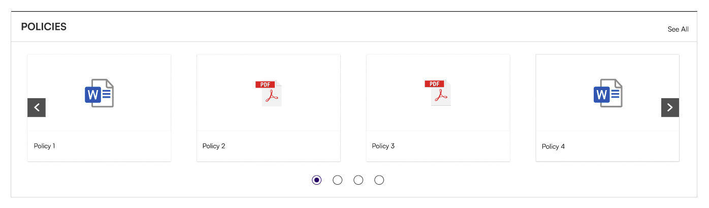

### 📌 Header Settings

| Name               | Purpose                                                                              | Control Type |
| ------------------ | ------------------------------------------------------------------------------------ | ------------ |
| Show Webpart Title | Shows or hides the web part title                                                    | Toggle       |
| Title              | The title shown above the document list (visible only when Show Webpart Title is on) | Text field   |

📸 View Header Settings Screenshots

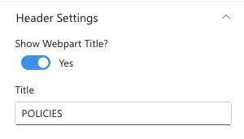

- - -

### ⚙️ General Settings

| Name                      | Purpose                                                                                         | Control Type   |
| ------------------------- | ----------------------------------------------------------------------------------------------- | -------------- |
| Source                    | Choose between showing all documents from this site or a specific library                       | Dropdown       |
| Select a Library          | Pick the document library to display (visible only when Source is "A document library")         | Library picker |
| Goto Library              | Opens the selected library directly to manage files                                             | Link           |
| Add/Update Items          | Opens the library in a panel to add or update files                                             | Button         |
| Folder Name               | Filter to show only files from a specific folder (type nested paths with `/`)                   | Text field     |
| Include Sub-Folder Files  | Also shows files from folders inside the selected folder (visible only when Folder Name is set) | Toggle         |
| Category Name             | The choice column to use for filtering (auto-detected from the library)                         | Dropdown       |
| Filter the Category Value | Pre-filter documents to show only selected category values                                      | Multi-select   |

📸 View General Settings Screenshots

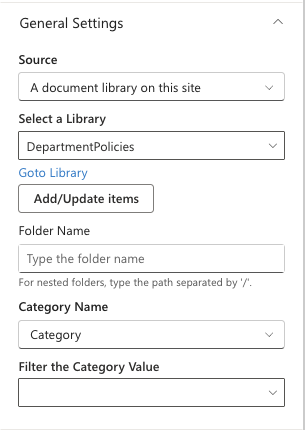

- - -

### 📐 Layout Settings

| Name         | Purpose                                                                  | Control Type |
| ------------ | ------------------------------------------------------------------------ | ------------ |
| Layout Type  | Display style: Film Strip, Grid, List, or Compact                        | Dropdown     |
| Layout Style | Switch between Standard (all-round border) and Accent Bar (top bar only) | Dropdown     |

- - -

### 🎨 Appearance Settings

| Name                       | Purpose                                                                                   | Control Type  |
| -------------------------- | ----------------------------------------------------------------------------------------- | ------------- |
| Show See All               | Shows a "See All" link above the document list                                            | Toggle        |
| See All Link               | URL for the "See All" link (visible only when Show See All is on)                         | Text field    |
| Show Thumbnail             | Shows a file thumbnail image (Film Strip and Grid layouts)                                | Toggle        |
| Show Folder Name           | Shows the folder the file is in (visible only when Show Thumbnail is on)                  | Toggle        |
| Show Category              | Shows the category tag on each file (visible only when the library has a category column) | Toggle        |
| Show Author                | Shows the file author's name                                                              | Toggle        |
| Show Description           | Shows the file description                                                                | Toggle        |
| Slides per View            | Number of files visible per slide (Film Strip layout)                                     | Slider (1–6)  |
| Enable Navigation          | Shows previous/next arrows on the carousel (Film Strip layout)                            | Toggle        |
| Enable Pagination          | Shows page dots below the carousel (Film Strip layout)                                    | Toggle        |
| Number of Items to Display | Limits how many files are shown before the "See All" link appears                         | Slider (1–25) |

📸 View Appearance Settings Screenshots

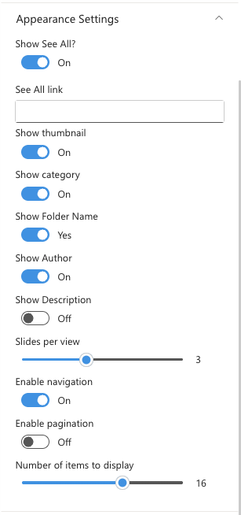

- - -

### 🛠 Admin Settings

| Name        | Purpose                                                                      | Control Type  |
| ----------- | ---------------------------------------------------------------------------- | ------------- |
| Show Admin  | Shows or hides the admin view for specified users                            | Toggle        |
| Admin Users | Pick people who can see the admin tools (visible only when Show Admin is on) | People picker |

- - -

## 5. Feedback

Feedback is a simple call-to-action banner with a background image and a button that directs employees to a feedback destination, such as a Microsoft Form or support mailbox.

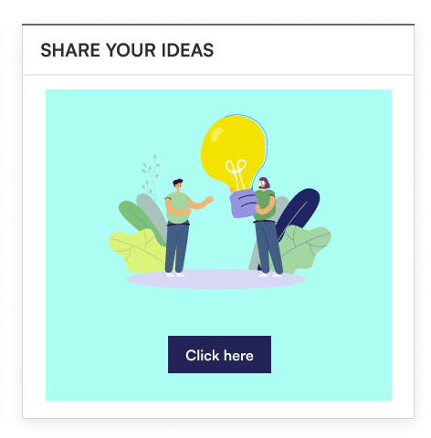

### 📌 Header Settings

| Name          | Purpose                         | Control Type |
| ------------- | ------------------------------- | ------------ |
| Webpart Title | The heading shown on the banner | Text field   |

- - -

### ⚙️ General Settings

| Name           | Purpose                                                            | Control Type         |
| -------------- | ------------------------------------------------------------------ | -------------------- |
| Select Image   | Background image for the banner                                    | Image picker         |
| Button Text    | Label on the call-to-action button (e.g., "Share Your Ideas")      | Text field           |
| Action Link    | URL the button navigates to (e.g., a Microsoft Form or email link) | Text field           |
| Webpart Height | Controls the height of the banner                                  | Slider (100–1000 px) |

📸 View General Settings Screenshots

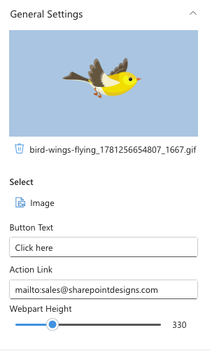

- - -

### 📐 Layout Settings

| Name   | Purpose                                | Control Type |
| ------ | -------------------------------------- | ------------ |
| Layout | Switch between Standard and Accent Bar | Dropdown     |

- - -

## 6. Goals

Goals displays your department or team's key objectives as visual cards with an icon, title, description, and optional link. Cards can be reordered in the manage panel.

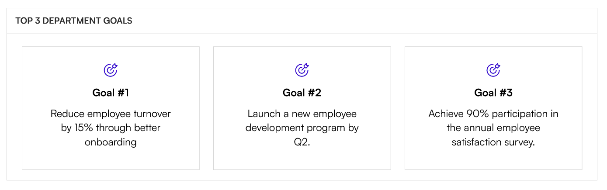

### 📌 Header Settings

| Name                | Purpose                              | Control Type |
| ------------------- | ------------------------------------ | ------------ |
| Enter Webpart Title | The title shown above the goals grid | Text field   |

- - -

### ⚙️ General Settings

| Name  | Purpose                                                    | Control Type |
| ----- | ---------------------------------------------------------- | ------------ |
| Goals | Opens a panel to add, edit, reorder, and delete goal cards | Manage panel |

**Goals Panel Fields:**

| Field       | Purpose                                     |
| ----------- | ------------------------------------------- |
| Title       | The goal heading                            |
| Description | A short description of the goal             |
| Link URL    | Optional link to a related page or document |
| Icon        | Fabric icon shown on the card (icon picker) |

📸 View General Settings Screenshots

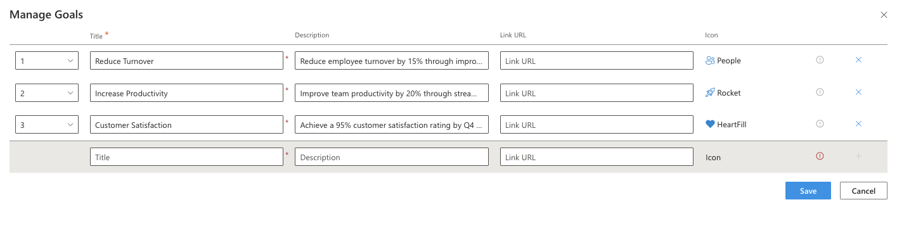

- - -

### 📐 Layout Settings

| Name          | Purpose                                | Control Type |
| ------------- | -------------------------------------- | ------------ |
| Select Layout | Switch between Standard and Accent Bar | Dropdown     |

- - -

### 🎨 Appearance Settings

| Name                  | Purpose                                                | Control Type |
| --------------------- | ------------------------------------------------------ | ------------ |
| Text Alignment        | Aligns the card text: Left, Centre, or Right           | Dropdown     |
| Show Full Description | Shows the complete description text without truncation | Toggle       |

📸 View Appearance Settings Screenshots

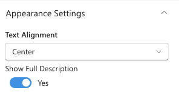

- - -

## 7. Newsletter

Newsletter pulls editions from a SharePoint document library and displays them as a gallery with cover images, titles, and a "Read More" link. A month filter lets employees browse past editions, and an optional carousel lets editors showcase multiple issues at once.

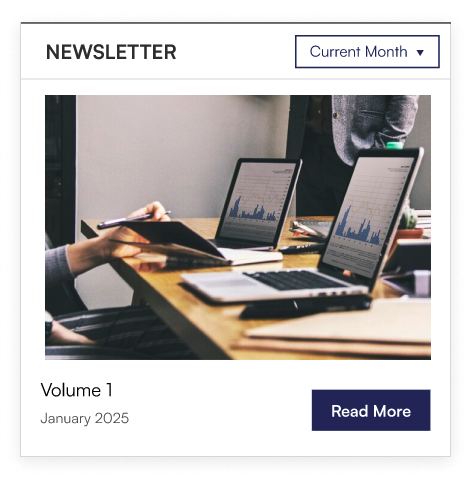

### 📌 Header Settings

| Name          | Purpose                                      | Control Type |
| ------------- | -------------------------------------------- | ------------ |
| Webpart Title | The title shown above the newsletter gallery | Text field   |

- - -

### ⚙️ General Settings

| Name                      | Purpose                                                                                         | Control Type        |
| ------------------------- | ----------------------------------------------------------------------------------------------- | ------------------- |
| Select Sites              | Pick the SharePoint site that hosts the newsletter library                                      | Site picker         |
| Select Newsletter Library | Pick the document library containing newsletter editions (visible only when a site is selected) | Library picker      |
| Add/Update Items          | Opens the library in a panel to upload or update newsletters                                    | Button              |
| Enable Carousel           | Switches to a carousel display for multiple editions                                            | Toggle              |
| Height                    | Controls the height of the web part                                                             | Slider (200–700 px) |
| Number of Items per Slide | How many editions are visible per slide (visible only when Enable Carousel is on)               | Slider (1–10)       |

📸 View General Settings Screenshots

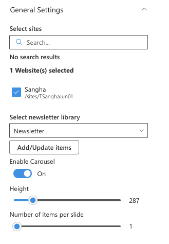

- - -

### 📐 Layout Settings

| Name   | Purpose                                | Control Type |
| ------ | -------------------------------------- | ------------ |
| Layout | Switch between Standard and Accent Bar | Dropdown     |

- - -

### 🛠 Admin Settings

| Name        | Purpose                                                                  | Control Type  |
| ----------- | ------------------------------------------------------------------------ | ------------- |
| Show Admin  | Shows or hides the admin section for specified users                     | Toggle        |
| Admin Users | Pick people who can see admin tools (visible only when Show Admin is on) | People picker |

- - -

## 8. The Team

The Team displays a curated list of team members or subject-matter experts (SMEs) with their profile photo, role, and an optional custom name. Cards can be shown as a static grid or in a scrollable carousel.

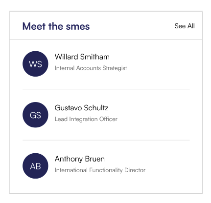

### 📌 Header Settings

| Name          | Purpose                                     | Control Type |
| ------------- | ------------------------------------------- | ------------ |
| Webpart Title | The title shown above the team grid         | Text field   |
| See All Link  | URL for a "See All" or "Meet the Team" link | Text field   |

📸 View Header Settings Screenshots

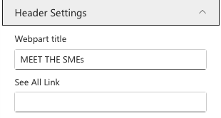

- - -

### ⚙️ General Settings

| Name                    | Purpose                                                                               | Control Type   |
| ----------------------- | ------------------------------------------------------------------------------------- | -------------- |
| Team Members            | Opens a panel to add, edit, and reorder team member cards                             | Manage panel   |
| Image Size              | Controls the size of profile photos                                                   | Slider (5–100) |
| Enable Carousel         | Switches the display to a scrollable carousel                                         | Toggle         |
| Show Navigation         | Shows previous/next arrows on the carousel (visible only when Enable Carousel is on)  | Toggle         |
| Items to Show per Slide | How many member cards are visible per slide (visible only when Enable Carousel is on) | Slider (1–10)  |

**Team Members Panel Fields:**

| Field               | Purpose                                                                                 |
| ------------------- | --------------------------------------------------------------------------------------- |
| Person              | Pick a person from the organisation directory (people picker)                           |
| Role                | Optional role or title to display beneath the person's name                             |
| Custom Display Name | Optional alternative name to display instead of the person's Microsoft 365 display name |

📸 View General Settings Screenshots

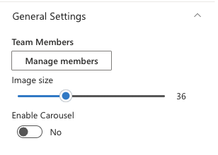

- - -

### 📐 Layout Settings

| Name          | Purpose                                | Control Type |
| ------------- | -------------------------------------- | ------------ |
| Select Layout | Switch between Standard and Accent Bar | Dropdown     |

- - -
