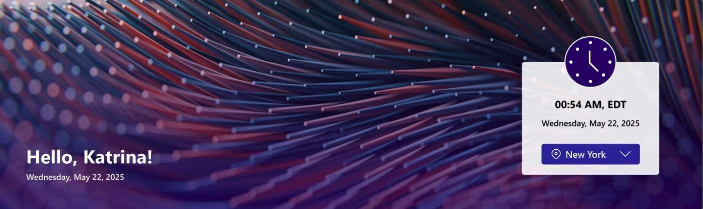

## Overview

A modern SharePoint web part that displays a personalized greeting and real-time date and time information for the selected city, featuring elegant visuals and user context awareness.

## Configuration

#### General settings

📸 View General settings Screenshots

| Name                 | Purpose                                      | Example                            |
| -------------------- | -------------------------------------------- | ---------------------------------- |
| Layout               | Define the layout structure of the web part. | Home/Sub Page                      |
| Welcome Message      | Display a personalized greeting.             | “Hello”                            |
| Format Date and Time | Display the current date and time            | “Thursday 14th Jul, 2022, 4:27 PM” |
| Change Background    | Upload a custom banner background            | Image Picker                       |

#### Message Configuration

📸 View Message Configuration Screenshots

| Name                  | Purpose                                                             | Example                                      |
| --------------------- | ------------------------------------------------------------------- | -------------------------------------------- |
| Show User's Full Name | Toggle to show or hide the user's full name in the welcome message. | On/Off                                       |
| People                | Select specific users to feature in the welcome message.            | User Picker                                  |
| Description           | Provide a brief description for the welcome message.                | “Maximizing SharePoint, Automation, and AI.” |
| Redirection URL       | Specify a URL to redirect users when they click on the Read More.   | URL Input                                    |

#### Appearance Settings

📸 View Appearance Settings Screenshots

| Name                        | Purpose                                              | Example        |
| --------------------------- | ---------------------------------------------------- | -------------- |
| Banner Height               | Adjust the height of the welcome banner.             | Slider Control |
| Message Container Width     | Set the width of the message container.              | Slider Control |
| People Welcome Height       | Adjust the height of the message container.          | Slider Control |
| Background color            | Choose a background color for the Message container. | Color Picker   |
| Text color                  | Choose a text color for the Message container.       | Color Picker   |
| Welcome Message theme color | Choose a theme color for the Welcome Message text.   | Dropdown       |
| Gradient Background theme   | Choose a theme color for the Gradient Background.    | Dropdown       |
| Read More Button Theme      | Choose a theme color for the Read More button.       | Dropdown       |

#### Draggable Configuration

📸 View Draggable Configuration Screenshots

| Name                     | Purpose                                                                 | Example |
| ------------------------ | ----------------------------------------------------------------------- | ------- |
| Enable Dragging          | Toggle to enable or disable dragging functionality for the web part.    | On/Off  |
| Reset Component Position | Reset the position of the web part to its default location on the page. | Button  |
