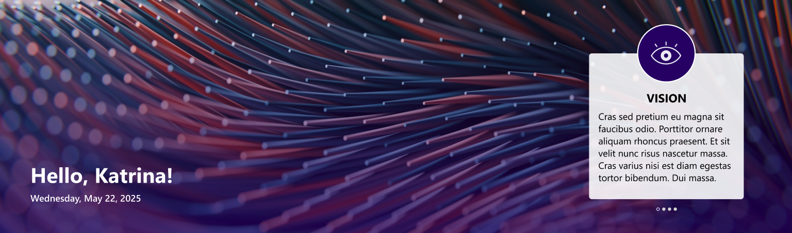
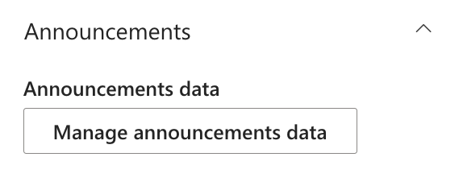
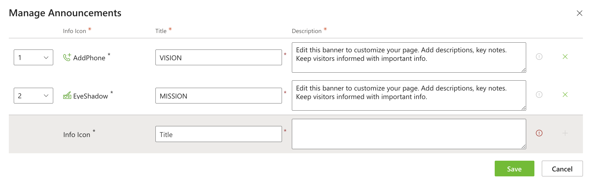
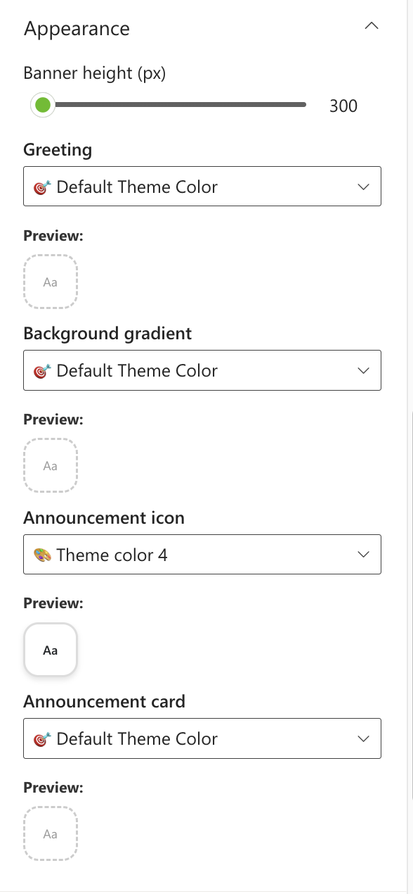

## Overview

A visually engaging SharePoint web part that presents personalized greetings and highlights organizational vision/mission/announcement.

## Configuration

#### General

📸 View General settings Screenshots

| Name                       | Purpose                                                                 | Example                            |
| -------------------------- | ----------------------------------------------------------------------- | ---------------------------------- |
| Greeting text              | Display a personalized greeting.                                        | “Hello” or "Welcome"               |
| User name format           | Display the user's name.                                                | John / John Smith                  |
| Draggable feature          | Toggle to enable or disable dragging functionality for the web part.    | On/Off                             |
| Reset to original position | Reset the position of the web part to its default position on the page. | Button                             |
| Date and time format       | Display the current date and time                                       | “Thursday 14th Jul, 2022, 4:27 PM” |
| Change Background          | Upload a custom banner background                                       | Image Picker                       |

#### Layout

📸 View layout Configuration Screenshots

| Name    | Purpose                                    | Example  |
| ------- | ------------------------------------------ | -------- |
| Layouts | Choose the layout for the welcome message. | Dropdown |

#### Announcements

📸 View Announcements Screenshots

| Name                      | Purpose                                      | Example               |
| ------------------------- | -------------------------------------------- | --------------------- |
| Manage announcements data | Stores the collection of announcements       | Collection data field |
| Collection Panel          | Add the details in the field and click save. | Collection field      |

#### Appearance Settings

📸 View Appearance Settings Screenshots

| Name                | Purpose                                           | Example        |
| ------------------- | ------------------------------------------------- | -------------- |
| Banner Height       | Adjust the height of the welcome banner.          | Slider Control |
| Greeting            | Choose a theme color for the greeting text.       | Dropdown       |
| Background gradient | Choose a theme color for the Background gradient. | Dropdown       |
| Announcement icon   | Choose a theme color for the announcement icon.   | Dropdown       |
| Announcement card   | Choose a theme color for the announcement card.   | Dropdown       |
