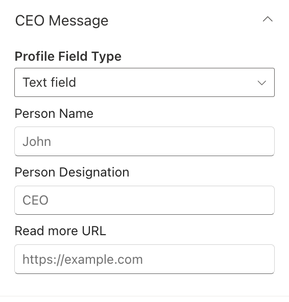
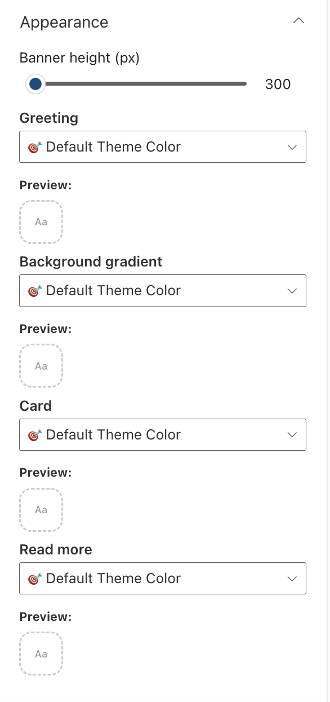

## Overview

A visually engaging SharePoint web part that presents personalized greetings and displays a message from the CEO.

## Configuration

#### General

📸 View General settings Screenshots

| Name                       | Purpose                                                                 | Example                            |
| -------------------------- | ----------------------------------------------------------------------- | ---------------------------------- |
| Greeting text              | Display a personalized greeting.                                        | “Hello” or "Welcome"               |
| User name format           | Display the user's name.                                                | John / John Smith                  |
| Draggable feature          | Toggle to enable or disable dragging functionality for the web part.    | On/Off                             |
| Reset to original position | Reset the position of the web part to its default position on the page. | Button                             |
| Date and time format       | Display the current date and time                                       | “Thursday 14th Jul, 2022, 4:27 PM” |
| Change Background          | Upload a custom banner background                                       | Image Picker                       |

#### Layout

📸 View layout Configuration Screenshots

| Name    | Purpose                                    | Example  |
| ------- | ------------------------------------------ | -------- |
| Layouts | Choose the layout for the welcome message. | Dropdown |

#### CEO Message

📸 View CEO Message Screenshots

| Name                   | Purpose                                                                     | Example         |
| ---------------------- | --------------------------------------------------------------------------- | --------------- |
| Profile field type     | An option to select eith a text field or people picker field                | Dropdown option |
| People (people picker) | A people picker field to select the person whose message is to be displayed | People picker   |
| Person Name            | A text field to add the person name                                         | Text field      |
| Person Designation     | A text field to add the person designation                                  | Text field      |
| Read more URL          | A text field to add the read more URL                                       | Text field      |

#### Appearance Settings

📸 View Appearance Settings Screenshots

| Name                | Purpose                                           | Example        |
| ------------------- | ------------------------------------------------- | -------------- |
| Banner Height       | Adjust the height of the welcome banner.          | Slider Control |
| Greeting            | Choose a theme color for the greeting text.       | Dropdown       |
| Background gradient | Choose a theme color for the Background gradient. | Dropdown       |
| Card                | Choose a theme color for the CEO Message card.    | Dropdown       |
| Read more           | Choose a theme color for the read more button.    | Dropdown       |
