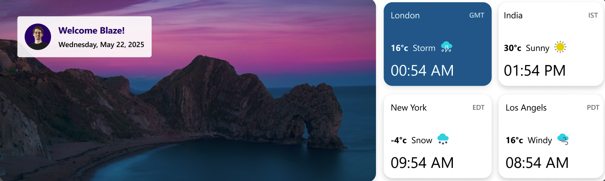
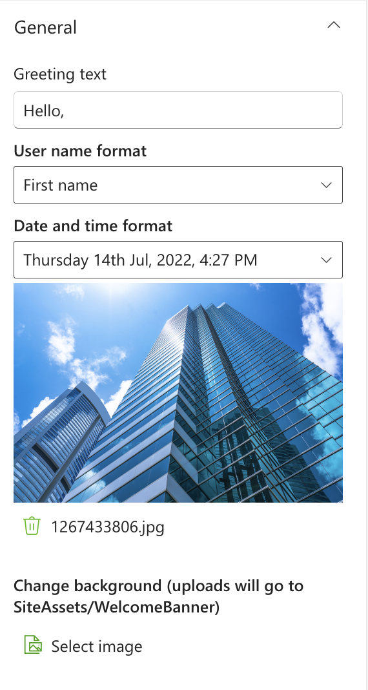
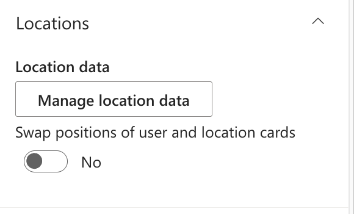
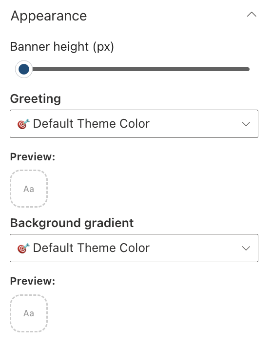

## Overview

A visually engaging SharePoint web part that presents personalized greetings and highlights different location weathers.

## Configuration

#### General

📸 View General settings Screenshots

| Name                 | Purpose                           | Example                            |
| -------------------- | --------------------------------- | ---------------------------------- |
| Greeting text        | Display a personalized greeting.  | “Hello” or "Welcome"               |
| User name format     | Display the user's name.          | John / John Smith                  |
| Date and time format | Display the current date and time | “Thursday 14th Jul, 2022, 4:27 PM” |
| Change Background    | Upload a custom banner background | Image Picker                       |

#### Layout

📸 View layout Configuration Screenshots

| Name    | Purpose                                    | Example  |
| ------- | ------------------------------------------ | -------- |
| Layouts | Choose the layout for the welcome message. | Dropdown |

#### Locations

📸 View Locations Screenshots

| Name                            | Purpose                           | Example               |
| ------------------------------- | --------------------------------- | --------------------- |
| Manage location data            | Stores the collection of location | Collection data field |
| Swap positions of user and card | Toggle it to swap the positions   | Toggle                |

#### Appearance Settings

📸 View Appearance Settings Screenshots

| Name                | Purpose                                           | Example        |
| ------------------- | ------------------------------------------------- | -------------- |
| Banner Height       | Adjust the height of the welcome banner.          | Slider Control |
| Greeting            | Choose a theme color for the greeting text.       | Dropdown       |
| Background gradient | Choose a theme color for the Background gradient. | Dropdown       |
