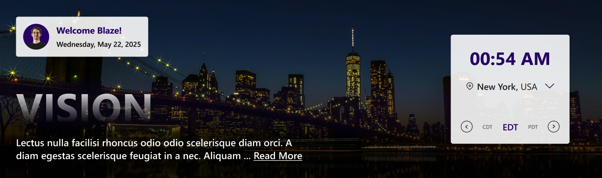
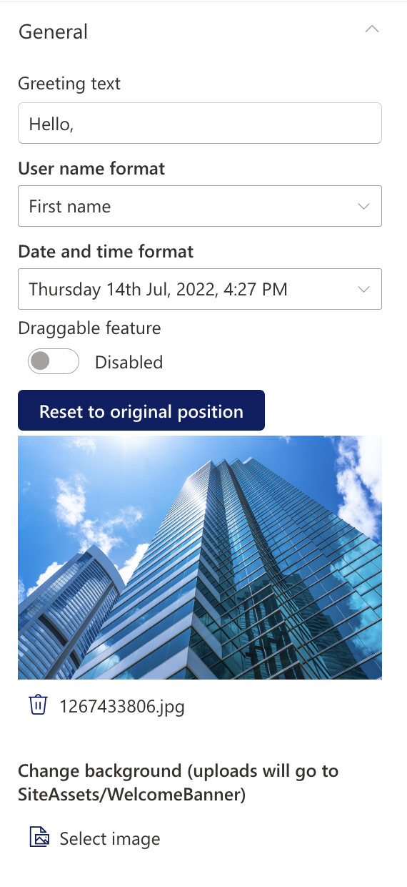
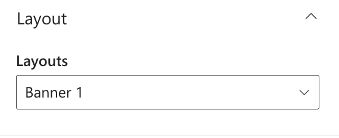
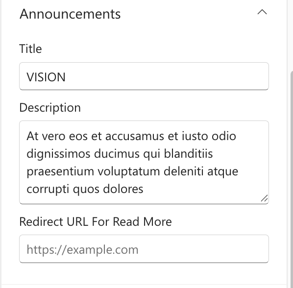
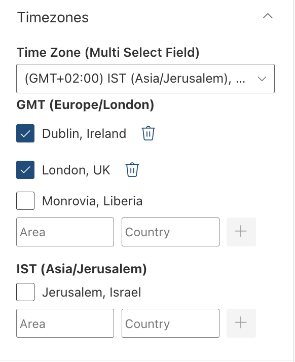
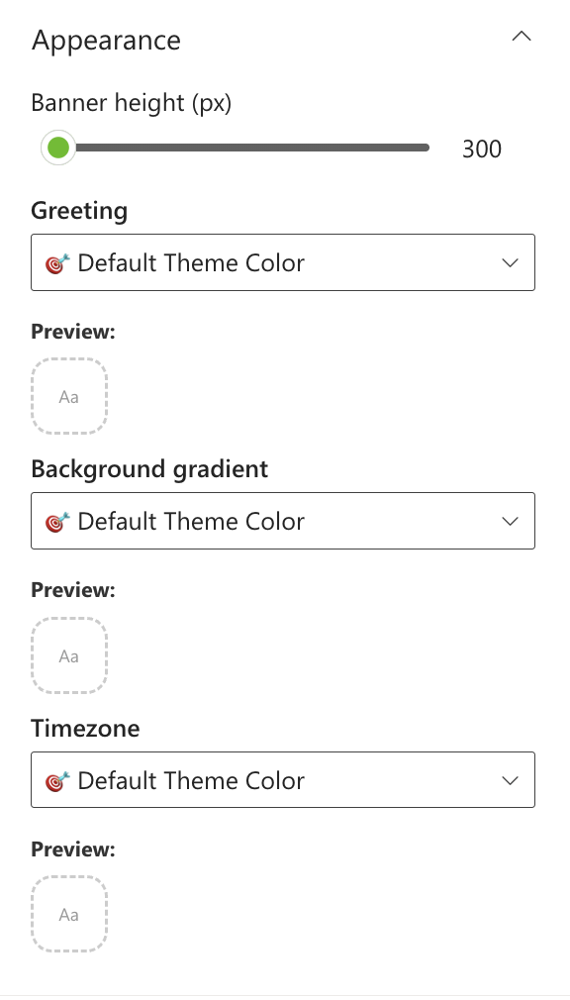

## Overview

A modern SharePoint web part that displays a personalized greeting and real-time date and time information for the selected city, featuring elegant visuals and user context awareness

## Configuration

#### General

📸 View General settings Screenshots

| Name                       | Purpose                                                                 | Example                            |
| -------------------------- | ----------------------------------------------------------------------- | ---------------------------------- |
| Greeting text              | Display a personalized greeting.                                        | “Hello” or "Welcome"               |
| User name format           | Display the user's name.                                                | John / John Smith                  |
| Draggable feature          | Toggle to enable or disable dragging functionality for the web part.    | On/Off                             |
| Reset to original position | Reset the position of the web part to its default position on the page. | Button                             |
| Date and time format       | Display the current date and time                                       | “Thursday 14th Jul, 2022, 4:27 PM” |
| Change Background          | Upload a custom banner background                                       | Image Picker                       |

#### Layout

📸 View layout Configuration Screenshots

| Name    | Purpose                                    | Example  |
| ------- | ------------------------------------------ | -------- |
| Layouts | Choose the layout for the welcome message. | Dropdown |

#### Announcements

📸 View Announcements Screenshots

| Name         | Purpose                                   | Example           |
| ------------ | ----------------------------------------- | ----------------- |
| Title        | Displays the heading of the announcement. | "Company Updates" |
| Description  | Add a description for the announcement.   | Multiline text    |
| Redirect URL | Add a redirect URL for the announcement.  | Text field        |

#### Timezones

📸 View Timezones Screenshots

| Name                           | Purpose                                                              | Example              |
| ------------------------------ | -------------------------------------------------------------------- | -------------------- |
| Time Zone (Multi Select Field) | Select the timezones that should be displayed in the welcome banner. | Multiselect dropdown |
| Checkbox options               | Select the checkbox to show dropdown options.                        | Checkbox             |

#### Appearance Settings

📸 View Appearance Settings Screenshots

| Name                | Purpose                                           | Example        |
| ------------------- | ------------------------------------------------- | -------------- |
| Banner Height       | Adjust the height of the welcome banner.          | Slider Control |
| Greeting            | Choose a theme color for the greeting text.       | Dropdown       |
| Background gradient | Choose a theme color for the Background gradient. | Dropdown       |
| Card                | Choose a theme color for the Timezone .           | Dropdown       |
