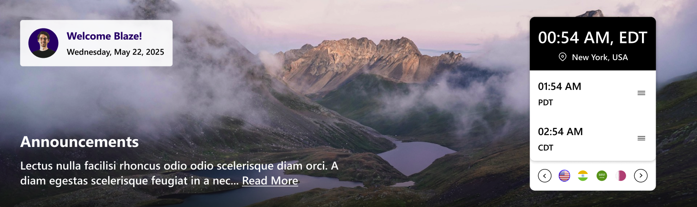
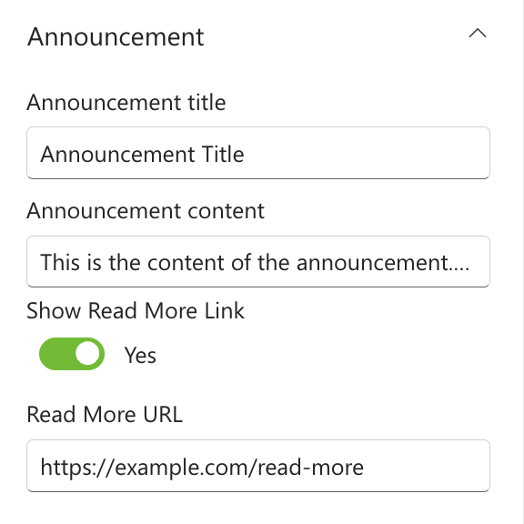
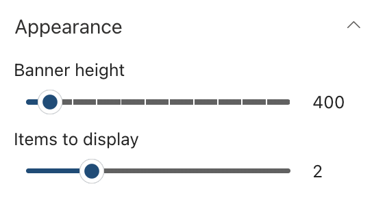

## Overview

A modern SharePoint web part that displays a personalized greeting and real-time date and time information for the selected city, featuring elegant visuals and user context awareness

## Configuration

#### General

📸 View General settings Screenshots

| Name                       | Purpose                                                                 | Example                            |
| -------------------------- | ----------------------------------------------------------------------- | ---------------------------------- |
| Greeting text              | Display a personalized greeting.                                        | “Hello” or "Welcome"               |
| User name format           | Display the user's name.                                                | John / John Smith                  |
| Draggable feature          | Toggle to enable or disable dragging functionality for the web part.    | On/Off                             |
| Reset to original position | Reset the position of the web part to its default position on the page. | Button                             |
| Date and time format       | Display the current date and time                                       | “Thursday 14th Jul, 2022, 4:27 PM” |
| Change Background          | Upload a custom banner background                                       | Image Picker                       |

#### Layout

📸 View layout Configuration Screenshots

| Name    | Purpose                                    | Example  |
| ------- | ------------------------------------------ | -------- |
| Layouts | Choose the layout for the welcome message. | Dropdown |

#### Announcements

📸 View Announcements Screenshots

| Name                | Purpose                                          | Example           |
| ------------------- | ------------------------------------------------ | ----------------- |
| Title               | Displays the heading of the announcement.        | "Company Updates" |
| Content             | Add a description for the announcement.          | Multiline text    |
| Show Read More Link | Toggle to show or hide read more button.         | Toggle            |
| Ream More URL       | A link to read the full content of announcement. | Text field        |

#### Timezones

📸 View Timezones Screenshots

| Name                 | Purpose                            | Example          |
| -------------------- | ---------------------------------- | ---------------- |
| Manage timezone data | Add a data to the collection field | Collection field |

#### Appearance Settings

📸 View Appearance Settings Screenshots

| Name             | Purpose                                      | Example        |
| ---------------- | -------------------------------------------- | -------------- |
| Banner Height    | Adjust the height of the welcome banner.     | Slider Control |
| Items to display | A slider to set the max no of items to show. | Slider         |
