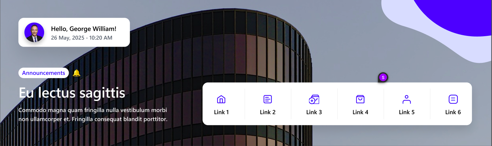
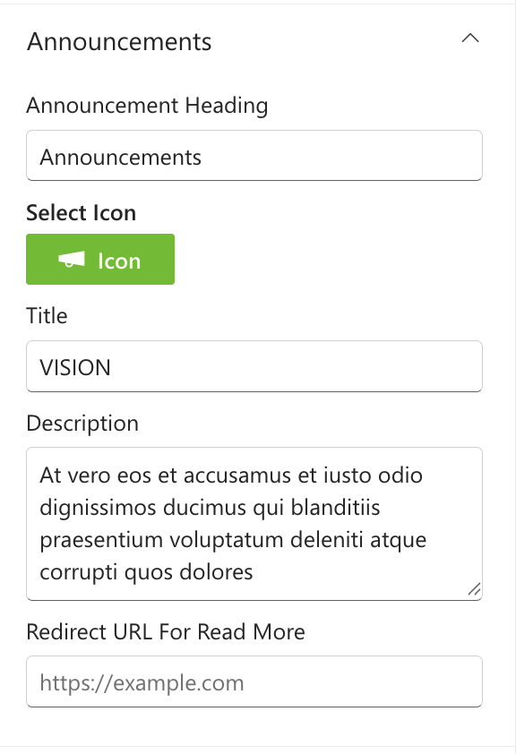
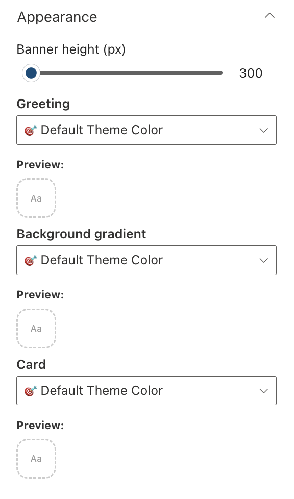

## Overview

A modern SharePoint web part that displays a personalized greeting and announcements and a quick links for quick navigation.

## Configuration

#### General

📸 View General settings Screenshots

| Name                       | Purpose                                                                 | Example                            |
| -------------------------- | ----------------------------------------------------------------------- | ---------------------------------- |
| Greeting text              | Display a personalized greeting.                                        | “Hello” or "Welcome"               |
| User name format           | Display the user's name.                                                | John / John Smith                  |
| Draggable feature          | Toggle to enable or disable dragging functionality for the web part.    | On/Off                             |
| Reset to original position | Reset the position of the web part to its default position on the page. | Button                             |
| Date and time format       | Display the current date and time                                       | “Thursday 14th Jul, 2022, 4:27 PM” |
| Change Background          | Upload a custom banner background                                       | Image Picker                       |

#### Layout

📸 View layout Configuration Screenshots

| Name    | Purpose                                    | Example  |
| ------- | ------------------------------------------ | -------- |
| Layouts | Choose the layout for the welcome message. | Dropdown |

#### Announcements

📸 View Announcements Screenshots

| Name                       | Purpose                                                                                                     | Example       |
| -------------------------- | ----------------------------------------------------------------------------------------------------------- | ------------- |
| Announcement Heading       | Defines the section title to indicate whether the content is an announcement or a Mission/Vision statement. | Announcements |
| Select Icon                | Allows selecting an icon to visually represent the announcement heading.                                    | Icon Picker   |
| Description                | Provides detailed information or context about the announcement.                                            | Multiline     |
| Redirect URL for Read More | Specifies a link to the full announcement or related content for users to read more.                        | Text Field    |

#### Quick Access

📸 View Quick Access Screenshots

| Name                | Purpose                                                                   | Example          |
| ------------------- | ------------------------------------------------------------------------- | ---------------- |
| Manage Quick Access | Enables adding and managing links or shortcuts within a collection field. | Collection Field |

#### Appearance Settings

📸 View Appearance Settings Screenshots

| Name             | Purpose                                      | Example        |
| ---------------- | -------------------------------------------- | -------------- |
| Banner Height    | Adjust the height of the welcome banner.     | Slider Control |
| Greeting | Choose a theme color for the greeting text. | Dropdown         |
|Background gradient|	Choose a theme color for the Background gradient.	|Dropdown|
|Card|	Choose a theme color for the Quick access	|Dropdown|
