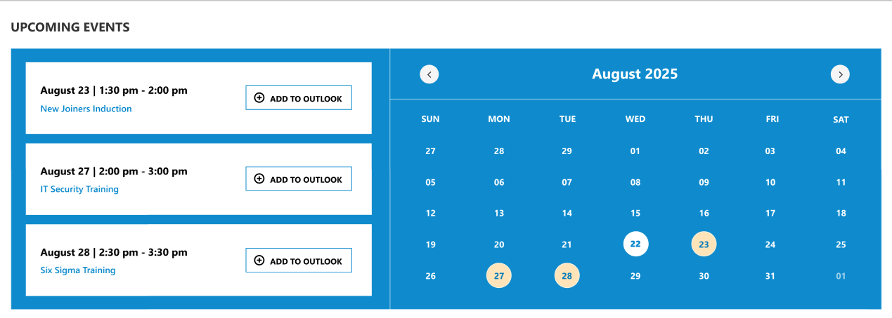
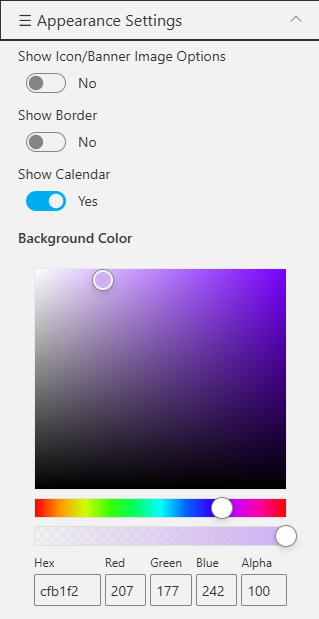

## Overview

Shows upcoming corporate events with date, time, and “Add to Outlook” integration. The adjacent calendar visually highlights event days within the same month for quick reference.

## Configuration

### Header settings

📸 View Header Settings Screenshots

| Name                        | Purpose                                                     | Example / Options          |
| --------------------------- | ----------------------------------------------------------- | -------------------------- |
| WebPart Title               | Specify a title for the Calendar Web Part.                  | “Calendar 1.1”             |
| Choose title heading level  | Select the heading level (H1–H6) for the WebPart title.     | Heading 3                  |
| Hide WebPart Title          | Toggle to show or hide the WebPart title.                   | Show / Hide                |
| WebPart Title (Theme-based) | Set a theme-based title color or style for the WebPart.     | Color Picker               |
| Show “See All” Link         | Display or hide the “See All” link for calendar navigation. | Show / Hide                |
| View All URL                | Provide a URL for the “View All” button to redirect users.  | `/sites/events/all-events` |

- - -

### General settings

📸 View General Settings Screenshots

| Name                     | Purpose                                                         | Example / Options                     |
| ------------------------ | --------------------------------------------------------------- | ------------------------------------- |
| Select the option Events | Select the event source for the Calendar.                       | Events from SharePoint List           |
| Select events list       | Choose the SharePoint list from which events will be displayed. | Dropdown of event lists               |
| Filter Events            | Control which past and upcoming events appear.                  | “Previous 6 months + upcoming events” |

- - -

### Appearance settings

📸 View Appearance Settings Screenshots

| Name                     | Purpose                                                        | Example / Options |     |     |
| ------------------------ | -------------------------------------------------------------- | ----------------- | --- | --- |
| Show Icon/Banner Options | Toggle to show or hide the icon/banner in the calendar header. | Yes / No          |     |     |
| Show Icon                | Display the calendar icon in the header.                       | Checkbox          |     |     |
| Show Banner              | Display a banner background behind the title.                  | Checkbox          |     |     |
| Show Calendar            | Toggle the visibility of the main calendar component.          | Yes / No          |     |     |
| Show Border              | Display a border around the calendar component.                | Yes / No          |     |     |
| Background Color         | Set a background color for the calendar section.               | Color Picker      |     |     |
