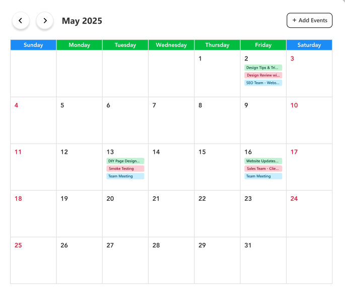
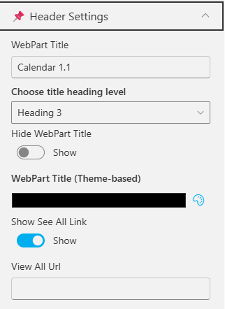
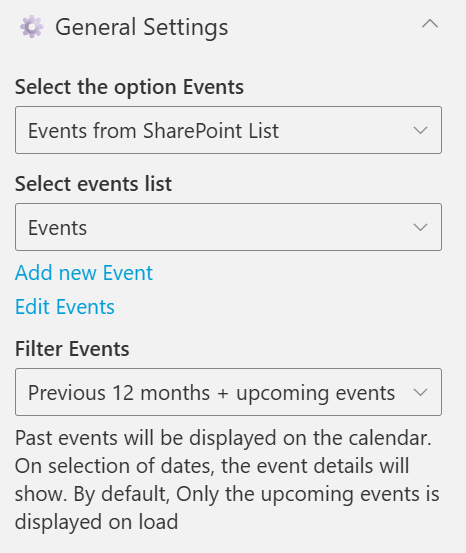
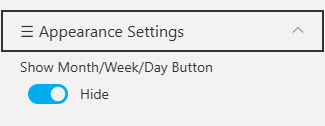

## Overview

A full monthly calendar view of team activities and meetings. Events are color-coded by category, allowing users to manage, view, and add new events easily.

## Configuration

### Header Settings

📸 View Header Settings Screenshots

| Name                        | Purpose                                                     | Example / Options          |
| --------------------------- | ----------------------------------------------------------- | -------------------------- |
| WebPart Title               | Specify a title for the Calendar Web Part.                  | “Calendar 1.1”             |
| Choose title heading level  | Select the heading level (H1–H6) for the WebPart title.     | Heading 3                  |
| Hide WebPart Title          | Toggle to show or hide the WebPart title.                   | Show / Hide                |
| WebPart Title (Theme-based) | Set a theme-based title color or style for the WebPart.     | Color Picker               |
| Show “See All” Link         | Display or hide the “See All” link for calendar navigation. | Show / Hide                |
| View All URL                | Provide a URL for the “View All” button to redirect users.  | `/sites/events/all-events` |

- - -

### General Settings

📸 View General Settings Screenshots

| Name                     | Purpose                                                         | Example / Options                     |
| ------------------------ | --------------------------------------------------------------- | ------------------------------------- |
| Select the option Events | Select the event source for the Calendar.                       | Events from SharePoint List           |
| Select events list       | Choose the SharePoint list from which events will be displayed. | Dropdown of event lists               |
| Filter Events            | Control which past and upcoming events appear.                  | “Previous 6 months + upcoming events” |

- - -

### Appearance Settings

📸 View Appearance Settings Screenshots

| Name                       | Purpose                                          | Example / Options |     |     |
| -------------------------- | ------------------------------------------------ | ----------------- | --- | --- |
| Show Month/Week/Day Button | Toggle to show or hide the Month/Week/Day Button | Yes / No          |     |     |
