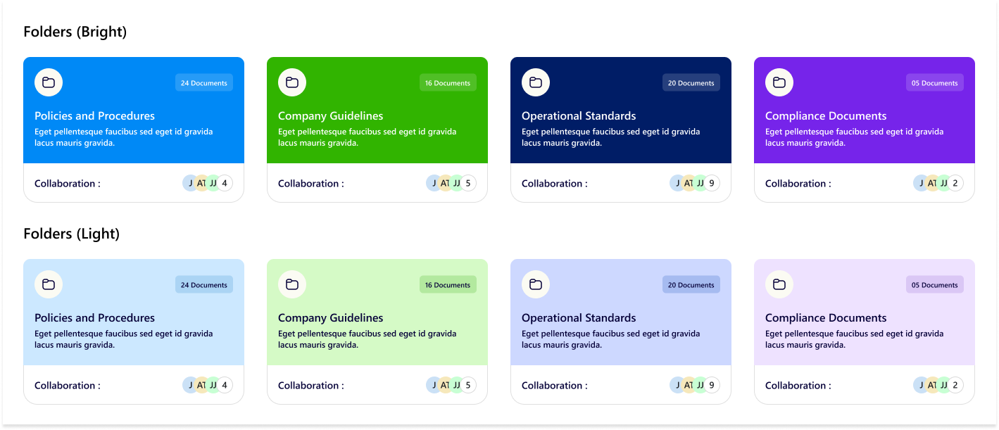
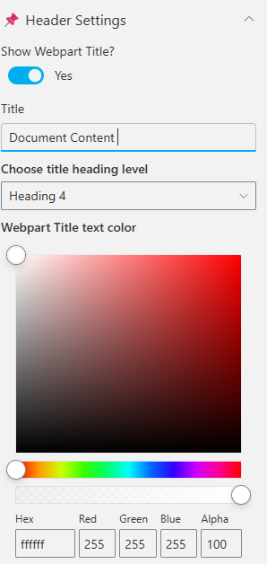
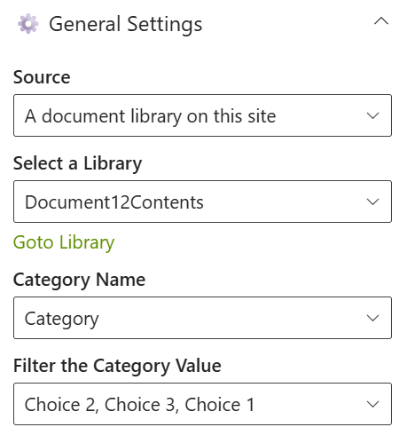
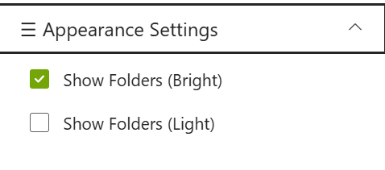

## Overview

The design showcases folder cards in two themes—Bright and Light—for document organization. Each card displays the folder title, a short description, the number of documents, and collaboration details, providing a clear and visually distinct layout for content management.

## Configuration

### Header settings

📸 View Header Settings Screenshots

| Name                        | Purpose                                                     | Example / Options          |
| --------------------------- | ----------------------------------------------------------- | -------------------------- |
| WebPart Title               | Specify a title for the Calendar Web Part.                  | “Calendar 1.1”             |
| Choose title heading level  | Select the heading level (H1–H6) for the WebPart title.     | Heading 3                  |
| Hide WebPart Title          | Toggle to show or hide the WebPart title.                   | Show / Hide                |
| WebPart Title (Theme-based) | Set a theme-based title color or style for the WebPart.     | Color Picker               |
| Show “See All” Link         | Display or hide the “See All” link for calendar navigation. | Show / Hide                |
| View All URL                | Provide a URL for the “View All” button to redirect users.  | `/sites/events/all-events` |

- - -

### General settings

📸 View General Settings Screenshots

| Name                      | Purpose                                                 | Example / Options               |
| ------------------------- | ------------------------------------------------------- | ------------------------------- |
| Source                    | Select the document source location for the content.    | A document library on this site |
| Select a Library          | Choose a specific document library from the site.       | Document12Contents              |
| Goto Library              | Quick navigation link to the selected library.          | Opens library in SharePoint     |
| Category Name             | Select the metadata column used for category filtering. | Category                        |
| Filter the Category Value | Choose one or more category values to filter items.     | Choice 1, Choice 2, Choice 3    |

- - -

### Appearance settings

📸 View Appearance Settings Screenshots

| Name                  | Purpose                                    | Example / Options |
| --------------------- | ------------------------------------------ | ----------------- |
| Show Folders (Bright) | Toggle to display folders in bright theme. | Checked           |
| Show Folders (Light)  | Toggle to display folders in light theme.  | Unchecked         |
