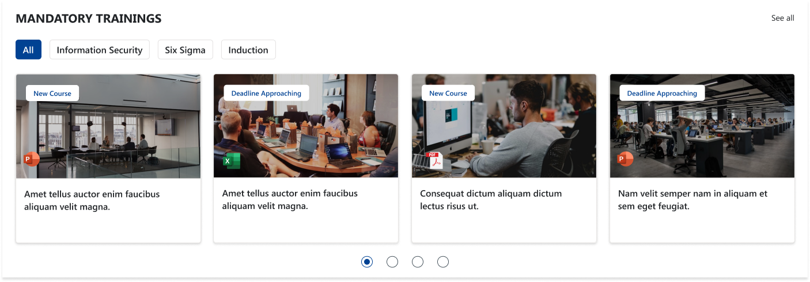
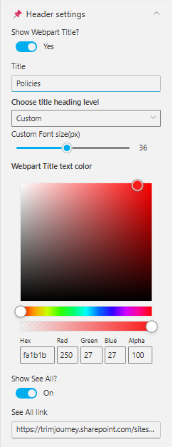
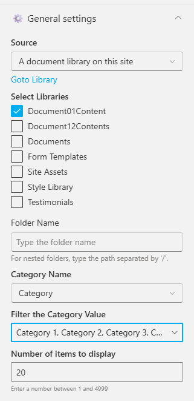
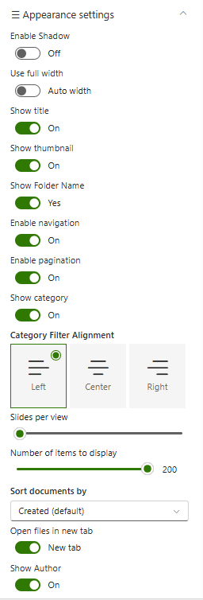

## Overview

The Mandatory Trainings Web Part presents essential employee training programs through visually rich cards arranged in a horizontal carousel. Each training module includes an image, status badge such as “New Course” or “Deadline Approaching,” and a short description to help employees prioritize their learning requirements. With category filters and an option to view all trainings, this web part ensures employees can easily navigate, track, and complete mandatory training tasks.

## Configuration

## Header Settings

📸 View Header Settings Screenshot

| Name                       | Purpose                                                             | Example / Options                         |
| -------------------------- | ------------------------------------------------------------------- | ----------------------------------------- |
| Show WebPart Title?        | Toggle to show or hide the WebPart title in the layout.             | Yes / No                                  |
| Title                      | Allows entering a custom title for the WebPart.                     |  “Mandatory Trainings”                    |
| Choose title heading level | Selects the heading hierarchy (H1–H6) to control title styling.     | Custom, H1–H6                             |
| Custom Font Size (px)      | Adjusts the font size of the WebPart title using a slider.          | 36px (adjustable)                         |
| WebPart Title Text Color   | Defines the title color using a color picker (supports RGBA & Hex). | \#fa1b1b, RGB(250,27,27), Alpha 100       |
| Show See All?              | Enables or disables the “See All” link on the WebPart header.       | On / Off                                  |
| See All link               | URL that users will navigate to when clicking "See All".            | https://trimjourney.sharepoint.com/sites… |

- - -

### General settings

📸 View General Settings Screenshots

| Name                      | Purpose                                                 | Example / Options               |
| ------------------------- | ------------------------------------------------------- | ------------------------------- |
| Source                    | Source of the Document library.    | A document library on this site |
| Select a Library          | Choose a specific document library from the site.       | DocumentContents              |
| Search sites              | Search the SharePoint sites available in the tenant          | SharePoint Sites available in the tenant.     |
| Website(s) selected             | Select the SharePoint sites source for the Document Library. | Search results based upon the key search                        |
| Number of items to display | Enter the number of items to display.     | Number between 01 and 4999    |
| Category Name             | Select the metadata column used for category filtering. | Category                        |
| Filter the Category Value | Choose one or more category values to filter items.     | Choice 1, Choice 2, Choice 3    |

- - -

## Appearance Settings

📸 View Appearance Settings Screenshot

| Name                       | Purpose                                                             | Example / Options                 |
| -------------------------- | ------------------------------------------------------------------- | --------------------------------- |
| Use full width             | Expands the web part to use the full available page width.          | On / Off                          |
| Auto width                 | Automatically adjusts width based on available space.               | Enabled / Disabled                |
| Hide Category Filter       | Toggles visibility of the category filter bar.                      | Yes / No                          |
| Show Title                 | Displays or hides the item title on each card.                      | On / Off                          |
| Show Thumbnail             | Shows or hides the thumbnail image inside each card.                | On / Off                          |
| Show Folder Name           | Enables display of folder names when applicable.                    | Yes / No                          |
| Enable Navigation          | Shows carousel navigation arrows for scrolling through items.       | On / Off                          |
| Enable Pagination          | Displays the pagination dots below the slider.                      | On / Off                          |
| Show Category              | Enables category labels on each item card.                          | Yes / No                          |
| Category Filter Alignment  | Sets alignment of category filter buttons.                          | Left / Center / Right             |
| Slides per view            | Number of items shown at once in the carousel.                      | 1–4+                              |
| Number of items to display | Limits the total number of items loaded in the web part.            | e.g., 20                          |
| Enable Borders             | Adds or removes borders around cards.                               | On / Off                          |
| Enable Shadow              | Adds shadow styling to cards for visual depth.                      | On / Off                          |
| Background Color           | Sets background color for item cards or web part area (Hex / RGBA). | \#ffffff / RGB(255,255,255)       |
| Sort documents by          | Specifies the sort order for files or items.                        | Created (default), Modified, Name |
| Enable Category Filter     | Enables category-based filtering of displayed items.                | On / Off                          |
| Category Filter Alignment  | Aligns the category filter buttons.                                 | Left / Center / Right             |
| Open files in new tab      | Opens document links in a new browser tab.                          | On / Off                          |
