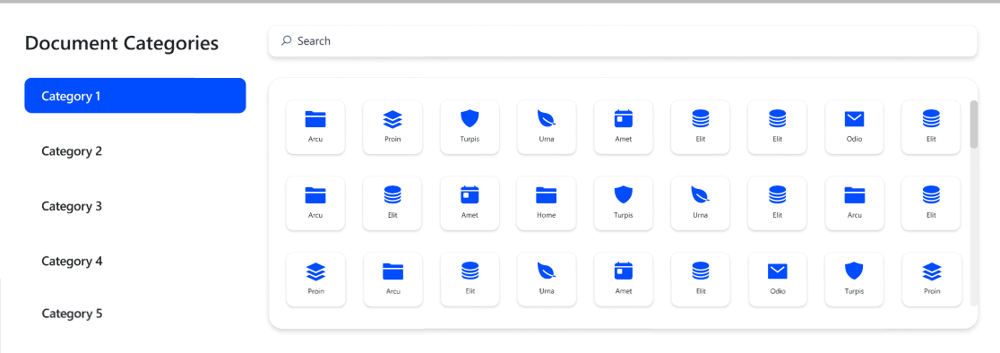
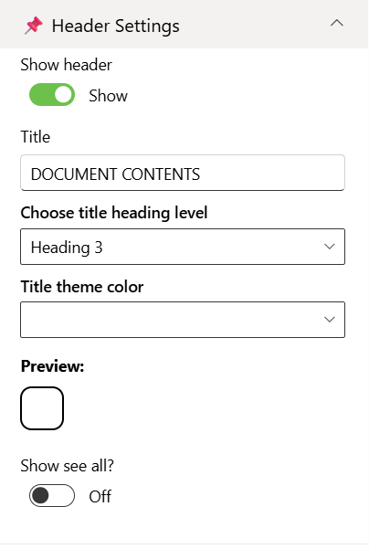
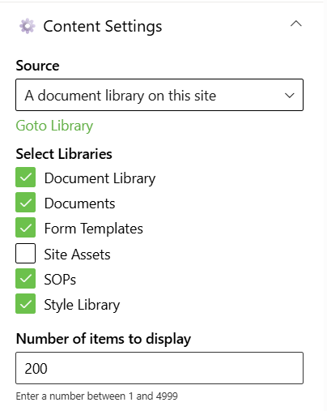
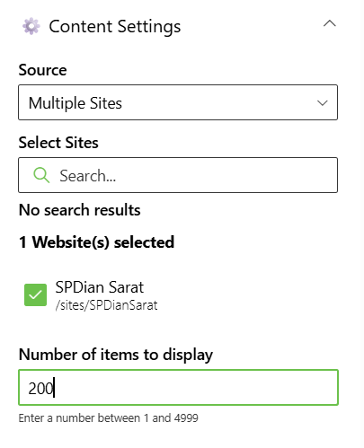
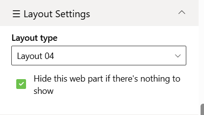
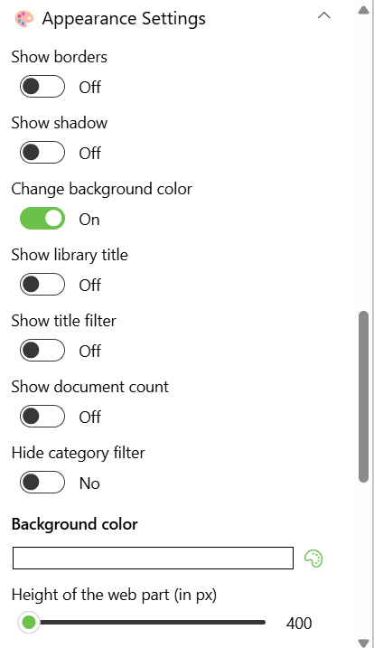

## Overview

Document Library allows users to browse and interact with SharePoint documents directly on a page. It can be configured to target a specific document library or dynamically aggregate files from all libraries within the current site. Ideal for scenarios where quick access to files across multiple libraries is needed, it supports modern SharePoint pages and provides a responsive, user-friendly interface for document management.

## Configuration

### Header Settings

📸 View Header Settings Screenshots

| Name                       | Purpose                                                             | Example / Options   |
| -------------------------- | ------------------------------------------------------------------- | ------------------- |
| Show header                | Toggle to show or hide the Web Part title.                          | Show / Hide         |
| Title                      | Specify a title for the Document Library Web Part.                  | “DOCUMENT CONTENTS” |
| Choose title heading level | Choose the heading level for the webpart title.                                                          | H1 / H2 / H3 / Custom             |
| Custom font size for title | Specify a custom font size for the webpart title (only visible when “Custom” heading level is selected). | 24px     
| Title theme color          | Set a theme-based title color or style for the Web Part.            | Dropdown            |
| Show see all button        | Display or hide the “See All” link for Document Library navigation. | Show / Hide         |

- - -

### Content Settings

📸 View Content Settings Screenshots

| Name                       | Purpose                                                      | Example / Options                         |
| -------------------------- | ------------------------------------------------------------ | ----------------------------------------- |
| Source                     | Source of the Document library                               | Dropdown                                  |
| Select Libraries           | Select the Document Library                                  | Checkbox                                  |
| Search sites               | Search the SharePoint sites available in the tenant          | SharePoint Sites available in the tenant. |
| Website(s) selected        | Select the SharePoint sites source for the Document Library. | Search results based upon the key search  |
| Number of items to display | Enter the number of items to display                         | Number between 01 and 4999                |

- - -

#### Layout Settings

📸 View layout Configuration Screenshots

| Name          | Purpose                                            | Example  |
| ------------- | -------------------------------------------------- | -------- |
| Choose layout | Choose the layout for the Document Library Webpart | Dropdown |

- - -

### Appearance Settings

📸 View Appearance Settings Screenshots

| Name                           | Purpose                                                            | Example / Options |     |
| ------------------------------ | ------------------------------------------------------------------ | ----------------- | --- |
| Show border                    | Toggle to show or hide the border of the document content.         | On/Off            |     |
| Show shadow                    | Toggle to show or hide the shadow of the document content.         | On/Off            |     |
| Change background color        | Toggle to change background color the document container.          | On/Off            |     |
| Show library title             | Toggle to show or hide the Library Tittle of the document content. | On/Off            |     |
| Show title filter              | Toggle to show or hide the Title filter of the document content    | On/Off            |     |
| Show document count            | Toggle to show or hide the Total Document count in each Libraries. | On/Off            |     |
| Background color               | Select the container background color from the color picker.       | Color Picker      |     |
| Height of the web part (in px) | Set the custom desire height of the Document Content Web part.     | Slider            |     |
